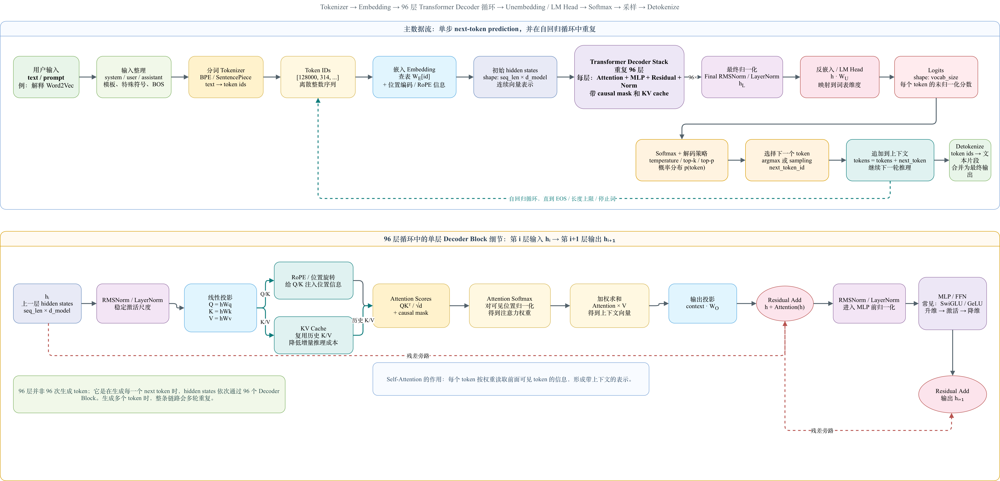

## 引言

主要涉及内容：全连接网络、反向传播、Transformer、注意力机制和 MLP 事实存储。

> 嵌入向量怎么来的？全连接网络为什么不够用？Transformer 到底解决了什么问题？

按照概念递进的顺序：网络结构 → 学习算法 → 嵌入表示 → 架构演进 → 注意力与知识存储。

前置要求：对矩阵乘法和导数有基本概念即可。如果完全零基础，建议先看一遍 3b1b 原视频再回来读。

---

## 神经网络的结构

### 手写数字识别问题

MNIST 数据集是深度学习的经典入门任务。输入是一张 28×28 像素的灰度图，每个像素用 0（纯黑）到 1（纯白）之间的一个数表示，总共 784 个数字。输出是 0 到 9 中的一个标签——图片上写的是哪个数字。

用传统编程解决这个问题几乎不可能。数字"4"有人写成开口的，有人写成闭口的；"7"有人带横杠，有人不带。写不出一套 if-else 规则来覆盖所有变体。但人脑对这件事毫不费力，甚至不需要思考就能完成。神经网络的出发点就是模仿这种生物结构——用大量简单单元的层叠组合来逼近复杂的输入输出映射。

### 神经元与网络结构

神经网络中的"神经元"远比生物神经元简单。它只做一件事：装一个 0 到 1 之间的数字，叫做激活值（activation）。0 表示完全沉默，1 表示最大程度兴奋。网络中的所有信息传递都靠这些数字的流动。

搭建一个具体的网络来解决手写数字问题：

| 层     | 神经元数量      | 设计意图                     |
| ----- | ---------- | ------------------------ |
| 输入层   | 784（28×28） | 每个神经元对应一个像素的灰度值          |
| 隐藏层 1 | 16         | 检测小尺度的边缘、短线、弧            |
| 隐藏层 2 | 16         | 组合边缘，检测圆圈、竖线等部件          |
| 输出层   | 10         | 分别代表数字 0~9，激活值最高的就是网络的判断 |


为什么选 2 层隐藏层、每层 16 个神经元？没有理论依据。这纯粹是为了动画演示好看、直觉容易理解。实际中隐藏层的数量和每层神经元数都是需要实验调整的超参数。

### 分层的动机：层次化抽象

分层结构的核心思路是把复杂问题拆成简单的子问题，拆法是按空间粒度：

```
像素 → 小边缘 → 大部件 → 完整数字
```

以识别数字"9"为例。理想状态下，第一层隐藏层检测到右上区域有一条弧线、右侧有一条竖线。第二层隐藏层把这两个信号组合起来，识别出"顶部有圆圈 + 右侧有长竖线"的组合模式。输出层根据这个组合模式点亮数字 9 对应的神经元。

这和语音识别的层次结构类似：原始音频先变成音素，音素组合成音节，音节组成单词。每深一层，抽象级别就高一层。

但这里有一个重要的提示：这只是一个直觉上的期望。后面会看到，真实训练出来的网络并没有按这种理想方式工作。

### 层间传递

下一层的每个神经元的值由上一层所有神经元决定，规则是加权和。

具体看一个例子。假设隐藏层的某个神经元专门检测"中间亮、周围暗"这种边缘模式。实现方法是给中间区域的像素赋正权重（比如 +1），给周围一圈的像素赋负权重（比如 -0.5），其余像素权重设为 0。当输入图像恰好在对应位置是中间亮、周围暗时，加权和达到最大值，这个神经元就"亮"了。每一个隐藏层神经元本质上都在用权重描述一种它关心的输入模式，这和图像处理中卷积核做模板匹配的直觉完全一样。

加权和本身可以是任意实数，但还需要两个额外成分才能构成完整的计算。

第一个是偏置（bias）。偏置控制神经元激活的难易程度。如果不想让加权和刚超过 0 就激活，而是**希望达到某个阈值才激活**，就给加权和加上一个负的常数。偏置越负，这个神经元就越"难伺候"——需要输入信号更强才能激活它。

第二个是激活函数。它把加权和（一个任意实数）压缩到 0 到 1 的范围内。传统选择是 Sigmoid 函数：

$$ \sigma(x) = \frac{1}{1 + e^{-x}} $$

很负的输入给出接近 0 的输出，很大的正输入给出接近 1 的输出，0 附近有一段平滑的过渡区。

一个神经元的完整计算写出来是：

$$ a^{(1)}_j = \sigma\left(\sum_k w_{jk} \cdot a^{(0)}_k + b_j\right) $$

把整层的计算用矩阵表示则是：

$$ a^{(1)} = \sigma(W \cdot a^{(0)} + b) $$

$a^{(0)}$ 是上一层的激活值列向量（784 维），$W$ 是权重矩阵（16×784，每行对应下一层一个神经元的所有权重），$b$ 是偏置向量（16 维），$\sigma$ 逐元素作用。每层就是一个矩阵乘加一个非线性——整个网络就是对这套操作的层层嵌套。

### Sigmoid 的问题与 ReLU

但是 Sigmoid 在现代深层网络中已经不再使用了。

原因出在梯度上。Sigmoid 在两端几乎完全平坦——当输入很大或很负时，函数曲线几乎是一条水平线。这意味着在这些区域做微小调整，输出几乎不变。训练到后期，很多神经元的输入落在平坦区，反向传播的信号经过这些位置时趋近于零，学习停滞。这个现象叫梯度饱和。

现代网络用 ReLU 替代 Sigmoid：

$$ \text{ReLU}(x) = \max(0, x) $$

负输入直接输出 0，正输入原样输出。形式极简，但在正半轴上梯度恒为 1，永远不会饱和。深层网络用 ReLU 的训练速度远超 Sigmoid。

### 参数规模与"网络即函数"

回到手写数字网络，算一下总共有多少个可调参数：

| 连接 | 权重数 | 偏置数 |
|---|---|---|
| 输入层 → 隐藏层 1（784×16） | 12,544 | 16 |
| 隐藏层 1 → 隐藏层 2（16×16） | 256 | 16 |
| 隐藏层 2 → 输出层（16×10） | 160 | 10 |
| **合计** | **12,960** | **42** |

总计 13,002 个可调参数。对深度学习来说这是一个极小的网络，但用来讲清核心概念足够了。

整个网络就是一个函数。输入 784 个数字（像素值），输出 10 个数字（每个数字的置信度）。虽然内部结构复杂、参数极多，但概念上和 $f(x) = mx + b$ 没有本质区别——都是输入一组数、输出一组数。区别只在于参数的数量和嵌套的深度。

"学习"这个词翻译成数学语言就是：从训练数据中自动找到这 13,002 个数的最佳组合。

---

## 参数的学习过程

### 代价函数

网络刚初始化时，所有参数都是随机的。输入一张"2"的图片，输出层 10 个神经元的激活值乱七八糟——可能是 0.5、0.8、0.2 这样毫无规律的数字，和理想输出（"2"对应的神经元为 1，其余为 0）差了十万八千里。

要让网络学习，首先需要一个数字来量化"当前参数有多差"。最直接的方案是把输出层每个神经元的误差平方后求和：

$$ C_0 = \sum_j (a_j^{(L)} - y_j)^2 $$

$a_j^{(L)}$ 是输出层第 j 个神经元的实际值，$y_j$ 是期望值。网络猜对了，这个数接近 0；猜错了，这个数很大。

对训练集中所有图片的代价取平均，得到一个以 13,002 个参数为输入、以一个实数为输出的函数。这个函数叫代价函数（cost function）。

这里有一个思维上的跳跃值得停下来想清楚。神经网络本身是一个函数：784 个像素 → 10 个数字。代价函数是在此之上再抽象一层：13,002 个参数 → 一个数字（描述网络有多差）。你在调整的对象不是网络的输出，而是这个描述网络好坏的元函数。学好的全部含义就是让这个元函数尽可能小。

### 梯度下降

问题变成了一个纯粹的数学优化任务：给定一个以 13,002 个数字为输入的函数，找到使它取最小值的那组输入。

从简单情况开始。如果代价函数只有一个参数 $x$，你可以画出 $C(x)$ 的曲线，找到谷底。方法是：随机选一个起点，算出该点的斜率（导数），斜率为正就往左走，斜率为负就往右走，每次走的步长和斜率大小成正比——离谷底远时大步走，接近谷底时小步挪。

推广到 13,002 个参数的情况。代价函数变成了一个 13,002 维空间上的"超曲面"。你无法画出它的图像，但核心问题不变：在当前位置，朝哪个方向走一步，代价下降得最快？

答案是负梯度方向。梯度 $\nabla C$ 是一个 13,002 维的向量，它的每个分量告诉你两件事：这个参数应该增大还是减小（符号），以及改变这个参数对降低代价的性价比有多高（绝对值大小）。

更新公式：

$$ \theta_{\text{new}} = \theta_{\text{old}} - \eta \cdot \nabla C $$

$\eta$ 是学习率，控制每步迈多大。太大会越过谷底开始震荡，太小则收敛极慢。实际取值通常在 0.001 到 0.1 之间。


对于一个只有两个参数的网络对应的代价函数曲面，在三维空间中你能清楚看到山谷和山峰。然后把这种"沿最陡方向往下走"的直觉推广到无法可视化的 13,002 维——用低维直觉理解高维行为，这也是理解深度学习的关键能力。

> 物理类比：你在大雾笼罩的山脊上，看不见周围的地形，只能感到脚底地面的倾斜方向。你朝最陡的下坡方向走一小步，停下来重新感受倾斜，再走一步。走到感觉不到坡度的时候停下——这里是局部最低点，但不一定是全局最低。

### 训练后的意外发现

训练完成后，这个小网络在测试集上达到了约 96% 的准确率。但发现了一个和预期不符的结果。

还记得前面说的"理想分层"吗？我们期望第一层学到边缘检测器，第二层学到环和线条的组合。实际情况是：第二层的权重看起来几乎是随机的，只隐约有一些方向性的模式。网络确实达到了 96% 的准确率，但它没有按照人类直觉中的"边缘→部件→数字"路径来工作。它在 13,002 维参数空间中找到了另一个完全不同的、也能让代价降到很低的位置。

更有意思的现象是：给这个训练好的网络输入纯随机噪声（不是任何数字的图片），它依然会自信地把噪声分类为某个数字，比如"5"。它不会说"我不知道"。原因很简单——代价函数在训练过程中从未要求网络具备"自我怀疑"的能力。训练集里只有真实的手写数字，网络从未见过"不是数字"的输入，自然也不知道该对这类输入输出低置信度。

会反复出现的事实：
1. 梯度下降找到的只是某个局部极小值，不一定是你直觉理解的那种解
2. 网络会利用训练数据中的任何统计线索，包括你完全意识不到的那些

> 对于两篇争议论文：第一篇把所有训练标签打乱（图片不变，但标签变成随机值），发现网络仍然能在训练集上达到相同的准确率——它在用数百万参数死记硬背随机数据。第二篇论文反驳说：虽然两种情况最终都能拟合，但在随机标签上代价下降极其缓慢（近乎线性），而在真实数据上代价快速下降。结论是网络确实在学习数据中的结构，结构化数据更容易找到好的局部最小值。

### 反向传播

梯度下降的策略清楚了——沿负梯度方向走。但执行时需要高效计算 13,002 个偏导数。逐个参数用数值方法求导需要 O(n²) 的计算量（n 是参数数量），对于 1750 亿参数的 GPT-3 完全不可行。反向传播算法通过一次前向传播加一次反向传播，只用 O(n) 的时间就能算出所有参数的梯度。

输入一张"2"的图片，网络当前的输出是乱的——输出层代表"2"的那个神经元不够亮。要让它变亮，有三条调整路径：

第一条：增大它的偏置。最直接——偏置越大，加权和越大，激活值越高。

第二条：增大它与上一层神经元之间的权重。但这里有一个效率问题。调整的效果正比于上一层神经元当前的激活值。如果上层某个神经元当前接近 0（几乎不亮），即使大幅调高连接它的权重，效果也微乎其微——因为权重乘以一个接近 0 的数还是接近 0。反过来，如果上层神经元当前很亮（比如 0.9），同样的权重调动带来的影响大了 9 倍。所以权重调整的回报与上一层神经元的活跃度成正比。

第三条：改变上一层的激活值本身。你不能直接修改激活值（它是计算出来的），但这引出了一个核心洞察——你需要让上一层那些与当前神经元用正权重相连的神经元变得更亮，让那些用负权重相连的变得更暗。

这就是 Hebbian 理论在反向传播中的体现：同时激活的神经元之间的连接应该被加强（"Neurons that fire together, wire together"）。如果上层神经元亮，而我们的目标是让当前层也更亮，那它们之间的权重就应该增加。

到目前为止只说了一个输出神经元的愿望。但输出层有 10 个神经元，每一个都对倒数第二层有自己的调整诉求。这些诉求加权叠加——某个上层神经元受到的"你应该变亮还是变暗"的信号是所有后层神经元诉求的总和。叠加完成后，同样的逻辑递归地往更前一层应用。

这就是"反向传播"名字的来源：输出层的不满意顺着网络一层层往回传递。


### 链式法则

为了看清核心逻辑，先考虑一个极简网络——每层只有一个神经元，总共只有 3 个权重和 3 个偏置。记最后一层的激活值为 $a^{(L)}$，单个样本的代价 $C_0 = (a^{(L)} - y)^2$。

要算代价对最后一层权重 $w^{(L)}$ 的偏导，链式法则直接给出：

$$ \frac{\partial C_0}{\partial w^{(L)}} = \frac{\partial z^{(L)}}{\partial w^{(L)}} \cdot \frac{\partial a^{(L)}}{\partial z^{(L)}} \cdot \frac{\partial C_0}{\partial a^{(L)}} $$

三项分别对应三个层层递进的因果关系：$w$ 的微调先改变了加权和 $z$，$z$ 的改变经过激活函数后改变了 $a$，$a$ 的改变最终反映到代价 $C$。就像三个依次咬合的齿轮——推动第一个，后面两个跟着转。

逐项算出来：

| 项 | 计算结果 | 物理含义 |
|---|---|---|
| $\frac{\partial C_0}{\partial a^{(L)}}$ | $2(a^{(L)} - y)$ | 误差越大，调整力度越大 |
| $\frac{\partial a^{(L)}}{\partial z^{(L)}}$ | $\sigma'(z^{(L)})$ | 激活函数在当前位置的斜率。如果已经饱和（Sigmoid 两端很平），这一项接近零，学习自动停摆 |
| $\frac{\partial z^{(L)}}{\partial w^{(L)}}$ | $a^{(L-1)}$ | 上一层的激活值。上层越亮，这个权重越值得调整 |

三项乘积就是对单个权重的完整梯度：

$$ \frac{\partial C_0}{\partial w^{(L)}} = a^{(L-1)} \cdot \sigma'(z^{(L)}) \cdot 2(a^{(L)} - y) $$

偏置的梯度类似，只是 $\frac{\partial z}{\partial b} = 1$，所以少了 $a^{(L-1)}$ 这一项。

推广到多层多神经元的真实网络时，公式前面多一对索引 $j, k$，但结构完全不变。唯一增加的复杂度是：一个前层神经元通过多条路径（连接到多个后层神经元）影响代价，所以传播时要把所有后层传来的误差求和：

$$ \frac{\partial C_0}{\partial a_k^{(L-1)}} = \sum_j w_{jk}^{(L)} \cdot \sigma'(z_j^{(L)}) \cdot 2(a_j^{(L)} - y_j) $$

这个求和就是反向传播的全部：后层每个神经元的误差，乘上对应的权重，累加回前层对应神经元。然后递归地继续往前传。

反向传播的革命性不在数学上多巧妙，而在复杂度上。用数值方法逐参数求导需要 O(n²) 的代价；反向传播通过一次前向加一次反向，只用 O(n)。1750 亿参数的 GPT-3 能训练，依赖的就是这个事实。

从更广阔的视角看，神经网络可以被看作一张有向无环图（计算图），每条边是一个函数依赖。反向传播就是从根节点（代价）逆向遍历这张图，每个节点只算一次，避免重复计算。这个视角就是现代深度学习框架（PyTorch、TensorFlow）的核心引擎——反向模式自动微分（Reverse-mode AD）。你不需要自己实现反向传播，框架帮你做了。但理解它的原理，让你在调试和优化时知道发生了什么。

### 随机梯度下降

梯度下降的理论版本要求用全部数万张图片算一次梯度再做一次更新。在现代规模下这完全不现实——GPT-3 的训练集有几千亿 token，每次都遍历全部数据来算一个梯度，一次更新可能要跑几天。

随机梯度下降（SGD）做了一处改动：每次只用一小批数据（mini-batch，比如 100 张图片）来估计梯度。这个估计有噪声——这一小批样本的方向不会恰好是全局最陡方向。

为什么噪声反而是好事？
两个人在浓雾中下山。第一个人每一步都停下来精确测量最陡方向——路径笔直但每一步都要算很久。第二个人醉醺醺地大概判断方向就迈步——路径歪歪扭扭，但每步极快，整体反而先到山脚。更重要的是，醉汉歪歪扭扭的路径不容易被浅沟绊住——那些精确走法会被困住的浅谷，噪声帮你直接跳过去了。

SGD 的随机性是特性，不是缺陷。噪声让网络有更好的机会找到真正好的解，而不是被困在最浅的局部最小值里。

### 训练循环

把前面所有内容串起来，一轮完整的训练是这样的：

```
初始化参数（全随机）
    ↓
循环:
    1. 取一小批数据（mini-batch）
    2. 前向传播：逐层计算每个神经元的激活值，得到最终输出和代价
    3. 反向传播：从输出层往回，逐层算出每个参数的梯度
    4. 参数更新：沿负梯度方向微调所有参数
    5. 回到 1，直到代价不再显著下降
```

整个过程中，反向传播是梯度下降的关键。没有它，无法高效计算 13,002 个参数各自应该往哪个方向调、调多少。

---

## 嵌入向量与高维空间

前面三节的讨论建立在图像上——输入天生就是像素值这种数字。但换成文字，第一个问题就是：词怎么变成向量？而且不是给每个词一个随机编号，而是变成能在几何空间中表达语义关系的向量。

### Word2Vec：从猜词游戏中学出向量

没有任何人坐在那里手工标注"国王"的坐标应该是 [0.12, -0.34, 0.67...]。嵌入向量的所有维度值都是从一个极其简单的任务中自动学出来的：猜词。

以 Word2Vec 的训练方式为例。读入海量文本——维基百科、新闻、书籍——然后遍历每一句话，每次挖掉一个词让模型猜。句子"王___坐在王位上统治着国家"，模型需要从词汇表（几万个词）中挑选最可能的词填入空格。这本质上是一个多分类问题。

训练过程是这样的。初始化时，给每个词分配一个随机向量（比如 300 维）。此时"国王"和"苹果"在空间中的距离差不多——完全没有语义。

然后开始猜词。模型看到上下文"统治"、"着"、"国家"，根据这些词的当前向量来预测空格处应该是什么词。预测结果和正确答案（"王后"）之间有差距，计算误差，然后通过反向传播同时调整两样东西：嵌入矩阵中相关词的向量坐标，以及分类器的参数。

每见到一次"国王统治国家"这样的句子，就把"国王"的向量往"统治"、"国家"这些上下文词的方向推一点点。数十亿次猜词之后，经常出现在相同上下文中的词自然就靠得近了。"国王"和"王后"附近的词是"王子"、"王位"、"统治"、"皇室"——它们被共同的上下文推到了一个语义簇中。

用一个简化的二维空间来展示这个过程：

```
训练前（随机）：
    国王·        ·苹果
         ·王后
    ·男人
              ·汽车
         ·女人

训练后（数十亿次猜词后）：
    国王·  ·王后
    男人·  ·女人

    苹果·  ·香蕉

         汽车·  ·卡车
```

语义相似的词聚在了一起。而且方向开始代表关系："国王→王后"的箭头 ≈ "男人→女人"的箭头（这个方向编码了"女性化"）。


### 分布假说

上面这个过程有语言学的理论支撑。J.R. Firth 在 1957 年提出的分布假说（distributional hypothesis），核心观点可以浓缩成一句话：看一个词交了什么样的朋友，就知道它是什么意思（"You shall know a word by the company it keeps"）。

两个词如果频繁出现在相似的上下文中，它们的语义必然接近。"苹果"和"香蕉"都和"吃"、"水果"、"甜的"一起出现；"汽车"和"卡车"都和"开"、"道路"、"运输"一起出现。Word2Vec 做的只是把这个语言学原则变成了一种可优化的数学目标函数——通过梯度下降，让模型在猜词任务上的表现越来越好，而嵌入向量的语义结构是这个优化过程的副产品。

### 方向编码语义

训练好的嵌入空间有一个令人惊讶的规律：空间中某个方向可以编码一种特定的语义关系。最经典的例子：

$$ \vec{\text{国王}} - \vec{\text{男人}} + \vec{\text{女人}} \approx \vec{\text{王后}} $$

"$-$男人$+$女人"指向嵌入空间中"女性化"的方向。沿着这个方向移动"国王"的向量，就落到了"王后"附近。

同样的方向逻辑横跨整个词汇表：`意大利 - 德国 + 希特勒` 的结果接近 `墨索里尼`；`德国 - 日本 + 寿司` 的结果接近 `德国香肠`。


为什么会出现这种规律？因为模型在训练过程中发现，把"国家"和"该国有名的 X"之间的关系安排成一致的位移向量，猜词任务完成得最好。这背后没有深层哲学——类比关系的一致位移恰好是对文本数据最压缩、最高效的表示方式。数学上没有理由必须出现，但数据中的规律迫使它出现了。

更具体地说，模型被训练去预测"当出现法国时，巴黎很可能出现"。为了让这个预测准确，模型必须把"法国"和"巴黎"放在能表达这种关系的位置上。同理，"英国"和"伦敦"也要满足类似的关系。最终的结果是"法国→巴黎"的位移向量 ≈ "英国→伦敦"的位移向量——这个方向就是嵌入空间中的"首都关系向量"。位置关系是训练的自然结果，不是人为强加的。

### 高维空间的几何直觉

GPT-3 中每个词向量是 12,288 维。这个数字初看很荒谬——人类理解语言需要 12,288 个轴吗？

维度的作用不在于数量本身。高维空间有一条反直觉的几何性质：随机两个高维向量几乎一定近乎垂直。

在三维空间中，随机两个向量的夹角均匀分布在 0° 到 180° 之间——什么角度都有可能。但在 12,288 维中，任意两个随机抽取的向量，它们的夹角几乎必定在 89° 到 91° 之间。几乎完美垂直。

这意味着你可以放心地把"篮球方向"和"汽车方向"放在同一个 12,288 维空间中，它们天然互不干扰。你不需要精心挑选 12,288 个严格正交的坐标轴——高维空间本身就由无数近乎垂直的自由方向构成。

更精确的数学描述来自约翰逊-林登斯特劳斯引理（Johnson-Lindenstrauss Lemma）：在高维空间中，允许方向之间稍微偏离垂直（89°~91°），能塞入的近似独立方向的数量随维度指数增长。

3b1b 用一个 Python 仿真验证了这个结论。他从 10,000 个随机的 100 维向量出发，通过简单的优化把它们两两夹角全部推入 89°~91° 范围。100 维就能容纳 10,000 个近乎独立的概念方向。12,288 维能容纳多少？指数级的更多。

这解释了为什么语言模型能在有限维度中存储天文数字级别的语义概念。模型中存储的概念数量远超 12,288 个——它们被分散到不同的近似独立方向上，互相之间的干扰极小。

但这也带来了一个代价：单个特征不是由单个神经元编码的，而是分布在一组神经元的共同激活模式上。这种现象叫做叠加（superposition）。你不能说"第 42 号神经元代表篮球"——实际上数百个神经元共同编码了篮球这个概念。这就是为什么神经网络的可解释性如此困难。Anthropic 的 sparse autoencoder 研究方向就是在尝试把这些叠加的特征"解开"。

另外，高维空间还有一个好处：线性可分性大大增强。在二维平面上，要把红蓝两类点分开可能需要复杂的曲线边界。但在高维空间中，几乎任何分类模式都可以用一个超平面（简单线性分割）分开。模型不需要复杂的非线性结构来判断"哪些词属于体育"——一个简单的方向加一个阈值就够用了。

### 位置编码

嵌入矩阵查出来的向量只包含词义信息。"乔丹"这个词查表得到的向量知道它是一个常见姓氏，但不知道它在句子中处于主语位置还是宾语位置、是紧跟在"迈克尔"之后还是在句末。位置信息需要额外编码。

最原始的位置编码是用正弦余弦函数构成的固定模式——每个维度用不同频率的正弦波编码位置索引。GPT 系列改用可学习的位置编码：直接当成另一个需要训练的矩阵，与嵌入矩阵一起在猜词任务中被梯度下降调优。

最终的输入向量 = 嵌入坐标 + 位置坐标。词义和词序两层信息被合并编码，在进入第一层 Transformer 之前就已经完成了。

---

## Transformer 架构

### 全连接网络处理文字的短板

一个全连接网络——输入固定 784 个像素，输出固定 10 个数字——处理固定尺寸的图像没问题。但文字完全不同。

首先，输入长度不固定。一句话可能是 3 个词也可能是 300 个词。其次，语言有方向性——在生成任务中，后面的词不能影响前面的词。最重要的是，要准确猜出下一个词，你需要所有前面 token 的信息都能汇聚到最后一个位置，而不是各自独立输出。

2017 年之前，这个问题由 RNN 和 LSTM 用"逐词传递隐藏状态"的串联方案解决。每个时间步处理一个 token，把当前状态传给下一步。在浅层和短序列时有效，但到了长序列，信号在逐个 token 传递中衰减得厉害。而且串行计算完全无法利用 GPU 的大规模并行能力——你必须等第一个 token 处理完才能处理第二个。

Transformer 在 2017 年的论文《Attention Is All You Need》中提出了核心改变：所有 token 同时处理，token 之间不靠串联传递，而靠点积匹配直接通信。

### GPT 的含义

GPT 三个字母拆开就是它的全部设计意图：

- **G**enerative：模型的唯一输出是下一个可能的 token，然后把这个 token 拼回去继续预测
- **P**re-trained：在海量文本上已经训练好了所有参数，可以直接拿来用或微调
- **T**ransformer：整个架构基于自注意力机制

ChatGPT 逐字逐句输出答案的过程中，每一步做的都是完全相同的一件事：把当前已有的全部文本作为输入，输出词汇表上 50,257 个 token 各自的概率，然后按某种策略从中选一个，附加到输入末尾，进入下一步。

关键约束：模型在预测下一个 token 时，只能看到当前已有的文本，看不到"未来"的 token。这个约束由后面要讲的因果掩码强制执行。

### 四阶段管道

数据从输入文本到最终输出经历四个阶段：

**阶段一：分词 + 嵌入。** 文本被切分成 token（GPT-3 词汇表大小 50,257，使用 BPE 字节对编码，会把罕见词切成子词）。每个 token 查嵌入表得到一个 12,288 维的初始向量，再叠加位置编码。同一个词"mole"在任何上下文中查出来的初始向量完全相同——上下文信息要等后面的 Transformer Block 来注入。

**阶段二：Transformer Block 循环。** 向量们依次经过注意力层和 MLP 层，每个 Block 结束后向量坐标发生一次修正。GPT-3 重复了 96 次。

**阶段三：反嵌入。** 取出最后一个 token 经过 96 层修正后的 12,288 维向量，与反嵌入矩阵（12,288×50,257）相乘，得到一个 50,257 维的原始分数向量（logits）。

**阶段四：Softmax 采样。** 把 50,257 个分数压成概率分布，按温度参数调节分布的尖锐程度，然后按概率采样得到一个 token。

### Softmax 与温度

Softmax 把一组任意实数变成概率分布：对每个数取 $e^x$（全部变正），然后除以总和（归一化到和为 1）。

温度参数 T 的作用是在取指数之前先把每个分数除以 T：

- T→0：只有最高分 token 获得概率，模型输出极度保守、可重复
- T=1：标准 Softmax
- T>1：分布被拉平，模型更愿意选"不太靠谱"的词，输出更随机

代码生成用低温（确定性高），写诗用高温（创造力强），T=2 以上基本就是胡言乱语了。


---

## 注意力机制

### 一词多义问题

回到嵌入那一节提到的问题。`mole` 这个词的初始嵌入是同一个向量，但在三个不同上下文中它表达三种完全不同的含义：

- `American shrew mole` —— 鼹鼠（动物）
- `one mole of CO₂` —— 摩尔（化学计量单位）
- `biopsy of the mole` —— 痣（皮肤病变）

初始嵌入不包含上下文信息——它只是查表得到的固定坐标。注意力机制做的事情是让 `mole` 的嵌入向量吸收周围 token 的信息，往对应的语义方向移动。吸收了 `CO₂` 的信息后它偏离初始坐标、移向化学计量方向；吸收了 `biopsy` 的信息后它往皮肤病方向移动。同一个初始 token，经过不同的注意力过程后变成了不同的向量。

### Query、Key、Value

注意力机制的核心可以被理解为一个内嵌在 Transformer 中的微型检索系统。用句子 `A fluffy blue creature roamed the verdant forest` 来说明。我们希望 `creature` 能吸收 `fluffy` 和 `blue` 的信息——它需要知道自己是"毛茸茸的蓝色生物"。

**Query（查询）** 由 `creature` 发出。计算方式是将 `creature` 的 12,288 维嵌入乘以一个学习得到的矩阵 $W_Q$（128×12,288），压缩到 128 维：

$$ Q_{\text{creature}} = W_Q \cdot E_{\text{creature}} $$

为什么压缩到 128 维？因为 Query 的作用只是"匹配"——提取足够用来判断相关性的关键特征就行，不需要携带完整的 12,288 维信息。就像在图书馆查书时只输入关键词，不输入整本书的内容。

**Key（键）** 由每一个 token（包括 `creature` 自己）生成。同样由 12,288 维嵌入乘以学习得到的 $W_K$（128×12,288）得到 128 维向量：

$$ K_i = W_K \cdot E_i $$

Query 和 Key 在同一个 128 维空间中——它们的点积就是匹配度。`creature` 的 Query 与 `fluffy` 的 Key 点积很大（形容词→名词匹配度高），与 `blue` 的 Key 点积也很大，但与 `the` 的 Key 点积接近零（冠词对名词没什么有用信息）。

对所有 token 两两计算 Query-Key 点积，得到一个 n×n 的网格（n 是上下文长度）。然后对每列做 Softmax 归一化（除以 $\sqrt{d_k}=\sqrt{128}$ 防止数值溢出后再做），得到每列总和为 1 的注意力权重。


### 因果掩码

训练时，模型同时预测每个位置之后的下一个 token。如果 `creature` 能"看到"后面的词，它就能提前知道答案——这是作弊。

做法是在 Softmax 之前，将注意力网格的上三角区域全部设为 $-\infty$。Softmax 之后这些位置精确归零。效果是：

```
     词1  词2  词3  词4
词1 [ ✓   -∞   -∞   -∞ ]  ← 词1 只能看到自己
词2 [ ✓    ✓   -∞   -∞ ]  ← 词2 能看到词1和自己
词3 [ ✓    ✓    ✓   -∞ ]  ← 词3 能看到前3个
词4 [ ✓    ✓    ✓    ✓ ]  ← 词4 能看到所有
```

位置靠后的 token 完全无法影响位置靠前的 token。GPT 系列（Decoder-only 架构）始终使用因果掩码，这是自回归生成的关键机制。

### Value 与嵌入更新

Query 和 Key 决定了"谁应该影响谁"。真正传递的内容在 Value 中。

**Value（值）** 矩阵 $W_V$ 将每个嵌入映射到 12,288 维向量——和嵌入在同一高维空间中，因此可以直接作为坐标的偏移量来使用。

拿注意力权重对各 token 的 Value 向量做加权求和，得到 $\Delta E$——要加到原始嵌入上的更改量：

$$ \Delta E_{\text{creature}} = 0.6 \cdot V_{\text{fluffy}} + 0.3 \cdot V_{\text{blue}} + 0.05 \cdot V_A + 0.05 \cdot V_{\text{creature}} + \dots $$

$$ E'_{\text{creature}} = E_{\text{creature}} + \Delta E_{\text{creature}} $$

`creature` 原来的坐标经过这一步被推到了一个新位置——它现在不仅是一个名词，还携带了"毛茸茸的、蓝色的"信息。

整个过程写成紧凑的矩阵形式，就是论文中那个著名的公式：

$$ \text{Attention}(Q, K, V) = \text{softmax}\left( \frac{QK^T}{\sqrt{d_k}} \right) V $$

四个操作：矩阵乘 $QK^T$ → 除以 $\sqrt{d_k}$ → Softmax → 矩阵乘 V。每个 token 的输出是 Value 向量的加权平均，权重由 Query-Key 匹配度决定。

>  Value 矩阵的低秩分解

朴素的 $W_V$ 需要是 12,288×12,288 的方阵——约 1.5 亿参数，远大于 Q 和 K 各自的 ~157 万参数（12,288×128）。为了平衡参数分布，$W_V$ 被分解为两个较小的矩阵相乘：$W_{V\downarrow}$（12,288×128）和 $W_{V\uparrow}$（128×12,288），合起来约 315 万参数。

这样 Q、K、V↓、V↑ 四个矩阵大小相当，单个注意力头共约 630 万参数。这种低秩分解的思路后来启发了 LoRA 等参数高效微调方法。

### 多头注意力

单个注意力头只能学习一种关系模式。它可能擅长形容词→名词的匹配，或者主语→动词的匹配，但无法同时处理所有不同类型的关系。

GPT-3 在每一层中运行 96 个独立的注意力头。每个头有自己的 $W_Q$、$W_K$、$W_V$ 矩阵，生产自己的 $\Delta E$ 提议。96 个 $\Delta E$ 向量直接相加后与原始嵌入求和：

```
头1 → ΔE₁
头2 → ΔE₂
...
头96 → ΔE₉₆
      ↓
ΔE_total = ΔE₁ + ΔE₂ + ... + ΔE₉₆
      ↓
新嵌入 = 原嵌入 + ΔE_total
```

不同的头在训练中自然分化出不同的关注模式——有些专门捕捉相邻词之间的语法关系，有些专门追踪长距离的指代消解（"they"指代 50 个 token 前的"the researchers"），有些处理更抽象的语义对应。没有人事先安排这种分工，它是梯度在 1750 亿参数空间中找到的一个稳定配置。

参数方面：每个注意力头 ~630 万参数，96 个头 × 96 层 ≈ 注意力总计 ~580 亿参数。


注意力模式矩阵的大小是 n²（n 是 token 数量）。GPT-3 默认 n=2048，对应约 400 万个元素。如果将上下文扩展到 128,000 个 token，网格膨胀到约 163 亿个元素。计算量和显存占用都按 n² 增长。

这就是为什么长上下文在工程上如此困难。FlashAttention 等优化算法通过分块计算来降低内存开销，但 n² 的渐近复杂度是注意力机制的固有代价。

### 交叉注意力

GPT 系列只用自注意力——Query 和 Key 都来自同一组 token。但在其他架构中还存在交叉注意力：

| 类型 | Query 来源 | Key 来源 | 用途 |
|---|---|---|---|
| 自注意力 | 自己 | 自己 | GPT / 语言模型 |
| 交叉注意力 | 目标语言 | 源语言 | 机器翻译 |
| 交叉注意力 | 文本 | 图像 | 多模态模型 |

交叉注意力更多用在 Encoder-Decoder 架构（翻译模型、图像描述模型）中。GPT 作为 Decoder-only 架构，不需要它。

---

## MLP 与事实存储

### 事实存储在哪里

2023 年 12 月，Google DeepMind 发表了一项关于 LLM 知识定位的研究，核心发现是：事实性知识主要存储在 MLP 层中，而非注意力层。

分工很明确：注意力层管路由——决定信息在 token 之间如何流动（"谁应该影响谁"）；MLP 层管内容——把已固化的知识添加到经过注意力修正的向量坐标中（"我知道什么"）。

一个完整的 Transformer Block 内部结构是：

```
输入 → [LayerNorm → 多头注意力 → 残差连接]
     → [LayerNorm → MLP → 残差连接]
     → 输出
```

MLP 对每个 token 的向量独立处理（这一步没有 token 间的通信），但每个 token 跑的是完全相同的一个 MLP。

### MLP 的计算

用一个具体例子来走完整个过程。假设嵌入空间中有三个近乎垂直的方向：$\vec{M}$ 编码"名字是 Michael"，$\vec{J}$ 编码"姓氏是 Jordan"，$\vec{B}$ 编码"篮球"。

**第一步：升维投影。** 12,288 维的输入向量乘以 $W_{\uparrow}$（49,152×12,288），映射到 49,152 维的高维中间空间。

$W_{\uparrow}$ 的每一行可以看作一个"提问向量"——它在问输入向量一个具体的是/否问题。比如某一行被训练成了 $\vec{M} + \vec{J}$ 这样的组合，它问的是"这个向量是不是同时携带 Michael 和 Jordan 两个方向的分量？"偏置设为 -1.5。

对"Michael Jordan"的嵌入向量做点积：结果 = 1 + 1 - 1.5 = 0.5（正数）。对其他人的嵌入向量：点积 ≤ -0.5（负数）。

GPT-3 中 $W_{\uparrow}$ 是 49,152×12,288 ≈ 6.04 亿参数。这是整个网络除了嵌入之外最大的单块矩阵之一。

**第二步：ReLU（或 GELU）。** 把所有负值截断为零，正值保持不变。

它的实际作用是实现了一个"与门"（AND gate）。回到 Michael Jordan 的例子：当且仅当输入向量同时在 $\vec{M}$ 和 $\vec{J}$ 方向上有足够大的分量时（加权和 > 0），这个神经元才输出正值、向前传递信号。只满足其中一个条件（比如只有 Michael 没有 Jordan），加权和为负，ReLU 截断为 0，信号被阻断。

这就是网络中非线性为什么至关重要。没有它，多层矩阵乘法合起来还是一个线性变换——网络连 XOR 都表达不了。有了 ReLU，网络可以在高维空间中对任意复杂的特征组合做"是/否"二元判断。

现代模型常用 GELU（平滑版本的 ReLU），但原理相同。

**第三步：降维投影。** 激活后的 49,152 维向量乘以 $W_{\downarrow}$（12,288×49,152），被拉回 12,288 维。

$W_{\downarrow}$ 的每一列是嵌入空间中一个具体的方向。如果第一列对应 $\vec{B}$（篮球方向），且对应的神经元在第二步被激活了（输出为正），那么"篮球方向"就会被加回到结果向量中。其他列可能编码"芝加哥公牛"、"23 号球衣"、"得分后卫"等关联方向。

$W_{\downarrow}$ 同样是 ~6.04 亿参数。单个 MLP 层用 ~12 亿参数实现了"条件判断 + 知识写回"的功能。

**第四步：残差连接。** 输出 = 输入 + 第三步的结果。输入向量保持不动，MLP 的检测结果作为增量叠加到原向量上。

经过 96 层这样的叠加后，最初只是一个"姓氏"的"乔丹"向量，被一层层 MLP 添加了"打篮球"、"美国运动员"、"出生于布鲁克林"、"1984 年 NBA 选秀"等层层加码的方向分力，最终成为一个携带大量结构化事实的向量。


### 参数统计

| 组件 | 参数量 | 占比 | 作用 |
|---|---|---|---|
| 嵌入矩阵 | 6.17 亿 | <1% | 把 token 变成向量 |
| 反嵌入矩阵 | 6.17 亿 | <1% | 把向量变回 token |
| 注意力（96 层 × 96 头） | ~580 亿 | ~33% | token 间通信路由 |
| MLP（96 层） | ~1,160 亿 | ~66% | 事实知识存储 |
| LayerNorm 等 | ~300 万 | 可忽略 | 数值稳定 |
| **总计** | **~1,750 亿** | | |

注意力提供通信，MLP 提供知识。MLP 占了总参数的 2/3——因为存储事实需要的参数量远大于路由信息。

---

## 一次推理

### 询问"迈克尔·乔丹从事什么运动"

给出这个输入，在 GPT-3 内部发生的完整过程：

**分词。** 文本被切成 token：`["迈克尔", "·", "乔丹", "从事", "什么", "运动", "？"]`。每个 token 有一个词汇表中的编号。

**嵌入。** 每个 token 查嵌入表得到一个 12,288 维的初始坐标向量。"乔丹"的初始向量只知道这是一个常见姓氏——没有任何关于篮球的信息。

**加位置编码。** 各向量叠加位置信号。"乔丹"在第三个位置，"运动"在第六个位置。

**96 层 Transformer 处理。** 每一层先跑注意力（token 间交换上下文），再跑 MLP（给每个向量叠加检测到的事实）。

第 1 层注意力中，"乔丹"的 Query 与"迈克尔"的 Key 高度匹配。"乔丹"从"迈克尔"吸收了大量信息，坐标从"一个普通姓氏"向"某人的全名"方向移动。注意力层不提供事实——此时"乔丹"还不知道自己是打篮球的。

第 1 层 MLP 中，$W_{\uparrow}$ 某一行检测到了"同时编码 Michael 和 Jordan 方向"的组合条件 → ReLU 激活 → $W_{\downarrow}$ 对应列把"篮球方向"加到"乔丹"向量中。初次的"篮球"信号被注入。

第 2 层注意力发现"乔丹"的坐标中出现了"篮球"信号，"运动"的 Query 与它的 Key 匹配度上升——"运动"也开始吸收"体育竞技"的语义偏向。第 2 层 MLP 检测到更丰富的特征组合，继续叠加"NBA"、"23 号"等知识方向。

逐层精炼的过程大致是：

| 层深度       | 嵌入编码了什么          |
| --------- | ---------------- |
| 浅层（1-10）  | 语法关系：形容词→名词、主谓一致 |
| 中层（10-30） | 语义关系：指代消解、情感     |
| 深层（30-96） | 抽象概念：语气、文体、科学知识  |

到第 96 层结束时，问号的向量已经通过注意力吸收了整句话中最重要的信息——"有人叫迈克尔·乔丹，问题在问运动，而乔丹的向量中篮球信号非常强"。

**反嵌入 + Softmax。** 取出"？"的最终 12,288 维向量，与反嵌入矩阵相乘得到 50,257 个原始分数。"篮球"的分值远超其他词。Softmax 后概率约 89%。采样选中"篮球"。

**循环生成。** "篮球"被拼回输入，整个流程重新运行——预测下一个词，然后再下一个，直到模型输出结束符。


```
输入: "迈克尔·乔丹从事什么运动？"
        ↓
① 分词 → ["迈克尔", "·", "乔丹", "从事", "什么", "运动", "？"]
        ↓
② 查嵌入表 → 每个 token 获得 12,288 维初始坐标
        ↓
③ 加位置编码 → 坐标带上位置信息
        ↓
④ 进入 96 层 Transformer:
   ┌─────────────────────────────────────────┐
   │ 每层做两件事:                            │
   │                                         │
   │  注意力层: token 间交换上下文            │
   │    "乔丹"←→"迈克尔" (互相调整坐标)      │
   │                                         │
   │  MLP 层: 检测特征 + 添加知识             │
   │    升维 → 检测"这是 Michael Jordan"      │
   │    → ReLU 门控                           │
   │    → 把"篮球"方向加回坐标               │
   │    → 残差连接保留原信息                  │
   └─────────────────────────────────────────┘
        ↓
⑤ 取最后一个 token "？" 的最终坐标
        ↓
⑥ 反嵌入 → 算出词汇表上每个词的分数
        ↓
⑦ Softmax → 转成概率分布
        ↓
⑧ 采样 → 选"篮球"
        ↓
⑨ 拼回输入，重复①~⑧ → 生成下一个词 → 直到结束
```



### 一个类比

把整个 Transformer 的过程类比成一间公司的 96 轮工作会议：

- 每轮开始，所有人先用"注意力"听到别人对当前议题的最新发言，更新自己对议题的理解
- 然后各自查阅自己的专业数据库（MLP），把查到的相关信息写进自己的笔记中
- 笔记采用追加格式（残差连接），不覆盖之前的记录——即使某轮查询搞砸了，前面的信息也还在
- 开完一轮，笔记状态稳定下来（LayerNorm），进入下一轮

96 轮下来，每个人对议题的理解已经从最初模糊的只言片语变成了涵盖所有相关方面的完整认知。最后一个人（最后一个 token）的笔记中积累了对整场会议最全面的记录——输出预测靠的就是这一份最终笔记。

---

## 辅助组件

**LayerNorm**

在每层注意力和 MLP 之前，把向量数值归一化到均值 0、方差 1 的范围内。96 层连续叠加，如果不做归一化，向量的数值会越来越大或越来越小，很快出现数值溢出（NaN）。LayerNorm 保证了深层网络的数值稳定性。

**残差连接**

每层的输出 = 输入 + 本层计算出的修正量。两个核心价值：

第一，原始信息永远不会被覆盖。哪怕某层的注意力或 MLP 完全失效（输出全 0），输入信息也能原封不动流到下一层。

第二，梯度可以从输出层跳过中间层直接"抄近路"回到浅层。没有残差连接的深层网络面临梯度消失问题——误差信号在逐层传播中衰减到几乎为零，浅层参数学不动。残差连接提供了一条梯度的高速公路，让浅层也能收到有效的学习信号。

**嵌入与反嵌入的参数共享**

GPT-3 中嵌入矩阵和反嵌入矩阵通常共享同一个参数集。同一个映射表负责"token→向量"和"向量→token"两个方向的翻译。这给模型加了一条强约束：同一个词，进去和出来的表示必须一致。

---

## 延伸

 **我们弄懂了什么**

- 训练目标迫使语义相似的词在高维空间中位置靠近
- 方向可以编码关系——king→queen 的位移向量 ≈ man→woman 的位移向量
- 注意力实现了 token 间信息流动——"乔丹"能从"迈克尔"那里吸收上下文
- MLP 通过升维检测 + ReLU 门控 + 降维写回机制存储和检索事实
- 高维空间近乎垂直的几何性质提供了指数级的存储容量
- 反向传播让 O(n) 复杂度的梯度计算成为可能，使得 1750 亿参数的训练可行

 **还没完全解释的**

- 为什么梯度下降在如此高维的非凸地形中能持续找到优良的局部极小值，而不被海量鞍点困住。已有的理论方向（损失景观的连通性）有进展但无法完全解释。
- 为什么 12,288 维刚好是 GPT-3 的一个实用甜点——既不过小到表达力不足，也不大到训练代价不可承受。这个数字更多是工程经验加缩放实验的结果，没有第一性原理的推导。
- 中层和深层神经元的激活模式具体在做什么。这是 Anthropic 的 Transformer Circuits 团队和 sparse autoencoder 方向在持续研究的问题。
- 为什么模型会"自动"把"国王→王后"和"男人→女人"对齐成同一个方向。我们知道训练目标迫使它这样做效率最高，但为什么梯度下降能可靠地找到这种结构，而不是陷入某种次优的混乱表示。

我们知道它怎么工作，也知道怎么让它工作得更好，但在"每个神经元各自承担什么特征的检测"这个粒度上，我们离完全理解还有相当距离。

**延伸阅读**

- **Andrej Karpathy——《Let's build GPT from scratch》**。从零实现一个 GPT，每个步骤都讲得很清楚。适合看完这篇后想动手的人。
- **《Attention Is All You Need》（Vaswani et al., 2017）**。Transformer 原始论文。看懂上面的内容后读原文会轻松很多。
- **Christopher Olah 的 Transformer Circuits 系列博客**。在 Anthropic 网站上持续更新，是目前关于 Transformer 可解释性最深入的工作。
- **3Blue1Brown 深度学习系列原视频**。3b1b 的动画表达能力远超文字，建议看完。
