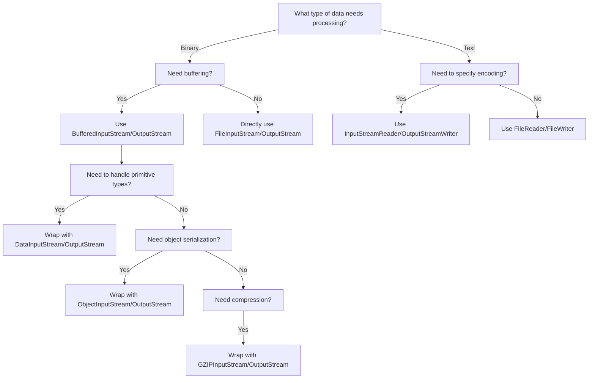

> [!note] Note
> This article reverts to your original Java Collections/Fundamentals notes as the main body, striving to retain the original question formats, summaries, and source code analysis structure as much as possible.

## Contents

- `Overview of Java Collections`
- `Java Collections Summary`
- `Common Knowledge about List`
- `Common Knowledge about Map (Important)`
- `Java Basics Summary`
- `Java Reflection`
- `Java Proxy Pattern`
- `Java SPI Mechanism`
- `Java IO`

## Overview of Java Collections

It seems my understanding of the source code analysis part of Java collections is insufficient? But time is running out! Need to step it up!

### Overview of Java Collections
Derived from two main interfaces: one is the `Collection` interface, mainly for storing single elements; the other is the `Map` interface, mainly for storing key-value pairs. Under the `Collection` interface, there are three main sub-interfaces: `List`, `Set`, and `Queue`.


>Only the main inheritance relationships are listed here, not all relationships.

### Summary of Underlying Data Structures in the Collection Framework

**List**

- `ArrayList`: `Object[]` array. Details can be found in: ArrayList Source Code Analysis.
- `Vector`: `Object[]` array.
- `LinkedList`: Doubly linked list (before JDK 1.6 it was a circular linked list, JDK 1.7 removed the circular structure). Details can be found in: LinkedList Source Code Analysis.

**Set**

- `HashSet` (unordered, unique): Implemented based on `HashMap`, internally uses `HashMap` to store elements.
- `LinkedHashSet`: `LinkedHashSet` is a subclass of `HashSet`, and its internal implementation is based on `LinkedHashMap`.
- `TreeSet` (ordered, unique): Red-Black tree (a self-balancing sorted binary tree).

**Queue**

- `PriorityQueue`: `Object[]` array implementing a min-heap. Details can be found in: PriorityQueue Source Code Analysis.
- `DelayQueue`: Based on `PriorityQueue`. Details can be found in: DelayQueue Source Code Analysis.
- `ArrayDeque`: Resizable dynamic double-ended array.

**Map**

- `HashMap`: Before JDK 1.8, `HashMap` was composed of an array and linked lists, with the array being the main body and linked lists primarily used to resolve hash collisions (using the "separate chaining" method). In JDK 1.8 and later, there's a significant change in resolving hash collisions: when the linked list length exceeds the threshold (default is 8) (before converting the linked list to a red-black tree, it checks if the current array length is less than 64; if so, it prefers array expansion over conversion to a red-black tree), the linked list is transformed into a red-black tree to reduce search time. Details can be found in: HashMap Source Code Analysis.
- `LinkedHashMap`: `LinkedHashMap` inherits from `HashMap`, so its underlying structure is still based on the separate chaining hash structure, i.e., composed of an array and linked lists or red-black trees. Additionally, `LinkedHashMap` adds a doubly linked list on top of the above structure, allowing it to maintain the insertion order of key-value pairs. Through corresponding operations on the linked list, it also implements logic related to access order. Details can be found in: LinkedHashMap Source Code Analysis.
- `Hashtable`: Composed of an array and linked lists, with the array being the main body and linked lists primarily used to resolve hash collisions.
- `TreeMap`: Red-Black tree (a self-balancing sorted binary tree).

### Potential Key Questions!

>Adding \* indicates key points! Overall: `ArrayList`, `LinkedList`, `HashMap`, `ConcurrentHashMap` are the key ones! Understand the others.

#### What is the underlying implementation principle of ArrayList?
- `ArrayList` is implemented using a dynamic array underneath.
- `ArrayList` has an initial capacity of 0; it initializes the capacity to 10 only when data is added for the first time.
- When `ArrayList` expands, its capacity becomes 1.5 times the original capacity, and each expansion requires copying the array.
- When adding data to `ArrayList`:
    - Ensure that the used length (`size`) plus 1 is sufficient to store the next piece of data.
    - Calculate the array's capacity. If the current used length + 1 is greater than the current array length, call the `grow` method to expand (to 1.5 times the original).
    - After ensuring space for the new data, add the new element at the `size` position.
    - Return a boolean indicating successful addition.

> `new ArrayList(10)` How many times does the list expand? 0 times

#### How to convert between Array and List?
- Convert Array to List: Use the `asList` method from the `java.util.Arrays` utility class in the JDK.
- Convert List to Array: Use the `toArray` method of the List. The parameterless `toArray` method returns an `Object` array. Passing an array of the specified type initializes and returns an array of that type.

If the interviewer asks further:
- After converting an array to a List using `Arrays.asList`, if you modify the original array, will the list be affected? `->` Yes, it will be affected.
- After converting a List to an array using `toArray`, if you modify the List content, will the array be affected? `->` No, it will not be affected.

Answer:
- After converting an array to a List using `Arrays.asList`, if you modify the array content, the list will be affected. This is because it internally uses an inner class `ArrayList` within the `Arrays` class to construct the collection. In the constructor of this inner class, it simply wraps the array we passed in, ultimately pointing to the same memory address.
- After converting a List to an array using `toArray`, if you modify the List content, the array will not be affected. When `toArray` is called, it performs a copy of the array at the底层 (underlying level), so it has no relationship with the original elements afterwards. Therefore, even if the List is modified later, the array remains unaffected.

#### What is the difference between ArrayList and LinkedList? (*)
What is the difference between ArrayList and LinkedList?

#### What is the underlying implementation of HashMap? (*)
The underlying implementation of HashMap.
>What is the difference between HashMap in JDK 1.7 and 1.8?

#### What is the specific process of the put operation in HashMap? (*)
Flowchart:


**(Important)**

1.  Check if the key-value pair array `table` is null or empty; if so, execute `resize()` for expansion (initialization).
2.  Calculate the hash value based on the key to get the array index.
3.  If `table[i] == null` condition holds, directly create a new node and add it.
4.  If `table[i] != null`:
    - Check if the first element of `table[i]` has the same key; if so, directly overwrite the value.
    - Check if `table[i]` is a `TreeNode`, i.e., if `table[i]` is a red-black tree. If it's a red-black tree, insert the key-value pair directly into the tree.
    - Traverse `table[i]`, insert the data at the end of the linked list, then check if the linked list length is greater than 8. If greater than 8, convert the linked list to a red-black tree and perform the insertion operation within the red-black tree. During traversal, if a key is found to already exist, directly overwrite the value.
5.  After successful insertion, check if the actual number of existing key-value pairs (`size`) exceeds the maximum capacity `threshold` (array length * 0.75). If it exceeds, perform expansion.

#### What is the expansion mechanism of HashMap?
Flowchart:


- The `resize` method needs to be called when adding elements or during initialization. The first time data is added, the array length is initialized to 16. Subsequent expansions occur when the expansion threshold (array length * 0.75) is reached.
- Each expansion doubles the previous capacity (this ensures it's always a power of 2).
- After expansion, a new array is created, and the data from the old array needs to be moved to the new one.
    - For nodes without hash collisions, directly calculate the new array index using `e.hash & (newCap - 1)`.
    - For red-black trees, follow the red-black tree addition process.
    - For linked lists, the linked list needs to be traversed and potentially split. Check if `(e.hash & oldCap)` is 0. The element either stays at the original index or moves to the **original index + increased array size**.

#### What is the addressing algorithm of HashMap?


#### The infinite loop problem of HashMap JDK 1.7 under multi-threading
Reference videos:
- [Common Collections Part-17 - HashMap Multi-threading Infinite Loop Issue in Version 1.7\_bilibili\_bilibili](https://www.bilibili.com/video/BV1yT411H7YK?vd_source=cb670d82714ee9baee22c33ef083884d&spm_id_from=333.788.player.switch&p=85)
- [JDK7 HashMap Head Insertion Loop Problem, Is It This Hard to Understand?\_bilibili\_bilibili](https://www.bilibili.com/video/BV1n541177Ea/?vd_source=cb670d82714ee9baee22c33ef083884d)
- [Why does HashMap cause an infinite loop? HashMap infinite loop occurs in versions before JDK 1.8. It refers to a situation where, in a concurrent environment, due to multiple... - Juejin](https://juejin.cn/post/7236009910147825719?searchId=202307221616567C1AAB8045817A64ED43)

In JDK 1.7's `HashMap`, during array expansion, because the linked list uses head insertion, it could lead to an infinite loop during the data migration process.

For example, suppose there are two threads:
Thread 1: Reads the current HashMap data, including a linked list, and is about to expand when Thread 2 intervenes.
Thread 2: Also reads the HashMap and performs the expansion directly. Because it's head insertion, the order of the linked list is reversed. For example, the original order is A -> B, and after expansion, it becomes B -> A. Thread 2 finishes execution.

Thread 1: When it continues execution, it encounters an infinite loop.
Thread 1 first moves A to the new linked list, then inserts B at the head of the new list. Due to the modification by the other thread, B's `next` points to A, resulting in B -> A -> ..., forming a cycle (loop).
Of course, JDK 8 adjusted the expansion algorithm. It no longer adds elements to the head of the linked list (instead, it maintains the same order as before expansion), using **tail insertion**, thus avoiding the infinite loop problem present in JDK 7.

## Java Collections Summary

Key points:
- Underlying principles of HashMap
- Underlying principles of ConcurrentHashMap
- Underlying principles of ArrayList

Understanding the underlying principles of these few is sufficient. (No summary for others for now.)

This approach feels inefficient, as it only lists points without providing answers. It's easy to forget. So, use the Java Collections mind map.

Therefore, this note will **organize common questions and my own questions**.

### ArrayList
Regarding the underlying principles and source code analysis of ArrayList:
- **How is the expansion mechanism implemented?**
- **Differences from LinkedList**
- Thread safety? What to use then?
- Why does it have the ability for fast lookup?

My own thoughts:
- What is `modCount`?
- Source code analysis of various operations.

### HashMap

**The most important of the most important**

Almost a guaranteed exam topic

Questions:
- **How does HashMap expand?**
- **Differences between JDK 7 and 8 implementations.**
- How does HashMap expand? Why double the size?
- Is it thread-safe?
- What is the load factor? Why is the default 0.75?

From interview experience:
- Explain the process of HashMap.
- Use cases of Red-Black trees and HashMap?
- Differences between HashMap, HashTable, and ConcurrentHashMap.
- In a multi-threaded environment: while HashMap is expanding, another thread tries to perform a `put` operation. Does it insert into the new table or the old table?
- Underlying data structure of HashMap.
- How are hash collisions resolved?
- **Why was JDK 1.7 HashMap using head insertion, and why did 1.8 change to tail insertion?**

For me:
- How are various methods implemented in the source code? What is the operation flow?
- Has the `hash` method changed between JDK 7/8? Why is it implemented that way?
- What is the mechanism of the `resize` method?

### ConcurrentHashMap
>Strictly speaking, this also belongs to JUC content, so... it can be written about either way, right?

Questions:
- **Differences between JDK 7/8?**
- **What is the storage structure? (For JDK 7/8)**
- What is the process flow for various operations?
- **Comparison/Differences with HashMap?**
- CAS?
- Does the `get` method of ConcurrentHashMap need to be locked? Why?

From interview experience:
- **How is thread safety achieved?**
- How is segment locking guaranteed? (Not entirely sure what this question asks)
- **Principles** and their drawbacks?
- How is it implemented?
- Compared with HashTable, which is better?
- `size()` algorithm?
- Why does ConcurrentHashMap in 1.8 use the `synchronized` keyword?
- Why can the key of ConcurrentHashMap not be null?
- What are its applications in projects?

## List Related Common Knowledge

### What is the difference between ArrayList and Array?
> `ArrayList` is internally based on a dynamic array implementation, making it more flexible to use than `Array` (static array):

- `ArrayList` dynamically expands or shrinks based on the actual elements stored, whereas the length of an `Array` cannot be changed after it is created.
- `ArrayList` allows you to use generics to ensure type safety, while `Array` does not.
- `ArrayList` can only store objects. For primitive data types, their corresponding wrapper classes (like Integer, Double, etc.) must be used. `Array` can directly store primitive data types or objects.
- `ArrayList` supports common operations like insertion, deletion, and traversal, and provides a rich set of API methods, such as `add()`, `remove()`, etc. `Array` is just a fixed-length array where elements can only be accessed by index; it lacks capabilities for dynamically adding or removing elements.
- `ArrayList` does not require specifying a size upon creation, while `Array` must specify its size when created.

```java
 // Initialize a String array
 String[] stringArr = new String[]{"hello", "world", "!"};
 // Modify an element in the array
 stringArr[0] = "goodbye";
 System.out.println(Arrays.toString(stringArr));// [goodbye, world, !]
 // Delete an element from the array, requires manually shifting subsequent elements
 for (int i = 0; i < stringArr.length - 1; i++) {
     stringArr[i] = stringArr[i + 1];
 }
 stringArr[stringArr.length - 1] = null;
 System.out.println(Arrays.toString(stringArr));// [world, !, null]
```

```java
// Initialize a String ArrayList
 ArrayList<String> stringList = new ArrayList<>(Arrays.asList("hello", "world", "!"));
// Add an element to the ArrayList
 stringList.add("goodbye");
 System.out.println(stringList);// [hello, world, !, goodbye]
 // Modify an element in the ArrayList
 stringList.set(0, "hi");
 System.out.println(stringList);// [hi, world, !, goodbye]
 // Delete an element from the ArrayList
 stringList.remove(0);
 System.out.println(stringList); // [world, !, goodbye]
```

### What are the differences between ArrayList and LinkedList?

- `ArrayList` and `LinkedList` are both unsynchronized, meaning **thread safety is not guaranteed**.
- `ArrayList` uses an `Object` array at its core; `LinkedList` uses a **doubly linked list** data structure (before JDK 1.6 it was a circular linked list, JDK 1.7 removed the circular structure. Note the difference between a doubly linked list and a doubly circular linked list).
- Whether insertion and deletion are affected by element position:
    - `ArrayList` uses array storage, so the time complexity of inserting and deleting elements is affected by element position.
    - `LinkedList` uses linked list storage, so inserting or deleting elements at the head or tail is not affected by element position, $O(1)$. If inserting or deleting at a specified position, it is $O(n)$.
- Support for fast random access: Fast random access means **quickly obtaining an element object by its index** (corresponding to the `get(int index)` method).
    - `LinkedList` does not support efficient random element access.
    - `ArrayList` supports it (implements the `RandomAccess` interface).
- Memory space usage: `ArrayList`'s space waste is mainly reflected in **reserving a certain amount of capacity space** at the end of the list, while `LinkedList`'s space cost is reflected in each element consuming more space than `ArrayList` (because it needs to store references to the direct successor, direct predecessor, and the data).

>Generally, `LinkedList` is not commonly used. Scenarios requiring `LinkedList` can almost always be replaced with `ArrayList`, and performance is usually better.

#### RandomAccess Interface
> [!question]
> Q: Why can't `LinkedList` implement the `RandomAccess` interface?
> A: `RandomAccess` is a marker interface used to indicate that the implementing class supports random access (i.e., elements can be quickly accessed via index). Because `LinkedList`'s underlying data structure is a linked list with non-contiguous memory addresses, elements can only be located via pointers, and it does not support fast random access, so it cannot implement the `RandomAccess` interface.

```java
public interface RandomAccess {
}
```
Actually, the `RandomAccess` interface defines nothing. So `RandomAccess` is merely an identifier. **It identifies that classes implementing this interface have random access capabilities.**

>In the `binarySearch()` method, it checks whether the incoming `list` is an instance of `RandomAccess`. If so, it calls the `indexedBinarySearch()` method; otherwise, it calls the `iteratorBinarySearch()` method.

### Doubly Linked List vs. Doubly Circular Linked List


### What is the time complexity of inserting and deleting elements in ArrayList?
>Very easy to understand, the complexity is as expected and similar to the nature of an array.

Insertion:

- Head Insertion: Since all elements need to be shifted backward by one position, the time complexity is O(n).
- Tail Insertion: When the `ArrayList` capacity is not reached, inserting an element at the end of the list has a time complexity of O(1), as it simply adds an element at the end of the array. When the capacity is reached and expansion is needed, an O(n) operation is required to copy the original array to a new, larger array, followed by the O(1) operation of adding the element.
- Insertion at a Specified Position: All elements after the target position need to be shifted backward by one position, and then the new element is placed at the specified index. This process requires moving an average of n/2 elements, so the time complexity is O(n).

Deletion:

- Head Deletion: Since all elements need to be shifted forward by one position, the time complexity is O(n).
- Tail Deletion: When the deleted element is at the end of the list, the time complexity is O(1).
- Deletion at a Specified Position: All elements after the target element need to be shifted forward to fill the gap left by the deleted element, requiring an average of n/2 elements to be moved, resulting in a time complexity of O(n).

### What is the time complexity of inserting and deleting elements in LinkedList?
>LinkedList is a doubly linked list, worth noting.
- Head Insertion/Deletion: Only requires modifying the head node's pointers to complete the operation, so the time complexity is O(1).
- Tail Insertion/Deletion: Only requires modifying the tail node's pointers to complete the operation, so the time complexity is O(1).
- Insertion/Deletion at a Specified Position: Requires first moving to the specified position, then modifying the pointers of the specified nodes. However, due to the existence of head and tail pointers, traversal can start from the closer end, requiring an average of n/4 elements to be traversed, resulting in a time complexity of O(n).

### Understand (Just look, relatively simple):
#### What are the differences between ArrayList and Vector? (Just understand)
- `ArrayList` is the **main implementation class** of `List`, using `Object[]` for storage, suitable for frequent lookup operations, and is thread-unsafe.
- `Vector` is an **older implementation class** of `List`, using `Object[]` for storage, and is thread-safe.

#### What are the differences between Vector and Stack? (Just understand)
- Both `Vector` and `Stack` are thread-safe, using the `synchronized` keyword for synchronization.
- `Stack` inherits from `Vector`, representing a Last-In-First-Out (LIFO) stack, while `Vector` is a list.

> [!NOTE]
> With the evolution of Java concurrent programming, `Vector` and `Stack` have been phased out. It is **recommended to use concurrent collection classes** (such as `ConcurrentHashMap`, `CopyOnWriteArrayList`, etc.) or manually implement thread-safe methods for safe multi-threaded operations.

#### Can ArrayList store null values?
ArrayList can store objects of any type, including null values. However, **adding null values to ArrayList is not recommended**, as null values are meaningless and make code harder to maintain; for example, forgetting to perform null checks can lead to NullPointerExceptions.

## Map Related Common Knowledge

### Differences between HashMap and Hashtable

- `HashMap` is not thread-safe, while `Hashtable` is thread-safe because its internal methods are mostly decorated with `synchronized`. (Use `ConcurrentHashMap` for thread safety).
- `Hashtable` is slightly less efficient and is largely **deprecated**.
- Support for Null key and Null value:
    - `HashMap` can store `null` keys and `null` values, but only one `null` key is allowed (multiple `null` values are allowed).
    - `Hashtable` does not allow `null` keys or `null` values; attempting to use them will throw a `NullPointerException`.
- Differences in initial capacity and capacity expansion size:
    - If the initial capacity is **not specified** upon creation, `Hashtable` defaults to an initial size of 11, and subsequent expansions change the capacity to `2n+1`. `HashMap` defaults to an initial size of 16, and subsequent expansions double the capacity.
    - If the initial capacity is **specified** upon creation, `Hashtable` uses the given size directly, while `HashMap` expands it to the **next power of 2** (guaranteed by the `tableSizeFor()` method in `HashMap`).
- Underlying Data Structure:
    - From JDK 1.8 onwards, `HashMap` has a significant change in resolving hash conflicts: when the linked list length exceeds the threshold (default 8), it converts the linked list to a **red-black tree** (before conversion, it checks if the current array length is less than 64; if so, it prefers array expansion over conversion to a red-black tree) to reduce search time.
    - `Hashtable` does not have such a mechanism.
- Hash Function Implementation: `HashMap` applies a perturbation function to mix high and low bits of the hash value to reduce collisions, while `Hashtable` directly uses the key's `hashCode()`.

>Ensures `HashMap` always uses a power of 2 as the hash table size.
```java
/**
 * Returns a power of two size for the given target capacity.
 * Finds the smallest power of 2 greater than or equal to cap
 */
static final int tableSizeFor(int cap) {
    int n = cap - 1;
    n |= n >>> 1;
    n |= n >>> 2;
    n |= n >>> 4;
    n |= n >>> 8;
    n |= n >>> 16;
    return (n < 0) ? 1 : (n >= MAXIMUM_CAPACITY) ? MAXIMUM_CAPACITY : n + 1;
}
```

#### Why is the length of HashMap a power of 2?

- Bitwise operations are more efficient: Bitwise AND (&) is more efficient than the modulo operation (%). When the length is a power of 2, `hash % length` is equivalent to `hash & (length - 1)`.
- Helps ensure a more uniform distribution of hash values: After expansion, if the hash values of elements in the old array are relatively uniform, elements in the new array will also be distributed relatively evenly. Optimally, about half will be in the first half of the new array and half in the second half.
- Simplifies and makes the expansion mechanism efficient: After expansion, it only needs to check the change in the high bit of the hash value to determine the new position of an element. Elements either stay at the same index (if the high bit is 0) or move to the new position (if the high bit is 1, i.e., original index + original capacity).

### Differences between HashMap and HashSet
`HashSet` is implemented based on `HashMap` internally. Except for `clone()`, `writeObject()`, and `readObject()`, which `HashSet` must implement itself, all other methods directly call methods from `HashMap`.

### Differences between HashMap and TreeMap
`TreeMap` and `HashMap` both inherit from `AbstractMap`. Additionally, `TreeMap` implements the `NavigableMap` and `SortedMap` interfaces.


Implementing the `NavigableMap` interface gives `TreeMap` the ability to search for elements within the collection.

The `NavigableMap` interface provides rich methods for exploring and manipulating key-value pairs:
- Directional Search: Methods like `ceilingEntry()`, `floorEntry()`, `higherEntry()`, and `lowerEntry()` can locate the closest key-value pair greater than or equal to, less than or equal to, strictly greater than, or strictly less than a given key.
- Subset Operations: Methods like `subMap()`, `headMap()`, and `tailMap()` efficiently create view subsets of the original map without copying the entire collection.
- Reverse Order View: The `descendingMap()` method returns a reverse-order `NavigableMap` view, allowing iteration over the entire `TreeMap` in reverse order.
- Boundary Operations: Methods like `firstEntry()`, `lastEntry()`, `pollFirstEntry()`, and `pollLastEntry()` provide convenient ways to access and remove elements.

Implementing the `SortedMap` interface gives `TreeMap` the ability to sort elements in the collection by key. By default, it sorts keys in ascending order, but a custom comparator can also be specified.

```java
public class Person {
    private Integer age;
    //...
    public static void main(String[] args) {
        TreeMap<Person, String> treeMap = new TreeMap<>(new Comparator<Person>() {
            @Override
            public int compare(Person person1, Person person2) {
                int num = person1.getAge() - person2.getAge();
                return Integer.compare(num, 0);
            }
        });
        /* Can also use lambda expression
        TreeMap<Person, String> treeMap = new TreeMap<>((person1, person2) -> {
          int num = person1.getAge() - person2.getAge();
          return Integer.compare(num, 0);
        });
        */

        treeMap.put(new Person(3), "person1");
        treeMap.put(new Person(18), "person2");
        treeMap.put(new Person(35), "person3");
        treeMap.put(new Person(16), "person4");
        treeMap.entrySet().stream().forEach(personStringEntry -> {
            System.out.println(personStringEntry.getValue());
        });
    }
}
```

Elements in `TreeMap` are already sorted in ascending order based on the `Person` object's `age` field.

Compared to `HashMap`, `TreeMap` mainly adds **the ability to sort elements by key** and **the ability to search for elements within the collection**.

### How does HashSet check for duplicates?

> [!NOTE]
> When you add an object to a `HashSet`, `HashSet` first calculates the object's `hashcode` to determine its insertion position, and also compares it with the `hashcode` of other added objects. If no matching `hashcode` is found, `HashSet` assumes the object is not duplicated. However, if an object with the same `hashcode` is found, it calls the `equals()` method to check if the objects with equal `hashcode` are truly identical. If both are the same, `HashSet` prevents the addition operation from succeeding.

In JDK 1.8, the `add()` method of `HashSet` simply calls `HashMap`'s `put()` method and checks the return value to determine if there was a duplicate element.
Source code in `HashSet`:
```java
// Return value: Returns true if the set did not already contain the specified element
public boolean add(E e) {
        return map.put(e, PRESENT)==null;
}
```

In `HashMap`'s `putVal()` method (the `put` method calls `putVal`), you can also see the following note:

```java
// Return value: Returns null if the insertion position had no element, otherwise returns the previous element
final V putVal(int hash, K key, V value, boolean onlyIfAbsent,
                   boolean evict) {
...
}
```

That is, in JDK 1.8, regardless of whether an element already exists in the `HashSet`, `HashSet` **will directly insert it**, but the return value of the `add()` method indicates whether an identical element existed before insertion.

### Underlying Implementation of HashMap
Before JDK 1.8, `HashMap` was implemented using an array and linked lists combined, i.e., a hash chain. `HashMap` calculates the hash value of the key after processing it through a perturbation function, then uses `(n - 1) & hash` to determine the storage location of the element (n is the array length). If the position already contains an element, it checks if the hash value and key of the existing element are the same as the one to be inserted. If they are the same, it directly overwrites the value. If not, it resolves the conflict using the separate chaining method. ^45b49e

>**Separate Chaining**: Combines linked lists and arrays. Essentially, it creates an array of linked lists, where each cell in the array is a linked list. When a hash collision occurs, the colliding value is added to the corresponding linked list. As shown in the figure:


^8b5a78

The perturbation function (the `hash` method) in `HashMap` is used to optimize the distribution of hash values. By performing additional processing on the original `hashCode()`, the perturbation function can **reduce collisions caused by poor `hashCode()` implementations**, thereby improving the uniformity of data distribution.

```java
//JDK1.8
    static final int hash(Object key) {
        int h;
      // key.hashCode(): returns the hash value, i.e., the hashcode
      // ^: bitwise XOR
      // >>>: unsigned right shift, ignoring the sign bit, fills with 0
      return (key == null) ? 0 : (h = key.hashCode()) ^ (h >>> 16);
  }
//JDK.7
    static int hash(int h) {
        // This function ensures that hashCodes that differ only by
        // constant multiples at each bit position have a bounded
        // number of collisions (approximately 8 at default load factor).
    
        h ^= (h >>> 20) ^ (h >>> 12);
        return h ^ (h >>> 7) ^ (h >>> 4);
    }
```

After JDK 1.8, there was a significant change in resolving hash collisions (prior to 1.7, it was separate chaining). When the **linked list length exceeds the threshold (default 8) and the total number of elements exceeds 64**, the linked list is converted to a red-black tree to reduce search time.


#### HashMap Source Code: Linked List to Red-Black Tree Conversion
>Enter the `HashMap` source code and search for `treeifyBin`.

In the `putVal` method, there is a section of code:
```java
final V putVal(int hash, K key, V value, boolean onlyIfAbsent,
               boolean evict) {
        //..
            for (int binCount = 0; ; ++binCount) {
                if ((e = p.next) == null) {
                    p.next = newNode(hash, key, value, null);
                    //TREEIFY_THRESHOLD = 8
                    if (binCount >= TREEIFY_THRESHOLD - 1) // -1 for 1st
                        // Red-black tree conversion (doesn't convert directly yet)
                        treeifyBin(tab, hash);
                    break;
                }
                if (e.hash == hash &&
                    ((k = e.key) == key || (key != null && key.equals(k))))
                    break;
                p = e;
            }
        //...
}
```

For the `treeifyBin` method: It checks whether the conversion to a red-black tree should actually happen.
```java
final void treeifyBin(Node<K,V>[] tab, int hash) {
    int n, index; Node<K,V> e;
    // MIN_TREEIFY_CAPACITY = 64, checks if the current array length is less than 64
    if (tab == null || (n = tab.length) < MIN_TREEIFY_CAPACITY)
        // If less than 64, perform array expansion
        resize();
    else if ((e = tab[index = (n - 1) & hash]) != null) {
        // Convert to red-black tree
        TreeNode<K,V> hd = null, tl = null;
        do {
            TreeNode<K,V> p = replacementTreeNode(e, null);
            if (tl == null)
                hd = p;
            else {
                p.prev = tl;
                tl.next = p;
            }
            tl = p;
        } while ((e = e.next) != null);
        if ((tab[index] = hd) != null)
            hd.treeify(tab);
    }
}
```

Before converting a linked list to a red-black tree, it checks if the current array length is less than 64. If it is, it prefers array expansion over conversion to a red-black tree.

### HashMap Multi-threaded Operation Causing Infinite Loop Issue
In `HashMap` versions JDK 1.7 and earlier, expansion operations in a multi-threaded environment could potentially lead to an infinite loop. This occurs because when multiple elements in a bucket need to be expanded, multiple threads operating on the linked list simultaneously, combined with head insertion, can cause nodes to point to incorrect locations, forming a circular linked list. This then leads to an infinite loop when querying elements.

To solve this problem, JDK 1.8's `HashMap` adopted tail insertion instead of head insertion to avoid reversing the linked list. Nodes are always inserted at the end of the list, preventing circular structures. However, using `HashMap` in a multi-threaded environment is still not recommended, as issues like **data overwriting** can still occur. For concurrent environments, `ConcurrentHashMap` is the recommended choice.

### Why is HashMap not thread-safe?
In JDK 1.7 and earlier versions, `HashMap` could cause infinite loops and data loss during expansion in a multi-threaded environment.

Data loss exists in both JDK 1.7 and JDK 1.8.

After JDK 1.8, in `HashMap`, multiple key-value pairs may be assigned to the same bucket and stored as a linked list or red-black tree. Concurrent `put` operations by multiple threads on a `HashMap` can lead to thread safety issues, specifically the risk of data overwriting.

>Refer to the source code of `HashMap`'s `putVal` method.

Consider two threads performing a `put` operation simultaneously, and a hash collision occurs:
> [!example]
> - Two threads, 1 and 2, simultaneously perform a `put` operation, and a hash collision occurs (the hash function calculates the same insertion index).
> - Different threads may get CPU execution time in different time slices. Thread 1 finishes the hash collision check but is suspended before proceeding due to its time slice expiring. Thread 2 completes its insertion first.
> - Subsequently, Thread 1 gets the CPU time slice. Since it has already performed the hash collision check, it proceeds directly to insertion, thereby overwriting the data inserted by Thread 2.

Concurrent `put` operations can also lead to an incorrect `size` value, further causing data overwrite issues: (This describes a very common multi-threading problem)

> [!example]
> - Thread 1 executes the `if(++size > threshold)` check, assuming it reads `size` as 10, but gets suspended before proceeding due to time slice expiration.
> - Thread 2 also executes the `if(++size > threshold)` check, also reads `size` as 10, inserts its element into the bucket, and updates `size` to 11.
> - Subsequently, Thread 1 gets the CPU time slice. It also inserts its element into the bucket and updates `size` to 11. Both Thread 1 and 2 performed a `put` operation, but `size` only increased by 1, meaning effectively only one element was actually added to the `HashMap`.

### Common ways to traverse a HashMap
[HashMap's 7 Traversal Methods and Performance Analysis](https://mp.weixin.qq.com/s?__biz=MzkxOTcxNzIxOA==&mid=2247505580&idx=1&sn=1825ca5be126c2b650e201fb3fa8a3e6&source=41#wechat_redirect)

Roughly categorized as:
- Iterator traversal
    1. `EntrySet`
    2. `KeySet`
- `For Each` traversal
    3. `EntrySet`
    4. `KeySet`
5. `Lambda` traversal - JDK 1.8+
- `Stream` traversal - JDK 1.8+ (includes **6. Single-threaded and 7. Multi-threaded**)

```java
// Create and assign values to a HashMap
Map<Integer, String> map = new HashMap();
map.put(1, "Java");
map.put(2, "JDK");
map.put(3, "Spring Framework");
map.put(4, "MyBatis framework");
map.put(5, "Java Chinese Community");
```

```java
// 1 Traverse iterator entrySet
Iterator<Map.Entry<Integer, String>> iterator = map.entrySet().iterator();
while (iterator.hasNext()) {
    Map.Entry<Integer, String> entry = iterator.next();
    System.out.println(entry.getKey());
    System.out.println(entry.getValue());
}
 
// 2 Traverse iterator keySet
Iterator<Integer> iterator = map.keySet().iterator();
while (iterator.hasNext()) {
    Integer key = iterator.next();
    System.out.println(key);
    System.out.println(map.get(key));
}

 // 3 Traverse foreach entrySet
for (Map.Entry<Integer, String> entry : map.entrySet()) {
    System.out.println(entry.getKey());
    System.out.println(entry.getValue());
}

// 4 Traverse foreach keySet
for (Integer key : map.keySet()) {
    System.out.println(key);
    System.out.println(map.get(key));
}

// 5 Traverse lambda
map.forEach((key, value) -> {
    System.out.println(key);
    System.out.println(value);
});

// 6 Traverse Streams API single-threaded
map.entrySet().stream().forEach((entry) -> {
    System.out.println(entry.getKey());
    System.out.println(entry.getValue());
});

// 7 Traverse Streams API multi-threaded
map.entrySet().parallelStream().forEach((entry) -> {
    System.out.println(entry.getKey());
    System.out.println(entry.getValue());
});
```

Performance analysis for HashMap traversal:

When blocking is present, `parallelStream` has the highest performance. When non-blocking, `parallelStream` has the lowest performance.

- When traversal does not involve blocking, `parallelStream` has the lowest performance:
```java
Benchmark               Mode  Cnt     Score      Error  Units
Test.entrySet           avgt    5   288.651 ±   10.536  ns/op
Test.keySet             avgt    5   584.594 ±   21.431  ns/op
Test.lambda             avgt    5   221.791 ±   10.198  ns/op
Test.parallelStream     avgt    5  6919.163 ± 1116.139  ns/op
```

- After adding blocking code `Thread.sleep(10)`, `parallelStream` has the highest performance:
```java
Benchmark               Mode  Cnt           Score          Error  Units
Test.entrySet           avgt    5  1554828440.000 ± 23657748.653  ns/op
Test.keySet             avgt    5  1550612500.000 ±  6474562.858  ns/op
Test.lambda             avgt    5  1551065180.000 ± 19164407.426  ns/op
Test.parallelStream     avgt    5   186345456.667 ±  3210435.590  ns/op
```

### Underlying Implementation of ConcurrentHashMap (and Differences from Hashtable)
They differ in how thread safety is achieved.

- **Underlying Data Structure**:
    - JDK 1.7 `ConcurrentHashMap` uses a **segmented array + linked list** structure at its core. JDK 1.8 uses a data structure similar to HashMap 1.8: array + linked list / red-black tree.
    - Similar to `HashMap` (pre-JDK 1.8), the underlying structure is essentially an **array + linked list**, where the array is the main body and linked lists primarily resolve hash collisions.
    - `Hashtable` uses an **array + linked list** structure.
- **Way of Achieving Thread Safety** (Important):
    - In JDK 1.7, `ConcurrentHashMap` divided the entire bucket array into segments (`Segment`, segment lock). Each lock only locks a portion of the container's data (see diagram below). This allows multiple threads to access different data segments concurrently without lock contention, improving concurrency.
    - By JDK 1.8, `ConcurrentHashMap` abandoned the `Segment` concept. It directly uses a **Node array + linked list + red-black tree** data structure. Concurrency control is achieved using **`synchronized` and CAS operations**. (Since JDK 1.6, the `synchronized` lock has undergone many optimizations). The whole structure looks like an **optimized and thread-safe `HashMap`**. Although the `Segment` data structure can still be seen in JDK 1.8, its attributes have been simplified, mainly for compatibility with older versions.
    - `Hashtable` (single lock): Uses `synchronized` to ensure thread safety, making it **very inefficient**. When one thread accesses a synchronized method, other threads attempting to access any synchronized method may enter a blocking or polling state. For example, if one thread uses `put` to add an element, another thread cannot use `put` or `get`, leading to increased contention and lower efficiency.

>Pre-JDK 1.8 `HashMap` and `HashTable` both used an array + linked list structure.
> The diagram below can be viewed alongside the structure diagrams in the original notes.
#### JDK 1.7
`ConcurrentHashMap` before JDK 1.8: Composed of a `Segment` array structure and a `HashEntry` array structure.

Each element in the `Segment` array contains a `HashEntry` array, and each `HashEntry` array is essentially a linked list structure.

> i.e., **`Segment` array + `HashEntry` array + linked list**


Data is divided into segments (these "segments" are `Segment`). Each data segment is assigned a lock. **When a thread acquires a lock to access data in one segment, data in other segments can still be accessed by other threads**.

`Segment` inherits from `ReentrantLock`, so `Segment` acts as a reentrant lock, fulfilling the role of a lock. `HashEntry` is used to store key-value pair data.
```java
static class Segment<K,V> extends ReentrantLock implements Serializable {
}
```

> [!NOTE]
> A reentrant lock is a lock that supports a thread acquiring the same lock multiple times. That is, a thread holding a lock can acquire that same lock again without deadlocking. Reentrant locks typically maintain a counter tracking how many times the current thread has acquired the lock; the lock is only released when the counter reaches zero. This mechanism ensures that a single thread can acquire the lock multiple times without causing a deadlock. Common reentrant locks include `ReentrantLock` and the `synchronized` keyword.

A `ConcurrentHashMap` contains a `Segment` array. The number of `Segment`s cannot be changed once initialized. The default size of the `Segment` array is 16, meaning it supports up to 16 threads concurrently writing by default.

The structure of `Segment` is similar to `HashMap` (pre-JDK 1.8), an array and linked list structure.

A `Segment` contains a `HashEntry` array. Each `HashEntry` is a linked list element. Each `Segment` guards the elements in its corresponding `HashEntry` array. To modify data in the `HashEntry` array, the lock for the corresponding `Segment` must be obtained first. This means that **concurrent writes to the same `Segment` are blocked, while writes to different `Segment`s can proceed concurrently**.

#### JDK 1.8
JDK 1.8 and later: **`Node` array + linked list / red-black tree** (similar to `HashMap` implementation after JDK 1.8).
> `Node` is only used for linked list scenarios. For red-black trees, `TreeNode` is used. When a conflicting linked list reaches a certain length, it converts to a red-black tree.


> [!NOTE]
> `TreeNode` stores the red-black tree node and is wrapped by `TreeBin`. `TreeBin` maintains the root node of the red-black tree via the `root` attribute. During rotations in a red-black tree, the root node might be replaced by one of its former children. If another thread tries to write to the same red-black tree at this moment, thread-safety issues could arise. Therefore, in `ConcurrentHashMap`, `TreeBin` uses the `waiter` attribute to track the thread currently using the red-black tree, preventing other threads from entering.

Source code:
```java
static final class TreeBin<K,V> extends Node<K,V> {
        TreeNode<K,V> root;
        volatile TreeNode<K,V> first;
        volatile Thread waiter;
        volatile int lockState;
        // values for lockState
        static final int WRITER = 1; // set while holding write lock
        static final int WAITER = 2; // set when waiting for write lock
        static final int READER = 4; // increment value for setting read lock
        //...
}
```

`ConcurrentHashMap` removes the `Segment` segment lock and uses `Node + CAS + synchronized` to ensure concurrency safety. The data structure is similar to `HashMap` 1.8: **array + linked list / red-black tree**. Java 8 converts a linked list (search time complexity `O(N)`) to a red-black tree (search time complexity `O(log(N))`) when the list length exceeds a certain threshold (8).

#### Differences between JDK 1.7 and JDK 1.8 Implementations

- Thread Safety Implementation:
    - JDK 1.7 uses `Segment` segment locks (inheriting from `ReentrantLock`) for safety.
    - JDK 1.8 abandons `Segment` segment locks, adopting `Node + CAS + synchronized` to ensure thread safety. The lock granularity is finer; `synchronized` only locks the first node of the current linked list or red-black tree.
- Hash Collision Resolution: JDK 1.7 uses separate chaining; JDK 1.8 uses **separate chaining combined with red-black trees** (converts to red-black tree when linked list exceeds a threshold).
- Concurrency Level: JDK 1.7's maximum concurrency level is the number of `Segment`s, default 16. JDK 1.8's maximum concurrency level is the size of the `Node` array, offering **higher concurrency**.

### Why can't keys and values be null in ConcurrentHashMap?

The primary reason `ConcurrentMaps` (like `ConcurrentHashMap`, `ConcurrentSkipListMap`) do not allow `null` is that the ambiguity which might be tolerable in non-concurrent maps is unmanageable in a concurrent context. The main issue is that if `map.get(key)` returns `null`, you cannot distinguish between the key explicitly mapping to `null` and the key being absent. In a non-concurrent map, you could check this via `map.contains(key)`, but in a concurrent map, the `map` could have changed between the calls.

In a multi-threaded environment, it's impossible to correctly determine if a key-value pair exists (due to potential modifications by other threads). Single-threaded scenarios are fine.

If you absolutely need to use `null` in a `ConcurrentHashMap`, you can use a special static sentinel object to represent `null`.
```java
public static final Object NULL = new Object();
```

### Can ConcurrentHashMap guarantee the atomicity of compound operations?
>**Compound operations** are operations composed of multiple basic operations (like `put`, `get`, `remove`, `containsKey`), such as checking if a key exists (`containsKey(key)`) and then inserting or updating based on the result (`put(key, value)`).

`ConcurrentHashMap` is thread-safe, meaning it guarantees that when multiple threads perform read and write operations concurrently, data inconsistency will not occur, nor will the infinite loop issues seen in pre-JDK 1.8 `HashMap` under multi-threading.

>However, this does not mean it guarantees that all compound operations are atomic.

> [!example]
> Consider the following code:
> ```java
> // Thread A
> if (!map.containsKey(key)) {
> map.put(key, value);
> }
> // Thread B
> if (!map.containsKey(key)) {
> map.put(key, anotherValue);
> }
> ```
> If the execution order of Thread A and B is:
> - Thread A checks `map` and finds key does not exist.
> - Thread B checks `map` and finds key does not exist.
> - Thread B inserts `(key, anotherValue)` into the map.
> - Thread A inserts `(key, value)` into the map.
>
> Then the final result is `(key, value)`, not the expected `(key, anotherValue)`. This demonstrates the issue of non-atomic compound operations.

So how can we ensure the atomicity of compound operations with `ConcurrentHashMap`?
`ConcurrentHashMap` provides several atomic compound operations, such as `putIfAbsent`, `compute`, `computeIfAbsent`, `computeIfPresent`, `merge`, etc. These methods accept a function, calculate a new value based on the given key and value, and update the map atomically.

The code could be rewritten as:
```java
// Thread A
map.putIfAbsent(key, value);
// Thread B
map.putIfAbsent(key, anotherValue);

//or

// Thread A
map.computeIfAbsent(key, k -> value);
// Thread B
map.computeIfAbsent(key, k -> anotherValue);
```

>You could also use explicit locking for synchronization, but this is not recommended as it defeats the purpose of using `ConcurrentHashMap`. When using `ConcurrentHashMap`, it's best to utilize these atomic compound operation methods to ensure atomicity.

### Collections Utility Class
- Sorting
- Searching and replacing operations
- Synchronization control (not recommended; for thread-safe collection types, consider using concurrent collections from the JUC package)

Sorting operations:
```java
void reverse(List list)// Reverses the order
void shuffle(List list)// Randomly shuffles
void sort(List list)// Sorts in ascending natural order
void sort(List list, Comparator c)// Custom sort, logic controlled by Comparator
void swap(List list, int i , int j)// Swaps elements at two indices
void rotate(List list, int distance)// Rotates. Positive distance moves the last distance elements to the front. Negative distance moves the first distance elements to the back.
```

Searching and replacing operations
```java
int binarySearch(List list, Object key)// Performs binary search on a List, returns index; List must be sorted
int max(Collection coll)// Returns the largest element based on natural order. Analogous to int min(Collection coll)
int max(Collection coll, Comparator c)// Returns the largest element based on custom order defined by Comparator. Analogous to int min(Collection coll, Comparator c)
void fill(List list, Object obj)// Replaces all elements in the list with the specified object
int frequency(Collection c, Object o)// Counts the number of occurrences of an element
int indexOfSubList(List list, List target)// Finds the first index of target sublist in list, returns -1 if not found. Analogous to int lastIndexOfSubList(List source, list target)
boolean replaceAll(List list, Object oldVal, Object newVal)// Replaces old values with new values
```

Synchronization control: (Avoid using)
`Collections` provides several `synchronizedXxx()` methods that wrap a specified collection into a thread-synchronized collection, solving thread-safety issues for multi-threaded access.
We know that `HashSet`, `TreeSet`, `ArrayList`, `LinkedList`, `HashMap`, `TreeMap` are thread-unsafe. `Collections` provides static methods to wrap them into thread-synchronized collections.

**Very inefficient**
```java
synchronizedCollection(Collection<T>  c) // Returns a synchronized (thread-safe) collection backed by the specified collection.
synchronizedList(List<T> list)// Returns a synchronized (thread-safe) list backed by the specified list.
synchronizedMap(Map<K,V> m) // Returns a synchronized (thread-safe) map backed by the specified map.
synchronizedSet(Set<T> s) // Returns a synchronized (thread-safe) set backed by the specified set.
```

## Java Basics Summary

>Prioritize summarizing the questions given in the interview prep diagram. Summarize others if time permits.

Then summarize common ones. Summarize others in the miscellaneous section below.

##### Dynamic Proxy

**Dynamic Proxy** is both a **design pattern** and a **programming technique**. It allows for the **dynamic** creation of **proxy objects** at **runtime**, without needing to explicitly write the proxy class's source code at compile time. This proxy object can **intercept** calls to the methods of the **original target object**, and **insert additional logic** (such as logging, permission checks, transaction management, etc.) before and after the call, before **delegating** the actual method execution to the original target object. Its core value lies in **enhancing or controlling** the functionality of the original target class **without modifying its code**. It is a fundamental basis for implementing **Aspect-Oriented Programming (AOP)**.

There are two main ways to implement dynamic proxies: **JDK Dynamic Proxy** and **CGLIB Dynamic Proxy**.

**JDK Dynamic Proxy** is a feature provided by the `java.lang.reflect` package in the Java standard library. It requires that the **target object must implement one or more interfaces**. At runtime, JDK dynamic proxy dynamically **generates the bytecode for a new class** (typically named like `$ProxyX`) that implements the interfaces of the target object, and creates an instance of this class as the proxy object. This proxy class holds a reference to an implementation of the **`InvocationHandler`** interface.

The **principle of JDK Dynamic Proxy** is: when any interface method of the proxy object is called, the call is **forwarded** to the associated `InvocationHandler`'s **`invoke` method**. The `invoke` method receives three parameters: the proxy object itself, the `Method` object representing the called method, and the array of method arguments. The developer writes the **enhancement logic** inside the `invoke` method and can optionally **call the corresponding method on the original target object** via `Method.invoke(targetObject, args)`. Therefore, the core lies in intercepting and handling method calls through **reflection** and **interface implementation**.

**CGLIB (Code Generation Library)** is a **third-party** code generation library. It **does not require** the target object to implement interfaces; it can directly proxy **ordinary classes**. CGLIB achieves dynamic proxy through **inheritance**. At runtime, it dynamically **generates a subclass** of the target class and **overrides** all **non-final** methods of the target class.

The **principle of CGLIB Dynamic Proxy** is: when a method of the proxy object (the generated subclass instance) is called, CGLIB **intercepts** the call and **forwards** it to the **`intercept` method** of a class implementing the **`MethodInterceptor`** interface. The `intercept` method is similar to JDK proxy's `invoke` method; it receives the target object, the method, the arguments, and a `MethodProxy` object (used for efficiently calling the original superclass method). The developer implements the enhancement logic in the `intercept` method and can call the original target class's (parent class's) method via `MethodProxy.invokeSuper(proxyObject, args)`. It typically uses bytecode manipulation libraries like **ASM** to directly generate the bytecode of the subclass. Because it's based on inheritance, it **cannot proxy `final` classes or `final` methods**.

In summary, the core of dynamic proxy is **creating a proxy object at runtime** to **intercept and enhance** calls to the target object's methods. **JDK proxy is based on interface implementation and reflection**, requiring the target to implement interfaces; **CGLIB proxy is based on inheritance and bytecode generation**, can proxy ordinary classes (but cannot proxy final ones). Both are key technologies for implementing decoupling designs like AOP.

##### Reflection

What is Reflection?
**Reflection** is a **powerful mechanism** provided by Java that allows a program to **dynamically** obtain information about itself (or other classes) at **runtime** and to **dynamically manipulate** the fields, methods, and constructors of a class. Simply put, the program can **"introspect"** itself while running, understanding the internal structure of a class (such as fields, methods, constructors, annotations, etc.), and can **create object instances, call methods, and access or modify field values** at runtime, even if these classes, methods, or fields were **unknown at compile time**. The core entry point is typically the **`java.lang.Class` object**.

What are its benefits?
The **main benefit of reflection** lies in the great **flexibility** and **dynamism** it provides. It enables writing **highly generic** code that can adapt to different classes at runtime without needing to hardcode specific class names or method names at compile time. This is crucial for **building extensible frameworks and libraries**, as frameworks can **load, instantiate, and call** user-defined components based on configuration files or annotations without knowing the concrete implementation classes beforehand. It also enables **introspection**, allowing programs to examine the capabilities of an object.

Usage Scenarios?
*   **Framework Development**: This is the most common application scenario for reflection.
    *   **Spring's IoC/DI container** uses reflection to create Bean instances and inject dependencies based on configuration files or annotations.
    *   **ORM frameworks (like MyBatis, Hibernate)** use reflection to map database query results to fields of Java objects.
    *   **Web frameworks (like Spring MVC)** use reflection to invoke Controller methods that match request paths.
*   **Annotation Processing**: Programs can obtain **annotation information** on classes, methods, or fields at runtime via reflection and execute corresponding logic based on these annotations (e.g., JUnit executing test methods annotated with `@Test`).
*   **Serialization/Deserialization**: Some serialization libraries (like Jackson, Gson) use reflection to access object fields to convert them to JSON/XML or vice-versa, populating objects from data.
*   **Dynamic Loading and Proxy**: Can dynamically load classes based on class name strings (`Class.forName()`) and create instances. Implementations of dynamic proxies (JDK Proxy, CGLIB) also rely heavily on reflection to call methods on target objects.
*   **Development and Debugging Tools**: Features like IDE code completion, variable inspection and modification in debuggers rely on reflection to inspect and manipulate the state of objects at runtime.

**Disadvantages** mainly include:
- **Performance Overhead** (reflective calls are typically much slower than direct calls due to steps like lookup and access checks).
- **Breaking Encapsulation** (can access private members, potentially leading to security issues and maintenance difficulties).
- **Reduced code readability and maintainability** (bypassing compile-time type checks, errors may only surface at runtime).

##### *SPI Mechanism & Serialization Methods*
Mainly (used this mechanism in the RPC project, but didn't understand it very well).

##### Various New Features in Java?
*   **Java 5 (Tiger - 2004):** A very important version in Java's history, introducing many core features:
    *   **Generics:** Provides compile-time type safety, reducing casting and runtime errors.
    *   **Annotations:** Metadata mechanism for providing information to the compiler or runtime (e.g., `@Override`, `@Deprecated`).
    *   **Autoboxing/Unboxing:** Automatic conversion between primitive types and their corresponding wrapper classes.
    *   **Enums:** Type-safe enumerated types.
    *   **Varargs:** Allows methods to accept a variable number of arguments.
    *   **Enhanced for-loop:** Simplifies iteration over collections and arrays.
    *   **Concurrency Utilities (`java.util.concurrent`):** Introduced powerful concurrency tools (e.g., `ExecutorService`, `Locks`, `ConcurrentHashMap`).

*   **Java 7 (Dolphin - 2011):**
    *   **try-with-resources statement:** Automatically manages resources (like file streams, database connections), ensuring they are closed properly.
    *   **Diamond Operator `<>`:** Simplifies syntax for generic instantiation.
    *   **String in Switch:** Allows using strings in `switch` statements.
    *   **NIO.2 (New I/O API):** Provides a more powerful file system API (`java.nio.file` package).
    *   **Fork/Join Framework:** A framework for parallel task execution.

*   **Java 8 (Lambda - 2014):** Another milestone version, greatly changing Java programming paradigms:
    *   **Lambda Expressions:** Provides functional programming capabilities, making code more concise.
    *   **Stream API:** A powerful API for functional-style operations (filter, map, reduce, etc.) on collections.
    *   **Functional Interfaces:** Interfaces with a single abstract method, designed to be used with lambda expressions.
    *   **Default Methods and Static Methods in Interfaces:** Allows providing implementations in interfaces, enhancing interface evolution.
    *   **`Optional` Class:** For elegantly handling potentially `null` values, avoiding `NullPointerException`.
    *   **New Date and Time API (`java.time`):** Replaces the old, poorly designed `Date` and `Calendar` API.

*   **Java 9 (Module System - 2017):**
    *   **Java Platform Module System (JPMS - Project Jigsaw):** Introduces modularity concepts to improve code organization, security, and performance.
    *   **JShell (REPL):** Java's interactive programming environment.
    *   **Private Methods in Interfaces:** Allows defining private methods in interfaces to assist default or static methods.
    *   **Collection Factory Methods (`List.of()`, `Set.of()`, `Map.of()`):** Convenient methods for creating immutable collections.

*   **Java 10 (2018):**
    *   **Local Variable Type Inference (`var`):** Allows declaring local variables inside methods using `var` instead of explicit types; the compiler infers the type.

*   **Java 11 (LTS - 2018):** The first Long-Term Support (LTS) version under the new release cadence:
    *   **Standardized HTTP Client API:** A modern, built-in HTTP client.
    *   **`var` for Lambda Parameters:** Lambda expression parameters can also use `var`.
    *   **Launch Single-File Source-Code Programs:** Can directly run `.java` files without explicit compilation.

*   **Java 17 (LTS - 2021):** Another important LTS version:
    *   **Sealed Classes (Standard):** Restricts which classes can extend or implement a given class/interface, enhancing pattern matching.
    *   **Pattern Matching for `instanceof` (Standard):** Simplifies `instanceof` checks and type casting.
    *   **Removal of Experimental AOT and JIT Compilers (GraalVM serves as alternative).**
    *   **Strong Encapsulation of JDK Internal APIs (default):** Restricts access to JDK internal APIs.

*   **Java 21 (LTS - 2023):** The latest LTS version, bringing eagerly anticipated features:
    *   **Virtual Threads (Standard):** Lightweight threads that dramatically improve throughput for high-concurrency I/O-bound applications (see below).
    *   **Record Patterns (Standard):** Destructuring Record data for use in `instanceof` and `switch`.
    *   **Pattern Matching for Switch (Standard):** Allows using more complex patterns in `switch` statements and expressions.
    *   **Sequenced Collections:** Introduces new interfaces (`SequencedCollection`, `SequencedSet`, `SequencedMap`) providing uniform, well-defined operations for accessing first/last elements and reverse-order views.
    *   **Scoped Values (Preview):** A mechanism for sharing immutable data within and across child threads, designed to replace `ThreadLocal` in certain scenarios.
    *   **Structured Concurrency (Preview):** Simplifies multi-task concurrent programming by treating a group of related tasks running in different threads as a single unit of work.
    *   **Foreign Function & Memory API (Preview):** A safer and more efficient API for calling native code and manipulating off-heap memory, aiming to replace JNI.

##### Virtual Threads?
**Virtual Threads** are a **lightweight** user-mode thread implementation introduced in the Java platform, managed directly by the **JVM**, unlike traditional **platform threads** that directly map to **operating system kernel threads**. A platform thread is a heavyweight resource, with numbers limited by the OS.

The primary purpose of introducing virtual threads is to **dramatically increase** the **throughput** of handling high-concurrency **I/O-bound** tasks. In the traditional model, when a platform thread performs a **blocking I/O operation** (like a network request, database access), it is **suspended by the OS** and cannot perform other tasks during that time, limiting the number of concurrent requests a server can handle.

How virtual threads work: when a virtual thread encounters a **blocking I/O operation**, the JVM **automatically suspends** it and **unmounts/releases** the underlying **carrier thread** (a platform thread) it was using, allowing that carrier thread to execute other virtual threads. When the I/O operation completes, the JVM finds an available carrier thread to **resume** the virtual thread's execution. This suspension and resumption process is **transparent** to the application code.

This means we can support **millions of virtual threads** running concurrently using only a **handful of platform threads**. Applications can continue using the simple, easy-to-understand **synchronous, blocking programming model** (the "one request per thread" model) without needing to switch to complex asynchronous/non-blocking programming (Callbacks, Futures, Reactive Streams), while still achieving **scalability close to that of asynchronous programming** and **high resource utilization**.

In summary, virtual threads are a **major innovation** in the Java concurrency model. They allow developers to write high-performance applications capable of handling **massive concurrent connections** in a **simpler way**, especially suitable for modern microservices, web servers, and similar scenarios. They were finalized (became standard) in **Java 21 (LTS)**.

### Miscellaneous

- Characteristics of the Java language:
    - Object-Oriented (Encapsulation, Inheritance, Polymorphism)
    - Platform Independence
    - Compiled and Interpreted Coexistence
    - Security (inherent design provides various safeguards)
- Difference between Java SE and Java EE:
    - **Java SE** is the **standard edition** of Java, providing core language features and libraries, mainly for developing **desktop applications and basic programs**.
    - **Java EE** is built upon Java SE, focusing on **enterprise application development**, including web development (Servlet, JSP), database access (JPA), messaging services (JMS), etc., suitable for building complex **distributed and multi-tier systems**.
    - Difference: Java SE is the **foundation platform**, while Java EE provides **advanced frameworks and services** for enterprise applications. Java EE often runs in application server environments, while Java SE runs independently on the JVM. Essentially, Java SE forms the base, and Java EE provides enterprise-level extensions.
- What are JVM, JDK, JRE, and what is their relationship?
    - **JVM (Java Virtual Machine)** is the **virtual machine environment** where Java programs run, responsible for converting Java bytecode into machine code and executing it. It is the core of Java's platform independence, providing memory management, garbage collection, and security mechanisms.
    - **JRE (Java Runtime Environment)** is a runtime environment that includes the **JVM and Java core class libraries**, used for running Java programs but does not include development tools. Simply put, JRE provides the basic environment needed to run Java programs.
    - **JDK (Java Development Kit)** builds upon the JRE, additionally including the **compiler (`javac`), debugger, and other development tools**, essential for writing, compiling, and debugging Java programs.
    - Relationship: **JDK includes JRE, and JRE includes JVM**. i.e., Development Environment (JDK) > Runtime Environment (JRE) > Virtual Machine (JVM).
        - **Note**: Starting from JDK 9, a traditional, standalone JRE is no longer released. Java adopted a modular structure; developers can use the modular runtime image (generated by the `jlink` tool) to create a customized, lightweight runtime environment as needed.
- What is bytecode?
    - **Bytecode** is an **intermediate code** generated by the **Java compiler (`javac`)** when it translates the **source code into a `.class` file**. It is not direct machine code but an instruction set independent of the specific hardware platform, recognizable and executable by the Java Virtual Machine (JVM).
    - The main benefit of using bytecode is achieving **platform independence**. Because bytecode can be interpreted and executed by corresponding JVMs on different operating systems and hardware, developers can write code once and run it everywhere, greatly enhancing program portability and compatibility.
    - Additionally, bytecode gives Java **security and optimization capabilities**. The JVM can dynamically load, verify, and Just-In-Time (JIT) compile bytecode, ensuring a secure runtime environment and improving execution efficiency.
    - In summary, bytecode is the key to Java's platform independence, security, and performance optimization, forming the foundation of Java's widespread application.
- What is the execution process of a `.java` file? (Why is Java said to be both compiled and interpreted?)
    - The developer writes the `.java` source code file. Then, the **Java compiler (`javac`)** **compiles the `.java` file into bytecode (`.class` file)**, translating the high-level syntax into platform-independent bytecode.
    - The generated `.class` bytecode file is passed to the **Java Virtual Machine (JVM)**. The JVM's **class loader** is responsible for locating and loading the bytecode file, bringing the program code into memory and preparing it for execution.
    - The loaded bytecode passes through the **bytecode verifier**, which ensures code safety and absence of illegal operations. Then, during the **preparation and resolution** phases, memory is allocated for variables used at runtime, and symbolic references are resolved.
    - Through the interpreter or Just-In-Time (JIT) compiler, the JVM **converts the bytecode into machine code** for execution on the current platform. The interpreter executes instructions one by one, while the JIT compiler compiles "hot" code into native code for direct execution, improving efficiency.
    - The entire process embodies Java's core advantage: **first compile to platform-independent intermediate code (bytecode), then let the JVM interpret or compile it on the specific platform**, achieving a unified balance of platform independence and efficient execution.

>No further summarization of Java basics will be done here. Reasons:
>- There are few exam points, but the content is extensive.
>- Only frequently tested points will be summarized.

## Java Reflection

**As for encountering more, handle it then. This part doesn't seem to be the main focus.**

Reference blog:
- [【Interview】Java Reflection Mechanism (Common Interview Questions) - CSDN Blog](https://blog.csdn.net/u011397981/article/details/130565249?theme=white)

### Ways to Obtain Reflection-related Information:

- `Field` class: Provides information about class attributes and dynamic access permissions. It encapsulates a reflected class's attribute.
- `Constructor` class: Provides information about class constructors and dynamic access permissions. It encapsulates a reflected class's constructor.
- `Method` class: Provides information about class methods, including abstract methods. It encapsulates a reflected class's method.
- `Class` class: Represents the instance of a class in a running Java application.
- `Object` class: `Object` is the parent class of all Java classes. All objects implicitly implement methods of the `Object` class.

Four ways to obtain a Class object:

1.  Obtain the Class object: (Basic usage involves `.forName` format.)
    - `Class.forName("pkg.ClassName")`
    - `ClassName.class`
    - `instance.getClass()`
    >Only one Class object is generated per class.

2.  Obtain member variables:
    - `.getDeclaredFields()`: Gets all declared variables.
    - `.getFields()`: Gets all public fields.

3.  Obtain constructors:
    - `.getDeclaredConstructors()`
    - `.getConstructors()`

4.  Obtain other methods:
    - `getDeclaredMethods()`: Gets all declared non-constructor methods.
    - `getMethods()`: Gets only public non-constructor methods.

### What is Reflection?

Reflection, in the running state of a program, allows for any class to know all its properties and methods, and for any object to call any of its methods and access any of its properties. This ability to dynamically obtain information and dynamically call object methods is called the reflection mechanism in the Java language.

### What is the purpose of Reflection?

- In JDBC, reflection is used to dynamically load database drivers.
- In Web servers, reflection is used to call service methods of Servlets.
- Development tools like Eclipse, IDEA use reflection to dynamically analyze object types and structures, and dynamically suggest object properties and methods.
- Many frameworks utilize reflection mechanisms, such as injecting properties and calling methods, like Spring.

### Advantages and Disadvantages
- Advantages: Allows dynamic execution, enabling the dynamic invocation of methods and access to properties based on business logic during runtime, maximizing Java's flexibility. It provides convenience for various frameworks to offer out-of-the-box functionality.
- Disadvantages: Has a performance impact; such operations are always slower than directly executing Java code.

>You can look up related blog posts.

## Java Proxy Pattern

Recommended resources:
- [02, Dynamic Proxy: Creating Proxies, Workflow Demonstration\_bilibili\_bilibili](https://www.bilibili.com/video/BV1ue411N7GX?vd_source=cb670d82714ee9baee22c33ef083884d&p=2&spm_id_from=333.788.player.switch)

Understanding through code is easier. (Static proxy is used very rarely.)

```java
public interface SmsService {
    String send(String message);
}
```

```java
public class SmsServiceImpl implements SmsService {
    public String send(String message) {
        System.out.println("send message:" + message);
        return message;
    }
}
```

(Requires manual implementation; any change affects it, making it cumbersome)
```java
public class SmsProxy implements SmsService {

    private final SmsService smsService;

    public SmsProxy(SmsService smsService) {
        this.smsService = smsService;
    }

    @Override
    public String send(String message) {
        // We can add our own operations before calling the method
        System.out.println("before method send()");
        smsService.send(message);
        // We can also add our own operations after calling the method
        System.out.println("after method send()");
        return null;
    }
}
```

```java
public class Main {
    public static void main(String[] args) {
        SmsService smsService = new SmsServiceImpl();
        SmsProxy smsProxy = new SmsProxy(smsService);
        smsProxy.send("java");
    }
}

OUTPUT:
before method send()
send message:java
after method send()
```

### Dynamic Proxy

#### JDK Dynamic Proxy
`SmsService` and `SmsServiceImpl` are the same as above.

Implement a JDK dynamic proxy class (implement the `InvocationHandler` interface).

```java
import java.lang.reflect.InvocationHandler;
import java.lang.reflect.InvocationTargetException;
import java.lang.reflect.Method;

public class DebugInvocationHandler implements InvocationHandler {
    /**
     * The real object within the proxy class
     */
    private final Object target;

    public DebugInvocationHandler(Object target) {
        this.target = target;
    }

    @Override
    public Object invoke(Object proxy, Method method, Object[] args) throws InvocationTargetException, IllegalAccessException {
        // We can add our own operations before calling the method
        System.out.println("before method " + method.getName());
        Object result = method.invoke(target, args);
        // We can also add our own operations after calling the method
        System.out.println("after method " + method.getName());
        return result;
    }
}
```

- `invoke()` method: When our dynamic proxy object calls a native method, it ultimately calls the `invoke()` method, which then calls the proxied object's method on our behalf.

Factory class for obtaining proxy objects
```java
public class JdkProxyFactory {
    public static Object getProxy(Object target) {
        return Proxy.newProxyInstance(
                target.getClass().getClassLoader(), // Class loader of the target class
                target.getClass().getInterfaces(),  // Interfaces the proxy needs to implement, can specify multiple
                new DebugInvocationHandler(target)   // Custom InvocationHandler corresponding to the proxy object
                // Anonymous inner class can also be used here
        );
    }
}
```

- `getProxy()`: Mainly obtains a proxy object for a certain class via the `Proxy.newProxyInstance()` method.

Usage:

```java
SmsService smsService = (SmsService) JdkProxyFactory.getProxy(new SmsServiceImpl());
smsService.send("java");

Output:
before method send
send message:java
after method send
```

Disadvantage: JDK dynamic proxy can only proxy classes that implement interfaces.

#### CGLIB Dynamic Proxy

Refer to JavaGuide for details.

### Comparison between Static Proxy and Dynamic Proxy

- Flexibility: Dynamic proxy is more flexible. It doesn't necessarily require implementing interfaces; it can directly proxy implementation classes, and there's no need to create a separate proxy class for each target class. Additionally, with static proxy, if a new method is added to the interface, both the target object and the proxy object must be modified, which is very cumbersome!
- JVM Level: Static proxy compiles the interface, implementation class, and proxy class into actual `.class` files at compile time. Dynamic proxy, on the other hand, dynamically generates class bytecode at runtime and loads it into the JVM.

## Java SPI Mechanism

Referable videos:
- [10 minutes to thoroughly understand Java SPI, with example code demonstration #Anyuanzai is very codey\_bilibili\_bilibili](https://www.bilibili.com/video/BV1RY4y1v7mN/?vd_source=cb670d82714ee9baee22c33ef083884d)

>I didn't grasp this even after watching videos and reading docs? My current state seems off? A bit strange!

>I think I need to set some goals! I'm not in a rush for speed now; I want to pursue a solid foundation! (Prioritize learning the mind map content first! Others, if really incomprehensible, can be set aside for now!)

>Although I don't understand, I think I'll prioritize saving the process. Either watch it a few more times, or just leave it for now.

### What is SPI?

SPI stands for Service Provider Interface. Literally, it means: "an interface for service providers." My understanding is: it's an interface specifically provided for service providers or developers extending framework functionalities.

SPI separates the service interface from specific service implementations, decoupling the service caller from the service implementer, thereby improving program extensibility and maintainability. Modifying or replacing the service implementation does not require modifying the caller.

Many frameworks use Java's SPI mechanism, such as: the Spring framework, database driver loading, logging interfaces, and Dubbo's extension mechanism, etc.

### Difference between SPI and API


- Calling an implementer's interface to gain capabilities provided by the implementer is API.
    - In this case, both the interface and its implementation reside in the implementer's package. The caller uses the interface to **invoke the implementer's functionality**, without needing to care about specific implementation details.
- When the interface resides on the caller's side, that's SPI.
    - The interface rules are defined by the interface caller, and different vendors **implement this interface according to the rules** to provide services.

### SLF4J Example


#### Service Provider Interface
First, create the `Service Provider Interface` project:

```c
│  service-provider-interface.iml
│
├─.idea
│  │  .gitignore
│  │  misc.xml
│  │  modules.xml
│  └─ workspace.xml
│
└─src
    └─edu
        └─jiangxuan
            └─up
                └─spi
                        Logger.java
                        LoggerService.java
                        Main.class
```

Write the SPI Java files as required. After running the `main` function, you'll find:

At this point, we only have empty interfaces; we haven't provided any implementation for the `Logger` interface, so the output doesn't print the expected results accordingly.

Then, package this project as a `jar` file.

#### Service Provider
Create a new project `Service Provider`: Need to import the above `jar` file.

```c
│  service-provider.iml
│
├─.idea
│  │  .gitignore
│  │  misc.xml
│  │  modules.xml
│  └─ workspace.xml
│
├─lib
│      service-provider-interface.jar
│
└─src
    ├─edu
    │  └─jiangxuan
    │      └─up
    │          └─spi
    │              └─service
    │                      Logback.java
    │
    └─META-INF
        └─services
                edu.jiangxuan.up.spi.Logger
```

Create a `Logback` class that extends the `Logger` class.

Then, in the newly created file named after the SPI's fully qualified class name (`edu.jiangxuan.up.spi.Logger`), write the fully qualified class name of `Logback`: `edu.jiangxuan.up.spi.service.Logback`.

> [!NOTE]
> The SPI mechanism in Java, during each class loading phase, first looks for the `META-INF/services` folder in the classpath, finds the file named after the interface (`edu.jiangxuan.up.spi.Logger`), loads all files under this folder into memory, then based on the filename and the file content, finds the specific implementation class for the corresponding interface (`Logback.java`). After finding the implementation class, it generates the corresponding object via reflection, stores it in a list. Therefore, specific implementation instances can be obtained through iteration or traversal.

Some specification requirements:
- The filename must be the fully qualified name of the interface.
- The content must be the fully qualified name of the implementation class.
- There can be multiple implementation classes; just separate them with newlines in the configuration file (when multiple implementation classes exist, they are loaded one by one via iteration).

Then, package the `service-provider` project into a `jar` file, which represents the service provider's implementation.

>Usually, importing Maven `pom` dependencies is somewhat similar, except we haven't published this `jar` to the Maven public repository, so it must be manually added to projects where it's needed.

#### Testing

```java
LoggerService loggerService = LoggerService.getService();
loggerService.info("Hello");
loggerService.debug("Testing Java SPI Mechanism");
```

Output:

```java
// When the specific implementation JAR is included
Logback info log: Hello
Logback debug log: Testing Java SPI Mechanism

// If the specific implementation JAR is not imported
No Logger service provider found for info
No Logger service provider found for debug
```

To switch to a different implementation, simply replace the implementation (`service-provider`) `jar` file (this is the principle behind SLF4J).

### ServiceLoader (Key to SPI)

Main process:

- Use URL utilities to locate the file under `/META-INF/services/` within the `jar` files.
- Read the filename to find the corresponding SPI interface.
- Read the fully qualified class names of the specific implementation classes from the file via an `InputStream`.
- Based on the obtained fully qualified names, first check if they are of the same type as the SPI interface. If yes, construct instance objects via reflection.
- Add the constructed instance objects to a list of providers.

A simplified, self-implemented version of `ServiceLoader`:

```java
package edu.jiangxuan.up.service;

import java.io.BufferedReader;
import java.io.InputStream;
import java.io.InputStreamReader;
import java.lang.reflect.Constructor;
import java.net.URL;
import java.net.URLConnection;
import java.util.ArrayList;
import java.util.Enumeration;
import java.util.List;

public class MyServiceLoader<S> {

    // Corresponding interface Class template
    private final Class<S> service;

    // Corresponding implementation classes - can have multiple, encapsulated in a List
    private final List<S> providers = new ArrayList<>();

    // Class loader
    private final ClassLoader classLoader;

    // Method exposed externally; calling this starts the process of loading custom implementations.
    public static <S> MyServiceLoader<S> load(Class<S> service) {
        return new MyServiceLoader<>(service);
    }

    // Private constructor
    private MyServiceLoader(Class<S> service) {
        this.service = service;
        this.classLoader = Thread.currentThread().getContextClassLoader();
        doLoad();
    }

    // Key method, logic for loading specific implementation classes
    private void doLoad() {
        try {
            // Read files under the META-INF/services package from all JARs. Filename is the interface name,
            // content contains the path + fully qualified class name of the specific implementation.
            Enumeration<URL> urls = classLoader.getResources("META-INF/services/" + service.getName());
            // Iterate through each found file
            while (urls.hasMoreElements()) {
                // Get the current file
                URL url = urls.nextElement();
                System.out.println("File = " + url.getPath());
                // Establish connection
                URLConnection urlConnection = url.openConnection();
                urlConnection.setUseCaches(false);
                // Get file input stream
                InputStream inputStream = urlConnection.getInputStream();
                // Get buffer from file input stream
                BufferedReader bufferedReader = new BufferedReader(new InputStreamReader(inputStream));
                // Read the fully qualified class name of the implementation class from the file content
                String className = bufferedReader.readLine();

                while (className != null) {
                    // Get the implementation class instance via reflection
                    Class<?> clazz = Class.forName(className, false, classLoader);
                    // If the declared interface and this specific implementation class are of the same type
                    // (think of it as Java polymorphism: interface and implementation class, parent class and subclass, etc.), construct the instance.
                    if (service.isAssignableFrom(clazz)) {
                        Constructor<? extends S> constructor = (Constructor<? extends S>) clazz.getConstructor();
                        S instance = constructor.newInstance();
                        // Add the currently constructed instance object to the providers list
                        providers.add(instance);
                    }
                    // Continue reading the next line for the next implementation class (multiple implementations possible, just newline separated)
                    className = bufferedReader.readLine();
                }
            }
        } catch (Exception e) {
            System.out.println("Exception reading file...");
        }
    }

    // Returns the list of specific implementation classes corresponding to the SPI interface
    public List<S> getProviders() {
        return providers;
    }
}
```

### Summary
The essence of `SPI` is still accomplished through reflection: we declare the specific implementation classes to be exposed for external use in files under `META-INF/services/` as required.

Advantages: The SPI mechanism can significantly **enhance the design flexibility of interfaces**.

Disadvantages:
- Iterating through and loading all implementation classes can be relatively inefficient.
- Concurrency issues can arise when multiple `ServiceLoader`s perform `load` simultaneously.

## Java IO

Roughly categorized into:
- File Byte Streams: `FileInputStream`, `FileOutputStream`
- File Character Streams: `FileReader`, `FileWriter`
- Buffered Streams: `BufferedInputStream`, `BufferedOutputStream`, `BufferedReader`, `BufferedWriter`
- Conversion Streams: `InputStreamReader`, `OutputStreamWriter`
- Data Streams: `DataInputStream`, `DataOutputStream`
- Object Streams (Serialization): `ObjectInputStream`, `ObjectOutputStream`
- Print Streams: `PrintStream`, `PrintWriter`


### Java I/O Classification
#### I. Byte Streams (for binary data)

##### 1. FileInputStream

**Common APIs:**
- `int read()`: Reads a single byte (0-255), returns -1 at end-of-stream.
- `int read(byte[] b)`: Reads data into a byte array, returns the actual number of bytes read.
- `int read(byte[] b, int off, int len)`: Reads up to `len` bytes of data into the array starting at offset `off`.
- `long skip(long n)`: Skips over and discards `n` bytes of data.
- `int available()`: Returns an estimate of the number of bytes that can be read without blocking.

**In-depth Analysis:**
```java
// Example: Comparison of different reading methods
try (FileInputStream fis = new FileInputStream("data.bin")) {
    // Method 1: Single-byte read (least efficient)
    int singleByte;
    while ((singleByte = fis.read()) != -1) {
        // Process each byte...
    }
    
    // Method 2: Batch read (recommended)
    byte[] buffer = new byte[1024];
    int bytesRead;
    while ((bytesRead = fis.read(buffer)) != -1) {
        processData(buffer, bytesRead); // Process the read data
    }
    
    // Method 3: Precise control over reading
    byte[] part = new byte[20];
    fis.read(part, 5, 10); // Fill from part[5], read at most 10 bytes
}
```

**Best Practices:**
- Always use batch reads (`read(byte[])`) rather than single-byte reads.
- Buffer size is recommended to be multiples of 1024 (e.g., 8192).
- Check the `bytesRead` value; it may be less than the buffer length.

##### 2. FileOutputStream

**Common APIs:**
- `void write(int b)`: Writes a single byte (the low eight bits).
- `void write(byte[] b)`: Writes the entire byte array.
- `void write(byte[] b, int off, int len)`: Writes a portion of the byte array.
- `void flush()`: Forces any buffered output bytes to be written out.
- `FileChannel getChannel()`: Returns the `FileChannel` associated with this stream (NIO).

**In-depth Analysis:**
```java
// Example: Different writing methods
try (FileOutputStream fos = new FileOutputStream("output.bin", true)) { // Append mode
    // Method 1: Single-byte write
    fos.write(65); // Writes ASCII code for 'A'
    
    // Method 2: Batch write
    byte[] data = "Hello".getBytes(StandardCharsets.UTF_8);
    fos.write(data);
    
    // Method 3: Partial write
    byte[] fullData = new byte[100];
    // ...fill data...
    fos.write(fullData, 10, 20); // Writes only fullData[10] to [29]
    
    // Important: Ensure data is actually written to disk
    fos.getFD().sync(); // Force synchronization to disk
}
```

**Best Practices:**
- Prefer batch write methods.
- For critical data, call `flush()` or `getFD().sync()` after writing.
- Consider wrapping with buffered streams for better performance.
#### II. Character Streams (for text data)

##### 3. FileReader

**Common APIs:**
- `int read()`: Reads a single character.
- `int read(char[] cbuf)`: Reads characters into an array.
- `int read(char[] cbuf, int off, int len)`: Reads characters into a portion of an array.
- `long skip(long n)`: Skips `n` characters.
- `boolean ready()`: Tells whether this stream is ready to be read.

**Encoding Problem Solutions:**
```java
// Alternative to FileReader with explicit encoding specification
Reader reader = new InputStreamReader(
    new FileInputStream("text.txt"), 
    StandardCharsets.UTF_8);
```

**In-depth Analysis:**
```java
// Example: Handling large text files
try (Reader reader = new FileReader("large.txt")) {
    char[] buffer = new char[8192];
    int charsRead;
    StringBuilder content = new StringBuilder();
    
    while ((charsRead = reader.read(buffer)) != -1) {
        content.append(buffer, 0, charsRead);
        
        // Processing logic can be added here
        if (content.length() > 100_000) {
            processChunk(content.toString());
            content.setLength(0); // Clear buffer
        }
    }
    
    // Process remaining content
    if (content.length() > 0) {
        processChunk(content.toString());
    }
}
```

##### 4. FileWriter

**Common APIs:**
- `void write(int c)`: Writes a single character.
- `void write(char[] cbuf)`: Writes an array of characters.
- `void write(char[] cbuf, int off, int len)`: Writes a portion of a character array.
- `void write(String str)`: Writes a string.
- `void write(String str, int off, int len)`: Writes a portion of a string.
- `Writer append(CharSequence csq)`: Appends a character sequence.

**In-depth Analysis:**
```java
// Example: Log file writing
try (FileWriter fw = new FileWriter("app.log", true)) { // Append mode
    // Write log header
    fw.write("===== System Start =====\n");
    
    // Batch write log entries
    String[] logs = getLogEntries();
    for (String log : logs) {
        fw.write(log);
        fw.write("\n"); // Newline
        
        // Flush every 10 entries
        if (++count % 10 == 0) {
            fw.flush();
        }
    }
    
    // Write log footer
    fw.append("\n===== System Shutdown =====\n");
}
```

#### III. Buffered Streams (to improve I/O efficiency)

##### 5. BufferedInputStream (Buffered Byte Input Stream)
**Purpose**: Adds buffering functionality to a byte input stream.

```java
// Example: Efficient file copy
try (BufferedInputStream bis = new BufferedInputStream(
        new FileInputStream("large.bin"))) {
    
    byte[] buffer = new byte[8192];  // 8KB buffer
    int bytesRead;
    while ((bytesRead = bis.read(buffer)) != -1) {
        // Process data...
    }
}
```

**Analysis**:
- Internally maintains a buffer (default 8KB).
- Reduces actual disk read operations.
- Must wrap another `InputStream`.

##### 6. BufferedOutputStream (Buffered Byte Output Stream)
**Purpose**: Buffers byte output.

```java
try (BufferedOutputStream bos = new BufferedOutputStream(
        new FileOutputStream("out.bin"))) {
    
    for (int i = 0; i < 1000; i++) {
        bos.write(i % 256);  // Frequent small writes are buffered.
    }
} // Automatically flushed and closed.
```

**Analysis**:
- Efficient for many small writes.
- Data is written to disk when buffer fills or stream is closed.
- Can manually call `flush()` to force write.

##### 7. BufferedReader (Buffered Character Input Stream)
**Purpose**: Efficiently reads text.

```java
// Example: Reading text line by line
try (BufferedReader br = new BufferedReader(
        new FileReader("bigtext.txt"))) {
    
    String line;
    while ((line = br.readLine()) != null) {  // Read a line
        System.out.println(line);
    }
}
```

**Analysis**:
- `readLine()` is a unique method, convenient for text processing.
- Default buffer size 8KB.
- Typically wraps a `FileReader`.

##### 8. BufferedWriter (Buffered Character Output Stream)
**Purpose**: Efficiently writes text.

```java
try (BufferedWriter bw = new BufferedWriter(
        new FileWriter("log.txt"))) {
    
    bw.write("First line");
    bw.newLine();       // Newline (cross-platform safe)
    bw.write("Second line");
} // Automatically flushed
```

**Analysis**:
- `newLine()` is safer than writing `\n` directly (compatible with different OS).
- Suitable for scenarios with frequent small text writes.

#### IV. Conversion Streams (Byte ↔ Character conversion)

##### 9. InputStreamReader
**Purpose**: Converts a byte stream to a character stream (encoding can be specified).

```java
// Example: Reading text with specified encoding
try (InputStreamReader isr = new InputStreamReader(
        new FileInputStream("data.txt"), "GBK")) {
    
    char[] buf = new char[1024];
    int len;
    while ((len = isr.read(buf)) != -1) {
        System.out.print(new String(buf, 0, len));
    }
}
```

**Analysis**:
- Key class for solving encoding issues.
- `FileReader` is actually a subclass of `InputStreamReader`.

##### 10. OutputStreamWriter
**Purpose**: Converts a character stream to a byte stream.

```java
try (OutputStreamWriter osw = new OutputStreamWriter(
        new FileOutputStream("out.txt"), "UTF-8")) {
    
    osw.write("Writing with UTF-8 encoding");
}
```

#### V. Data Streams (handling primitive data types)

##### 11. DataInputStream

**Core APIs:**
- `readBoolean()`, `readByte()`, `readChar()`, `readShort()`
- `readInt()`, `readLong()`, `readFloat()`, `readDouble()`
- `readUTF()`: Reads a string encoded in UTF-8.
- `readFully(byte[] b)`: Reads bytes completely into the buffer.

**Binary File Parsing:**
```java
// Example: Parsing a custom binary format
try (DataInputStream dis = new DataInputStream(
        new BufferedInputStream(
            new FileInputStream("data.dat")))) {
    
    // Read file header
    String magic = dis.readUTF();  // Read identifier
    int version = dis.readInt();   // Version number
    
    // Read records
    while (dis.available() > 0) {
        int id = dis.readInt();
        double value = dis.readDouble();
        boolean valid = dis.readBoolean();
        
        processRecord(id, value, valid);
    }
}
```

##### 12. DataOutputStream

**Core APIs:**
- Corresponding `write` methods for all `DataInputStream` reads.
- `writeUTF(String str)`: Writes a string in UTF-8 encoding.
- `size()`: Returns the number of bytes written so far.

**Binary File Generation:**
```java
// Example: Generating a custom binary file
try (DataOutputStream dos = new DataOutputStream(
        new BufferedOutputStream(
            new FileOutputStream("output.dat")))) {
    
    // Write file header
    dos.writeUTF("DATA");  // Magic number
    dos.writeInt(2);       // Version
    
    // Write records
    for (DataRecord record : records) {
        dos.writeInt(record.getId());
        dos.writeDouble(record.getValue());
        dos.writeBoolean(record.isValid());
    }
    
    System.out.println("File size: " + dos.size() + " bytes");
}
```

#### VI. Object Serialization Streams

##### 13. ObjectInputStream

**Key APIs:**
- `writeObject(Object obj)` / `readObject()`
- `writeUnshared(Object obj)`: Writes a non-shared object.
- `reset()`: Resets the stream's object reference table.

**Custom Serialization:**
```java
class User implements Serializable {
    private static final long serialVersionUID = 1L;
    private String username;
    private transient String password; // Not serialized
    
    // Custom serialization logic
    private void writeObject(ObjectOutputStream oos) throws IOException {
        oos.defaultWriteObject();  // Default serialization
        oos.writeObject(encrypt(password)); // Serialize encrypted password
    }
    
    private void readObject(ObjectInputStream ois) 
            throws IOException, ClassNotFoundException {
        ois.defaultReadObject();   // Default deserialization
        this.password = decrypt((String)ois.readObject());
    }
    
    // Encryption/decryption methods omitted...
}

// Usage example
try (ObjectOutputStream oos = new ObjectOutputStream(
        new FileOutputStream("users.dat"))) {
    
    User user = new User("admin", "secret");
    oos.writeObject(user);
    oos.writeUnshared(new Date()); // Writes a new object even if identical.
}
```

##### 14. ObjectOutputStream
```java
class Person implements Serializable {
    String name;
    int age;
}

// Serialization
try (ObjectOutputStream oos = new ObjectOutputStream(
        new FileOutputStream("person.dat"))) {
    oos.writeObject(new Person("Zhang San", 25));
}

// Deserialization
try (ObjectInputStream ois = new ObjectInputStream(
        new FileInputStream("person.dat"))) {
    Person p = (Person) ois.readObject();
}
```

**Important Notes**:
- The class must implement the `Serializable` interface.
- `transient` fields are not serialized.
- Pay attention to `serialVersionUID`.

#### VII. Print Streams

##### 15. PrintStream
##### 16. PrintWriter

**Enhanced APIs:**
- `printf(String format, Object... args)`: Formatted output.
- `format()`: Same as `printf`.
- `println()`: Prints a line (automatically newline).
- `checkError()`: Checks the error state.

**Advanced Applications:**
```java
// Example: Generating a CSV file
try (PrintWriter pw = new PrintWriter(
        new BufferedWriter(
            new FileWriter("data.csv")))) {
    
    // Write header
    pw.println("ID,Name,Salary,Department");
    
    // Write data
    for (Employee emp : employees) {
        pw.printf("%d,%s,%.2f,%s%n",  // Formatted output
            emp.getId(),
            escapeCsv(emp.getName()),  // Handle special characters
            emp.getSalary(),
            emp.getDepartment());
    }
    
    if (pw.checkError()) {
        System.err.println("Error writing to file");
    }
}

String escapeCsv(String input) {
    if (input.contains(",") || input.contains("\"")) {
        return "\"" + input.replace("\"", "\"\"") + "\"";
    }
    return input;
}
```

#### NIO Bridge Classes

##### FileChannel (Obtained via streams)
```java
// Example: Efficient file copy
try (FileInputStream fis = new FileInputStream("src.bin");
     FileOutputStream fos = new FileOutputStream("dest.bin");
     FileChannel src = fis.getChannel();
     FileChannel dest = fos.getChannel()) {
    
    // Three copy methods:
    // 1. Complete copy
    dest.transferFrom(src, 0, src.size());
    
    // 2. Manual control
    ByteBuffer buffer = ByteBuffer.allocateDirect(8192); // Direct buffer
    while (src.read(buffer) != -1) {
        buffer.flip();  // Switch to read mode
        dest.write(buffer);
        buffer.clear(); // Clear buffer
    }
    
    // 3. Memory-mapped files (for very large files)
    MappedByteBuffer map = src.map(
        FileChannel.MapMode.READ_ONLY, 0, src.size());
    dest.write(map);
}
```

#### Summary: Best Use Cases for Each

| Requirement Scenario          | Recommended Class(es)                                    | Reason                                      |
| ----------------------------- | -------------------------------------------------------- | ------------------------------------------- |
| Binary File Reading           | `BufferedInputStream` + `FileInputStream`                | Buffering improves performance              |
| Binary File Writing           | `BufferedOutputStream` + `FileOutputStream`              | Buffering improves performance              |
| Text File Reading             | `BufferedReader` + `FileReader` / `InputStreamReader`    | Supports line reading and encoding control  |
| Text File Writing             | `BufferedWriter` + `FileWriter` / `OutputStreamWriter`   | Buffering improves performance              |
| Structured Data Storage       | `DataInputStream` / `DataOutputStream`                   | Preserves data types                        |
| Object Persistence            | `ObjectInputStream` / `ObjectOutputStream`               | Complete object serialization               |
| Logging / Text Generation     | `PrintWriter`                                            | Convenient formatted output                 |
| Very Large File Processing    | `FileChannel` + `MappedByteBuffer`                       | Efficient memory-mapped handling            |
