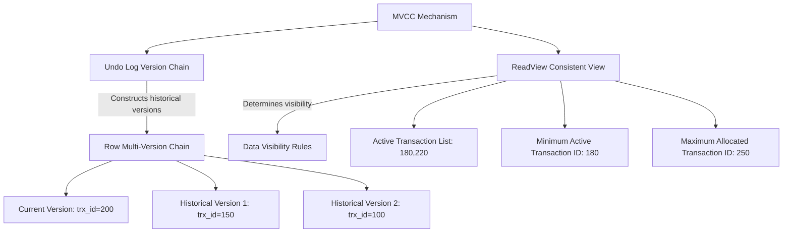

> [!note] Description
> This article reverts to using your original MySQL notes as the main body, primarily retaining the sections on transactions, locks, MVCC, logs, and optimization.

## Content Included

- `MySQL Transactions and Logs`

## MySQL Transactions, Locks, MVCC, and Logs

### Transactions
#### ACID Properties
The ACID properties and how they are guaranteed.
- Atomicity: Guaranteed by undo log.
- Consistency: Guaranteed by the other three properties.
- Isolation: Guaranteed by locking mechanisms / MVCC.
- Durability: Guaranteed by redo log.

#### Transaction Isolation Levels
1.  **Read Uncommitted**: Changes made by a transaction before it commits can be seen by other transactions.
2.  **Read Committed**: Changes made by a transaction can only be seen by other transactions after it commits.
3.  **Repeatable Read**: Data seen during a transaction's execution is consistent with the data seen when the transaction started. This is the default isolation level for MySQL's InnoDB engine.
4.  **Serializable**: Acquires read and write locks on records. When multiple transactions perform read/write operations on a record and a read-write conflict occurs, subsequent transactions must wait for the previous transaction to complete before continuing execution.

> Generally speaking, using Repeatable Read (**the default**) can largely avoid phantom read issues (though they can still occur). The Serializable isolation level impacts performance. Phantom reads are **basically** resolved through the following two methods:
> 1. For ordinary SELECT statements (snapshot reads), MVCC resolves phantom reads.
> 2. For SELECT...FOR UPDATE statements (current reads), next-key locks (record lock + gap lock) resolve phantom reads.

Implementation methods:
- For the **Read Uncommitted** isolation level, because uncommitted changes from other transactions can be read, the latest data is read directly.
- For the **Serializable** isolation level, concurrent access is prevented by adding read/write locks.
- For the **Read Committed** and **Repeatable Read** isolation levels, they are implemented using Read Views. Their difference lies in when the Read View is created. Think of a Read View as a data snapshot, like a camera capturing the scenery at a specific moment. The **Read Committed** isolation level **re-generates a Read View before each statement execution**, whereas the **Repeatable Read** isolation level **generates a Read View when the transaction starts and uses it throughout the entire transaction**.

Commands to start a transaction in MySQL:
1.  `BEGIN` / `START TRANSACTION`: The transaction is not truly considered started until the first SELECT statement is executed.
2.  `START TRANSACTION WITH CONSISTENT SNAPSHOT`: Starts the transaction immediately.

#### Dirty Read / Non-repeatable Read / Phantom Read

- **Dirty Read**: A transaction reads data that has been modified by another **uncommitted transaction**.
- **Non-repeatable Read**: In the same transaction, reading the same data multiple times results in **different values**.
- **Phantom Read**: In the same transaction, querying the number of records that meet a certain condition multiple times results in **different counts**.

> [!example]
> - Dirty Read Example: Transaction A reads a balance of 100, then modifies it to 200. Meanwhile, Transaction B reads the balance. The value it reads (200) is a dirty read (if Transaction A later rolls back, Transaction B would still have read 200).
> - Non-repeatable Read Example: Transaction A reads a balance of 100. Transaction B then modifies the balance to 200. When Transaction A reads the balance again, it sees a different value. This is a non-repeatable read (the same transaction gets different values for the same data upon repeated reads).
> - Phantom Read Example: Transaction B reads the count of records satisfying a condition. Transaction A then inserts a new record that also satisfies that condition. When Transaction B reads the count again, the number is different – a phantom read.

#### MVCC (Important)

**How does Read View work in MVCC?**
**Read View:**


After creating a Read View, the record's `trx_id` falls into one of these three categories:


**This method of controlling concurrent transaction access to the same record through a "version chain" is called MVCC (Multi-Version Concurrency Control).**

Simply put, the MVCC logic chain can be remembered like this:

- Each row record carries `trx_id` and `roll_pointer`.
- `trx_id` indicates the transaction ID that last modified this row.
- `roll_pointer` points from the current version to the previous `undo log` version.
- Thus, a record forms a version chain through `undo logs`.
- During a snapshot read, a transaction uses its own `Read View` to traverse the version chain backwards until it finds a version visible to it.

Add a few points most likely to be asked in follow-up questions from Apple Notes:

- `undo log` is not just for rollback; it's also the true source of MVCC historical versions.
- For `DELETE`, InnoDB does not physically delete immediately. It first marks the record for deletion, which is later cleaned up by the `purge` thread.
- For `UPDATE`:
    - If the primary key column is updated, it's essentially treated as "delete old row + insert new row".
    - If a non-primary key column is updated, the old value is recorded in the `undo log`. During rollback or snapshot reads, the historical version can be accessed along the version chain.
- `undo pages` themselves also go into the `Buffer Pool`. True persistence still relies on `redo log` as the fallback.

> [!TIP]
> The most solid way to answer this isn't to recite terminology upfront, but to explain the chain smoothly:
> `Current Row -> trx_id / roll_pointer -> Old Version in undo log -> Visibility Check via Read View -> Find the Version Visible to the Transaction`.

##### Read View Visibility Determination

- `trx_id < min_trx_id`: The transaction that modified this version had already committed when the snapshot was created. The current version is visible.
- `trx_id >= max_trx_id`: This transaction ID was assigned after the snapshot was created. The current version is not visible; need to look for an older version.
- `min_trx_id <= trx_id < max_trx_id`:
    - If `trx_id` is in the list of active transactions, it means this transaction hadn't committed when the snapshot was taken. The version is not visible.
    - Otherwise, the transaction had already committed, so the version is visible.

##### **How does MVCC implement Read Committed / Repeatable Read?**
For Read Committed:
- A new Read View is regenerated before each SELECT statement execution.

For Repeatable Read:
- A Read View is generated when the transaction starts (upon the first SELECT or BEGIN), and this Read View remains valid throughout the entire transaction lifecycle without being regenerated.

##### **In which scenario can MVCC not completely prevent phantom reads?**

```sql
## Transaction A-----------------
mysql> begin;
Query OK, 0 rows affected (0.00 sec)

mysql> select * from t_stu where id = 5;
Empty set (0.01 sec)

## Transaction B-----------------
mysql> begin;
Query OK, 0 rows affected (0.00 sec)

mysql> insert into t_stu values(5, 'Xiaomei', 18);
Query OK, 1 row affected (0.00 sec)

mysql> commit;
Query OK, 0 rows affected (0.00 sec)

## Transaction A-----------------
mysql> update t_stu set name = 'Xiaolin Coding' where id = 5;
Query OK, 1 row affected (0.01 sec)
Rows matched: 1  Changed: 1  Warnings: 0

mysql> select * from t_stu where id = 5;
+----+----------------+------+
| id | name           | age  |
+----+----------------+------+
|  5 | Xiaolin Coding |   18 |
+----+----------------+------+
1 row in set (0.00 sec)
```

**Attention**: The main reason is that MVCC only supports SELECT. It's ineffective when UPDATE is involved...

**However, phantom reads can be completely resolved using MVCC + next-key lock!**

The InnoDB storage engine resolves phantom reads at the RR level through MVCC and Next-key Lock:

1.  **Executing ordinary SELECT**: Data is read using MVCC snapshot reads.
    In snapshot reads, the RR isolation level generates a Read View only upon the first query in the transaction and uses it until the transaction commits. Therefore, updates and inserts made by other transactions after the Read View is generated are not visible to the current transaction, achieving repeatable reads and preventing "phantom reads" under snapshot reads.

2.  **Executing current reads** like `SELECT...FOR UPDATE / LOCK IN SHARE MODE`, `INSERT`, `UPDATE`, `DELETE`:
    Under current reads, the latest data is always read. If another transaction inserts a new record that falls within the current transaction's query scope, a phantom read would occur! InnoDB uses Next-key Lock to prevent this. When a current read is executed, it locks the records that are read and also locks the gaps between them, preventing other transactions from inserting data within the query scope. Preventing insertion prevents phantom reads.



### Locking Mechanism

- Global Locks
- Table-level Locks
    - Table Locks
    - Metadata Locks (MDL)
    - Intention Locks
    - AUTO-INC Locks
- Row-level Locks
    - Record Lock: Locks a single index record.
    - Gap Lock: Locks a gap between index records (open interval).
    - Next-Key Lock: Combination of Gap Lock and Record Lock (usually seems to be left-open, right-closed).
    - Insert Intention Lock

> The previous explanation from Gemini was quite good.

#### Usage Scenarios
This section directly brings back the lock details from Apple Notes, focusing on: **How Record Lock, Gap Lock, and Next-Key Lock are applied for different index types + equality/range queries.**

First, remember the command to observe locks:

```sql
select * from performance_schema.data_locks\G;
```

- **Unique Index Equality Query**
    - **Record exists**: `next-key lock` degenerates into a `record lock`.
    - **Record does not exist**: Degenerates into a `gap lock`. Because locks are placed on indexes, a non-existent record itself cannot be record-locked.
- **Unique Index Range Query**
    - `id > target`: Scans to the right using next-key intervals like `(target, next]`. The final segment might become `(last, +∞]`.
    - `id >= target`: The starting point might first degrade to a record lock, but subsequent intervals are still locked according to the range.
    - `id < target` / `id <= target`: Key point is whether the right boundary crosses the query's upper bound. Once crossed, the final segment often degrades to a gap lock, as the main goal is to prevent phantom reads caused by inserts within the interval.
- **Non-Unique Index Equality Query**
    - This usually locks not only the matched records but also adds gap/next-key locks.
    - Typical reason: If only the currently matched rows are locked, a new record with the same index value but a different primary key could still be inserted, changing the result set on the next query.
    - The note's example `age = 22 for update` demonstrates a combination: a next-key lock for `(21,22]`, a gap lock for `(22,39)`, and record locks on the primary keys of the matched rows.
- **Non-Unique Index Range Query**
    - `next-key lock` generally does not degrade easily. The core goal is to ensure "re-querying this range yields the same result set".
- **Query Without an Index**
    - Leads to a full table scan. All records encountered along the way are locked. `UPDATE`/`DELETE` without an index behave the same. Therefore, such statements are both slow and tend to significantly widen the lock scope.

#### Deadlock Supplement

The deadlock example mentioned in Apple Notes essentially illustrates the conflict between **gap locks and insert intention locks**.

- `gap lock` and `gap lock` do not conflict with each other.
- However, if two transactions both acquire a gap lock on a certain interval and then each tries to insert data into that interval, they will request an `insert intention lock`.
- The insert intention lock conflicts with the gap lock held by the other transaction. Thus, both wait for each other, creating a deadlock.

So, for this question, don't just say "a deadlock occurred". Explain more clearly:

- Why could they coexist during the query phase?
- Why did they block each other once the insertion phase started?
- Why does InnoDB eventually have to roll back one of the transactions?

### Logs
- redo log
- binlog
- undo log
- Buffer pool
- ...

> For this part, Heima's video content seems decent and can be referenced.

#### undo log
- **Inserting a record**: Records the primary key value. For rollback, simply delete this inserted record.
- **Deleting a record**: First marks it for deletion while retaining the old record information. For rollback, restore the record. Actual physical deletion is handled by the `purge` thread.
- **Updating a record**:
    - Updating a primary key column is essentially treated as "delete old row + insert new row".
    - Updating a non-primary key column logs the old value, allowing a reverse update during rollback.

**undo log is a logical log**.

Functions:
- Guarantees transaction atomicity, enabling transaction rollback.
- Implements MVCC via `Read View + undo log`.
- Chains historical versions using `trx_id + roll_pointer`.

> [!info] **How is undo log made persistent?**
> `undo pages` modified in the `Buffer Pool` also have their persistence guaranteed by `redo log`.

#### Buffer Pool
> The cache pool.

One of the core structures that handles read/write performance in the InnoDB engine.

- When reading data, if the data page is already in the buffer pool, it's read directly from memory.
- When modifying data, the in-memory page is updated first, and the page is marked as "dirty".
- Dirty pages are not flushed to disk immediately. A background thread writes them back to disk at an appropriate time.

Common scenarios triggering dirty page flush:

- The `redo log` is almost full.
- `Buffer Pool` space is low, requiring dirty page eviction.
- A background thread performs periodic flushing.
- Before MySQL shuts down normally, it tries to flush dirty pages as much as possible.

Apple Notes also added a few often-overlooked structures:

- **free list**: Quickly obtain an available clean cache page without scanning the entire memory area.
- **flush list**: Strings dirty pages together separately, allowing the background thread to traverse directly when flushing.
- **LRU list**: Manages hot and cold pages.

Moreover, InnoDB doesn't use a simple LRU; it divides the LRU list into `young` and `old` regions:

- Solves read-ahead failure: Pages brought in by read-ahead are first placed in the `old` region, preventing them from immediately occupying hot spots.
- Solves Buffer Pool pollution: Pages from large scans must spend enough time in the `old` region before qualifying for promotion to `young`.

The `Buffer Pool` contains not just data pages, but also:

- Data pages
- Index pages
- Insert buffer pages
- undo pages
- Adaptive hash index
- Lock information

When querying a single record, InnoDB doesn't just load that one row; it loads the **entire page** into the cache, then locates the record via the page directory.

#### redo log
To prevent **data loss** during a power failure, InnoDB uses WAL (Write-Ahead Logging):

- First, update the in-memory page.
- Concurrently, write the page modification as a `redo log` entry.
- Later, at an appropriate time, flush the dirty page back to disk.

**redo log is a physical log**: It records "which tablespace, which page, which offset, was changed to what value".

Its two core values are:

- Crash recovery: Can redo the modifications of committed transactions that hadn't been flushed to disk yet.
- Provides durability guarantees for in-memory modifications like `undo pages` and data pages.

Points often discussed alongside `redo log`:

- `redo log buffer`: Buffers log entries in memory to reduce frequent disk flushes.
- `page cache`: The operating system's filesystem page cache.
- `innodb_flush_log_at_trx_commit`: Controls the flush strategy at transaction commit time.

#### binlog
`binlog` belongs to the **MySQL Server layer**, not the InnoDB layer.

It is a logical log, commonly used for:

- Master-slave replication.
- Point-in-time recovery.
- Auditing changes.

In an interview, explaining these points is usually sufficient:

- `redo log` handles crash recovery and ensures InnoDB durability.
- `binlog` records "what this change did" for the MySQL Server layer's use.

#### Why the Two-Phase Commit for redo log and binlog?
If only one log were written before committing, problems would occur:

- `redo log` exists, `binlog` missing: The master can recover, but master-slave replication would lose the transaction.
- `binlog` exists, `redo log` missing: A slave might have applied this change, but if the master crashes and recovers, it might miss this data.

Therefore, InnoDB uses a two-phase commit:

1.  Write the `redo log` to the `PREPARE` state.
2.  Write the `binlog`.
3.  Mark the `redo log` as `COMMIT`.

This way, even if a crash occurs midway, the state of `redo log + binlog` can be used to determine whether the transaction should be recovered or not.

### Optimization!
JavaGuide:

- Read-Write Separation
- Database/Table Sharding
    - Solving Master-Slave Delay
    - Conditions warranting sharding
- Data Tiering (Hot/Cold Separation)
- SQL Performance Optimization?
    - Disk I/O optimization related to logs (see notes)
- Caching Mechanisms?

> [!CITE]
> - **Master-slave replication delay and sharding concepts need to be mastered.**
>   - Regarding master-slave delay and the timing points in replication:
>       - The moment the master executes a transaction and writes it to the binlog is recorded as T1.
>       - The moment the slave's I/O thread receives the binlog and writes it to the relay log is recorded as T2.
>       - The moment the slave's SQL thread reads the relay log and applies the changes locally is recorded as T3.
>   - **How can master-slave delay be resolved?**
>       - **Slave machine performance is inferior to the master**: The slave might be slower in receiving binlog/writing relay log and executing SQL statements (i.e., T2-T1 and T3-T2 could be larger). Solutions include using slaves with specifications equal to or higher than the master, or optimizing slave performance (tuning parameters, increasing cache, using SSDs).
>       - **Slave handles too many read requests**: The slave must apply all writes from the master while also serving read requests. Too many reads consume CPU, memory, and network resources, impacting replication efficiency. Solutions: Introduce caching (recommended), use a multi-slave architecture to distribute reads, or offload queries to other systems like Hadoop or Elasticsearch by consuming binlogs.
>       - **Large transactions**: Transactions that run for a long time without committing. Large transactions take more time and resources on the slave, easily causing delay. Solution: Avoid modifying large amounts of data in one go; process in batches. Similarly, slow SQL queries need optimization.
>       - **Too many slaves**: The master must send binlogs to all slaves. Too many slaves increase synchronization overhead and time (T2-T1 increases due to master pressure). Solutions: Reduce the number of slaves, or implement a hierarchical replication structure where upper-tier slaves replicate to lower-tier ones, reducing the master's load.
>       - **Network latency**: Slow network transfer between master and slave, or packet loss/jitter, affects binlog transmission efficiency. Solution: Optimize the network environment (bandwidth, latency, stability).
>       - **Single-threaded replication**: MySQL 5.5 and earlier only supported single-threaded replication. Multi-threaded replication was introduced in 5.6 and further improved in 5.7.
>       - **Replication mode**: MySQL's default asynchronous replication inherently has some delay. Full synchronous replication has no delay but poor performance. Semi-synchronous replication is a compromise, improving data safety and reducing (but not eliminating) delay. Supported via plugins since MySQL 5.5, with enhanced semi-sync in 5.7.
>   - **When to consider database/table sharding? (How much data warrants sharding?)**
>       - **Very large rows (close to half a page size, ~8KB)**: A 3-level B+ tree might only store a little over 1 million rows.
>       - **Very small rows (e.g., only a few INT fields)**: A 3-level B+ tree could theoretically store nearly 500 million rows.
>       - A "typical" business table: A 3-level B+ tree might hold around 10 million rows.
>       - **Performance Bottleneck Appears**: This is the most practical trigger. When queries (especially range scans or full table scans) become noticeably slow due to data volume, causing high CPU/IO, and analysis confirms it's due to increased B+ tree levels or excessive page scans, sharding should be strongly considered.
>       - How various sharding algorithms work?
> - **Data Tiering (Hot/Cold Separation)**
> - **How to optimize SQL performance?**
>
>
> >[!NOTE]- **How to optimize MySQL performance?**
> > MySQL performance optimization is a systematic project involving multiple aspects. It's impossible to cover everything in an interview. Therefore, it's recommended to structure your answer logically, starting from core issues and expanding outwards, demonstrating your depth of thought and problem-solving skills.
> >
> > 1.  **Identify the Core: Slow SQL Location and Analysis**
> >     The first step in performance optimization is always identifying the bottleneck. Start with slow SQL location and analysis to showcase your problem-solving approach and familiarity with performance monitoring:
> >     - **Monitoring Tools**: Mention tools like MySQL's slow query log, Performance Schema, showing familiarity and how they help locate problems.
> >     - **EXPLAIN Command**: Explain its usage, analyzing query plans and index usage. Use practical examples to demonstrate interpreting results like execution order, index usage, full table scans, etc.
> > 2.  **Targeted Optimization: Index, Schema, and SQL Tuning**
> >     After locating slow SQL, optimize specific issues. Focus on index, schema, and SQL writing:
> >     - **Index Optimization**: A key area. Discuss index creation principles, covering indexes, leftmost prefix matching. Mentioning real project examples for index selection is a plus.
> >     - **Schema Optimization**: Optimize table design: choose appropriate field types, avoid redundant columns, use normalization/denormalization wisely.
> >     - **SQL Optimization**: Avoid `SELECT *`, use specific columns, prefer joins over subqueries, optimize pagination, use batch operations.
> > 3.  **Advanced Solutions: Architectural Optimization**
> >     If the interviewer is satisfied with basic knowledge, they might delve into architectural optimizations:
> >     - **Read-Write Separation**: Separate reads and writes across instances to increase concurrency capacity.
> >     - **Database/Table Sharding**: Distribute data across multiple instances/tables to reduce single-table size and improve query efficiency. But weigh the complexity and maintenance costs carefully.
> >     - **Data Tiering (Hot/Cold Separation)**: Separate data based on access frequency. Hot data in high-performance storage, cold data in low-cost, low-performance storage.
> >     - **Caching Mechanisms**: Use middleware like Redis to cache hot data in memory, significantly reducing database load. Very common, highly effective, excellent cost-performance!
> > 4.  **Other Optimization Techniques**
> >     Mention other techniques to show comprehensive understanding:
> >     - **Connection Pool Configuration**: Properly sized pools, timeouts, etc., improve connection efficiency and avoid frequent connection overhead.
> >     - **Hardware Configuration**: Hardware upgrades (faster servers, more memory, SSDs) can effectively boost overall database performance.