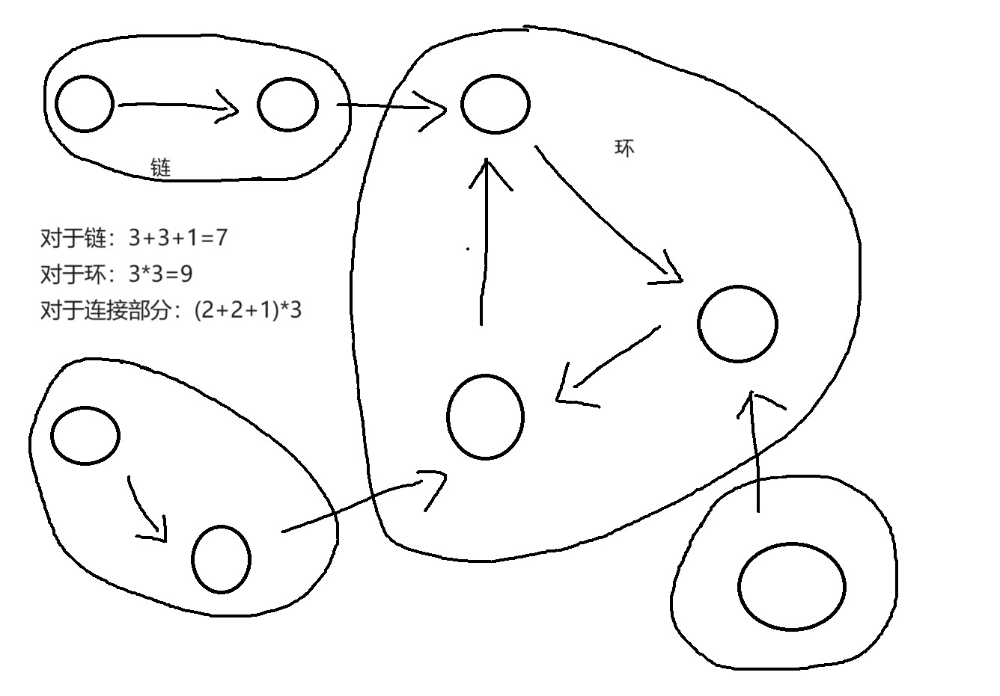

> [!note] Note
> This article continues to directly backfill the original problem solution notes, trying to keep the original descriptions unchanged as much as possible, only handling image, link, and section compatibility issues within the site.

## Scope of Coverage

- `ABC 348 E`
- `ABC 348 F`
- `ABC 350 D`
- `ABC 350 E`
- `ABC 351 D`
- `ABC 351 E`
- `ABC 351 F`
- `ABC 357 D`
- `ABC 357 E`
- `ABC 357 F`
- `ABC 358 C`
- `ABC 358 E`
- `ABC 358 G`
- `ABC 360 E`

## ABC 348 E - Minimize Sum of Distances
You are given a tree with $N$ vertices. The vertices are numbered $1$ to $N$, and the $i$-th edge connects vertices $A_{i}$ and $B_{i}$.

We are also given a sequence $C$ of $N$ positive integers. Let $d(a, b)$ be the number of edges between vertices $a$ and $b$, and for $x = 1, 2, \ldots, N$, define $\displaystyle f(x) = \sum_{i=1}^{N} (C_{i} \times d(x, i))$. Find $\displaystyle \min_{1 \leq v \leq N} f(v)$.

### Solution
Rerooting DP / Tree DP / <span style="color:#92d050">Rerooting / Tree Centroid</span>

Original: [Problem - F - Codeforces](https://codeforces.com/contest/1092/problem/F) However, that problem asks for the maximum value. The initial processing is the same, but the second DFS differs:

$\Huge{CF_{DFS_{2}}}$
```cpp
void go(int v, int p = -1) {
	ans = max(ans, res);
	for (auto to : g[v]) {
		if (to == p) {
			continue;
		}
		
		res -= sum[to];
		sum[v] -= sum[to];
		res += sum[v];
		sum[to] += sum[v];
		
		go(to, v);
		
		sum[to] -= sum[v];
		res -= sum[v];
		sum[v] += sum[to];
		res += sum[to];
	}
}
```

A similar approach for this problem:
```cpp
ll ans = INF;
void dfs(int u, int fa) {
    ans = min(ans, res);
    for (auto v : G[u]) {
        if (v == fa) {
            continue;
        }
        res -= sum[v];
        res += sum[1] - sum[v];
        dfs(v, u);
        res += sum[v];
        res -= sum[1] - sum[v];
    }
}
```

First, scan the tree with $1$ as the root node. $sum[i]$ represents the sum of weights of node $i$ and its subtree. The weight of the root node must be the sum of all weights.

> Then find the node $x$ whose weight accounts for more than half of the total weight. If such a node exists, taking $x$ as the new root, since its own weight is not counted in the distances from it, this saves the maximum amount of weight, thus minimizing the answer.
>
> If it equals half the total weight, whether to change the root or not doesn't matter.
>
> If the root node remains unchanged, then it is already the minimum.

Generally speaking, what is described above can be called the centroid of a tree. It can be proven that every tree has a centroid, and there are at most two centroids.

When the centroid of a tree is taken as the root, the size of all subtrees does not exceed half the size of the entire tree. Here, 'size' carries weight, meaning weighted size.

> [Tree Centroid - OI Wiki](https://oi-wiki.org/graph/tree-centroid/) About the centroid (center of mass) of a tree, dedicated to solving graph theory and its optimization problems.

```cpp Jiangly
void solve() {
    int n;cin >> n;
    vector<vector<int>> g(n + 1);
    for (int i = 1;i < n;i++) {
        int u, v;cin >> u >> v;
        g[u].push_back(v);g[v].push_back(u);
    }
    vector<int>c(n + 1);
    for (int i = 1;i <= n;i++)cin >> c[i];
    vector<ll> sum(n + 1);
    auto dfs1 = [&](auto self, int x, int p) -> void {
        sum[x] = c[x];
        for (auto y : g[x]) {
            if (y == p)continue;
            self(self, y, x);
            sum[x] += sum[y];
        }
        };
    dfs1(dfs1, 1, 0);

    auto dfs2 = [&](auto self, int x, int p) -> int {
        for (auto y : g[x]) {
            if (y == p || 2 * sum[y] <= sum[1])continue;
            return self(self, y, x);
        }
        return x;
        };
    int x = dfs2(dfs2, 1, 0);
    dfs1(dfs1, x, 0);
    ll ans = 0;
    for (int i = 1;i <= n;i++) {
        if (i != x)ans += sum[i];
    }
    cout << ans << '\n';
}
```

Alternatively: This problem is a template for rerooting DP, but the approach above is not provided. Here is the code:

```cpp
#include <bits/stdc++.h>
using namespace std;
using i64 = long long;

int main() {
    cin.tie(nullptr)->sync_with_stdio(false);
    int n; cin >> n;
    vector<vector<int>> g(n + 1);
    for (int i = 1; i < n; ++i) {
        int u, v;
        cin >> u >> v;
        g[u].push_back(v);
        g[v].push_back(u);
    }
    vector<i64> c(n + 1);
    for (int i = 1; i <= n; ++i)
        cin >> c[i];
    vector<i64> dp(n + 1), res(n + 1);
    auto pre_dfs = [&](auto &f, int fa, int u)->void {
        dp[u] = c[u];
        for (auto &v : g[u]) {
            if (v == fa) continue;
            f(f, u, v);
            dp[u] += dp[v];
            res[u] += res[v] + dp[v];
        }
    };
    pre_dfs(pre_dfs, 1, 1);
    auto dfs = [&](auto &f, int fa, int u)->void {
        if (fa != u)
            res[u] = res[fa] - (res[u] + dp[u]) + (dp[1] - dp[u]) + res[u];
            // res[u] = res[fa] + dp[1] - 2 * dp[u]
        for (auto &v : g[u]) {
            if (v == fa) continue;
            f(f, u, v);
        }
    };
    dfs(dfs, 1, 1);
    cout << *min_element(begin(res) + 1, end(res)) << '\n';
}
```

## ABC 348 F - Oddly Similar
There are $N$ sequences of length $M$, denoted as $A_1, A_2, \ldots, A_N$. The $i$-th sequence consists of $M$ integers $A_{i,1}, A_{i,2}, \ldots, A_{i,M}$.

Two sequences $X$ and $Y$ of length $M$ are said to be similar if and only if the number of indices $i$ ($1 \leq i \leq M$) where $X_i = Y_i$ is odd.

Find the number of pairs of integers $(i,j)$ satisfying $1 \leq i < j \leq N$ such that $A_i$ and $A_j$ are similar.

### Solution
bitset / Technique

```cpp
#pragma GCC optimize("Ofast,unroll-loops")
```
Turning on `O3` allows a direct brute-force pass.
```cpp
int ans = 0;
for (int i = 0;i < n;i++) {
	for (int j = i + 1;j < n;j++) {
		int cnt = 0;
		for (int k = 0;k < m;k++) {
			if (a[i][k] == a[j][k])cnt++;
		}
		if (cnt & 1)ans++;
	}
}
cout << ans << '\n';
```

Bitset approach for a forced time complexity: $O\left( \frac{N^2M}{64} \right)$
```cpp
bitset<2010> f[2010][1000];
void solve() {
    int n, m;cin >> n >> m;
    vector<vector<int>>a(n, vector<int>(m));
    for (int i = 0;i < n;i++) {
        for (int j = 0;j < m;j++) {
            cin >> a[i][j];
            f[j][a[i][j]][i] = 1;
        }
    }
    int ans = 0;
    for (int i = 0;i < n;i++) {
        bitset<2010> g;
        for (int j = 0;j < m;j++) {
            g ^= f[j][a[i][j]];
        }
        g[i] = 0;
        ans += g.count();
    }
    cout << ans / 2 << '\n';
}
```

## ABC 350 D - New Friends
There is an SNS used by $N$ users, labeled from $1$ to $N$.

In this SNS, two users can become **friends** with each other.
Friendship is bidirectional; if user X is a friend of user Y, then user Y is always a friend of user X.

Currently, there are $M$ pairs of friends on the SNS, where the $i$-th pair consists of users $A_i$ and $B_i$.

Determine the maximum number of times the following operation can be performed:

- Operation: Choose three users X, Y, and Z such that X and Y are friends, Y and Z are friends, but X and Z are not friends. Make X and Z friends.

This problem can be seen at a glance: For each connected component: size*(size-1)/2 - number of edges in the component.
Let Connected-Component $\to \text{C}$, size: $\text{size()}$, number of edges: $\text{edge\_num}$

i.e.: $\frac{1}{2}\sum \text{C.size()*(C.size()-1)-edge\_num}$

```cpp
#define int long long
void solve() {
    int n, m;cin >> n >> m;vector<vector<int>>g(n + 1);
    vector<int> vis(n + 1);
    for (int i = 1;i <= m;i++) {
        int a, b;cin >> a >> b;g[a].push_back(b);g[b].push_back(a);
    }
    int ans = 0, res = 0, cnt = 0;

    auto dfs = [&](auto self, int v) ->void {
        vis[v] = 1;res++;
        cnt += g[v].size();
        for (auto i : g[v]) {
            if (vis[i])continue;
            self(self, i);
        }
        };

    for (int i = 1;i <= n;i++) {
        if (!vis[i]) {
            res = 0, cnt = 0;
            dfs(dfs, i);
            ans += res * (res - 1) / 2 - cnt / 2;
        }
    }
    cout << ans << '\n';
}
```

## ABC 350 E - Toward 0
You are given an integer $N$. You can perform the following two types of operations:

- Pay $X$ yen and replace $N$ with $\displaystyle\left\lfloor\frac{N}{A}\right\rfloor$.
- Pay $Y$ yen and roll a die that shows an integer between $1$ and $6$ with equal probability. Let $b$ be the result of the die roll, and replace $N$ with $\displaystyle\left\lfloor\frac{N}{b}\right\rfloor$.

Here, $\lfloor s \rfloor$ denotes the greatest integer less than or equal to $s$. For example, $\lfloor 3 \rfloor=3$ and $\lfloor 2.5 \rfloor=2$.

Find the minimum expected cost required for $N$ to become $0$ when operations are chosen optimally.
The result of each die roll is independent of other die rolls, and operations can be chosen after observing the results of previous operations.

### Solution
Expectation / Memoized Search

* * *

This problem can be solved using memoized recursion.

<span style="color:#92d050">Problem 1</span>

First, consider the following problem.

> The setup is the same as the original problem. However, there is only one type of operation.
>
> - Pay Y yen. Roll a die that shows an integer from 2 to 6 with equal probability. Replace N with $\left\lfloor\frac{N}{b}\right\rfloor$.

Let the expected value be denoted as $f(N)$. Then,

$f (N)=Y +\frac{1}{5}f\left (\left\lfloor\frac{N}{2}\right\rfloor\right) +\frac{1}{5}f\left (\left\lfloor\frac{N}{3}\right\rfloor\right) +\frac{1}{5}f\left (\left\lfloor\frac{N}{4}\right\rfloor\right) +\frac{1}{5}f\left (\left\lfloor\frac{N}{5}\right\rfloor\right) +\frac{1}{5}f\left (\left\lfloor\frac{N}{6}\right\rfloor\right)$

Therefore, we can compute this via memoized recursion. (Regarding computational complexity, we will mention it later.)

<span style="color:#92d050">Problem 2</span>

Next, consider the following problem.

> The setup is the same as the original problem. However, there is only one type of operation.
>
> - Pay Y yen. Roll a die that shows an integer from 1 to 6 with equal probability. Replace N with $\left\lfloor\frac{N}{b}\right\rfloor$.

Let the expected value be denoted as $f(N)$. Then,

$f (N)=Y +\frac{1}{6}f\left (\left\lfloor\frac{N}{1}\right\rfloor\right) +\frac{1}{6}f\left (\left\lfloor\frac{N}{2}\right\rfloor\right) +\frac{1}{6}f\left (\left\lfloor\frac{N}{3}\right\rfloor\right) +\frac{1}{6}f\left (\left\lfloor\frac{N}{4}\right\rfloor\right) +\frac{1}{6}f\left (\left\lfloor\frac{N}{5}\right\rfloor\right) +\frac{1}{6}f\left (\left\lfloor\frac{N}{6}\right\rfloor\right)$

The right-hand side also contains $f(N)$, so it seems impossible to compute recursively, but we can move the term to the left and multiply both sides by $\frac{6}{5}$ to obtain

$\color{green}{f (N)= \frac{6}{5}Y +\frac{1}{5}f\left (\left\lfloor\frac{N}{2}\right\rfloor\right) +\frac{1}{5}f\left (\left\lfloor\frac{N}{3}\right\rfloor\right) +\frac{1}{5}f\left (\left\lfloor\frac{N}{4}\right\rfloor\right) +\frac{1}{5}f\left (\left\lfloor\frac{N}{5}\right\rfloor\right) +\frac{1}{5}f\left (\left\lfloor\frac{N}{6}\right\rfloor\right)}$

Thus, we can compute this via memoized recursion. (Regarding computational complexity, we will mention it later.)

<span style="color:#92d050">Original Problem</span>

Consider the original problem. Let the expected value be denoted as $f(N)$. Since there are two types of operations, it is optimal to choose the one with the smaller expected value.

$f(N)=\min\left(X+f\left(\left\lfloor\frac{N}{A}\right\rfloor\right), \frac{6}{5}Y +\frac{1}{5}f\left(\left\lfloor\frac{N}{2}\right\rfloor\right) +\frac{1}{5}f\left(\left\lfloor\frac{N}{3}\right\rfloor\right) +\frac{1}{5}f\left(\left\lfloor\frac{N}{4}\right\rfloor\right) +\frac{1}{5}f\left(\left\lfloor\frac{N}{5}\right\rfloor\right) +\frac{1}{5}f\left(\left\lfloor\frac{N}{6}\right\rfloor\right) \right)$

Therefore, we can compute this via memoized recursion.

To compute $f(N)$, we note that $\displaystyle \left\lfloor\frac{\left\lfloor\frac{N}{a}\right\rfloor}{b}\right\rfloor=\left\lfloor\frac{N}{ab}\right\rfloor$, so $f(N)$ only appears for integers $m$ that can be written in the form $m=2^p3^q5^r$.

Such $m$ are at most $O((\log N)^3)$, so the overall computational complexity is $O((\log N)^3)$.

* * *

<span style="color:#92d050">Summary</span>

Following the [official explanation](https://atcoder.jp/contests/abc350/editorial/9812), let the expected value we seek be $f(N)$. Also, call the two operations in the problem Operation A and Operation B.

If we model the original problem directly, we get the following equation:

$$
 f(N) = \min \left( X + f \left( \left\lfloor \frac{N}{A} \right\rfloor \right), Y + \frac{1}{6} \sum_{i = 1}^6 f \left( \left\lfloor \frac{N}{i} \right\rfloor \right) \right).
$$

The [official explanation](https://atcoder.jp/contests/abc350/editorial/9812) might be a bit vague, but because of the $\min$, we cannot simply use algebraic manipulation to remove $f(N)$ from the right-hand side.

Therefore, we can replace the two operations in the problem with the following two operations to make discussion easier. Through this replacement, we can obtain the same equation as in the [official explanation](https://atcoder.jp/contests/abc350/editorial/9812).

- Pay $X$ yen. Replace $N$ with $\left\lfloor N / A \right\rfloor$. (Unchanged)
- "Pay $Y$ yen, and roll a uniformly distributed die until a number between 2 and 6 appears." Use the resulting integer $b$ to replace $N$ with $\left\lfloor N / b \right\rfloor$.

If Operation B is the best operation for minimizing the expected value, then performing Operation A would not yield any additional benefit. Therefore, even with the above replacement, the expected value does not change.

<span style="color:#92d050">Expected value of the latter operation</span>

Regarding the expected value of the latter operation, we can model it as follows.

<span style="color:#00b0f0">Expected amount paid until a number 2 or greater appears</span>

The probability of rolling the die $i \geq 1$ times and still paying $Y$ yen until a number 2 or greater appears is $(1/6)^{i-1}$. Therefore, the expected amount paid is:

$$
 \sum_{i = 1}^{\infty} Y \cdot \left( \frac{1}{6} \right)^{i-1} = \frac{6}{5} Y.
$$

Reference: [Convergence and divergence conditions for infinite geometric series and proofs, etc. | Manabitimes](https://manabitimes.jp/math/1055)

$$
a+ar+ar^2+\dots=\frac{a}{1-r}(-1<r(\text{Common ratio})<1)
$$

<span style="color:#00b0f0">Expected value after a number 2 or greater appears</span>

With probability $1/5$, $N$ can be replaced by one of $\lfloor N / 2 \rfloor, \lfloor N / 3 \rfloor, \lfloor N / 4 \rfloor, \lfloor N / 5 \rfloor, \lfloor N / 6 \rfloor$. Therefore, the expected value is:

$$
 \frac{1}{5} \cdot f \left(\left\lfloor \frac{N}{2} \right\rfloor \right) + \frac{1}{5} \cdot f \left(\left\lfloor \frac{N}{3} \right\rfloor \right) + \frac{1}{5} \cdot f \left(\left\lfloor \frac{N}{4} \right\rfloor \right) + \frac{1}{5} \cdot f \left(\left\lfloor \frac{N}{5} \right\rfloor \right) + \frac{1}{5} \cdot f \left(\left\lfloor \frac{N}{6} \right\rfloor \right).
$$

Adding the two expected values above yields the second term inside the $\min$ in the [official explanation](https://atcoder.jp/contests/abc350/editorial/9812).

---

### Code
Transition equation:

$f(N)=\min\left(X+f\left(\left\lfloor\frac{N}{A}\right\rfloor\right), \frac{6}{5}Y +\frac{1}{5}f\left(\left\lfloor\frac{N}{2}\right\rfloor\right) +\frac{1}{5}f\left(\left\lfloor\frac{N}{3}\right\rfloor\right) +\frac{1}{5}f\left(\left\lfloor\frac{N}{4}\right\rfloor\right) +\frac{1}{5}f\left(\left\lfloor\frac{N}{5}\right\rfloor\right) +\frac{1}{5}f\left(\left\lfloor\frac{N}{6}\right\rfloor\right) \right)$

```cpp
#define int long long
map<int, double>mp;
int a, x, y;
double f(int n) {
    if (!n)return 0;
    if (mp.count(n))return mp[n];
    return mp[n] = min(x + f(n / a), 1.2 * y + 0.2 * (f(n / 2) + f(n / 3) + f(n / 4) + f(n / 5) + f(n / 6)));
}
void solve() {
    int n;cin >> n >> a >> x >> y;
    printf("%.10f", f(n));
}
```

## ABC 351 D - Grid and Magnet
There is a grid with $H$ rows and $W$ columns. Some cells (possibly zero) contain magnets.
The state of the grid is represented by $H$ strings $S_1, S_2, \ldots, S_W$ of length $W$. If the $j$-th character of $S_i$ is "#", it means there is a magnet in the cell at the $i$-th row from the top and $j$-th column from the left; if it is ".", it means the cell is empty.

Takahashi, wearing iron armor, can move on the grid as follows:

- If any of the cells vertically or horizontally adjacent to the current cell contains a magnet, he cannot move.
- Otherwise, he can move to any vertically or horizontally adjacent cell.
    However, he cannot leave the grid.

For each cell without a magnet, define its degree of freedom as the number of cells he can reach by repeatedly moving from that cell. Find the maximum degree of freedom among all cells without a magnet in the grid.

Here, in the definition of degree of freedom, "cells he can reach by repeatedly moving from that cell" refers to cells that can be reached from the starting cell via some sequence of moves (possibly zero moves). It is not necessary that there exists a single move sequence that visits all these reachable cells starting from the starting cell. Specifically, each cell itself (without a magnet) is always included in the cells reachable from that cell.

>During the contest, the `cnt` array was too small for this problem... it didn't result in RE, but WA.

The overall idea is relatively simple: mark the cells around '#' as 1, mark visited paths as 2, so that each time you enter a connected component, you only visit cells marked 1/2 once. This allows calculating the number of traversable cells within each connected component.
```cpp
char s[1010][1010];
int vis[1010][1010], dx[] = {0,0,1,-1}, dy[] = {1,-1,0,0};
void solve() {
    int n, m;cin >> n >> m;
    for (int i = 1;i <= n;i++) {
        for (int j = 1;j <= m;j++) {
            cin >> s[i][j];
            if (s[i][j] == '#') {
                if (i - 1 >= 1)vis[i - 1][j] = 1;
                if (i + 1 <= n) vis[i + 1][j] = 1;
                if (j + 1 <= m) vis[i][j + 1] = 1;
                if (j - 1 >= 1) vis[i][j - 1] = 1;
            }
        }
    }
    int k = 0, ans = 1;
    auto bfs = [&](int sx, int sy) {
        map<pair<int, int>, int>once;
        queue<pair<int, int>>q;q.push({sx,sy});vis[sx][sy] = 2;k++;
        while (q.size()) {
            auto [x, y] = q.front();q.pop();
            for (int i = 0;i < 4;i++) {
                int a = x + dx[i], b = y + dy[i];
                if (a < 1 || b<1 || a>n || b>m || vis[a][b] == 2 || s[a][b] == '#')continue;
                if (vis[a][b] == 1) {
                    if (!once.count({a,b})) {
                        once[{a, b}] = 1; k++;
                    }
                    continue;
                }
                q.push({a,b});vis[a][b] = 2;k++;
            }
        }
        };
    for (int i = 1;i <= n;i++) {
        for (int j = 1;j <= m;j++) {
            if (s[i][j] == '.' && !vis[i][j]) {
                k = 0;
                bfs(i, j);
                ans = max(ans, k);
            }
        }
    }
    cout << ans << '\n';
}
```

## ABC 351 E - Jump Distance Sum
On the coordinate plane, there are $N$ points $P_1, P_2, \ldots, P_N$, where point $P_i$ has coordinates $(X_i, Y_i)$.
The distance $\text{dist}(A, B)$ between two points $A$ and $B$ is defined as follows:

> A rabbit initially located at point $A$.
> A rabbit at position $(x, y)$ can jump to $(x+1, y+1)$, $(x+1, y-1)$, $(x-1, y+1)$, or $(x-1, y-1)$ in one move.
> $\text{dist}(A, B)$ is defined as the minimum number of jumps required to reach point $B$ from point $A$.
> If point $B$ cannot be reached from point $A$ after any number of jumps, set $\text{dist}(A, B) = 0$.

Calculate $$\displaystyle\sum_{i=1}^{N-1}\displaystyle\sum_{j=i+1}^N \text{dist}(P_i, P_j)$$

### Solution

Similar problem:
[P3964 Squirrel Party](https://www.luogu.com.cn/problem/P3964)

---
**Converting Chebyshev distance to Manhattan distance**: $\max(\mid x_{1}-x_{2}\mid,\mid y_{1}-y_{2}\mid)\implies\mid x_{1}-x_{2}\mid+\mid y_{1}-y_{2}\mid$

>[!tip]- Chebyshev -> Manhattan
>
> First, through a transformation that rotates by $45$ degrees around the origin and scales by a factor of $\sqrt{2}$, a point at $(X,Y)$ moves to $(X+Y, X-Y)$. Let the coordinates of the transformed points be $(x_i, y_i)$, then we have $x_i = X_i + Y_i$ and $y_i = X_i - Y_i$.
>
> Next, we consider how the definition of $\text{dist}(A,B)$ changes. In the original definition, the rabbit can jump from $(X,Y)$ to $(X+1, Y+1)$, $(X+1, Y-1)$, $(X-1, Y+1)$, and $(X-1, Y-1)$; therefore, after transformation, it can jump from $(X+Y, X-Y)$ to $(X+Y+2, X-Y)$, $(X+Y, X-Y+2)$, $(X+Y, X-Y-2)$, and $(X+Y-2, X-Y)$. Substituting $x = X+Y$ and $y = X-Y$, we get that it can jump from $(x,y)$ to $(x+2, y)$, $(x, y+2)$, $(x, y-2)$, and $(x-2, y)$. Thus, the minimum number of jumps from $A$ to $B$ is exactly the definition of $\text{dist}(A,B)$ (or $0$ if unreachable).
>
> Next, we consider the problem after transformation. That is, let $P_i = (x_i, y_i)$, define $\text{dist}(A,B)$ as above, and consider $\displaystyle\sum_{i=1}^{N-1}\displaystyle\sum_{j=i+1}^N \text{dist}(P_i,P_j)$. Obviously, this gives the same answer as the original problem.
>
> We further consider the case for $A=(x_1, y_1)$, $B=(x_2, y_2)$. If $x_1 \not\equiv x_2 \pmod{2}$ or $y_1 \not\equiv y_2 \pmod{2}$, the rabbit cannot go from $A$ to $B$, so $\text{dist}(A,B)=0$. Otherwise, it will be exactly half of the Manhattan distance, i.e., $\frac{1}{2}(\lvert x_1-x_2\rvert + \lvert y_1-y_2\rvert)$.

After rotating $45^\circ$ and scaling by $\sqrt{2}$, it converts to Manhattan distance:
From $x_i = X_i + Y_i$ and $y_i = X_i - Y_i$, it follows that $x_i$ and $y_i$ have the same parity.

The $N$ points can be divided into two groups: those where $x_i$ and $y_i$ are both even, or both odd. For two points $A$ and $B$ belonging to different groups, $\text{dist}(A,B)=0$; for two different points belonging to the same group, $\text{dist}(A,B)=\frac{1}{2}(\lvert x_1-x_2\rvert + \lvert y_1-y_2\rvert)$.

Let $S$ be the set where $x_i, y_i$ are both even or both odd. Since the problem calculates pairwise sums, the order of calculation does not affect the result, so we can **sort in descending order** to simplify the calculation:

For $x_i$: (similarly for $y_i$)
$$\displaystyle \frac{1}{2}\sum_{i=1}^{|S|}\sum_{j=i+1}^{|S|}\mid x_{j}-x_{i}\mid = \displaystyle \frac{1}{2}\sum_{i=1}^{|S|}\sum_{j=i+1}^{|S|} (x_{i}-x_{j})=\frac{1}{2}\sum_{i=1}^{|S|}((|S|-1-2i)x_i)$$

```cpp
#define int long long
void solve() {
    int n;cin >> n;vector<int>  a[4];
    for (int i = 1;i <= n;i++) {
        int x, y;cin >> x >> y;
        if ((x + y) % 2 == 0) {
            a[0].push_back(x + y);a[1].push_back(x - y);
        } else {
            a[2].push_back(x + y);a[3].push_back(x - y);
        }
    }
    int ans = 0;
    for (int i = 0;i < 4;i++) {
        sort(a[i].rbegin(), a[i].rend());
        for (int j = 0;j < a[i].size();j++) {
            ans += a[i][j] * (a[i].size() - 1 - 2 * j);
        }
    }
    cout << ans / 2 << '\n';
}
```

## ABC 351 F - Double Sum
You are given an integer sequence $A = (A_1, A_2, \dots, A_N)$.
Compute the following expression:

$$\displaystyle \sum_{i=1}^N \sum_{j=i+1}^N \max(A_j - A_i, 0)$$

> The constraints guarantee that the answer is less than $2^{63}$.

### Solution
<span style="color:#92d050">Fenwick Tree / Segment Tree / Sweep Line</span>

> Using Fenwick Tree to find the $k_{th}$ smallest element: [Nowcoder](https://ac.nowcoder.com/acm/contest/view-submission?submissionId=66730392)

> [!NOTE]- Official Solution
> Here, for a fixed $i$, the contribution to the double sum can be expressed as
>
> $$
> \sum_{i < j} \max(A_j - A_i, 0)
> = \sum_{i < j,\, A_i \le A_j} (A_j - A_i).
> $$
>
> That is: for a fixed $i$, we only need to know the sum of those $A_j$ on the right satisfying $A_i \le A_j$, and their count.
>
> Using this fact, the problem can be solved by a sweep line algorithm as follows.
>
> - Prepare a data structure that manages the following two values:
>   - A multiset $S_0$ supporting queries to retrieve the number of elements not less than $x$.
>   - A multiset $S_1$ supporting queries to retrieve the sum of elements not less than $x$.
> - Also, prepare a variable $\mathrm{ans}$ to store the answer. Initially, let $\mathrm{ans} = 0$.
> - For each $i = N, N-1, \dots, 2, 1$, perform the following operations.
>   - Query $S_0$ with $x = A_i$ and name the response value $c$.
>   - Query $S_1$ with $x = A_i$ and name the response value $s$.
>   - Add $s - c \times A_i$ to $\mathrm{ans}$.
>   - Insert $A_i$ into $S_0$ and $S_1$.
> - Print the resulting value of $\mathrm{ans}$.
>
> $S_0$ and $S_1$ can be implemented using Fenwick Trees and coordinate compression; they can handle each query in $\mathrm{O}(\log N)$ time.

During implementation, compress all $A_i$ coordinates, then use two Fenwick trees: one maintains counts, the other maintains the sum of values. Scan in reverse order, each time querying "the count and sum of elements on the right not less than $A_i$", then insert the current value.

```cpp
class FenwickTree {
private:
    vector<long long> bit;  // 1-indexed
    int n;

public:
    FenwickTree(int n) {
        this->n = n;
        bit.assign(n + 1, 0);
    }

    FenwickTree(vector<int> a) : FenwickTree(a.size()) {
        for (size_t i = 0; i < a.size(); i++)add(i + 1, a[i]);
    }

    long long sum(int i) {
        long long ans = 0;
        while (i)ans += bit[i], i -= i & -i;
        return ans;
    }

    long long sum(int l, int r) {
        return sum(r) - sum(l - 1);
    }

    void add(int i, int delta) {
        while (i <= n)bit[i] += delta, i += i & -i;
    }
};

int main() {
    int N;
    cin >> N;
    vector<int> A(N);
    for (int& x : A) cin >> x;

    vector<int> B = A;
    sort(B.begin(), B.end());
    B.erase(unique(B.begin(), B.end()), B.end());
    int M = B.size();

    FenwickTree sum0(M), sum1(M);
    long long ans = 0;
    for (int i = N - 1; i >= 0; --i) {
        int k = lower_bound(B.begin(), B.end(), A[i]) - B.begin() + 1;
        long long c = sum0.sum(k, M);
        long long s = sum1.sum(k, M);
        ans += s - c * A[i];
        sum0.add(k, 1);
        sum1.add(k, A[i]);
    }
    cout << ans << '\n';
}
```

## ABC 357 D - 88888888
For a positive integer $N$, let $V_N$ be the integer formed by concatenating $N$ exactly $N$ times.
More precisely, treating $N$ as a string, concatenating $N$ copies of it, and interpreting the result as an integer yields $V_N$.

Find $V_N$ $\bmod 998244353$

Consider whether you can derive the geometric series formula...[^1]

$s = \text{number of digits of } n$

$\displaystyle V_{n}=n+n\times10^{s^1}+n\times 10^{s^2}+\dots+n\times 10^{s^{n-1}}=n(1+10^{s^1+\dots+10^{s^{n-1}}})=\frac{n(10^{sn}-1)}{10^s-1}\pmod {998244353}$

Knowing the geometric series formula solves it.

> Note: Here $s\times n\leq 18\times10^{18}<2\times10^{19}$, which exceeds the range of long long. You can either cast to int128 or calculate $10^s$ and $10^{sn}$ separately. Here, we directly use int128.

```cpp
void solve() {
    int n;cin >> n;
    int s = to_string(n).size();
    int x = n % mod * (qpow(10, (__int128_t)s * n) % mod - 1) % mod;x %= mod;
    int y = qpow(10, s) - 1;y %= mod;
    cout << x * qpow(y, mod - 2) % mod << '\n';
}
```

[^1]: Geometric series summation formula: $\frac{a_{1}(1-q^n)}{1-q}$

## ABC 357 E - Reachability in Functional Graph
There is a directed graph with $N$ vertices numbered $1$ to $N$ and $N$ edges.
Each vertex has outdegree $1$, and the edge from vertex $i$ points to vertex $a_i$.
Count the number of ordered pairs of vertices $(u, v)$ such that vertex $v$ is reachable from vertex $u$.

Here, vertex $v$ is reachable from vertex $u$ if there exists a sequence of vertices $w_0, w_1, \dots, w_K$ of length $K+1$ satisfying the following conditions. Note that if $u = v$, it is always reachable.

- $w_0 = u$.
- $w_K = v$.
- For each $0 \leq i \lt K$, there is an edge from vertex $w_i$ to vertex $w_{i+1}$.

### Solution
 Functional Graph / Topological Sort / SCC Compression

A directed graph with $n$ vertices and $n$ edges forms a functional graph, which must contain **exactly one** cycle per weakly connected component. **Breaking the cycle and case analysis** is a common technique for functional graphs.

#### Method 1: Topological Sort

This problem can be divided into three cases:

- For a chain: let the number of nodes in the chain be $x$, then the number of pairs is $\frac{x(x+1)}{2}$
- For a cycle: let the number of nodes in the cycle be $y$, then the number of pairs is $y^2$
- For the parts combining chains and cycles: the additional number of pairs is $x \times y$

Summing up the contributions from each part gives the answer.

Example diagram:


Code: First perform topological sorting to calculate the contributions from the chains. For the cycles, calculate the "number of nodes in the cycle" and the "number of nodes that can reach the cycle".

```cpp
#define int long long
void solve() {
    int n;cin >> n;
    vector<int> to(n + 1), in(n + 1);
    for (int i = 1;i <= n;i++) {
        cin >> to[i];
        ++in[to[i]];
    }
    queue<int>q;
    for (int i = 1;i <= n;i++) {
        if (!in[i])q.push(i);
    }
    int ans = 0;
    vector<int>f(n + 1);
    while (q.size()) {
        auto x = q.front();q.pop();
        ++f[x];
        f[to[x]] += f[x];
        ans += f[x];
        if (--in[to[x]] == 0){
            q.push(to[x]);
        }
    }
    vector<int> vis(n + 1);

    for (int i = 1;i <= n;i++) {
        if (in[i] > 0) {
            int cnt = 0, sum = 0;
            for (int j = i;!vis[j];j = to[j]) {
                ++cnt;
                sum += f[j];
                vis[j] = 1;
            }
            ans += cnt * (cnt + sum);
        }
    }
    cout << ans << '\n';
}
```

#### Method 2: SCC Compression

First, find the cycles. After finding a cycle, compress it into a single node. This makes the graph easier to handle.

The weight of this compressed cycle node is the `number of nodes in the cycle`. For other nodes, the weight is 1.

This graph then becomes a Directed Acyclic Graph (DAG). We only need to use memoized search to solve the problem.

Code:

```cpp
#define int long long
void solve() {
    int n;cin >> n;
    vector<int> a(n + 1), vis(n + 1), f(n + 1);
    for (int i = 1;i <= n;i++)cin >> a[i];
    for (int i = 1;i <= n;i++) {// Steps to find cycles
        if (vis[i])continue;
        int u = i;
        while (1) {
            if (vis[u]) {
                if (vis[u] == i) {
                    int x = a[u], cnt = 1;
                    while (x != u) {
                        x = a[x];cnt++;
                    }
                    f[u] = cnt;
                    x = a[u];
                    while (x != u) {
                        f[x] = cnt;x = a[x];
                    }
                }
                break;
            }
            vis[u] = i;
            u = a[u];
        }
    }
    int ans = 0;
    auto dfs = [&](auto self, int x) {
        if (f[x])return f[x];
        return f[x] = self(self, a[x]) + 1;
        };
    for (int i = 1;i <= n;i++)ans += dfs(dfs, i);
    cout << ans << '\n';
}
```

## ABC 357 F - Two Sequence Queries
You are given sequences $A=(A_1,A_2,\ldots,A_N)$ and $B=(B_1,B_2,\ldots,B_N)$ of length $N$.
You are also given $Q$ queries, which need to be processed in order.

There are three types of queries:

- `1 l r x`: Add $x$ to the interval $[l,r]$ of array $A$.
- `2 l r x`: Add $x$ to the interval $[l,r]$ of array $B$.
- `3 l r`: Query $\displaystyle\sum_{i=l}^r (A_i\times B_i)$ $\bmod 998244353$.

### Solution
Segment Tree

> Classic Segment Tree Problem

For a single point $(a_i, b_i)$, adding $(x, y)$ yields:

Then $a_i \times b_i = (a_i + x)(b_i + y) = a_i b_i + x b_i + y a_i + x y$.

For an interval $[l, r]$, adding $x$ to $A$ and $y$ to $B$ yields:

$\displaystyle \sum_{i=l}^r (a_i \times b_i) = \sum_{i=l}^r(a_i b_i + x b_i + y a_i + x y) = \sum_{i=l}^r a_i b_i + x\sum b_i + y\sum_{i=l}^r a_i + x y (r-l+1)$.

Thus we only need to maintain 4 pieces of information: $\displaystyle \sum a_i$, $\displaystyle \sum b_i$, $\displaystyle \sum a_i b_i$, and $len$.

For $a_i$ and $b_i$ themselves, $\displaystyle \sum_{i=l}^r (a_i + x) = \sum_{i=l}^r a_i + (r-l+1)x$, $\displaystyle \sum_{i=l}^r (b_i + x) = \sum_{i=l}^r b_i + (r-l+1)x$.

We need arrays `sa`, `sb`, `sab` to store $\sum a_i$, $\sum b_i$, $\sum a_i b_i$, and lazy tags `ta`, `tb`.

Code: (Two coding styles: using a struct (I find this more convenient) and using direct arrays)

```cpp
#define lc u<<1
#define rc u<<1|1
constexpr int mod = 998244353, N = 2e5 + 10;
int a[N], b[N];
struct Tree {
    int l, r, sa, sb, sab, ta, tb;
}tr[N << 2];
void pushup(int u) {
    tr[u].sa = (tr[lc].sa + tr[rc].sa) % mod;
    tr[u].sb = (tr[lc].sb + tr[rc].sb) % mod;
    tr[u].sab = (tr[lc].sab + tr[rc].sab) % mod;
}
void ca(int u, int x) {
    tr[u].sa = (tr[u].sa + x * (tr[u].r - tr[u].l + 1)) % mod;
    tr[u].sab = (tr[u].sab + x * tr[u].sb) % mod;
    tr[u].ta = (tr[u].ta + x) % mod;
}
void cb(int u, int x) {
    tr[u].sb = (tr[u].sb + x * (tr[u].r - tr[u].l + 1)) % mod;
    tr[u].sab = (tr[u].sab + x * tr[u].sa) % mod;
    tr[u].tb = (tr[u].tb + x) % mod;
}
void pushdown(int u) {
    ca(lc, tr[u].ta);
    ca(rc, tr[u].ta);
    tr[u].ta = 0;
    cb(lc, tr[u].tb);
    cb(rc, tr[u].tb);
    tr[u].tb = 0;
}
void build(int u, int l, int r) {
    tr[u] = {l,r,a[l],b[l],a[l] * b[l] % mod,0,0};
    if (l == r)return;
    int m = l + r >> 1;
    build(lc, l, m);
    build(rc, m + 1, r);
    pushup(u);
}
void modify1(int u, int l, int r, int x) {
    if (l <= tr[u].l && tr[u].r <= r) {
        ca(u, x);
        return;
    }
    int m = tr[u].l + tr[u].r >> 1;
    pushdown(u);
    if (l <= m) modify1(lc, l, r, x);
    if (r > m) modify1(rc, l, r, x);
    pushup(u);
}
void modify2(int u, int l, int r, int x) {
    if (l <= tr[u].l && tr[u].r <= r) {
        cb(u, x);
        return;
    }
    int m = tr[u].l + tr[u].r >> 1;
    pushdown(u);
    if (l <= m) modify2(lc, l, r, x);
    if (r > m) modify2(rc, l, r, x);
    pushup(u);
}
int query(int u, int l, int r) {
    if (l <= tr[u].l && tr[u].r <= r) return tr[u].sab;
    int m = tr[u].l + tr[u].r >> 1;
    pushdown(u);
    int sum = 0;
    if (l <= m) sum = (sum + query(lc, l, r)) % mod;
    if (r > m) sum = (sum + query(rc, l, r)) % mod;
    return sum;
}
void solve() {
    int n, q;cin >> n >> q;
    for (int i = 1;i <= n;i++)cin >> a[i];
    for (int i = 1;i <= n;i++)cin >> b[i];
    build(1, 1, n);
    while (q--) {
        int op, l, r;cin >> op >> l >> r;
        if (op == 1) {
            int x;cin >> x;
            modify1(1, l, r, x);
        } else if (op == 2) {
            int x;cin >> x;
            modify2(1, l, r, x);
        } else {
            cout << query(1, l, r) << '\n';
        }
    }
}
```

## ABC 358 C - Popcorn
In AtCoder Land, there are $N$ popcorn stalls numbered $1$ to $N$. They sell $M$ different flavors of popcorn, labeled $1, 2, \dots, M$, but not every stall sells all flavors. $1\leq N,M\leq 10$.

Takahashi obtained information about which flavors each stall sells. This information is represented by $N$ strings $S_1, S_2, \dots, S_N$ of length $M$. If the $j$-th character of $S_i$ is "o", it means stall $i$ sells flavor $j$. If it is "x", it means stall $i$ does not sell flavor $j$. Each stall sells at least one flavor, and each flavor is sold by at least one stall.

Takahashi wants to taste all flavors of popcorn but doesn't want to walk too much. Find the minimum number of stalls Takahashi must visit to purchase all flavors of popcorn.

Based on the constraints, a direct **binary enumeration** suffices.
```cpp
void solve() {
    int n, m;cin >> n >> m;
    vector<string> s(n);
    for (int i = 0;i < n;i++) {
        cin >> s[i];
    }
    int ans = 1e9;
    for (int i = 1;i < (1 << n);i++) {
        vector<int> vis(m);
        for (int j = 0;j <= __lg(i);j++) {
            if (((i >> j) & 1)) {
                for (int k = 0;k < m;k++) {
                    if (s[j][k] == 'o') {
                        vis[k] = 1;
                    }
                }
            }
        }
        int ok = 1;
        for (int j = 0;j < m;j++) {
            if (!vis[j])ok = 0;
        }
        if (ok)ans = min(ans, __builtin_popcount(i));
    }
    cout << ans << '\n';
}
```

## ABC 358 E - Alphabet Tiles
Find the number of strings consisting of uppercase English letters with lengths in $[1, k]$ that satisfy the following conditions (modulo $998244353$):

- For each integer $i$ satisfying $1 \leq i \leq 26$, the following condition holds:
    - $a_i$ corresponds to the $i$-th letter of the alphabet (`a[i] = 'a' + i - 1`).
    - The number of occurrences of $a_i$ in the string is between $0$ and $c_i$ inclusive.

$1\leq K\leq 1000,0\leq C_{i}\leq 1000$

### Solution
DP + Combinations, This is a classic problem: [ABC234_F](https://atcoder.jp/contests/abc234/tasks/abc234_f)

Classic — basically the same as P1077 "Arranging Flowers"

$dp_{i,j}$ represents the number of ways to form a string of length $j$ using the first $i$ types of letters.

Transition equation: $\displaystyle dp_{i,j}=\sum_{k=0}^{\min(c_{i},j)} dp_{i-1,j-k}\times \binom{j}{k}$

> A string of length $j$ using the first $i$ types of letters can be formed from a string of length $j-k$ using the first $i-1$ types by adding $k$ copies of the $i$-th character. The $k$ positions for these new characters can be chosen in $\binom{j}{k}$ ways.

```cpp
#define int long long
constexpr int mod = 998244353;
int a[27], f[27][1010], c[1010][1010];
void solve() {
    int n;cin >> n;
    for (int i = 1;i <= 26;i++)cin >> a[i];

    for (int i = 0;i <= n;i++)c[i][0] = 1, c[i][1] = i;
    for (int i = 2;i <= n;i++) {
        for (int j = 2;j <= n;j++) {
            c[i][j] = c[i - 1][j - 1] + c[i - 1][j];c[i][j] %= mod;
        }
    }

    f[0][0] = 1;
    for (int i = 1;i <= 26;i++) {
        for (int j = 0;j <= n;j++) {
            for (int k = 0;k <= min(a[i], j);k++) {
                f[i][j] += f[i - 1][j - k] * c[j][k];f[i][j] %= mod;
            }
        }
    }
    int ans = 0;
    for (int i = 1;i <= n;i++) {
        ans += f[26][i];ans %= mod;
    }
    cout << ans << '\n';
}
```

> [!question]- F - Easiest Maze
>
> Snuke plans to build a maze as a new attraction in AtCoder Land. The maze is a grid with $N$ rows and $M$ columns. The top side of the top-right cell is the entrance, and the bottom side of the bottom-right cell is the exit. He will create the maze by appropriately placing walls between adjacent cells.
>
> He likes simple mazes, so he wants the path from the entrance to the exit to pass through exactly $K$ cells and have no branches. Determine if it is possible to create such a maze, and if possible, construct one.
>
> For example, in the figure below, $N=3$ and $M=3$, and walls are placed on the solid lines (walls are always placed on the periphery except for the entrance and exit). In this case, the path from the entrance to the exit passes through exactly $7$ cells and has no branches.
> 
>
> Below is a formal description.
>
> There is a grid with $N$ rows and $M$ columns. Let $(i, j)$ denote the cell located at the $i$-th row from the top and $j$-th column from the left. For each pair of edge-adjacent cells, you can decide whether or not to place a wall between them. Determine if it is possible to place walls to satisfy the following conditions, and if possible, construct such a placement.
>
> > Consider an undirected graph $G$ with $NM$ vertices. Each vertex of $G$ is uniquely labeled by a pair of integers $(i,j)\ (1\leq i\leq N, 1\leq j\leq M)$. Two distinct vertices $(i_1,j_1)$ and $(i_2,j_2)$ are connected by an edge if and only if $|i_1-i_2|+|j_1-j_2|=1$ and there is no wall between the corresponding cells $(i_1,j_1)$ and $(i_2,j_2)$ on the grid.
> >
> > Condition: There exists a simple path connecting the two vertices $(1,M)$ and $(N,M)$ that has $K$ vertices, and the connected component containing the vertices $(1,M)$ and $(N,M)$ consists solely of this path.
>

## ABC 358 G - AtCoder Tour
AtCoder Land is represented by a grid with $H$ rows and $W$ columns. Let $(i, j)$ denote the cell at the $i$-th row and $j$-th column.

Takahashi starts at cell $(S_i, S_j)$ and repeats the following operation $K$ times:

- He either stays in the current cell or moves to an adjacent cell. After this operation, if he is at cell $(i, j)$, he gains fun value $A_{i, j}$.

Find the maximum total fun value he can obtain.

### Solution
$\displaystyle dp_{op,i,j}=\max(dp_{op,i,j},dp_{op-1,prei,prej}+A_{i,j})$
Time Complexity: $O(n^2m^2)$
```cpp
#define int long long
int dx[] = {1, 0, -1, 0, 0};
int dy[] = {0, 1, 0, -1, 0};
void solve() {
    int n, m, K;
    cin >> n >> m >> K;
    int Si, Sj;
    cin >> Si >> Sj;
    Si--;
    Sj--;
    vector<vector<int>> A(n, vector<int>(m));
    for (int i = 0; i < n; i++) {
        for (int j = 0; j < m; j++) {
            cin >> A[i][j];
        }
    }
    int N = min(n * m, K);
    vector<vector<vector<int>>> dp(N + 1, vector<vector<int>>(n, vector<int>(m, INT_MIN)));
    dp[0][Si][Sj] = 0;
    for (int i = 0; i < N; i++) {
        for (int j = 0; j < n; j++) {
            for (int k = 0; k < m; k++) {
                for (int l = 0; l < 5; l++) {
                    int x = j + dx[l];
                    int y = k + dy[l];
                    if (0 <= x && x < n && 0 <= y && y < m) {
                        dp[i + 1][x][y] = max(dp[i + 1][x][y], dp[i][j][k] + A[x][y]);
                    }
                }
            }
        }
    }
    int ans = 0;
    for (int i = 0; i < n; i++) {
        for (int j = 0; j < m; j++) {
            ans = max(ans, dp[N][i][j] + (K - N) * A[i][j]);
        }
    }
    cout << ans << '\n';
}
```

## ABC 360 E - Random Swaps of Balls
There are $N-1$ white balls and one black ball. These $N$ balls are arranged in a row, with the black ball initially at the leftmost position.

Takahashi will perform the following operation $K$ times.

- Choose an integer uniformly at random from $[1,n]$ twice. Let $a$ and $b$ be the chosen integers. If $a \neq b$, swap the balls at positions $a$ and $b$.

After $K$ operations, let the black ball be at the $x$-th position from the left. Find the expected value of $x$ modulo $998244353$.

### Solution
Combinatorics / Probability DP

> [!question]
>
>> [!NOTE]- My thought process
>>
> > Let $P_{i}$ be the probability of being at position $i$ after $K$ operations. It is easy to see that the last $N-1$ balls are equivalent, so the probabilities $P_{2\sim N}$ must be the same, and only $P_{1}$ may be different.
> >
> > The denominator of $P$ is $N^{2k}$, because each operation chooses two numbers independently from $N$ options, and there are $k$ rounds.
> >
> > If we know the numerator of $P_{1}$, let it be $X$, we can start deriving:
> >
> > Then $\displaystyle P_{1}=\frac{X}{N^{2k}}$, $P_{2}=P_{3}=P_{4}=\dots=P_{N}=\frac{1-P_{1}}{N-1}= \frac{N^{2k}-X}{N^{2k}(N-1)}$.
> >
> > $\displaystyle E=\sum_{i=1}^N i \times P_{i}=P_{1}+P_{2}\times(2+3+\dots +N)=P_{1}+\frac{(N-1)(N+2)}{2}\times P_{2}$.
> >
>>
>> $\displaystyle \implies E=\frac{\left( X+ \frac{(N+2)(N^{2k}-X)}{2} \right)}{N^{2k}}=1+\frac{N}{2}-\frac{X}{2N^{2k-1}}$.
>
> $$ E=1+ \frac{N^{2k}-X}{2N^{2k-1}}=1+\left( \frac{N}{2} \right)(1-P_{1})$$
>
>
> We only need to find $P_{1}$ to get the answer. Then I got stuck... combinatorics seemed too heavy.

Each operation has probability: $p=\frac{N^2-2(N-1)}{N^2}$ of not changing the position (i.e., staying at $i$), and $q=\frac{2}{N^2}$ of moving to position $j$ (where $j\neq i$).

That is, before the $k$-th operation, to calculate the probability of being in position $1$, it either stays there, or is not in position $1$ and moves into position $1$. There are only two options.

**State transition equation**: $f_{k}=f_{k-1}\times p+(1-f_{k-1})\times q$.

The calculated $f_{k}$ represents the probability of still being in position $1$ after $k$ rounds, which is exactly $P_{1}$. Substitute into the formula:

$$
E= \frac{2+N(1-P_{1})}{2}
$$
>Be very careful about modulo operations in various situations to avoid making low-level mistakes!
```cpp
void solve() {
    int n, k;cin >> n >> k;
    int p = (n * n - 2 * (n - 1)) % mod * inv(n * n % mod) % mod;
    int q = 2 * inv(n * n % mod) % mod;
    vector<int> f(k + 1);
    f[0] = 1;
    for (int i = 1;i <= k;i++) {
        f[i] = (f[i - 1] * p % mod + (1 - f[i - 1] + mod) * q % mod) % mod;
    }
    cout << (2 + n * (1 - f[k] + mod) % mod) % mod * inv(2) % mod << '\n';
}
```

<span style="color:#92d050">Easier to understand approach:</span>
Same idea as above, both aim to calculate $P_{1}$.

Let $f_{i,0/1}$ be the probability of being in / not in position $1$ after $i$ operations.

It's easy to see that before any operation, $f_{0,0}=1$.

If after an operation we are in position $1$, there are two possibilities:

- We were in position $1$ and the position did not change.
- We were not in position $1$ and the swap moved us to position $1$.

$f_{i,0}=f_{i-1,0}\times p+f_{i-1,1}\times q$.

If after an operation we are not in position $1$, there are two possibilities:

- We were in position $1$ and the position changed.
- We were not in position $1$, and the move did not result in being in position $1$ (i.e., we either stayed in another position or moved to another non-1 position).

$f_{i,1}=f_{i-1,0}\times(1-p)+f_{i-1,1}\times(1-q)$.

```cpp
void solve() {
    int n, k;cin >> n >> k;
    int p = (n * n - 2 * (n - 1)) % mod * inv(n * n % mod) % mod;
    int q = 2 * inv(n * n % mod) % mod;
    vector<array<int, 2>> f(k + 1);// f[i][0/1] represents probability of being in/not in position 1 after i operations
    f[0][0] = 1;
    for (int i = 1;i <= k;i++) {
        f[i][0] = f[i - 1][0] * p % mod + f[i - 1][1] * q % mod;
        f[i][0] %= mod;
        f[i][1] = f[i - 1][0] * (1 - p + mod) % mod + f[i - 1][1] * (1 - q + mod) % mod;
        f[i][1] %= mod;
    }
    cout << (2 + n * (1 - f[k][0] + mod) % mod) % mod * inv(2) % mod << '\n';
}
```