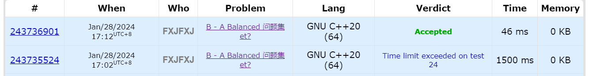
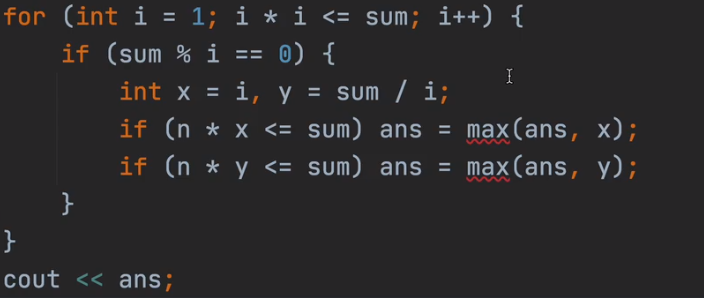
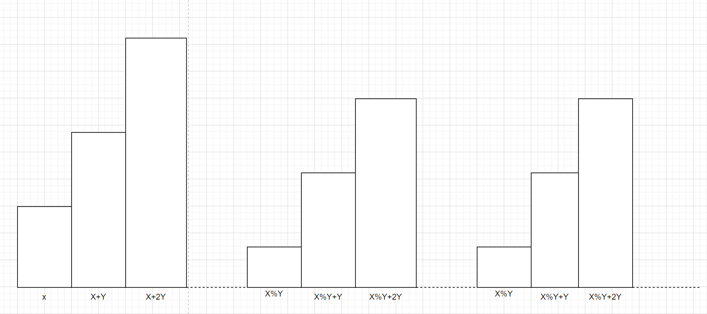

> [!note] Note
> This section retains your original "proof chain" solution content, especially those parts from number theory, SG, combinatorics, and EDU that are no longer suitable for me to compress into summaries.

## Coverage

- `CF 1931 Div.3 D`
- `CF 1931 Div.3 E`
- `CF 1931 Div.3 G`
- `CF 2008 Div.3 G`
- `CF 2008 Div.3 H`
- `CF 1925 Div.2 B`
- `CF 1928 Div.2 C`
- `CF 1928 Div.2 D`
- `CF 1928 Div.2 E`
- `CF 2004 EDU Div.2 D`
- `CF 2004 EDU Div.2 E`
- `CF 1957 Div.2 C`
- `CF 1957 Div.2 D`
- `CF 1957 Div.2 E`
- `CF 1935 Div.2 D`
- `CF 1997 EDU Div.2 D`

## CF 1931 Div.3 D - Divisible Pairs
Given an array $a$, find the number of pairs $(a_{i}+a_{j})\%x=0\cap(a_{i}-a_{j})\%y=0(i<j)$.

### Solution
It's easy to derive:

$(a_{i}\%x+a_{j}\%x)\%x=0,(a_{i}\%y-a_{j}\%y)\%y=0$
$\to a_{i}\%x+a_{j}\%x=x,a_{i}\%y-a_{j}\%y=0$

Store $a_{i}\%x,a_{i}\%y$. The pair satisfying $(x-a_{i}\%x)\%x\cap a_{i}\%y$ corresponds to the required condition.

```cpp
void solve() {
    int n, x, y;cin >> n >> x >> y;
    vector<int> a(n);
    for (auto& i : a)cin >> i;
    ll cnt = 0;
    map<pair<int, int>, int> mod;
    for (int i = 0;i < n;i++) {
        cnt += mod[{(x - a[i] % x) % x, a[i] % y}];
        mod[{a[i] % x, a[i] % y}]++;
    }
    cout << cnt << '\n';
}
```
or
```cpp
void solve() {
    int n, x, y;cin >> n >> x >> y;
    vector<int> a(n);
    for (auto& i : a)cin >> i;
    ll cnt = 0;
    map<pair<int, int>, int> mod;
    for (int i = 0;i < n;i++) {
        mod[{a[i] % x, a[i] % y}]++;
    }
    for (int i = 0;i < n;i++) {
        --mod[{a[i] % x, a[i] % y}];
        cnt += mod[{(x - a[i] % x) % x, a[i] % y}];
        ++mod[{a[i] % x, a[i] % y}];
    }
    cout << cnt / 2 << '\n';
}
```

## CF 1931 Div.3 E - Anna and the Valentine's Day Gift
Given an array $a$ of length $n$, Anna moves first.

- Anna chooses an $a_{i}\to$ $reverse(a_{i})$, removing leading zeros.
- Sasha chooses $a_{i},a_{j}\to$ $cat(a_{i},a_{j})$.

The game ends when Anna has made her move and only one element remains in the array. If the remaining number $\geq 10^m$, Sasha wins; otherwise, Anna wins.

Both play optimally. Output the winner.

### Solution
<span style="color:#92d050">Game Theory</span>

It's easy to see that Anna always prioritizes flipping the number with the most trailing zeros, while Sasha always prioritizes using the number with the most trailing zeros as $a_{i}$.

Take $a=\{10,10,10,10\}, m=5$ as an example:

- Anna: $1,10,10,10\to$ Sasha: $1,1010,10$
- Anna: $1,1010,1\to$ Sasha: $1,10101$
- Anna: $1,10101\to$ Sasha: $110101$
- Anna: $101011\to$ $\text{Game-Over}$, $101011\geq 10^5\to$ Sasha WIN

That is, each time Anna removes the largest one, Sasha keeps the second largest, and so on.

It's relatively simple.
```cpp
void solve() {
    int n, m;cin >> n >> m;
    vector<pair<int, int>> a(n);for (auto& [i, j] : a)cin >> j;
    int sum = 0;
    for (int i = 0;i < n;i++) {
        string num = to_string(a[i].second);
        sum += num.size();
        int cnt = 0;
        for (int i = num.size() - 1;i >= 0;i--) {
            if (num[i] == '0')cnt++;
            else break;
        }
        a[i].first = cnt;
    }
    sort(a.begin(), a.end());
    for (int i = n - 1;i >= 0;i -= 2) {
        sum -= a[i].first;
    }
    if (sum - 1 >= m)cout << "Sasha\n";
    else cout << "Anna\n";
}
```

## CF 1931 Div.3 G - One-Dimensional Puzzle


There are $a, b, c, d$ elements of each type. If all elements can be successfully combined into one long chain, it's considered complete. Find the number of ways (cannot flip).

### Solution
<span style="color:#92d050">Combinatorics (Stars and Bars)</span>

[Codeforces Round 925 (Div. 3) A-G Live Coding + Explanation (Starts at 60min)_bilibili](https://www.bilibili.com/video/BV16p421d7xw/?spm_id_from=333.337.search-card.all.click&vd_source=cb670d82714ee9baee22c33ef083884d) 

Note: In this problem, $C(x,y)$ is written as $C(y,x)$ (reversed $\dots$)

Preliminary exercise:

> $\text{eg1:}$ Put 10 identical balls into 8 boxes (each box has at least one ball). How many ways?
> 
> Gap method: 10 balls have 9 gaps to insert, with 7 dividers (i.e., no two dividers adjacent and there must be balls to the left of the first divider and to the right of the last divider).
> 
> Then the answer is $C(7,9)$.
> 
> $\text{eg2:}$ Put 10 identical balls into 8 boxes (boxes can be empty). How many ways?
> 
> Stars and bars: 10 balls and 7 dividers form a permutation of 17 items. Choose 7 positions for the dividers to distribute the balls into 8 boxes.
> 
> Answer: $C(7,17)$.
> 
> $\text{eg3:}$ Find the number of positive integer solutions to $x_{1}+x_{2}+x_{3}+x_{4}=10$.
> 
> Choose 3 positions from the 9 gaps between 10 ones to insert dividers. Answer: $C(3,9)$.
> 
> $\text{eg4:}$ Find the number of non-negative integer solutions to $x_{1}+x_{2}+x_{3}+x_{4}=10$.
> 
> Method 1: Add 4 to both sides, so $x_{i}\geq 1$, find positive integer solutions to $x_{1}+x_{2}+x_{3}+x_{4}=14$.
> 
> Method 2: Arrange 3 dividers and 10 balls as 13 items, choose 3 positions for dividers.
> 
> Answer: $C(3,13)$.

We can abstract:

Find the number of non-negative integer solutions and positive integer solutions to $x_{1}+x_{2}+x_{3}+\dots+x_{r}=n$.

$(1):$ $C(r-1,r+n-1)$

$(2):C(r-1,n-1)$

Put $n$ identical balls into $r$ boxes (boxes can be empty or at least one). How many ways?

$(1):C(r-1,n+r-1)$

$(2):C(r-1,n-1)$

We can insert $3$ between $1$ and $2$, and insert $4$ between $2$ and $1$.

- $121212$
- $212121$
- $333333$ placed between $1$ and $2$
- $444444$ placed between $2$ and $1$
- $\textcolor{red}{1}\textcolor{green}{333\dots3}\textcolor{red}{2}\textcolor{gray}{444\dots4}\textcolor{red}{1}\textcolor{green}{333\dots3}\textcolor{red}{2}\textcolor{gray}{444\dots4}\textcolor{red}{1}$

The meaning of insertion in this problem: Let the number of slots be $m$.

1. First consider the number of ways to put identical elements ($c$ of type 3 or $d$ of type 4) into $m$ slots (can be empty).
2. $x_{1}+x_{2}+x_{3}+\dots+x_{m}=c|d$ number of non-negative integer solutions.

The count below is $C(m-1,m+c|d-1)$. Since inserting $3|4$ does not conflict, multiply directly.

When $a=b$:

- $12121212$ slots: $3:a,4:a+1$
- $21212121$ slots: $3:a+1,4:a$

Number of solutions: $C(a-1,a+c-1)\times C(a,a+d)+C(a,a+c)\times C(a-1,a+d-1)$

When $a=b-1$:

- $2121212$ slots: $3:a+1,4:a+1$

Number of solutions: $C(a,a+c)\times C(a,a+d)$

When $a=b+1$:

- $1212121$ slots: $3:a,4:a$

Number of solutions: $C(a-1,a+c-1)\times C(a-1,a+d-1)$

Then preprocess factorials and inverse factorials up to the upper bound, so all combinations can be retrieved in $O(1)$; if you don't want to write linear inverses, direct fast exponentiation works, but the constant is slightly larger.

```cpp
const int mod = 998244353, N = 2e6 + 10;
ll fac[N], jv[N], inv[N];
void init(int n) {
    jv[0] = fac[0] = 1;
    for (int i = 1;i <= n;i++) {
        inv[i] = i == 1 ? 1 : (mod - mod / i) * inv[mod % i] % mod;
        fac[i] = fac[i - 1] * i % mod;
        jv[i] = jv[i - 1] * inv[i] % mod;
    }
}
ll C(int m, int n) {
    if (n < m || m < 0) return 0;
    return fac[n] * jv[n - m] % mod * jv[m] % mod;
}
void solve() {
    int a, b, c, d;cin >> a >> b >> c >> d;
    if (abs(a - b) >= 2) {
        cout << 0 << '\n';return;
    }
    ll ans = 0;
    if (!a && !b)ans = c == 0 || d == 0;
    else if (a == b) {
        ans = (C(a - 1, a + c - 1) * C(a, a + d) % mod + C(a, a + c) * C(a - 1, a + d - 1) % mod) % mod;
    } else if (a == b - 1) {
        ans = C(a, a + c) * C(a, a + d) % mod;
    } else if (a == b + 1) {
        ans = C(a - 1, a + c - 1) * C(a - 1, a + d - 1) % mod;
    }
    cout << ans << '\n';
}
main::init(2e6);
```

## CF 2008 Div.3 G - Sakurako's Task
Sakurako has prepared a task for you:

She gives you an array of $n$ integers, allowing you to choose $i$ and $j$ such that $i \neq j$ and $a_i \ge a_j$, and then set $a_i = a_i - a_j$ or $a_i = a_i + a_j$. You can perform this operation any number of times on any $i$ and $j$ as long as the conditions are met.

Sakurako asks you, what is the maximum possible value of $mex_k$ $^{*}$ of the array after any number of operations?

$^{*}$ $mex_k$ is the $k$-th non-negative integer not present in the array. For example: $mex_1(\{1,2,3\})=0$, because $0$ is the first element not present in the array; $mex_2(\{0,2,4\})=3$, because $3$ is the second element not present in the array.

### Solution

- Need to prove: Based on the operations, the final array can be $a_{i}=(i-1)\times \gcd(\{a_{i}\})$.
- With this array, how to find $\text{mex}_{k}$ efficiently?

The final possible values are $0,g,2g,3\mathbf{g}\dots,(n-1)g$.

There are $g-1$ numbers not formed in each gap, and there are $(n-1)$ gaps of $(g-1)$ numbers not formed.

If it exceeds this, it means it has gone beyond $(n-1)g$, and outside the range there are $k-(n-1)(g-1)$ numbers.
That is, $(n-1)g+k-(n-1)(g-1)=n-1+k$; otherwise, it's similar.

Find $\text{mex}_{k}$ in this way.

```cpp
#define int long long
void solve() {
    int n, k;cin >> n >> k;
    vector<int> a(n + 1);
    for (int i = 1;i <= n;i++)cin >> a[i];
    int g = a[1];
    for (int i = 1;i <= n;i++)g = __gcd(g, a[i]);
    if (n == 1) {
        cout << (a[1] >= k ? k - 1 : k) << '\n';return;
    }
    int t = (g - 1) * (n - 1);
    if (k > t) {
        cout << n - 1 + k << '\n';
    } else {
        if (k % (g - 1) == 0) {
            cout << k / (g - 1) * g - 1 << '\n';
        } else {
            cout << k / (g - 1) * g + k % (g - 1) << '\n';
        }
    }
}
```

## CF 2008 Div.3 H - Sakurako's Test
Sakurako is about to take a test. The test can be described as an integer array $n$ and a task:

Given an integer $x$, Sakurako can perform the following operation any number of times:

- Choose an integer $i$ ( $1\le i\le n$ ) such that $a_i\ge x$ ;
- Change the value of $a_i$ to $a_i-x$ .

Using this operation any number of times, she must find the minimum median $^{*}$ of the array $a$.

Sakurako knows the array, but not the integer $x$. It was leaked that one of the $q$ values of $x$ will appear in the next test, so Sakurako asks you for the answer for each such $x$.

$^{*}$ The median of an array of length $n$ is the element at the middle of the sorted array (for even $n$, the $\frac{n+2}{2}$-th position; for odd, the $\frac{n+1}{2}$-th position).

### Solution
Harmonic series complexity <-> mod Q

According to greedy thinking, $a_{i}\to a_{i} \bmod x$.

Preprocess all cases for $x\in[1,n]$. For each case, the answer range is $[0,x-1]$.

We can binary search the answer (for $x$, the minimum median of array $a$). For each $mid$, we can calculate the number of elements in the remainder range $[0,mid]$, and just need to check if the count is at least $\lfloor{\frac{n}{2}}\rfloor+1$.

Time complexity: $O(n\log^2n)$.

```cpp
void solve() {
    int n, q;cin >> n >> q;
    vector<int> mp(n + 1);
    for (int i = 1;i <= n;i++) {
        int x;cin >> x;mp[x]++;
    }

    for (int i = 1;i <= n;i++)mp[i] += mp[i - 1];
    vector<int> ans(n + 1);

    for (int i = 1;i <= n;i++) {//x
        int l = 0, r = i - 1;
        while (l < r) {
            int mid = l + r >> 1;
            int s = 0;
            for (int j = 0;j <= n;j += i) {
                s += mp[min(n, j + mid)] - (j == 0 ? 0 : mp[j - 1]);
            }
            if (s >= n / 2 + 1) {
                r = mid;
            } else {
                l = mid + 1;
            }
        }
        ans[i] = l;
    }
    while (q--) {
        int x;cin >> x;
        cout << ans[x] << ' ';
    }
    cout << '\n';
}
```

## CF 1925 Div.2 B - A Balanced Problemset?
Decompose $x$ into $n$ integers such that the `gcd` of these $n$ numbers is maximized, i.e., the most balanced.

### Solution
Thought for a long time but couldn't figure it out $\dots$

Not quite understood $\dots$

This code has been HACKED; submitting it now would TLE.

```cpp
void solve()
{
    int n, x;
    cin >> x >> n;
    if (n == 1)
    {
        cout << x << '\n';
        return;
    }
    for (int i = x / n; i >= 1; i--)
    {
        if (x % i == 0 && x / i >= n)
        {
            cout << i << '\n';
            return;
        }
    }
}
```

We have: $GCD(a_1,a_2,a_3,\ldots,a_n) = GCD(a_1,a_1+a_2,a_1+a_2+a_3,\ldots,a_1+a_2+a_3+\ldots+a_n)$ $\leftrightarrow GCD(a_1,a_1+a_2,a_1+a_2+a_3,\ldots,x)$.

So the answer must be a divisor of $x$.

Now, consider a divisor $d$ of $x$. I have two ideas:
$(1)$

- When $n\times d\leq x$, choose as: $d,d,d,\ldots,x-(n-1)d\leftrightarrow \gcd(d,2d,3d..,x)$ gives feasible answer $d$.
- When $n\leq d$, there is a feasible answer $x//d$ (originally each part is $\frac{x}{n}$, $n$ parts. If $n\leq d$, if divided into $d$ parts, each part is $\frac{x}{d}$, can be divided into more parts, each larger, and the part $\geq n$ can be placed anywhere. Then $\frac{x}{d}$ can also be an answer).

$(2)$

- Directly iterate over divisors from $1$ to $x$, check if $n \times d \le x$, and take $d$. This will TLE.
- Only iterate over divisors up to $\sqrt{x}$, check both $d$ and $x / d$ for the condition, covering all divisors.

Find the maximum $d$ satisfying this condition. This can be done in $\mathcal{O}(\sqrt{x})$ time via simple factorization.



```cpp
void solve()
{
    int n, x;
    cin >> x >> n;
    int ans = 1;
    for (int i = 1; i * i <= x; i++)
    {
        if (x % i == 0)//if i is a divisor of x
        {
            if (n <= x / i)//n*i<=x ->i i i ... x-(n-1)*i  ->i
                ans = max(ans, i);
            if (n <= i)
                ans = max(ans, x / i);
        }
    }
    cout << ans << '\n';
}
```

## CF 1928 Div.2 C - Physical Education Lesson
Everyone lines up and is asked to stand in the "$k$-th" position.

$1\sim k,k-1\sim 2,1\sim k,k-1\sim 2,\dots$ and so on. Thus, it repeats every $2k - 2$ positions. ($k \neq 1$)

Given the position in the line $n$ and the resulting number $x$, output how many $k$ are possible.

**eg**
$n=10,x=2$, $\to k$ = $2, 3, 5, 6$ .

Examples solving these for $k$:

| $k$ / № | $1$ | $2$ | $3$ | $4$ | $5$ | $6$ | $7$ | $8$ | $9$ | $10$ |
| ------- | --- | --- | --- | --- | --- | --- | --- | --- | --- | ---- |
| $2$     | $1$ | $2$ | $1$ | $2$ | $1$ | $2$ | $1$ | $2$ | $1$ | $2$  |
| $3$     | $1$ | $2$ | $3$ | $2$ | $1$ | $2$ | $3$ | $2$ | $1$ | $2$  |
| $5$     | $1$ | $2$ | $3$ | $4$ | $5$ | $4$ | $3$ | $2$ | $1$ | $2$  |
| $6$     | $1$ | $2$ | $3$ | $4$ | $5$ | $6$ | $5$ | $4$ | $3$ | $2$  |

### Solution

- When on the left part: just need to satisfy $n\%(2 k-2)=x$ (if it's 0, treat it as 2 specially).
- Otherwise, satisfy $2 k-n\%(2 k-2)=x$.

Brute force approach: (TLE) Since it's $O(n)$ ($n\leq 10^9$) it will definitely TLE.
```cpp
void solve() {
    int n, x;cin >> n >> x;
    int ans = 0;
    for (int k = 2;k <= n;k++) {
        int m = n % (2 * k - 2);
        if (!m) m = 2;
        if (m <= k) {
            if (m == x) ans++;
        } else {
            m = 2 * k - m;
            if (m == x) ans++;
        }
    }
    cout << ans << '\n';
}
```

From above: $k$ satisfies $(2 k-2)\times t+x=n\cup(2k-2)\times t+2k-x=n$.

This can be transformed to: $(2k-2)|(n-x)\cup(2k-2)|(n+x-2k)\to(2k-2)|(n+x-2)$.

So we just need to determine which numbers are even divisors (since $(2k-2)$ must be even) of $(n-x)\cup(n+x-2)$, i.e., representing $(2k-2)$. So when storing, store $k$ which is $\frac{i}{2}+1$.

$k$ and $x$ also satisfy $k\geq x$.

NOTE: <span style="color:#92d050">Trial division</span>: To find all divisors of a number, we only need $\sqrt{ n }$. When $i$ is a divisor, add $i$ and $\frac{n}{i}$, i.e.:

(However, when $n$ is a perfect square, there will be duplicates; use a `set` instead of a `vector` for deduplication.)
```cpp
auto find = [&](int n) {
	vector<int> ans;
	for (int i = 1;i * i <= n;i++) {
		if (n % i == 0) {
			ans.push_back(i);
			ans.push_back(n / i);
		}
	}
	return ans;
};
```

`unordered_set` can be used instead of `set`. Insertion in `unordered_set` is $O(1)$.
```cpp
void solve() {
    int n, x;cin >> n >> x;
    unordered_set<int> can;
    auto find = [&](int a) {
        unordered_set<int> ans;
        for (int i = 1;i * i <= a;i++) {
            if (a % i == 0) {
                if (i % 2 == 0)can.insert(1 + i / 2);
                if ((a / i) % 2 == 0)can.insert(1 + (a / i) / 2);
            }
        }
        return ans;
    };
    for (auto i : find(n - x))can.insert(i);
    for (auto i : find(n + x - 2))can.insert(i);
    int ans = 0;
    for (auto i : can) {
        if (i >= x)ans++;
    }
    cout << ans << '\n';
}
```

## CF 1928 Div.2 D - Lonely Mountain Dungeons
The army of the inhabitants of Middle-earth will consist of several squads. It is known that for each pair of creatures of the same race belonging to different squads, the total strength of the army increases by $b$ units. However, since Timothy finds it difficult to lead an army consisting of a large number of squads, the total strength of an army consisting of $k$ squads is reduced by $(k - 1) \cdot x$ units. Note that the army always consists of **at least one squad**.

There are $n$ races, and the number of creatures of the $i$-th race is equal to $c_i$. Determine the maximum possible strength of the army they can form.

### Solution
<span style="color:#92d050">Ternary Search</span> (first increasing, then decreasing) Combinatorics

Note: Carelessness with `long long` calculations can easily lead to WA.

The key to ternary search here is not the template itself, but first proving that `check(k)` exhibits a "first increasing then decreasing" unimodal shape. As the number of squads increases, the contribution within each race changes smoothly, and the total answer can be treated as a unimodal function. Thus, we can safely apply ternary search and then brute-force enumerate within the narrowed short interval.

[codeforces round 924 (Div2) A-E Idea Sharing_bilibili](https://www.bilibili.com/video/BV1wy421a7iy/?spm_id_from=333.337.search-card.all.click&vd_source=cb670d82714ee9baee22c33ef083884d)

For calculating combat power when divided into $k$ squads (each race is independent, so they can be calculated separately):

First, calculate the integer part of $\frac{i}{k}$, meaning each squad has at least $\lfloor{\frac{i}{k}}\rfloor$ individuals.

When each squad has $\lfloor{\frac{i}{k}}\rfloor$ individuals, the contribution at this point: $\frac{\lfloor{\frac{i}{k}}\rfloor\times(k-1)\times \lfloor{\frac{i}{k}}\rfloor\times k}{2}$.

>For one individual, individuals from other squads contribute: $\lfloor{\frac{i}{k}}\rfloor\times(k-1)$.
>
>For those in the same squad as him: $\lfloor{\frac{i}{k}}\rfloor\times(k-1)\times \lfloor{\frac{i}{k}}\rfloor$.
>
>The same applies to other squads, so the contribution at this point: $\frac{\lfloor{\frac{i}{k}}\rfloor\times(k-1)\times \lfloor{\frac{i}{k}}\rfloor\times k}{2}$.

Remainder part, only some squads have 1 extra individual, contribution: $\frac{i\%k\times(i\%k-1)}{2}$.

The connection between the remainder and the integer part: contribution: $(k-1)\times \lfloor{\frac{i}{k}}\rfloor\times i\%k$.

>For the newly added remainder part, the $(k-1)\times \lfloor{\frac{i}{k}}\rfloor$ individuals from the integer part not in the same squad need to be counted in the contribution.

`Then the combat power for this race`: $\textcolor{green}{\frac{\lfloor{\frac{i}{k}}\rfloor\times(k-1)\times \lfloor{\frac{i}{k}}\rfloor\times k}{2}+\frac{i\%k\times(i\%k-1)}{2}+(k-1)\times \lfloor{\frac{i}{k}}\rfloor\times i\%k-(k-1)\times x}$.

```cpp Ternary Search
void solve() {
    int n, b, x;cin >> n >> b >> x;
    vector<int> c(n);for (int i = 0;i < n;i++)cin >> c[i];
    auto check = [&](ll k) {//calculate combat power when divided into k squads
        ll ans = 0;
        for (auto i : c) {
            ll t = i / k, tt = i % k, res = 0;
            res += t * t * k * (k - 1) / 2;
            if (tt > 0) {//this condition can be ignored
                res += tt * (tt - 1) / 2;
                res += tt * t * (k - 1);
            }
            ans += res * b;
        }
        ans -= (k - 1) * x;
        return ans;
    };
    ll l = 1, r = *(max_element(c.begin(), c.end()));
    while (r - l + 1 > 3) {//the main purpose of this code is to narrow down the l,r interval sufficiently for later enumeration
        ll lmid = l + (r - l + 1) / 3;
        ll rmid = r - (r - l + 1) / 3;
        if (check(lmid) > check(rmid))r = rmid;//to shorten the interval
        else l = lmid;
    }
    ll ans = 0;
    for (ll i = l;i <= r;i++)ans = max(ans, check(i));
    cout << ans << '\n';
}
```

[D_bilibili](https://www.bilibili.com/video/BV1Cu4m1P7My?p=5&vd_source=cb670d82714ee9baee22c33ef083884d)
(I think the simplest idea): There might be duplicate numbers in $c[i]$. If enumerated sequentially, duplicates are recalculated. So calculate once and multiply by the count.

Complexity: Worst case (there are $m$ races with different population counts): $1,2,3,\dots,m$ all distinct. $\sum c=\frac{m(m+1)}{2}\in m^2\leq 2\times10^5\in n$, $\to O(mn)=O(n\sqrt{ n })$.

Note:
- The `num` array must be declared outside; putting it inside will TLE. To put `num` inside, its size needs to be changed to $\max(c_{i})$.

```cpp 
vector<int> num(2e5 + 1);
void solve() {
    int n, b, x;cin >> n >> b >> x;
    unordered_set<int> c;
    for (int i = 0;i < n;i++) {
        int x;cin >> x;
        c.insert(x);
        num[x]++;
    }
    auto check = [&](ll k) {
        ll ans = 0;
        for (auto i : c) {
            ll t = i / k, tt = i % k, res = 0;
            res += t * t * k * (k - 1) / 2;
            res += tt * (tt - 1) / 2;
            res += tt * t * (k - 1);
            ans += res * b * num[i];
        }
        ans -= (k - 1) * x;
        return ans;
    };
    ll l = 1, r = *(max_element(c.begin(), c.end())), ans = 0;
    for (ll i = l;i <= r;i++)
        ans = max(ans, check(i));
    cout << ans << '\n';
    for (auto p : c)num[p] = 0;
}
```

[Codeforces Round 924 (Div. 2) A - E - Zhihu](https://zhuanlan.zhihu.com/p/682080153)

It can be seen that the optimal solution is definitely to distribute each race <span style="color:#ffc000">evenly</span> among the squads.

Assuming a certain race has $c_{i}$ individuals, we can brute-force enumerate the contribution to the answer when the number of squads is $[1,c_{i}-1]$. For the interval $\left[ c_{i},\sum c \right]$, the contribution is fixed and can be achieved using static range addition.

Since $\sum c$ is limited, this method can be completed in $O\left( \sum c \right)$ time.
```cpp
void solve() {
    int n, b, x, m = 0;cin >> n >> b >> x;
    vector<int>c(n);for (int i = 0;i < n;i++)cin >> c[i], m += c[i];
    vector<ll>d(m + 1);
    auto add = [&](int l, int r, ll x) {
        d[l] += x;
        if (r + 1 <= m)d[r + 1] -= x;
    };
    for (auto x : c) {
        for (int i = 1;i < x;i++) {
            ll sum = 1ll * x * (x - 1);
            int t = x / i, r = x % i;
            sum -= (i - r) * 1ll * t * (t - 1);
            sum -= r * 1ll * (t + 1) * t;
            add(i, i, sum / 2);
        }
        add(x, m, 1ll * x * (x - 1) / 2);
    }
    ll ans = 0;
    for (int i = 1;i <= m;i++) {
        d[i] += d[i - 1];
        ans = max(ans, d[i] * b - 1ll * (i - 1) * x);
    }
    cout << ans << '\n';
}
```

[D_bilibili](https://www.bilibili.com/video/BV1B2421c7GQ?p=5&vd_source=cb670d82714ee9baee22c33ef083884d)
Even distribution is optimal. Sort first, enumerate the number of squads. Small races won't be recalculated next time; large ones are recalculated until no longer updated.

```cpp
#define int long long
void solve() {
    int n, b, x;cin >> n >> b >> x;
    vector<int> a(n);for (auto& i : a)cin >> i;sort(a.begin(), a.end());
    int maxx = 1e9, divi = 0, hascal = 0;
    int ans = 0;
    for (int i = 2;divi <= n - 1 && i <= maxx;i++) {
        int res = 0;
        for (int j = divi;j <= n - 1;j++) {
            if (a[j] <= i) {
                hascal += b * (a[j] * (a[j] - 1)) / 2;
                divi++;
            } else {
                int cnt = a[j] / i, mod = a[j] % i;
                int a1 = i - mod, a2 = mod;
                res += b * a[j] * (a[j] - 1) / 2;
                res -= b * a1 * cnt * (cnt - 1) / 2;
                res -= b * a2 * (cnt + 1) * cnt / 2;
            }
        }
        res += hascal;
        res -= (i - 1) * x;
        ans = max(ans, res);
    }
    cout << ans << '\n';
}
```

## CF 1928 Div.2 E - Modular Sequence
You are given two integers $x$ and $y$. A sequence $a$ of length $n$ is called a modular sequence if $a_1 = x$, and for all $1 < i \le n$, the value $a_i$ is either $a_{i-1} + y$ or $a_{i-1} \bmod y$.

Determine if there exists a modular sequence of length $n$ whose sum of elements equals $S$. If it exists, find any such sequence.

### Solution
<span style="color:#92d050">DP</span>

Brute force search $O(2^n)$.
```cpp
void solve() {
    int n, x, y, s;cin >> n >> x >> y >> s;vector<int> a(n, 0);a[0] = x;
    ll sum = x;
    auto dfs = [&](auto self, int i, ll currSum) -> bool {
        if (currSum > s) return false; // prefix sum pruning
        if (i == n) return currSum == s;
        a[i] = (a[i - 1] + y) % y;
        if (self(self, i + 1, currSum + a[i])) return true;
        a[i] = a[i - 1] + y;
        if (self(self, i + 1, currSum + a[i])) return true;
        return false;
    };
    if (dfs(dfs, 1, sum)) {
        cout << "yes\n";for (int i = 0;i < n;i++)cout << a[i] << " \n"[i == n - 1];
    } else {
        cout << "no\n";
    }
}
```

Official solution:

> Let's first look at the form of the answer: First, there will be a prefix of the form $x, x+y, \ldots, x+k\cdot y$, and then there will be some blocks of the form $x \bmod y, x \bmod y+y, \ldots, x \bmod y+k\cdot y$.
> 
> We can subtract $x \bmod y$ from all elements of the sequence and then divide all elements by $y$ (all elements initially have the remainder $x\bmod y$, so they are all divisible by $y$). Let $b_1 = \frac{x-x\bmod y}{y}$. Then our sequence will start with $b_1, b_1+1, \ldots, b_1+k_1$, followed by blocks of the form $0,1,\ldots,k_i$.
> 
> Now let's calculate these values: $dp_i$ represents the minimum length of a sequence of blocks of the form $0,1, \ldots, k_j$ whose sum is $i$. We can compute this for all values from $0$ to $s$ using dynamic programming. If we have processed all values from $0$ to $k-1$, then for $k$, we have calculated the minimum length, and we can update $dp$ values for $k+1, k+1+2,\ldots$ , totaling $O(\sqrt{s})$ values not exceeding $s$. In the same $dp$, we can record which values were recalculated through to recover the answer.
> 
> Now, we can iterate over the length of the first block of the form $b_1, b_1+1,\ldots,b_1+k_1$. Then we know the sum of the remaining blocks, and using the precomputed $dp$, we can determine if we can form the required sequence.

[codeforces round 924 (Div2) A-E Idea Sharing_bilibili](https://www.bilibili.com/video/BV1wy421a7iy/?spm_id_from=333.337.search-card.all.click&vd_source=cb670d82714ee9baee22c33ef083884d)

The sequence form is as shown below (after subtracting $x\%y$ from all and dividing by $y$).

The first part: $x,x+y,\dots x+k_{1}y\to$ $\frac{x-x\%y}{y},\frac{x-x\%y}{y}+1,\frac{x-x\%y}{y}+2,\dots,\frac{x-x\%y}{y}+k_{1}$.

The remaining parts: $x\%y,x\%y+y,\dots x\%y+k_{i}y\to$ $0,1,2,\dots k_{i}$.

`dp[x]={minimum length to achieve this area, where it transferred from, last height}`.

The condition must satisfy: `dp[s][0]<=n`.

Continuing from here, it's essentially a knapsack-like DP: `dp[s]` maintains the minimum length needed to form area `s`, the transfer source, and the height of the last layer. As long as the final `dp[s][0] <= n`, it means a construction within the length limit is possible. Then, backtrack according to the recorded predecessor to reconstruct the solution.



```cpp
void solve() {
    ll n, x, y, s;cin >> n >> x >> y >> s;
    if (x + (n - 1) * (x % y) > s) {
        cout << "NO\n";return;
    }
    s -= (x % y) * n;
    vector<array<int, 3>>dp(s + 1, {INT_MAX,0,0});
    for (int ns = x - x % y, h = x - x % y, i = 1;ns <= s;i++, h += y, ns += h) {
        dp[ns] = {i,0,h};
    }
    for (int i = 0;i <= s;i++) {
        if (dp[i][0] != INT_MAX) {
            for (int j = 1, t = 0/*t represents the length of a part of the pillars*/;t + i <= s;t += j * y, j++) {
                dp[t + i] = min(dp[t + i], {dp[i][0] + j, i, (j - 1)* y});
            }
        }
    }
    if (dp[s][0] > n) {
        cout << "NO\n";return;
    }
    vector<int> ans(n);
    int v = s;
    while (v) {
        auto [i, ns, h] = dp[v];
        while (v != ns) {
            i--;
            ans[i] = h;
            v -= h, h -= y;
        }
    }
    cout << "YES\n";
    for (auto i : ans)cout << i + (x % y) << " ";cout << "\n";
}
```

## CF 2004 EDU Div.2 D - Colored Portals
There are $n$ cities on a straight line. The cities are numbered from $1$ to $n$.

Portals are used to move between cities. There are $4$ colors of portals: blue, green, red, and yellow. Each city has portals of two different colors. If city $i$ and city $j$ share a portal color, it is possible to move from city $i$ to city $j$ (for example, you can move between a "blue-red" city and a "blue-green" city). This move costs $|i-j|$ gold coins.

Your task is to answer $q$ independent queries: calculate the minimum cost to move from city $x$ to city $y$.

### Solution
Binary Search

>On the surface, it looks like a shortest path problem, but upon closer inspection, it's not that approach.

Idea:

From the problem, there are six combinations. If two cities cannot pair directly, at most one transfer is needed to reach the other city.

If besides the colors of $x$ and $y$, there are no other cities with the required colors, then it's unreachable. Otherwise, we can definitely find a city to act as a transfer to reach the other city.

Now, another problem: Among all cities with the required different colors, how do we find the $k$ that minimizes $\left|{i-k}\right|+\left|{j-k}\right|$?

If we can find a $k$ such that $i<k<j$, then the answer is $j-i$.

If we cannot find such a $k$, we binary search each time to find the $k$ closest to $i$ or $j$, minimizing the answer, and take the minimum among these.

>The idea is completely correct, but the implementation was wrong... The correct code is as follows:

```cpp
const string tar[] = {"BG", "BR", "BY", "GR", "GY", "RY"};
void solve() {
    int n, q;cin >> n >> q;
    vector<string> s(n + 1);
    vector<vector<int>> idx(6);
    for (int i = 0;i < 6;i++)idx[i].push_back(0);
    for (int i = 1;i <= n;i++) {
        cin >> s[i];
        for (int j = 0;j < 6;j++)if (s[i] == tar[j])idx[j].push_back(i);
    }
    for (int i = 0;i < 6;i++)idx[i].push_back(1e9);

    while (q--) {
        int x, y;cin >> x >> y;
        if (x > y)swap(x, y);
        if (s[x][0] == s[y][0] || s[x][0] == s[y][1] || s[x][1] == s[y][1] || s[x][1] == s[y][0]) {
            cout << y - x << '\n';continue;
        }
        int ok = 0;
        for (int i = 0;i < 6;i++) {
            if (tar[i] == s[x] || tar[i] == s[y] || !idx[i].size()) continue;
            auto k = lower_bound(idx[i].begin(), idx[i].end(), x);
            if (*k != 1e9 && *k < y) {
                ok = 1;break;
            }
        }
        if (ok) {
            cout << y - x << '\n';continue;
        }
        int ans = 1e9;
        for (int i = 0;i < 6;i++) {
            if (tar[i] == s[x] || tar[i] == s[y] || !idx[i].size()) continue;
            auto k1 = lower_bound(idx[i].begin(), idx[i].end(), x);
            if (*k1 != 1e9) {
                ans = min(ans, *k1 - y + *k1 - x);
            }
            auto k2 = upper_bound(idx[i].begin(), idx[i].end(), x);
            --k2;
            if (*k2 != 0) {
                ans = min(ans, x + y - *k2 - *k2);
            }
        }
        if (ans == 1e9)ans = -1;
        cout << ans << '\n';
    }
}
```

Actually, the code can be simplified:
```cpp
const string tar[] = {"BG", "BR", "BY", "GR", "GY", "RY"};
void solve() {
    int n, q;cin >> n >> q;
    vector<string> s(n + 1);
    vector<vector<int>> idx(6);
    for (int i = 0;i < 6;i++)idx[i].push_back(0);
    for (int i = 1;i <= n;i++) {
        cin >> s[i];
        for (int j = 0;j < 6;j++)if (s[i] == tar[j])idx[j].push_back(i);
    }
    for (int i = 0;i < 6;i++)idx[i].push_back(1e9);

    while (q--) {
        int x, y;cin >> x >> y;
        if (x > y)swap(x, y);
        if (s[x][0] == s[y][0] || s[x][0] == s[y][1] || s[x][1] == s[y][1] || s[x][1] == s[y][0]) {
            cout << y - x << '\n';continue;
        }
        int ans = 1e9;
        for (int i = 0;i < 6;i++) {
            if (tar[i] == s[x] || tar[i] == s[y] || !idx[i].size()) continue;
            auto k = lower_bound(idx[i].begin(), idx[i].end(), x);
            if (*k != 1e9) {
                ans = min(ans, abs(*k - y) + *k - x);
            }
            --k;
            if (*k != 0) {
                ans = min(ans, x + y - *k - *k);
            }
        }
        if (ans == 1e9)ans = -1;
        cout << ans << '\n';
    }
}
```

## CF 2004 EDU Div.2 E - Not a Nim Problem
Alice and Bob are playing a game. They have $n$ piles of stones, where the $i$-th pile initially has $a_i$ stones.

On their turn, a player can choose any pile and remove any positive number of stones from it, but with one condition:

- Let $x$ be the number of stones in the chosen pile. Remove $y$ stones from the pile such that the greatest common divisor of $x$ and $y$ equals $1$.

The player who cannot make a move loses. Both players play optimally (i.e., if a player has a winning strategy, they will win regardless of the opponent's responses). Alice moves first.

Determine who wins.

### Solution
Game Theory / SG Function

>EDU: Learning Game Theory

We can first brute-force list the $sg$ function and find patterns based on the values:
```cpp
void solve() {
    constexpr int N = 500;
    vector<int> sg(N);
    for (int i = 1;i < N;i++) {
        set<int>s;
        for (int j = 1;j <= i;j++) {
            if (__gcd(i, j) == 1) {
                s.insert(sg[i - j]);
            }
        }
        int idx = 0;
        for (auto x : s) {
            if (x == idx)idx++;
        }
        sg[i] = idx;
    }
    vector<vector<int>> q(N);
    for (int i = 0;i < N;i++)q[sg[i]].push_back(i);
    for (int i = 0;i < N;i++) {
        cout << i << ": ";
        for (auto x : q[i])cout << x << " ";
        cout << '\n';
    }
}
```

Get $sg_{0\sim 99}$:
```cpp
0 1 0 2 0 3 0 4 0 2 0 5 0 6 0 2 0 7 0 8 0 2 0 9 0 3 0 2 0 10 0 11 0 2 0 3 0 12 0 2 0 13 0 14 0 2 0 15 0 4 0 2 0 16 0 3 0 2 0 17 0 18 0 2 0 3 0 19 0 2 0 20 0 21 0 2 0 4 0 22 0 2 0 23 0 3 0 2 0 24 0 4 0 2 0 3 0 25 0 2 
```
$q_{0\sim 99}$: (i.e., $q_{sg_{i}}$)

```cpp
0: 0 2 4 6 8 10 12 14 16 18 20 22 24 26 28 30 32 34 36 38 40 42 44 46 48 50 52 54 56 58 60 62 64 66 68 70 72 74 76 78 80 82 84 86 88 90 92 94 96 98 
1: 1 
2: 3 9 15 21 27 33 39 45 51 57 63 69 75 81 87 93 99 
3: 5 25 35 55 65 85 95 
4: 7 49 77 91 
5: 11 
6: 13 
7: 17 
8: 19 
9: 23 
10: 29 
11: 31 
12: 37 
13: 41 
14: 43 
15: 47 
16: 53 
17: 59 
18: 61 
19: 67 
20: 71 
21: 73 
22: 79 
23: 83 
24: 89 
25: 97 
```

It's easy to see:

- When $i$ is even, $sg_{i}=0$.
- Looking only at the first term, starting from 2, the subsequent terms are $3,5,7,11,\dots$, which are all prime terms. That is, $sg_{3}=2, sg_{5}=3, \dots, \to sg_{primes_{i}}=i+1$.
- When a value $x$ corresponds to multiple $sg_{i}$, it can be found that the smallest prime factor of the later numbers is the first prime in the list. That is:
  $sg_{\{list\}}=x$, $\{in\ list \cap i> 0:minp[list_{i}]=list_{0}\}$.

Thus: $\displaystyle sg_{primes_{i}=i+1}$, $sg_{i}=sg_{minp_{i}}$.

```cpp
constexpr int N = 1e7;
int sg[N + 1];
void solve() {
    int n;cin >> n;
    int ans = 0;
    for (int i = 1;i <= n;i++) {
        int x;cin >> x;ans ^= sg[x];
    }
    if (ans != 0) {
        cout << "Alice\n";
    } else {
        cout << "Bob\n";
    }
}
int main() {
    ios::sync_with_stdio(false), cin.tie(nullptr);
    sieve(N);
    sg[0] = 0;sg[1] = 1;sg[2] = 0;
    for (int i = 1;i < primes.size();i++) {
        sg[primes[i]] = i + 1;
    }
    for (int i = 3;i <= N;i++) {
        sg[i] = sg[minp[i]];
    }
    int _ = 1;
    cin >> _;
    while (_--)
        solve();
}
```

## CF 1957 Div.2 C - How Does the Rook Move?
You are given an $n \times n$ chessboard. You and the computer take turns placing white and black rooks on the board, respectively. When placing a rook, you must ensure that no two rooks attack each other. Two rooks attack each other if they share the same row or column, regardless of color.

A valid move is to place a rook on a square ($r$, $c$) such that it does not attack any other rook.

You start first. When you make a valid move in your turn, placing a white rook at position ($r$, $c$), the computer copies your move and places a black rook at position ($c$, $r$) in its turn. If $r = c$, the computer cannot mirror your move and skips its turn.

You have already played $k$ moves with the computer (and the computer tries to copy these moves). You must continue playing until there are no more valid moves. After playing these $k$ moves, how many different final configurations are possible if you continue playing optimally? It is guaranteed that the $k$ moves and the implied computer moves are all valid. Since the answer may be large, print it modulo $10^9+7$.

Two configurations are considered different if there exists a coordinate ($r$, $c$) such that one configuration has a rook and the other does not, or the colors of the rooks on that coordinate are different.

### Solution
<span style="color:#92d050">Combinatorics/DP</span>

Method 1: DP recurrence: `f[i] = f[i - 1] + f[i - 2] * 2 * (i - 1)`.

If reasoning backwards:

When placing a rook on the diagonal, choosing $(i,i)$ consumes $1r\times1l$, so the contribution is `f[i-1]`.

If not placed on the diagonal: after selecting row $i(row)$, the column can be chosen arbitrarily from the previous $(i-1)$ positions. Similarly for column $i(line)$. This consumes $2r\times2l$, so the contribution is $2(i-1)f[i-2]$.

```cpp
#define int long long
constexpr int mod = 1e9 + 7;
int f[300010];
void solve() {
    int n, k;cin >> n >> k;int cnt = n;
    for (int i = 1;i <= k;i++) {
        int x, y;cin >> x >> y;cnt -= 2 - (x == y);
    }
    cout << f[cnt] << '\n';
}
signed main() {
    ios::sync_with_stdio(false), cin.tie(nullptr);
    f[0] = 1;f[1] = 1;f[2] = 3;
    for (int i = 3;i <= 3e5;i++) {
        f[i] = f[i - 1] + f[i - 2] * 2 * (i - 1);f[i] %= mod;
    }
    int _ = 1;
    cin >> _;
    while (_--)
        solve();
}
```

Combinatorics:

$C_{n}^m=\frac{n!}{(n-m)!\times m!}$

$cnt$ represents the number of available rows and columns. Then: $ans=\sum\limits_{i=0}^{cnt/2}(C_{cnt}^{2i}\times C_{2i}^{i}\times i!)\equiv\sum\limits_{i=0}^{cnt/2}\left( \frac{cnt!}{(cnt-2i)!\times i!} \right)=\sum\limits_{i=0}^{cnt/2}\left( C_{cnt}^{2i}\times \frac{2i!}{i!} \right)$.

I don't understand how this is derived $\dots$.
```cpp
#define int long long
constexpr int mod = 1e9 + 7;
int fac[300010];
int inv(int a, int b = mod - 2) {
    int ans = 1;
    while (b) {
        if (b & 1)ans = (ans * a) % mod;
        a = (a * a) % mod;b >>= 1;
    }
    return ans;
}
int c(int a, int b) {
    return fac[a] * inv(fac[a - b]) % mod * inv(fac[b]) % mod;
}
void solve() {
    int n, k;cin >> n >> k;int cnt = n;
    for (int i = 1;i <= k;i++) {
        int x, y;cin >> x >> y;cnt -= 2 - (x == y);
    }
    int ans = 0;
    for (int i = 0;i * 2 <= cnt;i++) {
        ans = (ans + c(cnt, 2 * i) * c(2 * i, i) % mod * fac[i]) % mod;
    }
    cout << ans << '\n';
}
signed main() {
    ios::sync_with_stdio(false), cin.tie(nullptr);
    fac[0] = fac[1] = 1;
    for (int i = 2;i <= 3e5;i++) {
        fac[i] = fac[i - 1] * i % mod;
    }
    int _ = 1;
    cin >> _;
    while (_--)
        solve();
}
```

## CF 1957 Div.2 D - A BIT of an Inequality
You are given an array $a_1, a_2, \ldots, a_n$. Find the number of triples ($x, y, z$) satisfying the following conditions:

- $1 \leq x \leq y \leq z \leq n$, and
- $f(x, y) \oplus f(y, z) > f(x, z)$.

Define $f(l, r) = a_l \oplus a_{l + 1} \oplus \ldots \oplus a_{r}$.

### Solution
Bitwise Operations

$f(x, y) \oplus f(y, z)>f(x,z)\implies f(x,z)\oplus a_{y} > f(x, z)$.

> Let the prefix XOR be $s$, where $s_{i}$ represents the XOR of the first $i$ numbers.
> 
> Then the condition can be simplified to finding the number of pairs satisfying $s_{z}\oplus s_{x-1}\oplus a_{y}>s_{z}\oplus s_{x-1}$.
> 
> Now, classify based on bits: Let the current bits of $s_{z}$ and $s_{x-1}$ be $r$ and $l_{-1}$ respectively, and let $t$ be the value of the highest set bit of $a_{y}$.
> 
> When $t=0$: Regardless of whether $r$ and $l_{-1}$ are $0$ or $1$, the value of $s_{z}\oplus s_{x-1}$ remains unchanged.
> 
> When $t=1$: If $r$ and $l_{-1}$ are different at this time, the final value will decrease; otherwise, it will increase.

Summary: The only case where the value increases is when $t=1 \cap r=l_{-1}=0\text{ or }1$.

Thus, for $a_{i}$, first find the position of its highest set bit $(j=\_\_lg(a_{i}))$.

From the problem, we have $z \in[i,n],x-1 \in[0,i-1]$. So the answer is the number of cases where both sides have the same bit value for this highest bit.

That is, the count of 1s in $[i,n]$ multiplied by the count of 1s in $[0,i-1]$, plus the count of 0s in $[i,n]$ multiplied by the count of 0s in $[0,i-1]$.

>After calculating the count of 1s, the count of 0s in that interval is simply the interval length minus the count of 1s.

```cpp Fantasy Club President
#define int long long
int c[32][100010];
void solve() {
    int n;cin >> n;vector<int> a(n + 1), s(n + 1);
    for (int i = 1;i <= n;i++) {
        cin >> a[i];s[i] = s[i - 1] ^ a[i];
        for (int j = 0;j <= 30;j++) {
            c[j][i] = c[j][i - 1] + (s[i] >> j & 1);
        }
    }
    int ans = 0;
    for (int i = 1;i <= n;i++) {
        int k = __lg(a[i]);
        ans += (c[k][n] - c[k][i - 1]) * c[k][i - 1];
        ans += (n - i + 1 - (c[k][n] - c[k][i - 1])) * (i - c[k][i - 1]);
    }
    cout << ans << '\n';
}
```

Now, we need preprocessing: We need to know whether $f(l,r)=0\text{ or }1$ for the $k$-th bit, i.e., the XOR of the $k$-th bits of elements from $l$ to $r$ is 0 or 1.

> 
> Here, we need to handle prefixes and suffixes: (Official solution)
> 
> `pre[i][j][k = 0]` represents the count of numbers among $a[1\sim j]$ whose $i$-th bit is $0$, similarly for $k=1$.
> 
> `suf[i][j][k = 0]` represents the count of numbers among $a[n\sim j]$ whose $i$-th bit is $0$, similarly for $k=1$.
> 
> Note: Since prefixes and suffixes are not calculated with an offset here, when operating on $a_{i}$, $a_{i}$ needs to be included correctly.

```cpp Official Solution
constexpr int Z = 30, MAX_N = 1e5 + 3;
int pref[Z][MAX_N][2];
int suff[Z][MAX_N][2];

void solve() {
    int n;
    cin >> n;
    vector<int> a(n + 1);
    for (int i = 1; i <= n; i++) cin >> a[i];
    for (int i = 0; i < Z; i++) suff[i][n + 1][0] = suff[i][n + 1][1] = 0;
    for (int i = 0; i < Z; i++) {
        for (int j = 1; j <= n; j++) {
            int t = (a[j] >> i) & 1;
            for (int k = 0; k < 2; k++) pref[i][j][k] = (t == k) + pref[i][j - 1][k ^ t];
        }
        for (int j = n; j >= 1; j--) {
            int t = (a[j] >> i) & 1;
            for (int k = 0; k < 2; k++) suff[i][j][k] = (t == k) + suff[i][j + 1][k ^ t];
        }
    }
    long long ans = 0;
    for (int i = 1; i <= n; i++) {
        int z = __lg(a[i]); // <-> 31 - __builtin_clz(a[i])
        ans += 1ll * pref[z][i - 1][1] * (1 + suff[z][i + 1][0]);
        ans += 1ll * (1 + pref[z][i - 1][0]) * suff[z][i + 1][1];
    }
    cout << ans << "\n";
}
```

## CF 1957 Div.2 E - Carousel of Combinations
You are given an integer $n$. The function $C(i,k)$ represents the number of different ways to choose $k$ distinct numbers from the set \{ $1, 2, \ldots, i$ \} and arrange them in a circle $^\dagger$.

Find

$$
\sum\limits_{i=1}^n \sum\limits_{j=1}^i \left( C(i,j) \bmod j \right). 
$$

Since this value can be very large, output it modulo $10^9+7$.

### Solution
<span style="color:#92d050">Wilson's Theorem</span>

It's easy to know that $C(i,j)=Comb(i,j)\times(j-1)! =\frac{i!}{(i-j)!\times j}=\frac{i(i-1)(i-2)\dots(i-j+1)}{j}$.

It can be noted that $n\dots(n-j+1)$ has $j$ terms. Since they are $j$ consecutive numbers, their remainders modulo $j$ must be distinct ($0\sim j-1$), and exactly one term is divisible by $j$ ($0\pmod j$). The other terms together form $(j-1)!$.

$\implies C(i,j)=(j-1)!\times \lfloor{\frac{i}{j}}\rfloor\pmod j$.

> Wilson's theorem: For a prime $p$, $(p-1)! \equiv(p)-1\pmod p$. For composite $p$ (excluding $p=4$), $(p-1)! \equiv0\pmod p$.

Here, we use a difference array $d$. For position $i(i=k\times j,k=1,2,3\dots)$, to make $\lfloor{\frac{i}{j}}\rfloor$ the same, positions $i \in[kj,kj+j-1]$, i.e., $[i,i+j-1]$, have the same contribution $\left( \lfloor{\frac{i}{j}}\rfloor \right)$ as position $i$, until position $[i+j]$ where $\lfloor{\frac{i}{j}}\rfloor$ increases by 1. So, we add the corresponding contribution at position $i$ and subtract it at position $[i+j]$. Then, after performing a prefix sum on $d$, we can calculate the correct contribution for each position. The answer is the sum of contributions from $[1,n]$, so we need another prefix sum on $d$ to get the final answer.

```cpp
#define int long long
constexpr int N = 1e6, mod = 1e9 + 7;
int vis[N + 10], pri[N + 10], isp[N + 10];//to check if prime
int d[N + 10];
void init(int n) {//linear sieve
    int cnt = 0;
    for (int i = 2; i <= n; ++i) {
        if (!vis[i]) {
            pri[cnt++] = i;isp[i] = 1;
        }
        for (int j = 0; j < cnt; ++j) {
            if (i * pri[j] > n) break;
            vis[i * pri[j]] = 1;
            if (i % pri[j] == 0) break;
        }
    }
}
signed main() {
    ios::sync_with_stdio(false), cin.tie(nullptr);
    init(N);
    for (int j = 2;j <= N;j++) {
        if (j == 4 || isp[j]) {
            int v = (j == 4 ? 2 : j - 1);
            for (int i = j;i <= N;i += j) {//enumerate multiples of j
                int t = v * (i / j) % j;
                d[i] = (d[i] + t) % mod;
                if (i + j <= N)d[i + j] = (d[i + j] - t + mod) % mod;
            }
        }
    }
    for (int i = 1;i <= N;i++)d[i] = (d[i] + d[i - 1]) % mod;
    for (int i = 1;i <= N;i++)d[i] = (d[i] + d[i - 1]) % mod;
    int _;cin >> _;
    while (_--) {
        int n;cin >> n;cout << d[n] << '\n';
    }
}
```

## CF 1935 Div.2 D - Exam in MAC
Given an array $s$ of length $n$, find the number of pairs $x,y(x\leq y)$ (satisfying $x+y,y-x$ are not elements of the array, $0\leq x,y\leq c$).

### Solution
<span style="color:#92d050">Inclusion-Exclusion / Combinatorics</span>

The main thing is to think in this direction; once you do, it's simple.

Official solution:

Using inclusion-exclusion: $\mathrm{cnt}(x, y) - \mathrm{cnt}(x, y: x + y \in s) - \mathrm{cnt}(x, y: y - x \in s) + \mathrm{cnt}(x, y: x + y, y - x \in s)$.

The total number of $(x, y)$ pairs is $\frac{(c+1)\cdot(c+2)}{2}$.

For $x, y: x + y \in s$: Iterate over the sum value $s_i$. Assuming $x + y = s_i$, then for $0 \leq x \leq \lfloor \frac{s_i}{2} \rfloor$, there is a corresponding $y$. Thus, the number of pairs with this sum is $\lfloor \frac{s_i}{2} \rfloor + 1$.

For $x, y: y - x \in s$: Iterate over the difference $s_i$. Assuming $y - x = s_i$, then for $s_i \leq y \leq c$, there is a corresponding $x$. Thus, the number of pairs with this difference is $c - s_i + 1$.

For $x, y: x + y, y - x \in s$: Assuming $x+y=s_i$, $y-x=s_j$, then $x = \frac{s_i - s_j}{2}$, $y = \frac{s_i+s_j}{2}$. They contribute to the answer when they have the same parity. Let's count the number of even and odd numbers in $s$ — let them be $even$ and $odd$ respectively. Therefore, the number of such pairs is $\frac{even\cdot(even+1)}{2}+\frac{odd\cdot(odd+1)}{2}$.

```cpp
#define int long long
void solve() {
    int n, c;cin >> n >> c;
    vector<int> a(n);
    for (int i = 0;i < n;i++) {
        cin >> a[i];
    }
    int cnt = (c + 2) * (c + 1) / 2, odd = 0;
    for (int i = 0;i < n;i++) {
        cnt -= a[i] / 2 + 1;
        cnt -= c - a[i] + 1;
        if (a[i] % 2)odd++;
    }
    int even = n - odd;
    cnt += (odd + 1) * odd / 2 + (even + 1) * even / 2;
    cout << cnt << '\n';
}
```

## CF 1997 EDU Div.2 D - Maximize the Root
You are given a rooted tree consisting of $n$ vertices. The vertices of the tree are numbered from $1$ to $n$, with the root being vertex $1$. The value $a_i$ is written on the $i$-th vertex.

You can perform the following operation any number of times (possibly zero): Choose a vertex $v$ that has at least one child vertex. For all vertices $u$ in the subtree of $v$ (excluding $v$ itself), increase $a_v$ by $1$ and decrease $a_u$ by $1$. However, after each operation, all values on the vertices must remain non-negative.

Your task is to find the maximum possible value written on the root after performing the above operations.

### Solution
Tree DP / Binary Search

This problem screams binary search, but unfortunately, my graph theory implementation skills weren't good enough to write it. (There seem to be many solutions.)

$O(n\log n)$

DFS to determine if a value of at least $x$ can be obtained in the subtree of $u$.

The DFS idea: For the subtree of 1, we need to satisfy the requirement of being greater than or equal to mid. If not, the nodes in the subtree need to be increased to meet the requirement. However, increasing them places higher demands on the nodes in their subtrees, i.e., $x$ increases.

```cpp
#define int long long
void solve() {
    int n;cin >> n;
    vector<int> a(n + 1);
    for (int i = 1;i <= n;i++)cin >> a[i];
    vector<vector<int>> g(n + 1);
    for (int i = 2;i <= n;i++) {
        int x;cin >> x;
        g[x].push_back(i);
    }

    auto dfs = [&](auto self, int u, int x)->bool {
        if (x > 1e9)return 0;
        bool leaf = 1;
        if (u != 1) {
            x += max(0ll, x - a[u]);
        }
        for (auto v : g[u]) {
            leaf = 0;
            if (!self(self, v, x))return 0;
        }
        return (!leaf || x <= a[u]);
        };

    int l = 0, r = 1e10;
    while (l < r) {
        int mid = l + r >> 1;

        if (!dfs(dfs, 1, mid))r = mid;
        else l = mid + 1;
    }
    cout << a[1] + l - 1 << '\n';
}
```

$O(n)$

The idea is close to what I initially thought: try to make the minimum values of the upper and lower layers as close as possible.

If the minimum value $mi$ of the subtree of $u$ is smaller than $a_{u}$, it means the subtree doesn't have much to contribute to $a_u$, and the maximum value this subtree can achieve is $mi$.

If the minimum value $mi$ of the subtree of $u$ is greater than $a_{u}$, we can, according to the problem, contribute some values from the subtree to the parent. It's optimal when they are close.

After the search, the value of the root's subtree will be the value after contributions from its children. Thus, the answer is $a_{1}$ plus the minimum value of its children's subtrees.

```cpp
#define int long long
void solve() {
    int n;cin >> n;
    vector<int> a(n + 1), val(n + 1);
    for (int i = 1;i <= n;i++)cin >> a[i];
    vector<vector<int>> g(n + 1);
    for (int i = 2;i <= n;i++) {
        int x;cin >> x;
        g[x].push_back(i);
    }
    int inf = 1e18;
    auto dfs = [&](auto self, int u)->void {
        val[u] = a[u];
        int mi = inf;
        for (auto v : g[u]) {
            self(self, v);mi = min(mi, val[v]);//mn is the minimum value of the subtree of node u
        }
        if (mi != inf) {// not a leaf
            if (val[u] > mi) {
                val[u] = mi;
            } else {
                val[u] = val[u] + mi >> 1;
            }
        }
        };
    dfs(dfs, 1);
    int ans = inf;
    for (auto v : g[1]) {
        ans = min(ans, val[v]);
    }
    cout << ans + a[1] << '\n';
}
```