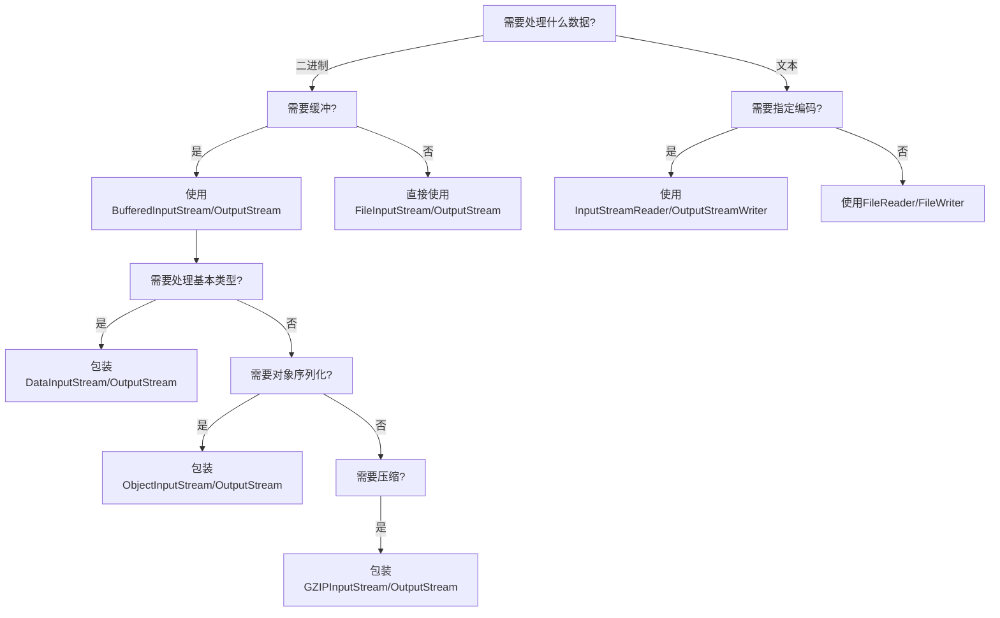

> [!note] 说明
> 这篇改回以你原来的 Java 集合 / 基础笔记为主体，尽量保留原来的问法、总结和源码分析结构。

## 收录内容

- `java集合概览`
- `Java集合总结`
- `List 相关常见知识`
- `Map相关常见知识(重)`
- `Java基础总结`
- `java反射`
- `java代理模式`
- `java SPI机制`
- `Java IO`

## Java 集合概览

似乎我在 java 集合部分中的源码分析部分，了解的不够？但是时间不多了！需要加把劲了！

### Java 集合概览
由两大接口派生而来：一个是 Collection 接口，主要用于存放单一元素；另一个是 Map 接口，主要用于存放键值对。对于 Collection 接口，下面又有三个主要的子接口：List、Set 、 Queue。


>这里只列举了主要的继承派生关系，并没有列举所有关系。

### 集合框架底层数据结构总结

List

- ArrayList：Object[] 数组。详细可以查看：ArrayList 源码分析。
- Vector：Object[] 数组。
- LinkedList：双向链表 (JDK 1.6 之前为循环链表，JDK 1.7 取消了循环)。详细可以查看：LinkedList 源码分析。

Set

- HashSet (无序，唯一): 基于 HashMap 实现的，底层采用 HashMap 来保存元素。
- LinkedHashSet: LinkedHashSet 是 HashSet 的子类，并且其内部是通过 LinkedHashMap 来实现的。
- TreeSet (有序，唯一): 红黑树 (自平衡的排序二叉树)。

Queue

- PriorityQueue: Object[] 数组来实现小顶堆。详细可以查看：PriorityQueue 源码分析。
- DelayQueue: PriorityQueue。详细可以查看：DelayQueue 源码分析。
- ArrayDeque: 可扩容动态双向数组。

Map

- HashMap：JDK 1.8 之前 HashMap 由数组+链表组成的，数组是 HashMap 的主体，链表则是主要为了解决哈希冲突而存在的（“拉链法”解决冲突）。JDK 1.8 以后在解决哈希冲突时有了较大的变化，当链表长度大于阈值（默认为 8）（将链表转换成红黑树前会判断，如果当前数组的长度小于 64，那么会选择先进行数组扩容，而不是转换为红黑树）时，将链表转化为红黑树，以减少搜索时间。详细可以查看：HashMap 源码分析。
- LinkedHashMap：LinkedHashMap 继承自 HashMap，所以它的底层仍然是基于拉链式散列结构即由数组和链表或红黑树组成。另外，LinkedHashMap 在上面结构的基础上，增加了一条双向链表，使得上面的结构可以保持键值对的插入顺序。同时通过对链表进行相应的操作，实现了访问顺序相关逻辑。详细可以查看：LinkedHashMap 源码分析 
- Hashtable：数组+链表组成的，数组是 Hashtable 的主体，链表则是主要为了解决哈希冲突而存在的。
- TreeMap：红黑树（自平衡的排序二叉树）。

### 可能会被问到的重点问题！

>加\*的代表是重点！总的来说：`ArrayList` ，`LinkedList`， `HashMap`，`ConcurrentHashMap` 为重点！其他的了解即可。

#### ArrayList 底层的实现原理是什么
- `ArrayList` 底层是用动态的数组实现的
- `ArrayList` 初始容量为 0，当第一次添加数据的时候才会初始化容量为 10
- `ArrayList` 在进行扩容的时候是原来容量的 1.5 倍，每次扩容都需要拷贝数组
- `ArrayList` 在添加数据的时候
	- 确保数组已使用长度(size)加 1 之后足够存下下一个数据
	- 计算数组的容量，如果当前数组民使用长度+1 后的大于当前的数组长度，则调用 `grow` 方法扩容（原来的 1.5倍）
	- 确保新增的数据有地方存储之后，则将新元素添加到位于 `size` 的位置上。
	- 返回添加成功布尔值。

>new ArrayList(10) list 扩容几次？0 次

#### 如何实现数组和 List 之间的转换
- 数组转 List ，使用 JDK 中 `java.util.Arrays` 工具类的 `asList` 方法
- List 转数组，使用 List 的 `toArray` 方法。无参 `toArray` 方法返回 Object 数组，传入初始化长度的数组对象，返回该对象数组

面试官再问:
- 用 `Arrays.asList` 转 List 后，如果修改了数组内容，list 受影响吗? `->` 受影响
- List 用 `toArray` 转数组后，如果修改了 List 内容，数组受影响吗? `->` 不受影响
答：
- `Arrays.asList` 转换 list 之后，如果修改了数组的内容，list 会受影响
因为它的底层使用的 Arrays 类中的一个内部类 ArrayList 来构造的集
合，在这个集合的构造器中，把我们传入的这个集合进行了包装而
已，最终指向的都是同一个内存地址
- list 用了 toArray 转数组后，如果修改了 list 内容，数组不会影响，当
调用了 toArray 以后，在底层是它是进行了数组的拷贝，跟原来的元
素就没啥关系了，所以即使 list 修改了以后，数组也不受影响

#### ArrayList 和 LinkedList 的区别是什么?(\*)
ArrayList 与 LinkedList 区别?

#### HashMap 的底层实现(\*)
HashMap 的底层实现
>JDK 1.7 和 1.8 的 HashMap 有什么区别？

#### HashMap 的 put 操作具体流程(\*)
流程图：


**(重)**

1. 判断键值对数组 table 是否为空或为 null，否则执行 resize()进行扩容(初始化)
2. 根据键值 key 计算 hash 值得到数组索引
3. 如果 `table[i]==null` 条件成立，直接新建节点添加
4. 如果 `table[i]!=null` 
	- 判断 `table[i]`的首个元素是否和 key 一样，如果相同直接覆盖 value
	- 判断 `table[i]` 是否为 treeNode，即 `table[i]` 是否是红黑树，如果是红黑树，则直接在树中插入键值对
	- 遍历 `table[i]`，链表的尾部插入数据，然后判断链表长度是否大于 8，大于 8 的话把链表转换为红黑树，在红黑树中执行插入操作，遍历过程中若发现 key 已经存在直接覆盖 value
5. 插入成功后，判断实际存在的键值对数量 size 是否超多了最大容量 `threshold` (数组长度\*0.75)，如果超过，进行扩容

#### HashMap 的扩容机制是什么？
流程图：


- 在添加元素或初始化的时候需要调用 `resize` 方法进行扩容，第一次添加数据初始化数组长度为 16，以后每次每次扩容都是达到了扩容阈值(数组长度\*0.75)
- 每次扩容的时候，都是扩容之前容量的 2 倍(可以保证每次都是 2 的幂);
- 扩容之后，会新创建一个数组，需要把老数组中的数据挪动到新的数组中
	- 没有 hash 冲突的节点，则直接使用 `e.hash &(newCap-1)`计算新数组的索引位置
	- 如果是红黑树，走红黑树的添加
	- 如果是链表，则需要遍历链表，可能需要拆分链表，判断 `(e.hash & oldCap)` 是否为 0，该元素的位置要么停留在原始位置，要么移动到**原始位置+增加的数组大小**这个位置上

#### HashMap 的寻址算法？


#### HashMap JDK 1.7 在多线程下死循环问题
参考视频：
-  [常见集合篇-17-HashMap在1.7情况下的多线程死循环问题\_哔哩哔哩\_bilibili](https://www.bilibili.com/video/BV1yT411H7YK?vd_source=cb670d82714ee9baee22c33ef083884d&spm_id_from=333.788.player.switch&p=85)
- [JDK7的HashMap头插法循环的问题，这么难理解吗？\_哔哩哔哩\_bilibili](https://www.bilibili.com/video/BV1n541177Ea/?vd_source=cb670d82714ee9baee22c33ef083884d)
- [为什么 HashMap 会死循环？HashMap 死循环发生在 JDK 1.8 之前的版本中，它是指在并发环境下，因为多 - 掘金](https://juejin.cn/post/7236009910147825719?searchId=202307221616567C1AAB8045817A64ED43)

在 jdk 1.7 的 hashmap 中在数组进行扩容的时候，因为链表是头插法，在进行数据迁移的过程中，有可能导致死循环 

比如说，现在有两个线程
线程一:读取到当前的 hashmap 数据，数据中一个链表，在准备扩容时，线程二介入
线程二:也读取 hashmap，直接进行扩容。因为是头插法，链表的顺序会进行颠倒过来。比如原来的顺序是 AB，扩容后
的顺序是 BA，线程二执行结束。

线程一:继续执行的时候就会出现死循环的问题。
线程一先将 A 移入新的链表，再将 B 插入到链头，由于另外一个线程的原因，B 的 next 指向了 A，所以 B->A->&,形成循环。
当然，JDK 8 将扩容算法做了调整，不再将元素加入链表头(而是保持与扩容前一样的顺序)，**尾插法**，就避免了 idk 7中
死循环的问题。

## Java 集合总结

重点：
- HashMap 的底层原理
- ConcurrentHashMap 的底层原理
- ArrayList 的底层原理

将这几个的底层原理理解了即可。(对于其他的暂时不做总结)

感觉这样效率较低，且只列出了点，但没有给出解答。易忘。所以使用 Java集合思维导图

所以这个笔记，**整理好常见问题和自己的问题即可**

### ArrayList
对于 ArrayList 的底层原理及其源码分析：
- **扩容机制如何实现的？**
- **与 LinkedList 的区别**
- 线程安全？那用什么
- 为什么有快速查找的能力？

对于自己想法：
- modcount 是什么？
- 各个操作的源码分析

### HashMap

**重中之重中的重中之重**

几乎是必考的考点

问题：
- **HashMap 是如何扩容的**
- **JDK7 和 8 实现的不同,即有哪些不同**
- HashMap 的扩容是怎样的？为什么是两倍？
- 线程安全吗？
- 加载因子是什么？为什么默认为 0.75

面经中的
- 讲一下 HashMap 的过程
- 红黑树和 HashMap 的使用场景？
- HashMap 和 HashTable、ConcurrentHashMap 的区别
- 多线程环境下: hashMap 正在扩容的时候另外一个线程要执行 put 操作，是插入到新的 table 还是旧的 table
- hashmap 的底层数据结构
- 如何解决的 hash 冲突
- **jdk1.7 hashmap 为什么是头插入，到 1.8 改为尾插**

for me:
- 对于各种方法在源码中是如何实现的呢？操作流程是怎样的呢？
- hash 方法对于 JDK7/8 有变化吗？为什么这样实现？
- resize 方法的机制是怎样的？

### ConcurrentHashMap
>严格来讲，这个也属于 JUC 的内容，所以...都可以写吧？

问题：
- **JDK7/8 有什么区别？**
- **存储结构是怎样的？(对于 JDK7/8)**
- 对于各个操作的流程是怎样的？
- **与 HashMap 的比较/区别？**
- CAS?
- cuncurrentHashMap 的 get 方法是否需要加锁,为什么？

面经中的：
- **如何实现的线程安全的？**
- 分段锁是如何保证的？(没太搞懂问的是什么)
- **原理**及其缺点？
- 是如何实现的？
- 和 HashTable 比较，谁好用
- size 算法？
- 为什么 concurrenthashmap 在 1.8 用 synchronized 关键字？
- 为什么 ConcurrentHashMap 的 key 不能为 null？
- 在项目中有哪些应用

## List 相关常见知识

### ArrayList 和 Array（数组）的区别？
> `ArrayList` 内部基于动态数组实现，比 `Array`（静态数组） 使用起来更加灵活：

- `ArrayList` 会根据实际存储的元素动态地扩容或缩容，而 `Array` 被创建之后就不能改变它的长度了。
- `ArrayList` 允许你使用泛型来确保类型安全，`Array` 则不可以。
- `ArrayList` 中只能存储对象。对于基本类型数据，需要使用其对应的包装类（如 Integer、Double 等）。`Array` 可以直接存储基本类型数据，也可以存储对象。
- `ArrayList` 支持插入、删除、遍历等常见操作，并且提供了丰富的 API 操作方法，比如 `add ()`、`remove ()`等。`Array` 只是一个固定长度的数组，只能按照下标访问其中的元素，不具备动态添加、删除元素的能力。
- `ArrayList` 创建时不需要指定大小，而 `Array` 创建时必须指定大小。

```java
 // 初始化一个 String 类型的数组
 String[] stringArr = new String[]{"hello", "world", "!"};
 // 修改数组元素的值
 stringArr[0] = "goodbye";
 System.out.println(Arrays.toString(stringArr));// [goodbye, world, !]
 // 删除数组中的元素，需要手动移动后面的元素
 for (int i = 0; i < stringArr.length - 1; i++) {
     stringArr[i] = stringArr[i + 1];
 }
 stringArr[stringArr.length - 1] = null;
 System.out.println(Arrays.toString(stringArr));// [world, !, null]
```

```java
// 初始化一个 String 类型的 ArrayList
 ArrayList<String> stringList = new ArrayList<>(Arrays.asList("hello", "world", "!"));
// 添加元素到 ArrayList 中
 stringList.add("goodbye");
 System.out.println(stringList);// [hello, world, !, goodbye]
 // 修改 ArrayList 中的元素
 stringList.set(0, "hi");
 System.out.println(stringList);// [hi, world, !, goodbye]
 // 删除 ArrayList 中的元素
 stringList.remove(0);
 System.out.println(stringList); // [world, !, goodbye]
```

### ArrayList 与 LinkedList 区别?

- `ArrayList` 和 `LinkedList` 都是不同步的，也就是**不保证线程安全**；
- `ArrayList` 底层使用的是 `Object` 数组；`LinkedList` 底层使用的是**双向链表**数据结构（JDK 1.6 之前为循环链表，JDK 1.7 取消了循环。注意双向链表和双向循环链表的区别）
- 插入和删除是否受元素位置的影响：
	- `ArrayList` 采用数组存储，所以插入和删除元素的时间复杂度受元素位置的影响。 
	- `LinkedList` 采用链表存储，所以在头尾插入或者删除元素不受元素位置的影响 $O(1)$，如果是要在指定位置插入和删除元素 $O(n)$
- 是否支持快速随机访问：快速随机访问就是**通过元素的序号快速获取元素对象** (对应于 `get(int index)` 方法)。
	- `LinkedList` 不支持高效的随机元素访问
	- `ArrayList` 支持（实现了 `RandomAccess` 接口） 。
- 内存空间占用：`ArrayList` 的空间浪费主要体现在在 `list` 列表的结尾会**预留一定的容量空间**，而 `LinkedList` 的空间花费则体现在它的每一个元素都需要消耗比 `ArrayList` 更多的空间（因为要存放直接后继和直接前驱以及数据）。

>一般不会使用 `LinkedList` ，需要用到 `LinkedList` 的场景几乎都可以使用 `ArrayList` 来代替，并且，性能通常会更好。

#### RandomAccess 接口
> [!question]
> Q: `LinkedList` 为什么不能实现 `RandomAccess` 接口？
> A: `RandomAccess` 是一个标记接口，用来表明实现该接口的类支持随机访问（即可以通过索引快速访问元素）。由于 `LinkedList` 底层数据结构是链表，内存地址不连续，只能通过指针来定位，不支持随机快速访问，所以不能实现 `RandomAccess` 接口。

```java
public interface RandomAccess {
}
```
实际上 `RandomAccess` 接口中什么都没有定义。所以 `RandomAccess` 接口不过是一个标识罢了。 **标识实现这个接口的类具有随机访问功能**。

>在 `binarySearch()` 方法中，它要判断传入的 `list` 是否 `RandomAccess` 的实例，如果是，调用 `indexedBinarySearch()`方法，如果不是，那么调用 `iteratorBinarySearch()`方法

### 双向链表与双向循环链表


### ArrayList 插入和删除元素的时间复杂度？
>非常好理解，复杂度和想象一样，和数组本质也一样。

插入：

- 头部插入：由于需要将所有元素都依次向后移动一个位置，因此时间复杂度是 O (n)。
- 尾部插入：当 `ArrayList` 的容量未达到极限时，往列表末尾插入元素的时间复杂度是 O (1)，因为它只需要在数组末尾添加一个元素即可；当容量已达到极限并且需要扩容时，则需要执行一次 O (n) 的操作将原数组复制到新的更大的数组中，然后再执行 O (1) 的操作添加元素。
- 指定位置插入：需要将目标位置之后的所有元素都向后移动一个位置，然后再把新元素放入指定位置。这个过程需要移动平均 n/2 个元素，因此时间复杂度为 O (n)。

删除：

- 头部删除：由于需要将所有元素依次向前移动一个位置，因此时间复杂度是 O (n)。
- 尾部删除：当删除的元素位于列表末尾时，时间复杂度为 O (1)。
- 指定位置删除：需要将目标元素之后的所有元素向前移动一个位置以填补被删除的空白位置，因此需要移动平均 n/2 个元素，时间复杂度为 O (n)。

### LinkedList 插入和删除元素的时间复杂度？
>LinkList 为双向链表，值得注意。
- 头部插入/删除：只需要修改头结点的指针即可完成插入/删除操作，因此时间复杂度为 O (1)。
- 尾部插入/删除：只需要修改尾结点的指针即可完成插入/删除操作，因此时间复杂度为 O (1)。
- 指定位置插入/删除：需要先移动到指定位置，再修改指定节点的指针完成插入/删除，不过由于有头尾指针，可以从较近的指针出发，因此需要遍历平均 n/4 个元素，时间复杂度为 O (n)。

### 了解(看看就行，较为简单)：
#### ArrayList 和 Vector 的区别?（了解即可）
- `ArrayList` 是 `List` 的**主要实现类**，底层使用 `Object[]`存储，适用于频繁的查找工作，线程不安全。
- `Vector` 是 `List` 的**古老实现类**，底层使用 `Object[]` 存储，线程安全。

#### Vector 和 Stack 的区别?（了解即可）
- `Vector` 和 `Stack` 两者都是线程安全的，都是使用 `synchronized` 关键字进行同步处理。
- `Stack` 继承自 `Vector`，是一个后进先出的栈，而 `Vector` 是一个列表。

> [!NOTE]
> 随着 Java 并发编程的发展，`Vector` 和 `Stack` 已经被淘汰，**推荐使用并发集合类**（例如 `ConcurrentHashMap`、`CopyOnWriteArrayList` 等）或者手动实现线程安全的方法来提供安全的多线程操作支持。
> 

#### ArrayList 可以添加 null 值吗？
ArrayList 中可以存储任何类型的对象，包括 null 值。不过，**不建议向 ArrayList 中添加 null 值**， null 值无意义，会让代码难以维护比如忘记做判空处理就会导致空指针异常。

## Map 相关常见知识

### HashMap 和 Hashtable 的区别

- `HashMap` 是非线程安全的，`Hashtable` 是线程安全的,因为 `Hashtable` 内部的方法基本都经过 `synchronized` 修饰。（保证线程安全使用 `ConcurrentHashMap` ）；
- `hashtable` 效率略低，基本被**淘汰**
- 对 Null key 和 Null value 的支持
	- `HashMap` 可以存储 `null` 的 `key` 和 `value`，但 `null` 作为键只能有一个，`null` 作为值可以有多个；
	- `Hashtable` 不允许有 `null` 键和 `null` 值，否则会抛出 `NullPointerException`。
- 初始容量大小和每次扩充容量大小的不同
	- 创建时如果**不指定**容量初始值，`Hashtable` 默认的初始大小为 11，之后每次扩充，容量变为原来的 `2n+1`。`HashMap` 默认的初始化大小为 16。之后每次扩充，容量变为原来的 2 倍。
	- 创建时如果**给定**了容量初始值，那么 `Hashtable` 会直接使用你给定的大小，而 `HashMap` 会将其扩充为 **2 的幂次方大小**（`HashMap` 中的 `tableSizeFor()` 方法保证）
- 底层数据结构
	- JDK 1.8 以后的 `HashMap` 在解决哈希冲突时有了较大的变化，当链表长度大于阈值（默认为 8）时，将链表转化为**红黑树**（将链表转换成红黑树前会判断，如果当前数组的长度小于 64，那么会选择先进行数组扩容，而不是转换为红黑树），以减少搜索时间。
	- `Hashtable` 没有这样的机制。
- 哈希函数的实现：`HashMap` 对哈希值进行了高位和低位的混合扰动处理以减少冲突，而 `Hashtable` 直接使用键的 `hashCode()` 值。

>保证了 `HashMap` 总是使用 2 的幂作为哈希表的大小。
```java
/**
 * Returns a power of two size for the given target capacity.
 * 找到大于或等于 cap 的最小2的幂
 */
static final int tableSizeFor(int cap) {
    int n = cap - 1;
    n |= n >>> 1;
    n |= n >>> 2;
    n |= n >>> 4;
    n |= n >>> 8;
    n |= n >>> 16;
    return (n < 0) ? 1 : (n >= MAXIMUM_CAPACITY) ? MAXIMUM_CAPACITY : n + 1;
}
```

#### HashMap 的长度为什么是 2 的幂次方

- 位运算效率更高：位运算(&)比取余运算(%)更高效。当长度(length)为 2 的幂次方时，`hash % length` 等价于 `hash & (length - 1)`。
- 可以更好地保证哈希值的均匀分布：扩容之后，在旧数组元素 hash 值比较均匀的情况下，新数组元素也会被分配的比较均匀，最好的情况是会有一半在新数组的前半部分，一半在新数组后半部分。
- 扩容机制变得简单和高效：扩容后只需检查哈希值高位的变化来决定元素的新位置，要么位置不变（高位为 0），要么就是移动到新位置（高位为 1，原索引位置 i+原容量 length）。

### HashMap 和 HashSet 区别
`HashSet` 底层就是基于 `HashMap` 实现。除了 `clone()`、`writeObject()`、`readObject()` 是 `HashSet` 自己不得不实现之外，其他方法都是直接调用 `HashMap` 中的方法。

### HashMap 和 TreeMap 区别
`TreeMap` 和 `HashMap` 都继承自 `AbstractMap` ， `TreeMap` 还实现了 `NavigableMap` 接口和 `SortedMap` 接口。


实现 `NavigableMap` 接口让 `TreeMap` 有了对集合内元素的搜索的能力。

`NavigableMap` 接口提供了丰富的方法来探索和操作键值对:
- 定向搜索: `ceilingEntry()`, `floorEntry()`, `higherEntry()`和 `lowerEntry()`等方法可以用于定位大于等于、小于等于、严格大于、严格小于给定键的最接近的键值对。
- 子集操作: `subMap()`, `headMap()`和 `tailMap()` 方法可以高效地创建原集合的子集视图，而无需复制整个集合。
- 逆序视图:`descendingMap()` 方法返回一个逆序的 `NavigableMap` 视图，使得可以反向迭代整个 `TreeMap`。
- 边界操作: `firstEntry()`, `lastEntry()`, `pollFirstEntry()`和 `pollLastEntry()` 等方法可以方便地访问和移除元素。

实现 `SortedMap` 接口让 `TreeMap` 有了对集合中的元素根据键排序的能力。默认是按 key 的升序排序，不过我们也可以指定排序的比较器。

```java
public class Person {
    private Integer age;
	//...
    public static void main(String[] args) {
        TreeMap<Person, String> treeMap = new TreeMap<>(new Comparator<Person>() {
            @Override
            public int compare(Person person1, Person person2) {
                int num = person1.getAge() - person2.getAge();
                return Integer.compare(num, 0);
            }
        });
		/*也可以用lambda表达式
		TreeMap<Person, String> treeMap = new TreeMap<>((person1, person2) -> {
		  int num = person1.getAge() - person2.getAge();
		  return Integer.compare(num, 0);
		});
		*/

        treeMap.put(new Person(3), "person1");
        treeMap.put(new Person(18), "person2");
        treeMap.put(new Person(35), "person3");
        treeMap.put(new Person(16), "person4");
        treeMap.entrySet().stream().forEach(personStringEntry -> {
            System.out.println(personStringEntry.getValue());
        });
    }
}
```

`TreeMap` 中的元素已经是按照 `Person` 的 `age` 字段的升序来排列了。

相比于 `HashMap` 来说， `TreeMap` 主要多了**对集合中的元素根据键排序的能力**以及**对集合内元素的搜索的能力**。

### HashSet 如何检查重复?

> [!NOTE]
> 当你把对象加入 `HashSet` 时，`HashSet` 会先计算对象的 `hashcode` 值来判断对象加入的位置，同时也会与其他加入的对象的 `hashcode` 值作比较，如果没有相符的 `hashcode`，`HashSet` 会假设对象没有重复出现。但是如果发现有相同 `hashcode` 值的对象，这时会调用 `equals()`方法来检查 `hashcode` 相等的对象是否真的相同。如果两者相同，`HashSet` 就不会让加入操作成功。

在 JDK 1.8 中，`HashSet` 的 `add()`方法只是简单的调用了 `HashMap` 的 `put()`方法，并且判断了一下返回值以确保是否有重复元素。
`HashSet` 中的源码:
```java
// 返回值：当 set 中没有包含 add 的元素时返回真
public boolean add(E e) {
        return map.put(e, PRESENT)==null;
}
```

在 `HashMap` 的 `putVal()` 方法(`put` 方法会调用 `putVal` 方法) 中也能看到如下说明：

```java
// 返回值：如果插入位置没有元素返回null，否则返回上一个元素
final V putVal(int hash, K key, V value, boolean onlyIfAbsent,
                   boolean evict) {
...
}
```

即在 JDK 1.8 中，实际上无论 `HashSet` 中是否已经存在了某元素，`HashSet` **都会直接插入**，只是会在 ` add()` 方法的返回值处告诉我们插入前是否存在相同元素

### HashMap 的底层实现
JDK 1.8 之前 `HashMap` 底层是数组和链表结合在一起使用也就是链表散列。`HashMap` 通过 key 的 `hashcode` 经过扰动函数处理过后得到 hash 值，然后通过 `(n - 1) & hash` 判断当前元素存放的位置（这里的 n 指的是数组的长度），如果当前位置存在元素的话，就判断该元素与要存入的元素的 hash 值以及 key 是否相同，如果相同的话，直接覆盖，不相同就通过拉链法解决冲突。 ^45b49e

>**拉链法**：将链表和数组相结合。也就是说创建一个链表数组，数组中每一格就是一个链表。若遇到哈希冲突，则将冲突的值加到链表中即可。如图：


^8b5a78

`HashMap` 中的扰动函数（**hash 方法**）是用来优化哈希值的分布。通过对原始的 `hashCode()` 进行额外处理，扰动函数可以**减小由于糟糕的 `hashCode()` 实现导致的碰撞**，从而提高数据的分布均匀性。

```java
//JDK1.8
	static final int hash(Object key) {
		int h;
	  // key.hashCode()：返回散列值也就是hashcode
	  // ^：按位异或
	  // >>>:无符号右移，忽略符号位，空位都以0补齐
	  return (key == null) ? 0 : (h = key.hashCode()) ^ (h >>> 16);
  }
//JDK.7
	static int hash(int h) {
		// This function ensures that hashCodes that differ only by
		// constant multiples at each bit position have a bounded
		// number of collisions (approximately 8 at default load factor).
	
		h ^= (h >>> 20) ^ (h >>> 12);
		return h ^ (h >>> 7) ^ (h >>> 4);
	}
```

JDK 1.8 之后在解决哈希冲突时有了较大的变化(1.7 及其之前为拉链法)，当**链表长度大于阈值（默认为 8），且总元素个数超过 64**时，将链表转化为红黑树，以减少搜索时间。


#### HashMap 源码链表到红黑树的转换
>进入 `HashMap` 源码，然后搜索 `treeifyBin` 即可看到。

在 `putVal` 方法中有一段代码：
```java
final V putVal(int hash, K key, V value, boolean onlyIfAbsent,
			   boolean evict) {
		//..
			for (int binCount = 0; ; ++binCount) {
				if ((e = p.next) == null) {
					p.next = newNode(hash, key, value, null);
					//TREEIFY_THRESHOLD = 8
					if (binCount >= TREEIFY_THRESHOLD - 1) // -1 for 1st
						//红黑树转换（并不会直接转换成红黑树）
						treeifyBin(tab, hash);
					break;
				}
				if (e.hash == hash &&
					((k = e.key) == key || (key != null && key.equals(k))))
					break;
				p = e;
			}
		//...
}
```

对于 `treeifyBin` 方法：需要判断是否真的要转换为红黑树
```java
final void treeifyBin(Node<K,V>[] tab, int hash) {
	int n, index; Node<K,V> e;
	//MIN_TREEIFY_CAPACITY = 64 判断当前数组的长度是否小于 64
	if (tab == null || (n = tab.length) < MIN_TREEIFY_CAPACITY)
		//小于，进行数组扩容
		resize();
	else if ((e = tab[index = (n - 1) & hash]) != null) {
		//转化为红黑树
		TreeNode<K,V> hd = null, tl = null;
		do {
			TreeNode<K,V> p = replacementTreeNode(e, null);
			if (tl == null)
				hd = p;
			else {
				p.prev = tl;
				tl.next = p;
			}
			tl = p;
		} while ((e = e.next) != null);
		if ((tab[index] = hd) != null)
			hd.treeify(tab);
	}
}
```

将链表转换成红黑树前会判断，如果当前数组的长度小于 64，那么会选择先进行数组扩容，而不是转换为红黑树。

### HashMap 多线程操作导致死循环问题
JDK 1.7 及之前版本的 `HashMap` 在多线程环境下扩容操作可能存在死循环问题，这是由于当一个桶位中有多个元素需要进行扩容时，多个线程同时对链表进行操作，头插法可能会导致链表中的节点指向错误的位置，从而形成一个环形链表，进而使得查询元素的操作陷入死循环无法结束。

为了解决这个问题，JDK 1.8 版本的 `HashMap` 采用了尾插法而不是头插法来避免链表倒置，使得插入的节点永远都是放在链表的末尾，避免了链表中的环形结构。但是还是不建议在多线程下使用 `HashMap`，因为多线程下使用 `HashMap` 还是会存在**数据覆盖的问题**。并发环境下，推荐使用 `ConcurrentHashMap` 。

### HashMap 为什么线程不安全？
JDK 1.7 及之前版本，在多线程环境下，`HashMap` 扩容时会造成死循环和数据丢失的问题。

数据丢失这个在 JDK 1.7 和 JDK 1.8 中都存在。

JDK 1.8 后，在 `HashMap` 中，多个键值对可能会被分配到同一个桶（bucket），并以链表或红黑树的形式存储。多个线程对 `HashMap` 的 `put` 操作会导致线程不安全，具体来说会有数据覆盖的风险。

>参考 `HashMap` `putVal` 的源码

同时进行 put 操作，并且发生了哈希冲突：
> [!example] 
> - 两个线程 1,2 同时进行 put 操作，并且发生了哈希冲突（hash 函数计算出的插入下标是相同的）。
> - 不同的线程可能在不同的时间片获得 CPU 执行的机会，当前线程 1 执行完哈希冲突判断后，由于时间片耗尽挂起。线程 2 先完成了插入操作。
> - 随后，线程 1 获得时间片，由于之前已经进行过 hash 碰撞的判断，所有此时会直接进行插入，这就导致线程 2 插入的数据被线程 1 覆盖了。

同时 `put` 操作导致 `size` 的值不正确，进而导致数据覆盖的问题：(这里描述的是很常见的多线程问题)

> [!example]
> - 线程 1 执行 `if(++size > threshold)` 判断时，假设获得 `size` 的值为 10，由于时间片耗尽挂起。
> - 线程 2 也执行 `if(++size > threshold)` 判断，获得 `size` 的值也为 10，并将元素插入到该桶位中，并将 `size` 的值更新为 11。
> - 随后，线程 1 获得时间片，它也将元素放入桶位中，并将 `size` 的值更新为 11。线程 1、2 都执行了一次 `put` 操作，但是 `size` 的值只增加了 1，也就导致实际上只有一个元素被添加到了 `HashMap` 中。

### HashMap 常见的遍历方式
[HashMap 的 7 种遍历方式与性能分析](https://mp.weixin.qq.com/s?__biz=MzkxOTcxNzIxOA==&mid=2247505580&idx=1&sn=1825ca5be126c2b650e201fb3fa8a3e6&source=41#wechat_redirect)

大致分为：
- 迭代器遍历
	1. `EntrySet`
	2.  `KeySet`
- `For Each` 遍历
	3.  `EntrySet`
	4.  `KeySet`
5. `Lambda` 遍历-JDK 1.8+
- `Stream` 流遍历-JDK.8+(分为  **6.单线程和 7. 多线程**)

```java
// 创建并赋值 HashMap
Map<Integer, String> map = new HashMap();
map.put(1, "Java");
map.put(2, "JDK");
map.put(3, "Spring Framework");
map.put(4, "MyBatis framework");
map.put(5, "Java中文社群");
```

```java
// 1遍历 iterator entrySet
Iterator<Map.Entry<Integer, String>> iterator = map.entrySet().iterator();
while (iterator.hasNext()) {
	Map.Entry<Integer, String> entry = iterator.next();
	System.out.println(entry.getKey());
	System.out.println(entry.getValue());
}
 
// 2遍历 iterator keySet
Iterator<Integer> iterator = map.keySet().iterator();
while (iterator.hasNext()) {
	Integer key = iterator.next();
	System.out.println(key);
	System.out.println(map.get(key));
}

 // 3遍历 foreach entrySet
for (Map.Entry<Integer, String> entry : map.entrySet()) {
	System.out.println(entry.getKey());
	System.out.println(entry.getValue());
}

// 4遍历 foreach  keySet
for (Integer key : map.keySet()) {
	System.out.println(key);
	System.out.println(map.get(key));
}

// 5遍历 lambda
map.forEach((key, value) -> {
	System.out.println(key);
	System.out.println(value);
});

// 6遍历 Streams API 单线程
map.entrySet().stream().forEach((entry) -> {
	System.out.println(entry.getKey());
	System.out.println(entry.getValue());
});

// 7遍历 Streams API 多线程
map.entrySet().parallelStream().forEach((entry) -> {
	System.out.println(entry.getKey());
	System.out.println(entry.getValue());
});
```

对于 HashMap 遍历的性能分析：

存在阻塞时 `parallelStream` 性能最高, 非阻塞时 `parallelStream` 性能最低。

- 当遍历不存在阻塞时, `parallelStream` 的性能是最低的：
```java
Benchmark               Mode  Cnt     Score      Error  Units
Test.entrySet           avgt    5   288.651 ±   10.536  ns/op
Test.keySet             avgt    5   584.594 ±   21.431  ns/op
Test.lambda             avgt    5   221.791 ±   10.198  ns/op
Test.parallelStream     avgt    5  6919.163 ± 1116.139  ns/op
```

- 加入阻塞代码 `Thread.sleep(10)`后, `parallelStream` 的性能才是最高的:
```java
Benchmark               Mode  Cnt           Score          Error  Units
Test.entrySet           avgt    5  1554828440.000 ± 23657748.653  ns/op
Test.keySet             avgt    5  1550612500.000 ±  6474562.858  ns/op
Test.lambda             avgt    5  1551065180.000 ± 19164407.426  ns/op
Test.parallelStream     avgt    5   186345456.667 ±  3210435.590  ns/op
```

### ConcurrentHashMap的底层实现 (和 Hashtable 的区别)
在实现线程安全的方式上不同。

- **底层数据结构**：
	- JDK 1.7 的 `ConcurrentHashMap` 底层采用**分段的数组+链表**实现，JDK 1.8 采用的数据结构跟 HashMap 1.8 的结构一样，数组+链表/红黑二叉树。
	- JDK 1.8 之前的 `HashMap` 的底层数据结构类似都是采用**数组+链表**的形式，数组是 `HashMap` 的主体，链表则是主要为了解决哈希冲突而存在的；
	- `Hashtable` 采用**数组+链表**的形式
- **实现线程安全的方式**（重要）：
	- 在 JDK 1.7 的时候，`ConcurrentHashMap` 对整个桶数组进行了分割分段(`Segment`，分段锁)，每一把锁只锁容器其中一部分数据（下面有示意图），多线程访问容器里不同数据段的数据，就不会存在锁竞争，提高并发访问率。
	- 到了 JDK 1.8 的时候，`ConcurrentHashMap` 已经摒弃了 `Segment` 的概念，而是直接用 `Node` **数组+链表+红黑树**的数据结构来实现，并发控制**使用 `synchronized` 和 CAS 来操作**。（JDK 1.6 以后 `synchronized` 锁做了很多优化） 整个看起来就像是**优化过且线程安全的 `HashMap`**，虽然在 JDK 1.8 中还能看到 `Segment` 的数据结构，但是已经简化了属性，只是为了兼容旧版本；
	- `Hashtable`(**同一把锁**) :使用 `synchronized` 来保证线程安全，**效率非常低下**。当一个线程访问同步方法时，其他线程也访问同步方法，可能会进入阻塞或轮询状态，如使用 `put` 添加元素，另一个线程不能使用 `put` 添加元素，也不能使用 `get`，竞争会越来越激烈效率越低。

>JDK 1.8 之前的 `HashMap` 和 `HashTable` 都是使用的数组+链表的形式 
> 下图示意可以结合原笔记中的结构图一起看。
#### JDK 1.7
JDK 1.8 之前的 `ConcurrentHashMap`：由 `Segment` 数组结构和 `HashEntry` 数组结构组成。

`Segment` 数组中的每个元素包含一个 `HashEntry` 数组，每个 `HashEntry` 数组属于链表结构。

>即 **`Segment` 数组 + `HashEntry` 数组 + 链表**


首先将数据分为一段一段（这个“段”就是 `Segment`）的存储，然后给每一段数据配一把锁，**当一个线程占用锁访问其中一个段数据时，其他段的数据也能被其他线程访问**。

`Segment` 继承了 `ReentrantLock`,所以 `Segment` 是一种可重入锁，扮演锁的角色。`HashEntry` 用于存储键值对数据。
```java
static class Segment<K,V> extends ReentrantLock implements Serializable {
}
```

> [!NOTE]
> 可重入锁是一种支持一个线程多次获取同一把锁的锁，也就是说，一个线程在持有锁的情况下，可以再次获取这把锁而不会发生死锁。可重入锁通常会维护一个计数器来记录当前线程获取锁的次数，只有当计数器为零时，锁才会被释放。这种机制确保了在同一个线程内部可以多次获取锁而不会产生死锁的情况。常见的可重入锁包括 `ReentrantLock` 和 `synchronized` 关键字。

一个 `ConcurrentHashMap` 里包含一个 `Segment` 数组，`Segment` 的个数一旦初始化就不能改变。 `Segment` 数组的大小默认是 16，也就是说默认可以同时支持 16 个线程并发写。

`Segment` 的结构和 `HashMap` (JDK 1.8 之前)类似，是一种数组和链表结构。

一个 `Segment` 包含一个 `HashEntry` 数组，每个 `HashEntry` 是一个链表结构的元素，每个 `Segment` 守护着一个 `HashEntry` 数组里的元素，当对 `HashEntry` 数组的数据进行修改时，必须首先获得对应的 `Segment` 的锁。也就是说，**对同一 `Segment` 的并发写入会被阻塞，不同 `Segment` 的写入是可以并发执行的**。

#### JDK 1.8
JDK 1.8 及其之后的为：**`Node` 数组 + 链表 / 红黑树**(与 `HashMap` JDK1.8 之后的实现相似)
> `Node` 只能用于链表的情况，红黑树的情况需要使用 `TreeNode`。当冲突链表达到一定长度时，链表会转换成红黑树。


> [!NOTE]
> `TreeNode` 是存储红黑树节点，被 `TreeBin` 包装。`TreeBin` 通过 `root` 属性维护红黑树的根结点，因为红黑树在旋转的时候，根结点可能会被它原来的子节点替换掉，在这个时间点，如果有其他线程要写这棵红黑树就会发生线程不安全问题，所以在 `ConcurrentHashMap` 中 `TreeBin` 通过 `waiter` 属性维护当前使用这棵红黑树的线程，来防止其他线程的进入。

源码：
```java
static final class TreeBin<K,V> extends Node<K,V> {
        TreeNode<K,V> root;
        volatile TreeNode<K,V> first;
        volatile Thread waiter;
        volatile int lockState;
        // values for lockState
        static final int WRITER = 1; // set while holding write lock
        static final int WAITER = 2; // set when waiting for write lock
        static final int READER = 4; // increment value for setting read lock
		//...
}
```

`ConcurrentHashMap` 取消了 `Segment` 分段锁，采用 `Node + CAS + synchronized` 来保证并发安全。数据结构跟 `HashMap` 1.8 的结构类似，**数组+链表/红黑二叉树**。Java 8 在链表长度超过一定阈值（8）时将链表（寻址时间复杂度为 `O(N)`）转换为红黑树（寻址时间复杂度为 `O(log(N))）`。

#### JDK 1.7 和 JDK1.8 实现的区别

- 线程安全实现方式：
	- JDK 1.7 采用 `Segment` 分段锁来保证安全， `Segment` 是继承自 `ReentrantLock`。
	- JDK 1.8 放弃了 `Segment` 分段锁的设计，采用 `Node + CAS + synchronized` 保证线程安全，锁粒度更细，`synchronized` 只锁定当前链表或红黑二叉树的首节点。
- Hash 碰撞解决方法 : JDK 1.7 采用拉链法，JDK 1.8 采用**拉链法结合红黑树**（链表长度超过一定阈值时，将链表转换为红黑树）。
- 并发度：JDK 1.7 最大并发度是 `Segment` 的个数，默认是 16。JDK 1.8 最大并发度是 `Node` 数组的大小，**并发度更大**。

### ConcurrentHashMap 为什么 key 和 value 不能为 null？

`ConcurrentMaps`（`ConcurrentHashMaps`，`ConcurrentSkipListMaps`）不允许使用 `null` 的主要原因是，在非并发映射中可能刚好可以容忍的歧义，无法得到容纳。主要原因是，如果 `map.get(Key)` 返回 `null`，则无法检测键是否显式地映射到 `null` 还是未映射键。在非并发映射中，您可以通过 `map.contains(Key)` 来检查这一点，但在并发映射中，` map ` 可能在调用之间发生变化。

多线程下无法正确判定键值对是否存在（存在其他线程修改的情况），单线程是可以的（不存在其他线程修改的情况）。

如果确实需要在 `ConcurrentHashMap` 中使用 `null` 的话，可以使用一个特殊的静态空对象来代替 `null`。
```java
public static final Object NULL = new Object();
```

### ConcurrentHashMap 能保证复合操作的原子性吗？
>**复合操作**是指由多个基本操作(如 `put`、`get`、`remove`、`containsKey` 等)组成的操作，例如先判断某个键是否存在 `containsKey(key)`，然后根据结果进行插入或更新 `put(key, value)`。

`ConcurrentHashMap` 是线程安全的，意味着它可以保证多个线程同时对它进行读写操作时，不会出现数据不一致的情况，也不会导致 JDK 1.7 及之前版本的 `HashMap` 多线程操作导致死循环问题。

>但并不意味着它可以保证所有的复合操作都是原子性的

> [!example]
> 对于下面的代码：
> ```java
> // 线程 A
> if (!map.containsKey(key)) {
> map.put(key, value);
> }
> // 线程 B
> if (!map.containsKey(key)) {
> map.put(key, anotherValue);
> }
> ```
> 如果线程 A 和 B 的执行顺序是这样：
> - 线程 A 判断 `map` 中不存在 key 
> - 线程 B 判断 `map` 中不存在 key 
> - 线程 B 将 `(key, anotherValue)` 插入 map 
> - 线程 A 将 `(key, value)` 插入 map
> 
> 那么最终的结果是 `(key, value)`，而不是预期的 `(key, anotherValue)`。这就是复合操作的非原子性导致的问题。
> 

那如何保证 `ConcurrentHashMap` 复合操作的原子性呢？
`ConcurrentHashMap` 提供了一些原子性的复合操作，如 `putIfAbsent`、`compute`、`computeIfAbsent` 、`computeIfPresent`、`merge` 等。这些方法都可以接受一个函数作为参数，根据给定的 key 和 value 来计算一个新的 value，并且将其更新到 map 中。

可以改写为：
```java
// 线程 A
map.putIfAbsent(key, value);
// 线程 B
map.putIfAbsent(key, anotherValue);

//or

// 线程 A
map.computeIfAbsent(key, k -> value);
// 线程 B
map.computeIfAbsent(key, k -> anotherValue);
```

>也可以加锁同步，但不建议使用加锁的同步机制，违背了使用 `ConcurrentHashMap` 的初衷。在使用 `ConcurrentHashMap` 的时候，尽量使用这些原子性的复合操作方法来保证原子性。

### Collections 工具类
- 排序
- 查找,替换操作
- 同步控制(不推荐，需要线程安全的集合类型时请考虑使用 JUC 包下的并发集合)

排序操作：
```java
void reverse(List list)//反转
void shuffle(List list)//随机排序
void sort(List list)//按自然排序的升序排序
void sort(List list, Comparator c)//定制排序，由Comparator控制排序逻辑
void swap(List list, int i , int j)//交换两个索引位置的元素
void rotate(List list, int distance)//旋转。当distance为正数时，将list后distance个元素整体移到前面。当distance为负数时，将 list的前distance个元素整体移到后面
```

查找,替换操作
```java
int binarySearch(List list, Object key)//对List进行二分查找，返回索引，注意List必须是有序的
int max(Collection coll)//根据元素的自然顺序，返回最大的元素。 类比int min(Collection coll)
int max(Collection coll, Comparator c)//根据定制排序，返回最大元素，排序规则由Comparatator类控制。类比int min(Collection coll, Comparator c)
void fill(List list, Object obj)//用指定的元素代替指定list中的所有元素
int frequency(Collection c, Object o)//统计元素出现次数
int indexOfSubList(List list, List target)//统计target在list中第一次出现的索引，找不到则返回-1，类比int lastIndexOfSubList(List source, list target)
boolean replaceAll(List list, Object oldVal, Object newVal)//用新元素替换旧元素
```

同步控制：(别用)
`Collections` 提供了多个 `synchronizedXxx()`方法·，该方法可以将指定集合包装成线程同步的集合，从而解决多线程并发访问集合时的线程安全问题。
我们知道 `HashSet`，`TreeSet`，`ArrayList`, `LinkedList`, `HashMap`, `TreeMap` 都是线程不安全的。`Collections` 提供了多个静态方法可以把他们包装成线程同步的集合。

**效率非常低**
```java
synchronizedCollection(Collection<T>  c) //返回指定 collection 支持的同步（线程安全的）collection。
synchronizedList(List<T> list)//返回指定列表支持的同步（线程安全的）List。
synchronizedMap(Map<K,V> m) //返回由指定映射支持的同步（线程安全的）Map。
synchronizedSet(Set<T> s) //返回指定 set 支持的同步（线程安全的）set。
```

## Java 基础总结

>优先总结八股图中给出的问题，其他的有时间再进行总结

然后总结常见的，对于其他的就总结在下方杂项中总结

##### 动态代理

**动态代理** 是一种 **设计模式**，也是一种 **编程技术**。它允许在 **运行时 (Runtime)** 动态地创建 **代理对象**，而无需在编译期就显式地编写代理类的源代码。这个代理对象可以 **拦截** 对 **原始目标对象 (Target Object)** 方法的调用，并在调用前后 **插入额外的逻辑**（例如日志记录、权限检查、事务管理等），然后再 **委托** 给原始目标对象执行实际的方法。其核心价值在于 **不修改原始目标类代码** 的前提下，对其功能进行 **增强或控制**，是实现 **面向切面编程 (AOP)** 的重要基础。

实现动态代理主要有两种主流方式：**JDK 动态代理** 和 **CGLIB 动态代理**。
**JDK 动态代理** 是 Java 标准库 `java.lang.reflect` 包提供的功能。它要求 **目标对象必须实现一个或多个接口**。JDK 动态代理在运行时会 **动态生成一个实现了目标对象所实现接口的新类**（通常命名类似 `$ProxyX`）的字节码，并创建这个类的实例作为代理对象。这个代理类会持有一个对 **`InvocationHandler`** 接口实现类的引用。

**JDK 动态代理的原理** 是：当调用代理对象的任何接口方法时，这个调用会被 **转发** 到关联的 **`InvocationHandler`** 的 **`invoke` 方法**。`invoke` 方法会接收到三个参数：代理对象本身、被调用的 `Method` 对象以及方法参数数组。开发者在 `invoke` 方法内部编写 **增强逻辑**，并可以选择性地通过 `Method.invoke(targetObject, args)` 来 **调用原始目标对象的对应方法**。因此，核心在于通过 **反射机制** 和 **接口实现** 来拦截和处理方法调用。

**CGLIB (Code Generation Library)** 是一个 **第三方** 的代码生成库。它 **不要求** 目标对象必须实现接口，可以直接代理 **普通的类**。CGLIB 通过 **继承** 的方式实现动态代理。它在运行时会 **动态生成一个目标类的子类**，并 **重写 (Override)** 目标类中所有 **非 final** 的方法。

**CGLIB 动态代理的原理** 是：当调用代理对象（即生成的子类对象）的方法时，CGLIB 会 **拦截** 这个调用，并将其 **转发** 给一个实现了 **`MethodInterceptor`** 接口的类的 **`intercept` 方法**。`intercept` 方法类似于 JDK 代理的 `invoke` 方法，它接收目标对象、方法、参数以及一个 `MethodProxy` 对象（用于高效调用原始父类方法）。开发者在 `intercept` 方法中实现增强逻辑，并可以通过 `MethodProxy.invokeSuper(proxyObject, args)` 来 **调用原始目标类（父类）的方法**。其底层通常使用 **ASM** 等字节码操作库来直接生成子类的字节码。由于它是基于继承，所以 **无法代理 `final` 类或 `final` 方法**。

总结来说，动态代理的核心都是在 **运行时创建代理对象** 来 **拦截和增强** 对目标对象方法的调用。**JDK 代理基于接口实现和反射**，要求目标实现接口；**CGLIB 代理基于继承和字节码生成**，可以代理普通类（但不能是 final）。两者都是实现 AOP 等解耦设计的关键技术。

##### 反射 

反射是什么？
**反射 (Reflection)** 是 Java 提供的一种 **强大的机制**，它允许程序在 **运行时 (Runtime)** **动态地** 获取关于自身（或其他类）的信息，并且能够 **动态地操作** 类的属性、方法和构造器。简单来说，就是程序可以在运行状态中 **“反观自身”**，了解类的内部结构（如有哪些字段、方法、构造函数、注解等），并能在运行时 **创建对象实例、调用方法、访问或修改字段值**，即使这些类、方法、字段在 **编译时是未知** 的。其核心入口通常是 **`java.lang.Class` 对象**。

有什么好处？
**反射的主要好处** 在于它提供了极大的 **灵活性 (Flexibility)** 和 **动态性 (Dynamism)**。它使得编写 **通用性强** 的代码成为可能，因为代码可以在运行时适应不同的类，而无需在编译时硬编码具体的类名或方法名。这对于 **构建可扩展的框架和库** 至关重要，框架可以在不知道具体实现类的情况下，通过配置文件或注解来 **加载、实例化并调用** 用户定义的组件。同时，它也使得 **内省 (Introspection)** 成为可能，即程序可以检查对象的能力。

使用场景？
*   **框架开发**：这是反射最常见的应用场景。
	* **Spring 的 IoC/DI 容器** 使用反射根据配置文件或注解来创建 Bean 实例并注入依赖；
	* **ORM 框架 (如 MyBatis, Hibernate)** 使用反射将数据库查询结果映射到 Java 对象的字段上；
	* **Web 框架 (如 Spring MVC)** 使用反射调用匹配请求路径的 Controller 方法。
*   **注解处理**：程序可以在运行时通过反射获取类、方法或字段上的 **注解信息**，并根据这些注解执行相应的逻辑（例如 JUnit 根据 `@Test` 注解执行测试方法）。
*   **序列化/反序列化**：一些序列化库（如 Jackson, Gson）会使用反射来访问对象的字段，以便将其转换为 JSON/XML 等格式，或反过来将数据填充到对象中。
*   **动态加载与代理**：可以根据类名字符串动态加载类 (`Class.forName()`) 并创建实例。动态代理（JDK Proxy, CGLIB）的实现也严重依赖反射来调用目标对象的方法。
*   **开发与调试工具**：IDE 的代码提示、调试器中的变量查看与修改等功能，都离不开反射来检查和操作运行时的对象状态。

 **缺点**主要包括：
- **性能开销 (Performance Overhead)**（反射调用通常比直接调用慢得多，因为涉及查找和权限检查等步骤）
- **破坏封装性 (Breaking Encapsulation)**（可以访问私有成员，可能引发安全问题和维护困难）
- **降低代码可读性和可维护性**（绕过了编译时类型检查，错误可能在运行时才暴露）。

##### *SPI 机制&序列化方式*
主要是(在 RPC 项目中用到了这个机制，但是不是很理解)

##### Java 各个新特性？
*   **Java 5 (Tiger - 2004):** 这是 Java 历史上一个非常重要的版本，引入了许多核心特性：
    *   **泛型 (Generics):** 提供了编译时类型安全，减少了强制类型转换和运行时错误。
    *   **注解 (Annotations):** 元数据机制，用于向编译器或运行时提供信息（如 `@Override`, `@Deprecated`）。
    *   **自动装箱/拆箱 (Autoboxing/Unboxing):** 基本类型和对应的包装类之间可以自动转换。
    *   **枚举 (Enums):** 类型安全的枚举类型。
    *   **可变参数 (Varargs):** 允许方法接受不定数量的参数。
    *   **增强型 for 循环 (Enhanced for-loop):** 简化了集合和数组的遍历。
    *   **并发包 (`java.util.concurrent`):** 引入了强大的并发工具类（如 `ExecutorService`, `Locks`, `ConcurrentHashMap`）。

*   **Java 7 (Dolphin - 2011):**
    *   **try-with-resources 语句:** 自动管理资源（如文件流、数据库连接），确保它们被正确关闭。
    *   **泛型实例化类型自动推断 (Diamond Operator `<>`):** 简化泛型实例化的语法。
    *   **`switch` 语句支持字符串 (String in Switch):** 可以在 `switch` 中使用字符串。
    *   **NIO.2 (New I/O API):** 提供了更强大的文件系统操作 API (`java.nio.file` 包)。
    *   **Fork/Join 框架:** 用于并行执行任务的框架。

*   **Java 8 (Lambda - 2014):** 又一个里程碑版本，极大地改变了 Java 编程范式：
    *   **Lambda 表达式:** 提供了函数式编程的能力，使代码更简洁。
    *   **Stream API:** 对集合进行函数式操作（过滤、映射、归约等）的强大 API。
    *   **函数式接口 (Functional Interfaces):** 只有一个抽象方法的接口，用于配合 Lambda 表达式。
    *   **接口的默认方法 (Default Methods) 和静态方法 (Static Methods):** 允许在接口中提供实现，增强了接口的扩展能力。
    *   **`Optional` 类:** 用于优雅地处理可能为 `null` 的值，避免 `NullPointerException`。
    *   **新的日期和时间 API (`java.time`):** 替代了旧的、设计不佳的 `Date` 和 `Calendar` API。

*   **Java 9 (Module System - 2017):**
    *   **Java 平台模块系统 (JPMS - Project Jigsaw):** 引入模块化概念，提高代码组织性、安全性和性能。
    *   **JShell (REPL):** Java 的交互式编程环境。
    *   **接口私有方法 (Private Methods in Interfaces):** 允许在接口中定义私有方法，用于辅助默认方法或静态方法。
    *   **集合工厂方法 (`List.of()`, `Set.of()`, `Map.of()`):** 创建不可变集合的便捷方法。

*   **Java 10 (2018):**
    *   **局部变量类型推断 (`var`):** 在方法内部声明局部变量时，可以用 `var` 替代具体的类型，编译器会自动推断。

*   **Java 11 (LTS - 2018):** 第一个长期支持 (LTS) 版本（按新的发布节奏）：
    *   **标准化的 HTTP Client API:** 内建的现代化 HTTP 客户端。
    *   **`var` 用于 Lambda 参数:** Lambda 表达式的参数也可以使用 `var`。
    *   **启动单文件源代码程序:** 可以直接运行 `.java` 文件而无需显式编译。

*   **Java 17 (LTS - 2021):** 又一个重要的 LTS 版本：
    *   **密封类 (Sealed Classes - Standard):** 限制哪些类可以继承或实现某个类/接口，增强了模式匹配。
    *   **模式匹配 for `instanceof` (Standard):** 简化了 `instanceof` 检查和类型转换。
    *   **移除实验性的 AOT 和 JIT 编译器 (GraalVM 可替代):**
    *   **强封装 JDK 内部 API (默认):** 限制对 JDK 内部 API 的访问。

*   **Java 21 (LTS - 2023):** 最新的 LTS 版本，带来了备受期待的特性：
    *   **虚拟线程 (Virtual Threads - Standard):** 大幅提升高并发 I/O 密集型应用吞吐量的轻量级线程（详见下文）。
    *   **记录模式 (Record Patterns - Standard):** 解构 Record 对象的数据，用于 `instanceof` 和 `switch`。
    *   **switch 的模式匹配 (Pattern Matching for Switch - Standard):** 可以在 `switch` 语句和表达式中使用更复杂的模式匹配。
    *   **序列化集合 (Sequenced Collections):** 引入新的接口 (`SequencedCollection`, `SequencedSet`, `SequencedMap`)，为集合提供统一的、定义良好的访问首尾元素及逆序视图的操作。
    *   **作用域值 (Scoped Values - Preview):** 在线程内及子线程间共享不可变数据的改进机制，旨在替代 `ThreadLocal` 的某些场景。
    *   **结构化并发 (Structured Concurrency - Preview):** 简化多任务并发编程的 API，将并发任务的生命周期视为一个单元。
    *   **外部函数与内存 API (Foreign Function & Memory API - Preview):** 更安全、更高效地调用本地库（Native Code）和操作堆外内存的 API，旨在替代 JNI。

##### 虚拟线程？
**虚拟线程** 是 Java 平台引入的一种 **轻量级** 的用户态线程实现，由 **JVM 直接管理**，而非像传统的 **平台线程 (Platform Threads)** 那样直接映射到 **操作系统的内核线程**。一个平台线程是重量级资源，其数量受限于操作系统。

引入虚拟线程的主要目的是为了 **大幅提高** 处理 **高并发 I/O 密集型 (I/O-bound)** 任务的 **吞吐量 (Throughput)**。在传统的模型中，当一个平台线程执行 **阻塞 I/O 操作**（如网络请求、数据库访问）时，它会 **被操作系统挂起**，期间无法执行其他任务，这限制了服务器能够同时处理的请求数量。

虚拟线程的工作原理是，当一个虚拟线程遇到 **阻塞 I/O 操作** 时，JVM 会 **自动将其挂起 (suspend)**，并 **释放 (unmount/release)** 其占用的 **底层平台线程 (Carrier Thread)** 去执行其他的虚拟线程。当 I/O 操作完成后，JVM 会找到一个可用的平台线程来 **恢复 (resume)** 这个虚拟线程的执行。这个挂起和恢复的过程对应用程序代码是 **透明的**。

这意味着可以用 **极少数的平台线程** 来支撑 **数百万个虚拟线程** 并发执行。应用程序可以继续使用 **简单、易于理解的同步阻塞式编程模型 (synchronous, blocking programming model)**（即“一个请求一个线程”的模式），而无需转向复杂的异步/非阻塞编程（如 Callback、Future、Reactive Streams），同时又能获得 **接近异步编程的扩展性 (Scalability)** 和 **高资源利用率 (Resource Utilization)**。

总结来说，虚拟线程是 Java 并发模型的一个 **重大革新**，它允许开发者以 **更简单的方式** 编写出能够处理 **海量并发连接** 的高性能应用程序，特别适用于现代微服务、Web 服务器等场景。它在 **Java 21 (LTS)** 中被正式确定下来。

### 杂项
           
- java 语言的特点：
	- 面向对象(封装，继承，多态)
	- 跨平台性
	- 编译与解释并存
	- 安全性(本身的设计就提供了各种安全防护)
- Java SE 和 EE 的区别
	- **Java SE** 是 Java 的**基础版本**，提供了核心语言功能和标准库，主要用于开发**桌面应用和基础程序**。
	- **Java EE** 是在 Java SE 基础上扩展的，专注于**企业级应用开发**，包含 Web 开发（Servlet、JSP）、数据库访问（JPA）、消息服务（JMS）等，适合构建复杂的**分布式和多层系统**。
	- 区别: Java SE 是**基础平台**，而 Java EE 提供了支持企业应用的**高级框架和服务**，且 Java EE 常运行于应用服务器环境，Java SE 独立运行于 JVM。即 Java SE 做基础，Java EE 做企业级扩展。
- JVM,JDK,JRE 分别是什么？有什么关系呢？
	- **JVM** 是 Java 程序运行的**虚拟机环境**，负责将 Java 字节码转换成机器码并执行。它是 Java 实现跨平台的核心，提供内存管理、垃圾回收和安全机制。
	- **JRE**是包含了**JVM 和 Java 核心类库**的运行环境，用于运行 Java 程序但不包含开发工具。简单来说，JRE 提供了运行 Java 程序所需的基础环境。
	- **JDK（Java Development Kit）**是在 JRE 基础上，额外包含了**编译器（javac）、调试工具和其他开发工具**，用于编写、编译和调试 Java 程序，是开发者的必备工具包。
	- 关系：**JDK 包含 JRE，JRE 包含 JVM**。即：开发环境（JDK） > 运行环境（JRE） > 虚拟机（JVM）。
		- **注**：JDK 9 及以后版本将不再单独发布传统意义上的 JRE，Java 采用了模块化结构，通过模块化运行时镜像（jlink 工具生成），开发者可以根据需要定制一个精简的运行时环境。
- 字节码是什么？
	- **字节码**是 Java 程序经过**编译器（javac）将源代码转换成的一种中间代码**，它不是直接的机器码，而是一种与具体硬件平台无关的指令集，能够被 Java 虚拟机（JVM）识别和执行。
	- 采用字节码的主要好处是实现了**跨平台性**。因为字节码在不同操作系统和硬件上都能由对应的 JVM 解释执行，开发者一次编写的代码可以“写一次，运行处处”，极大地提升了程序的移植性和兼容性。
	- 此外，字节码使得 Java 拥有**安全性和优化能力**。JVM 可以对字节码进行动态加载、校验和即时编译（JIT），从而保证运行环境的安全，并提升执行效率。
	- 总的来说，字节码是 Java 实现平台无关性、安全性和性能优化的关键所在，奠定了 Java 广泛应用的基础。
- .java 文件的执行流程是怎样？(为什么说 java 是解释和编译并存的？)
	- 开发者编写 `.java` 源代码文件。接着，通过**Java 编译器（javac）将.java 文件编译成字节码文件（.class）**，这一步将高级语法转换为与平台无关的字节码。
	- 生成的 `.class` 字节码文件被传递给**Java 虚拟机（JVM）**。JVM 的**类加载器（ClassLoader）负责定位并加载字节码文件**，这一步确保程序代码被引入内存，为执行做准备。
	- 加载后的字节码会经过**字节码校验器（Bytecode Verifier）**，该阶段保证代码安全，无非法操作，然后由**准备（Prepare）和解析（Resolve）** 阶段，为运行时使用的变量分配内存，解析符号引用。
	- 通过解释器或即时编译器（JIT），JVM**将字节码转换为机器码在当前平台上执行**。解释器按指令逐条执行，而 JIT 会将热点代码编译成直接运行的本地代码，提升执行效率。
	- 整个过程体现了 Java 的核心优势：**先编译生成与平台无关的中间代码（字节码），再由 JVM 在具体平台上解释或编译运行**，实现了跨平台和高效执行的统一。

>后续不再进行总结 java 基础，原因 ：
>- 考察的点很少，内容却很多
>- 总结经常考的即可

## Java 反射

**至于多的遇到了再说，因为这个部分似乎不是重点。**

参考博客：

-  [【面试】Java 反射机制（常见面试题）\_java反射面试题-CSDN博客](https://blog.csdn.net/u011397981/article/details/130565249?theme=white)

### 反射相关获取方式 ：

- Field 类：提供有关类的属性信息，以及对它的动态访问权限。它是一个封装反射类的属性的类。
- Constructor 类：提供有关类的构造方法的信息，以及对它的动态访问权限。它是一个封装反射类的构造方法的类。
- Method 类：提供关于类的方法的信息，包括抽象方法。它是用来封装反射类方法的一个类。
- Class 类：表示正在运行的 Java 应用程序中的类的实例。
- Object 类：Object 是所有 Java 类的父类。所有对象都默认实现了 Object 类的方法。

四种获取方式：

1. 获取 class 对象：（获取 class 对象基本使用 `.forName` 的格式。）

- `Class.forName("pkg")`
- `(class)xx.class` 
- `reality.getClass()`
>每一个类只会生成一个 Class 对象。

2. 获取成员变量：
-  `.getDeclaredFields`,获取所有的变量使用 
- `.getFields` ,获取所有公有的字段使用 

3. 获取构造方法：
- `.getDeclaredConstructors()`
- `.getConstructors()`

4. 获取其他方法：
- 获取所有声明的非构造函数的 `getDeclaredMethods` 
- 仅获取公有非构造函数的 `getMethods`

### 什么是反射 ？

反射是在运行状态中，对于任意一个类，都能够知道这个类的所有属性和方法；对于任意一个对象，都能够调用它的任意一个方法和属性；
这种动态获取的信息以及动态调用对象的方法的功能称为 Java 语言的反射机制。

### 反射有什么作用 ？

- JDBC 中，利用反射动态加载了数据库驱动程序。
- Web 服务器中利用反射调用了 Sevlet 的服务方法。x
- Eclispe ，IDEA等开发工具利用反射动态刨析对象的类型与结构，动态提示对象的属性和方法。
- 很多框架都用到反射机制，注入属性，调用方法，如 Spring。

### 优缺点
- 优点：可以动态执行，在运行期间根据业务功能动态执行方法、访问属性，最大限度发挥了 java 的灵活性。为各种框架提供开箱即用的功能提供了便利。
- 缺点：对性能有影响，这类操作总是慢于直接执行 java 代码。

>可以去看相关的博客。

## Java 代理模式

推荐的资源有：

- [02、动态代理：创建代理、工作流程演示\_哔哩哔哩\_bilibili](https://www.bilibili.com/video/BV1ue411N7GX?vd_source=cb670d82714ee9baee22c33ef083884d&p=2&spm_id_from=333.788.player.switch)

通过代码较好理解。(静态代理用得及其少。) 

```java
public interface SmsService {
    String send(String message);
}
```

```java
public class SmsServiceImpl implements SmsService {
    public String send(String message) {
        System.out.println("send message:" + message);
        return message;
    }
}
```

(需要自己去实现方法，这样每次改动都会影响，非常麻烦)
```java
public class SmsProxy implements SmsService {

    private final SmsService smsService;

    public SmsProxy(SmsService smsService) {
        this.smsService = smsService;
    }

    @Override
    public String send(String message) {
        //调用方法之前，我们可以添加自己的操作
        System.out.println("before method send()");
        smsService.send(message);
        //调用方法之后，我们同样可以添加自己的操作
        System.out.println("after method send()");
        return null;
    }
}
```

```java
public class Main {
    public static void main(String[] args) {
        SmsService smsService = new SmsServiceImpl();
        SmsProxy smsProxy = new SmsProxy(smsService);
        smsProxy.send("java");
    }
}

OUTPUT:
before method send()
send message:java
after method send()
```

### 动态代理

#### JDK 动态代理
`SmsService` 和 `SmsService` 与上面一样

实现一个 JDK 动态代理类，(实现 `InvocationHandler` 接口)

```java
import java.lang.reflect.InvocationHandler;
import java.lang.reflect.InvocationTargetException;
import java.lang.reflect.Method;

public class DebugInvocationHandler implements InvocationHandler {
    /**
     * 代理类中的真实对象
     */
    private final Object target;

    public DebugInvocationHandler(Object target) {
        this.target = target;
    }

    @Override
    public Object invoke(Object proxy, Method method, Object[] args) throws InvocationTargetException, IllegalAccessException {
        //调用方法之前，我们可以添加自己的操作
        System.out.println("before method " + method.getName());
        Object result = method.invoke(target, args);
        //调用方法之后，我们同样可以添加自己的操作
        System.out.println("after method " + method.getName());
        return result;
    }
}
```

- `invoke()` 方法: 当我们的动态代理对象调用原生方法的时候，最终实际上调用到的是 `invoke()` 方法，然后 `invoke()` 方法代替我们去调用了被代理对象的原生方法。

获取代理对象的工厂类
```java
public class JdkProxyFactory {
    public static Object getProxy(Object target) {
        return Proxy.newProxyInstance(
                target.getClass().getClassLoader(), // 目标类的类加载器
                target.getClass().getInterfaces(),  // 代理需要实现的接口，可指定多个
                new DebugInvocationHandler(target)   // 代理对象对应的自定义 InvocationHandler
                //这里也可以直接匿名内部类
        );
    }
}
```

- `getProxy()`：主要通过 `Proxy.newProxyInstance()` 方法获取某个类的代理对象

使用：

```java
SmsService smsService = (SmsService) JdkProxyFactory.getProxy(new SmsServiceImpl());
smsService.send("java");

out:
before method send
send message:java
after method send
```

缺点：JDK 动态代理只能代理实现了接口的类。

#### CGLIB 动态代理

参考 javaguide 即可

### 静态代理和动态代理对比

- 灵活性：动态代理更加灵活，不需要必须实现接口，可以直接代理实现类，并且可以不需要针对每个目标类都创建一个代理类。另外，静态代理中，接口一旦新增加方法，目标对象和代理对象都要进行修改，这是非常麻烦的！
- JVM 层面：静态代理在编译时就将接口、实现类、代理类这些都变成了一个个实际的 class 文件。而动态代理是在运行时动态生成类字节码，并加载到 JVM 中的。

## Java SPI 机制

可以参考的视频：
- [10分钟让你彻底明白Java SPI，附实例代码演示#安员外很有码\_哔哩哔哩\_bilibili](https://www.bilibili.com/video/BV1RY4y1v7mN/?vd_source=cb670d82714ee9baee22c33ef083884d)

>这个看了视频和文档都没有看懂呢？感觉现在的状态也太差了吧？有点奇怪了！

>我觉得现在还是需要去指定一些目标！现在我不太想追求速度了，现在追求扎实的基础！(优先去先将思维导图的内容先学了！其他的若是实在看不懂也可以先放着！)

>虽然看不懂，所以我觉得还是优先将流程保存下来，要么多看几遍，要么就放着。

### 什么是 SPI？

SPI 即 Service Provider Interface ，字面意思就是：“服务提供者的接口”，我的理解是：专门提供给服务提供者或者扩展框架功能的开发者去使用的一个接口。

SPI 将服务接口和具体的服务实现分离开来，将服务调用方和服务实现者解耦，能够提升程序的扩展性、可维护性。修改或者替换服务实现并不需要修改调用方。

很多框架都使用了 Java 的 SPI 机制，比如：Spring 框架、数据库加载驱动、日志接口、以及 Dubbo 的扩展实现等等。

### 与 API 的区别


- 调用实现方的接口从而拥有实现方给我们提供的能力，这就是 API
	- 这种情况下，接口和实现都是放在实现方的包中。调用方通过接口**调用实现方的功能**，而不需要关心具体的实现细节。
- 当接口存在于调用方这边时，这就是 SPI 。
	- 由接口调用方确定接口规则，然后由不同的厂商**根据这个规则对这个接口进行实现**，从而提供服务。

### SLF4J 示例


#### Service Provider Interface
先建立 `Service Provider Interface` 项目：

```c
│  service-provider-interface.iml
│
├─.idea
│  │  .gitignore
│  │  misc.xml
│  │  modules.xml
│  └─ workspace.xml
│
└─src
    └─edu
        └─jiangxuan
            └─up
                └─spi
                        Logger.java
                        LoggerService.java
                        Main.class
```

根据要求将 `spi` 的 `java` 文件写好，运行 `main` 函数之后会发现：

此时我们只是空有接口，并没有为 `Logger` 接口提供任何的实现，所以输出结果中没有按照预期打印相应的结果。

这个时候将项目打包为 `jar` 包。

#### Service Provider
建立新项目 `Service Provider`：需要导入上面的`jar`包

```c
│  service-provider.iml
│
├─.idea
│  │  .gitignore
│  │  misc.xml
│  │  modules.xml
│  └─ workspace.xml
│
├─lib
│      service-provider-interface.jar
│
└─src
    ├─edu
    │  └─jiangxuan
    │      └─up
    │          └─spi
    │              └─service
    │                      Logback.java
    │
    └─META-INF
        └─services
                edu.jiangxuan.up.spi.Logger
```

新建 `Logback` 类来继承 `Logger` 类。

然后在新建 `SPI` 的全类名(`edu.jiangxuan.up.spi.Logger`)，写入 `Logback` 的全类名：`edu.jiangxuan.up.spi.service.Logback`

> [!NOTE]
> Java 中的 SPI 机制就是在每次类加载的时候会先去找到： class 相对目录下的 META-INF 文件夹下的 services 文件夹下的文件(即 `edu.jiangxuan.up.spi.Logger`)，将这个文件夹下面的所有文件先加载到内存中，然后根据这些文件的文件名和里面的文件内容找到相应接口的具体实现类 (即 `Logback.java`)，找到实现类后就可以通过反射去生成对应的对象，保存在一个 list 列表里面，所以可以通过迭代或者遍历的方式拿到对应的实例对象，生成不同的实现。

一些规范要求：
- 文件名一定要是接口的全类名
- 内容一定要是实现类的全类名
- 实现类可以有多个，直接在配置中换行就好了(多个实现类的时候，会一个一个的迭代加载)。

然后一样将 `service-provider` 项目打包成 `jar` 包，即服务提供方的实现。

>通常我们导入 maven 的 pom 依赖就有点类似这种，只不过我们现在没有将这个 jar 包发布到 maven 公共仓库中，所以在需要使用的地方只能手动的添加到项目中。

#### 测试

```java
LoggerService loggerService = LoggerService.getService();
loggerService.info("你好");
loggerService.debug("测试Java SPI 机制");
```

输出：

```java
//生效
Logback info 打印日志：你好
Logback debug 打印日志：测试 Java SPI 机制

//若不导入具体实现的包
info 中没有发现 Logger 服务提供者
debug 中没有发现 Logger 服务提供者
```

这里若想要换一种实现，只需要换一个实现(`service-provider`)的 `jar` 包(即 `SLF4J` 原理)。

### ServiceLoader(SPI 的关键)

主要流程：

- 通过 URL 工具类从 `jar` 包的 `/META-INF/services` 目录下面找到对应的文件，
- 读取这个文件的名称找到对应的 spi 接口，
- 通过 `InputStream` 流将文件里面的具体实现类的全类名读取出来，
- 根据获取到的全类名， 先判断跟 spi 接口是否为同一类型，如果是的，那么就通过反射的机制构造对应的实例对象，
- 将构造出来的实例对象添加到 Providers 的列表中。

一个简易实现版本的 `ServiceLoader`：

```java
package edu.jiangxuan.up.service;

import java.io.BufferedReader;
import java.io.InputStream;
import java.io.InputStreamReader;
import java.lang.reflect.Constructor;
import java.net.URL;
import java.net.URLConnection;
import java.util.ArrayList;
import java.util.Enumeration;
import java.util.List;

public class MyServiceLoader<S> {

    // 对应的接口 Class 模板
    private final Class<S> service;

    // 对应实现类的 可以有多个，用 List 进行封装
    private final List<S> providers = new ArrayList<>();

    // 类加载器
    private final ClassLoader classLoader;

    // 暴露给外部使用的方法，通过调用这个方法可以开始加载自己定制的实现流程。
    public static <S> MyServiceLoader<S> load(Class<S> service) {
        return new MyServiceLoader<>(service);
    }

    // 构造方法私有化
    private MyServiceLoader(Class<S> service) {
        this.service = service;
        this.classLoader = Thread.currentThread().getContextClassLoader();
        doLoad();
    }

    // 关键方法，加载具体实现类的逻辑
    private void doLoad() {
        try {
            // 读取所有 jar 包里面 META-INF/services 包下面的文件，这个文件名就是接口名，然后文件里面的内容就是具体的实现类的路径加全类名
            Enumeration<URL> urls = classLoader.getResources("META-INF/services/" + service.getName());
            // 挨个遍历取到的文件
            while (urls.hasMoreElements()) {
                // 取出当前的文件
                URL url = urls.nextElement();
                System.out.println("File = " + url.getPath());
                // 建立链接
                URLConnection urlConnection = url.openConnection();
                urlConnection.setUseCaches(false);
                // 获取文件输入流
                InputStream inputStream = urlConnection.getInputStream();
                // 从文件输入流获取缓存
                BufferedReader bufferedReader = new BufferedReader(new InputStreamReader(inputStream));
                // 从文件内容里面得到实现类的全类名
                String className = bufferedReader.readLine();

                while (className != null) {
                    // 通过反射拿到实现类的实例
                    Class<?> clazz = Class.forName(className, false, classLoader);
                    // 如果声明的接口跟这个具体的实现类是属于同一类型，（可以理解为Java的一种多态，接口跟实现类、父类和子类等等这种关系。）则构造实例
                    if (service.isAssignableFrom(clazz)) {
                        Constructor<? extends S> constructor = (Constructor<? extends S>) clazz.getConstructor();
                        S instance = constructor.newInstance();
                        // 把当前构造的实例对象添加到 Provider的列表里面
                        providers.add(instance);
                    }
                    // 继续读取下一行的实现类，可以有多个实现类，只需要换行就可以了。
                    className = bufferedReader.readLine();
                }
            }
        } catch (Exception e) {
            System.out.println("读取文件异常。。。");
        }
    }

    // 返回spi接口对应的具体实现类列表
    public List<S> getProviders() {
        return providers;
    }
}
```

### 总结
`SPI` 的本质还是通过反射来完成的：我们按照规定将要暴露对外使用的具体实现类在 `META-INF/services/` 文件下声明。

优点：通过 SPI 机制能够大大地**提高接口设计的灵活性**，

缺点：
- 遍历加载所有的实现类，这样效率还是相对较低的；
- 当多个 `ServiceLoader` 同时 `load` 时，会有并发问题。

## Java IO

大致分为：
- 文件字节流：`FileInputStream` `FileOutputStream`
- 文件字符流：`FileReader` `FileWriter`
- 缓冲流：`BufferedInputStream` `BufferedOutputStream` `BufferedReader` `BufferedWriter`
- 转换流：`InputStreamReader` `OutputStreamWriter` 
- 数据流：`DataInputStream` `DataOutputStream`
- 对象流(序列化)：`ObjectInputStream` `ObjectOutputStream`
- 打印流：`PrintStream` `PrintWriter`


### Java I/O 分类
#### 一、字节流（处理二进制数据）

##### 1. FileInputStream

**常用 API：**
- `int read()`: 读取单个字节（0-255），到达末尾返回-1
- `int read(byte[] b)`: 读取数据填充字节数组，返回实际读取字节数
- `int read(byte[] b, int off, int len)`: 读取指定长度的数据到数组的指定位置
- `long skip(long n)`: 跳过 n 个字节
- `int available()`: 返回可读取的字节估计数

**深入分析：**
```java
// 示例：多种读取方式对比
try (FileInputStream fis = new FileInputStream("data.bin")) {
    // 方式1：单字节读取（效率最低）
    int singleByte;
    while ((singleByte = fis.read()) != -1) {
        // 处理每个字节...
    }
    
    // 方式2：批量读取（推荐）
    byte[] buffer = new byte[1024];
    int bytesRead;
    while ((bytesRead = fis.read(buffer)) != -1) {
        processData(buffer, bytesRead); // 处理读取到的数据
    }
    
    // 方式3：精确控制读取
    byte[] part = new byte[20];
    fis.read(part, 5, 10); // 从part[5]开始填充，最多读10字节
}
```

**最佳实践：**
- 总是使用批量读取（`read(byte[])`）而非单字节读取
- 缓冲区大小建议设为 1024 的倍数（如 8192）
- 检查 `bytesRead` 值，它可能小于缓冲区长度

##### 2. FileOutputStream

**常用 API：**
- `void write(int b)`: 写入单个字节（低 8 位）
- `void write(byte[] b)`: 写入整个字节数组
- `void write(byte[] b, int off, int len)`: 写入数组的指定部分
- `void flush()`: 强制将缓冲数据写入物理存储
- `FileChannel getChannel()`: 获取关联的 FileChannel（NIO）

**深入分析：**
```java
// 示例：多种写入方式
try (FileOutputStream fos = new FileOutputStream("output.bin", true)) { // 追加模式
    // 方式1：单字节写入
    fos.write(65); // 写入'A'的ASCII码
    
    // 方式2：批量写入
    byte[] data = "Hello".getBytes(StandardCharsets.UTF_8);
    fos.write(data);
    
    // 方式3：部分写入
    byte[] fullData = new byte[100];
    // ...填充数据...
    fos.write(fullData, 10, 20); // 只写入fullData[10]到[29]
    
    // 重要：确保数据真正写入磁盘
    fos.getFD().sync(); // 强制同步到磁盘
}
```

**最佳实践：**
- 优先使用批量写入方法
- 重要数据写入后调用 `flush()` 或 `getFD().sync()`
- 考虑使用缓冲流包装提高性能
#### 二、字符流（处理文本数据）

##### 3. FileReader

**常用 API：**
- `int read()`: 读取单个字符
- `int read(char[] cbuf)`: 读取字符到数组
- `int read(char[] cbuf, int off, int len)`: 读取到数组指定位置
- `long skip(long n)`: 跳过 n 个字符
- `boolean ready()`: 判断是否可读

**编码问题解决方案：**
```java
// 正确指定编码的FileReader替代方案
Reader reader = new InputStreamReader(
    new FileInputStream("text.txt"), 
    StandardCharsets.UTF_8);
```

**深入分析：**
```java
// 示例：处理大文本文件
try (Reader reader = new FileReader("large.txt")) {
    char[] buffer = new char[8192];
    int charsRead;
    StringBuilder content = new StringBuilder();
    
    while ((charsRead = reader.read(buffer)) != -1) {
        content.append(buffer, 0, charsRead);
        
        // 处理逻辑可以在这里添加
        if (content.length() > 100_000) {
            processChunk(content.toString());
            content.setLength(0); // 清空缓冲区
        }
    }
    
    // 处理剩余内容
    if (content.length() > 0) {
        processChunk(content.toString());
    }
}
```

##### 4. FileWriter

**常用 API：**
- `void write(int c)`: 写入单个字符
- `void write(char[] cbuf)`: 写入字符数组
- `void write(char[] cbuf, int off, int len)`: 写入数组的指定部分
- `void write(String str)`: 写入字符串
- `void write(String str, int off, int len)`: 写入字符串的指定部分
- `void append(CharSequence csq)`: 追加字符序列

**深入分析：**
```java
// 示例：日志文件写入
try (FileWriter fw = new FileWriter("app.log", true)) { // 追加模式
    // 写入日志头
    fw.write("===== 系统启动 =====\n");
    
    // 批量写入日志项
    String[] logs = getLogEntries();
    for (String log : logs) {
        fw.write(log);
        fw.write("\n"); // 换行
        
        // 每10条刷新一次
        if (++count % 10 == 0) {
            fw.flush();
        }
    }
    
    // 写入日志尾
    fw.append("\n===== 系统关闭 =====\n");
}
```

#### 三、缓冲流（提高 I/O 效率）

##### 5. BufferedInputStream（缓冲字节输入流）
**用途**：为字节输入流添加缓冲功能

```java
// 示例：高效复制文件
try (BufferedInputStream bis = new BufferedInputStream(
        new FileInputStream("large.bin"))) {
    
    byte[] buffer = new byte[8192];  // 8KB缓冲
    int bytesRead;
    while ((bytesRead = bis.read(buffer)) != -1) {
        // 处理数据...
    }
}
```

**分析**：
- 内部维护一个缓冲区（默认 8KB）
- 减少实际磁盘读取次数
- 必须包装其他 `InputStream` 使用

##### 6. BufferedOutputStream（缓冲字节输出流）
**用途**：缓冲字节输出

```java
try (BufferedOutputStream bos = new BufferedOutputStream(
        new FileOutputStream("out.bin"))) {
    
    for (int i = 0; i < 1000; i++) {
        bos.write(i % 256);  // 多次小量写入会被缓冲
    }
} // 自动flush并关闭
```

**分析**：
- 小量多次写入时效率高
- 缓冲区满或流关闭时自动写入磁盘
- 可手动调用 `flush()` 强制写入

##### 7. BufferedReader（缓冲字符输入流）
**用途**：高效读取文本

```java
// 示例：逐行读取文本
try (BufferedReader br = new BufferedReader(
        new FileReader("bigtext.txt"))) {
    
    String line;
    while ((line = br.readLine()) != null) {  // 读取一行
        System.out.println(line);
    }
}
```

**分析**：
- `readLine()` 是特有方法，方便文本处理
- 默认缓冲区大小 8KB
- 通常包装 FileReader 使用

##### 8. BufferedWriter（缓冲字符输出流）
**用途**：高效写入文本

```java
try (BufferedWriter bw = new BufferedWriter(
        new FileWriter("log.txt"))) {
    
    bw.write("第一行");
    bw.newLine();       // 换行（跨平台安全）
    bw.write("第二行");
} // 自动flush
```

**分析**：
- `newLine()` 比直接写 `\n` 更安全（兼容不同 OS）
- 适合频繁写入小段文本的场景

#### 四、转换流（字节↔字符转换）

##### 9. InputStreamReader
**用途**：将字节流转换为字符流（可指定编码）

```java
// 示例：用指定编码读取文本
try (InputStreamReader isr = new InputStreamReader(
        new FileInputStream("data.txt"), "GBK")) {
    
    char[] buf = new char[1024];
    int len;
    while ((len = isr.read(buf)) != -1) {
        System.out.print(new String(buf, 0, len));
    }
}
```

**分析**：
- 解决编码问题的关键类
- FileReader 实际上是 `InputStreamReader` 的子类

##### 10. OutputStreamWriter
**用途**：将字符流转换为字节流

```java
try (OutputStreamWriter osw = new OutputStreamWriter(
        new FileOutputStream("out.txt"), "UTF-8")) {
    
    osw.write("使用UTF-8编码写入");
}
```

#### 五、数据流（处理基本数据类型）

##### 11. DataInputStream

**核心 API：**
- `readBoolean()`, `readByte()`, `readChar()`, `readShort()`
- `readInt()`, `readLong()`, `readFloat()`, `readDouble()`
- `readUTF()`: 读取 UTF-8 编码字符串
- `readFully(byte[] b)`: 完全填充缓冲区

**二进制文件解析：**
```java
// 示例：解析自定义二进制格式
try (DataInputStream dis = new DataInputStream(
        new BufferedInputStream(
            new FileInputStream("data.dat")))) {
    
    // 读取文件头
    String magic = dis.readUTF();  // 读取标识符
    int version = dis.readInt();   // 版本号
    
    // 读取记录
    while (dis.available() > 0) {
        int id = dis.readInt();
        double value = dis.readDouble();
        boolean valid = dis.readBoolean();
        
        processRecord(id, value, valid);
    }
}
```

##### 12. DataOutputStream

**核心 API：**
- 对应 DataInputStream 的所有 write 方法
- `writeUTF(String str)`: 写入 UTF-8 字符串
- `size()`: 返回已写入字节数

**二进制文件生成：**
```java
// 示例：生成自定义二进制文件
try (DataOutputStream dos = new DataOutputStream(
        new BufferedOutputStream(
            new FileOutputStream("output.dat")))) {
    
    // 写入文件头
    dos.writeUTF("DATA");  // 魔数
    dos.writeInt(2);       // 版本
    
    // 写入记录
    for (DataRecord record : records) {
        dos.writeInt(record.getId());
        dos.writeDouble(record.getValue());
        dos.writeBoolean(record.isValid());
    }
    
    System.out.println("文件大小: " + dos.size() + " 字节");
}
```

#### 六、对象序列化流

##### 13. ObjectInputStream

**关键 API：**
- `writeObject(Object obj)` / `readObject()`
- `writeUnshared(Object obj)`: 写入非共享对象
- `reset()`: 重置对象引用表

**自定义序列化：**
```java
class User implements Serializable {
    private static final long serialVersionUID = 1L;
    private String username;
    private transient String password; // 不序列化
    
    // 自定义序列化逻辑
    private void writeObject(ObjectOutputStream oos) throws IOException {
        oos.defaultWriteObject();  // 默认序列化
        oos.writeObject(encrypt(password)); // 加密后序列化
    }
    
    private void readObject(ObjectInputStream ois) 
            throws IOException, ClassNotFoundException {
        ois.defaultReadObject();   // 默认反序列化
        this.password = decrypt((String)ois.readObject());
    }
    
    // 加密/解密方法省略...
}

// 使用示例
try (ObjectOutputStream oos = new ObjectOutputStream(
        new FileOutputStream("users.dat"))) {
    
    User user = new User("admin", "secret");
    oos.writeObject(user);
    oos.writeUnshared(new Date()); // 即使相同也写入新对象
}
```

##### 14. ObjectOutputStream
```java
class Person implements Serializable {
    String name;
    int age;
}

// 序列化
try (ObjectOutputStream oos = new ObjectOutputStream(
        new FileOutputStream("person.dat"))) {
    oos.writeObject(new Person("张三", 25));
}

// 反序列化
try (ObjectInputStream ois = new ObjectInputStream(
        new FileInputStream("person.dat"))) {
    Person p = (Person) ois.readObject();
}
```

**注意事项**：
- 类必须实现 `Serializable` 接口
- `transient` 字段不参与序列化
- 注意 `serialVersionUID`

#### 七、打印流

##### 15. PrintStream
##### 16. PrintWriter

**增强 API：**
- `printf(String format, Object... args)`: 格式化输出
- `format()`: 同 printf
- `println()`: 打印行（自动换行）
- `checkError()`: 检查错误状态

**高级应用：**
```java
// 示例：生成CSV文件
try (PrintWriter pw = new PrintWriter(
        new BufferedWriter(
            new FileWriter("data.csv")))) {
    
    // 写入表头
    pw.println("ID,Name,Salary,Department");
    
    // 写入数据
    for (Employee emp : employees) {
        pw.printf("%d,%s,%.2f,%s%n",  // 格式化输出
            emp.getId(),
            escapeCsv(emp.getName()),  // 处理特殊字符
            emp.getSalary(),
            emp.getDepartment());
    }
    
    if (pw.checkError()) {
        System.err.println("写入文件时出错");
    }
}

String escapeCsv(String input) {
    if (input.contains(",") || input.contains("\"")) {
        return "\"" + input.replace("\"", "\"\"") + "\"";
    }
    return input;
}
```

#### NIO 桥接类

##### FileChannel (通过流获取)
```java
// 示例：高效文件复制
try (FileInputStream fis = new FileInputStream("src.bin");
     FileOutputStream fos = new FileOutputStream("dest.bin");
     FileChannel src = fis.getChannel();
     FileChannel dest = fos.getChannel()) {
    
    // 三种复制方式：
    // 1. 完全复制
    dest.transferFrom(src, 0, src.size());
    
    // 2. 手动控制
    ByteBuffer buffer = ByteBuffer.allocateDirect(8192); // 直接缓冲区
    while (src.read(buffer) != -1) {
        buffer.flip();  // 切换为读模式
        dest.write(buffer);
        buffer.clear(); // 清空缓冲区
    }
    
    // 3. 内存映射文件（超大文件）
    MappedByteBuffer map = src.map(
        FileChannel.MapMode.READ_ONLY, 0, src.size());
    dest.write(map);
}
```

#### 总结：各类最佳使用场景

| 需求场景    | 推荐类                                            | 原因         |
| ------- | ---------------------------------------------- | ---------- |
| 二进制文件读取 | BufferedInputStream + FileInputStream          | 缓冲提高性能     |
| 二进制文件写入 | BufferedOutputStream + FileOutputStream        | 缓冲提高性能     |
| 文本文件读取  | BufferedReader + FileReader/InputStreamReader  | 支持行读取和编码控制 |
| 文本文件写入  | BufferedWriter + FileWriter/OutputStreamWriter | 缓冲提高性能     |
| 结构化数据存储 | DataInputStream/DataOutputStream               | 保持数据类型     |
| 对象持久化   | ObjectInputStream/ObjectOutputStream           | 完整对象序列化    |
| 日志/文本生成 | PrintWriter                                    | 方便的格式化输出   |
| 超大文件处理  | FileChannel + MappedByteBuffer                 | 内存映射高效处理   |
