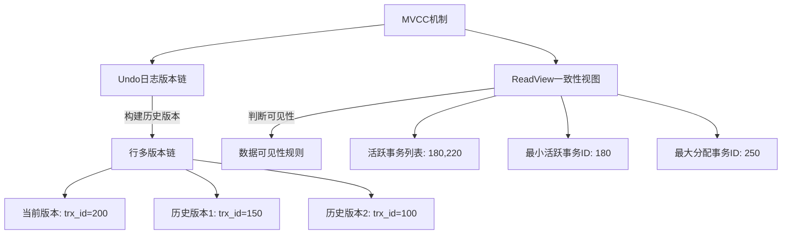

## MySQL 事务、锁、MVCC 与日志

### 事务
#### 事务的特性
ACID 特性以及通过怎样的方式来保证。
- 原子性：通过undo log(回滚日志)保证
- 一致性：通过其他三个特性来保证
- 隔离性：通过锁机制/MVCC(多版本并发控制)保证
- 持久性：通过 redo log(重做日志)保证

#### 事务的隔离级别
1. 读未提交（read uncommitted），指一个事务还没提交时，它做的变更就能被其他事务看到；
2. 读提交（read committed），指一个事务提交之后，它做的变更才能被其他事务看到；
3. 可重复读（repeatable read），指一个事务执行过程中看到的数据，一直跟这个事务启动时看到的数据是一致的，MySQL InnoDB 引擎的默认隔离级别；
4. 串行化（serializable ）；会对记录加上读写锁，在多个事务对这条记录进行读写操作时，如果发生了读写冲突的时候，后访问的事务必须等前一个事务执行完成，才能继续执行；

>一般来讲，使用可重复读(**默认**)就可以很大程度上避免幻读的问题了(但是还是可能出现)，串行化隔离级别，对性能会有影响，主要是通过下面两个方式**基本**解决幻读问题：
>1. 对于普通的 select 语句(快照读)，通过 MVCC 解决了幻读
>2. 对于 select...for update 语句(当前读)，通过 next-key lock(记录锁+间隙锁)解决幻读

实现方式：
- 对于「读未提交」隔离级别的事务来说，因为可以读到未提交事务修改的数据，所以直接读取最新的数据就好了；
- 对于「串行化」隔离级别的事务来说，通过加读写锁的方式来避免并行访问；
- 对于「读提交」和「可重复读」隔离级别的事务来说，它们是通过 Read View 来实现的，它们的区别在于创建 Read View 的时机不同，大家可以把 Read View 理解成一个数据快照，就像相机拍照那样，定格某一时刻的风景。**「读提交」隔离级别是在「每个语句执行前」都会重新生成一个 Read View，而「可重复读」隔离级别是「启动事务时」生成一个 Read View，然后整个事务期间都在用这个 Read View。**

MySQL 中开启事务的命令：
1. begin/start transaction：当执行了第一句 select 语句才算真正开启
2. start transaction with consistent snapshot：立即开启

#### 脏读/不可重复读/幻读问题

脏读：一个事务读到了另外一个**未提交的事务的数据**

不可重复读：同一个事务中多次读取同一个数据，出现**前后两次读到的数据不一样的情况**

幻读：同一个事务中多次查询某个符合查询条件的记录数量，出现**前后两次查询到的记录数量不一样的情况**

> [!example]
> - 脏读 eg:事务 A 读取金额 100，然后将金额修改为 200，与此同时事务 B 读取数据金额，这个时候读到的金额(200)即为脏读(后面事务 A 若触发回滚，事务 B 这个时候读到的金额仍然是 200)
> - 不可重复读 eg:事务 A 读取金额 100，事务 B 此时将金额修改为 200，事务 A 再次读取金额发现不一样了，即发生了**不可重复读现象**(在同一个事务中进行了重复读导致事务 A 在同一个事务中前后两次读取到的金额不同)
> - 幻读：即事务 A 在事务 B 读取数据个数之后，又插入了一条满足要求的数据，当事务 B 再次读的时候发现数据个数不一样了，即幻读
> 

#### MVCC（重）

Read View 在 MVCC 里如何工作的？
**Read View：**


在创建 Read View 后，将记录中的 `trx_id` 划分为这三种情况：


**这种通过「版本链」来控制并发事务访问同一个记录时的行为就叫 MVCC（多版本并发控制）。**

简单来说，MVCC 这条链路可以直接这样记：

- 行记录里会带上 `trx_id` 和 `roll_pointer`；
- `trx_id` 表示最后一次修改这行的事务 id；
- `roll_pointer` 会把当前版本指到上一个 `undo log` 版本；
- 因而一条记录会顺着 `undo log` 串成版本链；
- 快照读时，事务拿着自己的 `Read View` 沿着版本链往前找，直到找到自己能看到的那一版。

从苹果备忘录里补几个最容易被追问的点：

- `undo log` 不只是给回滚用的，也是 MVCC 历史版本真正的来源。
- 对于 `delete`，InnoDB 不是立刻物理删除，而是先打删除标记，后续再由 `purge` 线程清理。
- 对于 `update`：
  - 如果更新的是主键列，本质上更接近“删旧行 + 插新行”；
  - 如果更新的是普通列，则在 `undo log` 里记录旧值，回滚或快照读都能沿版本链拿到历史版本。
- `undo page` 自己也会进 `Buffer Pool`，真正的持久化仍然要靠 `redo log` 兜底。

> [!TIP]
> 这块最稳的答法不是一上来背术语，而是把这条链讲顺：
> `当前行 -> trx_id / roll_pointer -> undo log 旧版本 -> Read View 判断可见性 -> 找到事务可见版本`。

##### Read View 的可见性判断

- `trx_id < min_trx_id`：生成快照时，这个事务已经提交了，当前版本可见。
- `trx_id >= max_trx_id`：这是快照之后才分配的事务，当前版本不可见，要往前找旧版本。
- `min_trx_id <= trx_id < max_trx_id`：
  - 如果 `trx_id` 在活跃事务列表里，说明它创建快照时还没提交，不可见；
  - 否则说明已经提交，可见。

##### **MVCC 是如何实现已提交/可重复读的？**
对于读已提交：
- 每次执行 SELECT 语句时都会重新生成一个 Read View。

对于可重复读：
- 在事务启动时（第一次 SELECT 或 BEGIN 时）生成一个 Read View，并且该 Read View 在整个事务的生命周期内都有效，不再重新生成。

##### **哪种情况下 MVCC 不能完全避免幻读？**

```sql
## 事务 A-----------------
mysql> begin;
Query OK, 0 rows affected (0.00 sec)

mysql> select * from t_stu where id = 5;
Empty set (0.01 sec)

## 事务 B-----------------
mysql> begin;
Query OK, 0 rows affected (0.00 sec)

mysql> insert into t_stu values(5, '小美', 18);
Query OK, 1 row affected (0.00 sec)

mysql> commit;
Query OK, 0 rows affected (0.00 sec)

## 事务 A-----------------
mysql> update t_stu set name = '小林coding' where id = 5;
Query OK, 1 row affected (0.01 sec)
Rows matched: 1  Changed: 1  Warnings: 0

mysql> select * from t_stu where id = 5;
+----+--------------+------+
| id | name         | age  |
+----+--------------+------+
|  5 | 小林coding   |   18 |
+----+--------------+------+
1 row in set (0.00 sec)
```

**Attention**：主要还是因为 MVCC 只支持 select，所以对于有 update 的情况也束手无策...

**不过可以通过 MVCC+next-key-lock 来彻底解决幻读！**

InnoDB 存储引擎在 RR 级别下通过 MVCC 和 Next-key Lock 来解决幻读问题：

1、执行普通 select，此时会以 MVCC 快照读的方式读取数据

在快照读的情况下，RR 隔离级别只会在事务开启后的第一次查询生成 Read View ，并使用至事务提交。所以在生成 Read View 之后其它事务所做的更新、插入记录版本对当前事务并不可见，实现了可重复读和防止快照读下的 “幻读”

2、执行 select...for update/lock in share mode、insert、update、delete 等当前读

在当前读下，读取的都是最新的数据，如果其它事务有插入新的记录，并且刚好在当前事务查询范围内，就会产生幻读！InnoDB 使用 Next-key Lock 来防止这种情况。当执行当前读时，会锁定读取到的记录的同时，锁定它们的间隙，防止其它事务在查询范围内插入数据。只要我不让你插入，就不会发生幻读



### 锁机制

- 全局锁
- 表级锁
	- 表锁
	- 元数据锁
	- 意向锁
	- AUTO-INC 锁
- 行级锁
	- Record Lock：锁住单个点
	- Gap Lock：开区间
	- Next-Key-Lock：间隙锁+记录锁的结合(似乎通常是左开右闭的形式)
	- 插入意向锁

>我记得之前的 gemini 解释的不错的

#### 使用场景
下面这块直接把苹果备忘录里的锁记录补回来，重点就是：**不同索引 + 等值/范围查询，Record Lock / Gap Lock / Next-Key Lock 到底怎么落。**

先记一个观察锁的语句：

```sql
select * from performance_schema.data_locks\G;
```

- **唯一索引等值查询**
  - 记录存在：`next-key lock` 会退化为 `record lock`。
  - 记录不存在：会退化为 `gap lock`，因为锁是加在索引上的，不存在的记录本身没法加记录锁。
- **唯一索引范围查询**
  - `id > target`：按 `(target, next]` 这种 next-key 区间一路往右扫，最后一段会到 `(last, +∞]`。
  - `id >= target`：命中的起点可能先退化为记录锁，后续区间仍然按范围锁。
  - `id < target` / `id <= target`：重点看右边界是否已经越过查询上界；一旦越界，末段经常会退化成 gap lock，因为真正要防的是区间内插入造成的幻读。
- **非唯一索引等值查询**
  - 这时通常不只锁命中的记录，还要补 gap / next-key。
  - 典型原因是：如果只锁住当前命中的那几行，同样索引值但不同主键的新记录仍然可以插进来，下一次查询结果就变了。
  - 备忘录里的 `age = 22 for update` 就能看到 `(21,22]` 的 next-key、`(22,39)` 的 gap，以及命中行对应主键记录锁这种组合。
- **非唯一索引范围查询**
  - `next-key lock` 一般不会轻易退化，核心目标就是保证“按这个范围再查一次，结果集不能变”。
- **没有索引的查询**
  - 直接走全表扫描，沿途记录都会被加锁，`update/delete` 也一样，所以这类语句既慢，又容易把锁范围放大。

#### 死锁补充

苹果备忘录里提到的那个死锁例子，本质上就是：**间隙锁和插入意向锁之间的冲突**。

- `gap lock` 和 `gap lock` 本身并不冲突；
- 但两个事务都先拿到某段区间的 gap lock 后，再各自往这个区间里插入数据，就会去申请 `insert intention lock`；
- 而插入意向锁会和对方持有的 gap lock 冲突，于是双方互相等，形成死锁。

所以这题别只背一句“死锁了”，更该讲清楚：

- 为什么查询阶段能并存；
- 为什么一到插入阶段就互相卡住；
- 为什么 InnoDB 最后只能回滚其中一个事务。

### 日志
- redo log
- binlog
- undo log
- Buffer pool
- ...

>对于这个部分的内容，我觉得黑马的视频似乎不算差，可以看

#### undo log
- 插入一条数据：记录主键值，回滚的时候把这条插入删掉即可。
- 删除一条数据：先打删除标记，同时保留旧记录信息，回滚时把记录恢复；真正物理删除由 `purge` 线程处理。
- 更新一条记录：
  - 更新主键列，本质上更接近“删旧行 + 插新行”；
  - 更新普通列，则记录旧值，回滚时反向恢复。

**undo log 是逻辑日志**。

作用：
- 保证事务的原子性，实现事务回滚；
- 通过 `Read View + undo log` 实现 MVCC；
- 借助 `trx_id + roll_pointer` 把历史版本串成版本链。

> [!info] **undo log 是如何实现持久化的？**
> `undo page` 在 `Buffer Pool` 里被修改后，也会通过 `redo log` 保证持久化。

#### Buffer Pool
> 即缓存池。

InnoDB 引擎里真正扛读写性能的核心结构之一。

- 读取数据时，若数据已经在缓冲池，就直接从内存读；
- 修改数据时，先改内存页，并把该页标记为“脏页”；
- 脏页不会立刻刷盘，而是由后台线程在合适时机写回磁盘。

脏页刷盘的常见时机：

- `redo log` 快写满了；
- `Buffer Pool` 空间不足，要淘汰脏页；
- 后台线程定期刷盘；
- MySQL 正常关闭前，会把脏页尽量刷完。

Apple Notes 里这块还补了几个很容易被忽略的结构：

- **free 链表**：快速拿到空闲缓存页，不用遍历整片内存找。
- **flush 链表**：把脏页单独串起来，后台线程刷盘时能直接遍历。
- **LRU 链表**：管理冷热页。

而且 InnoDB 不是简单 LRU，还会把 LRU 分成 `young` / `old` 两段：

- 解决预读失效：预读进来的页先放在 `old` 区，别一上来就占住热点位置；
- 解决 Buffer Pool 污染：大范围扫描时，必须在 `old` 区待够时间，才有资格晋升到 `young`。

`Buffer Pool` 里不只是数据页，还包括：

- 数据页
- 索引页
- 插入缓存页
- undo 页
- 自适应哈希索引
- 锁信息

当查询一条记录的时候，并不是只把这一行拉进来，而是**整个页**进缓存，再通过页目录定位记录。

#### redo log
为了防止断电导致**数据丢失**，InnoDB 采用 WAL：

- 先更新内存页；
- 同时把页修改写成 `redo log`；
- 之后再在合适时机把脏页刷回磁盘。

**redo log 是物理日志**：它记录的是“哪个表空间、哪个页、哪个偏移量，被改成了什么”。

它最核心的价值有两个：

- 宕机恢复时，可以把已经提交但还没来得及刷盘的页重做出来；
- 给 `undo page`、数据页这些内存修改提供持久化保障。

和 `redo log` 配套经常一起被问的点：

- `redo log buffer`：先在内存里缓冲日志，减少频繁刷盘；
- `page cache`：操作系统层面的文件页缓存；
- `innodb_flush_log_at_trx_commit`：控制提交时刷盘策略。

#### binlog
`binlog` 属于 **MySQL Server 层**，而不是 InnoDB 层。

它是逻辑日志，常见用途：

- 主从复制；
- 数据恢复；
- 审计变更。

面试里通常答到这里就够：

- `redo log` 负责崩溃恢复、保障 InnoDB 持久性；
- `binlog` 负责把“这次变更做了什么”记录给 MySQL Server 层使用。

#### redo log 和 binlog 为什么要两阶段提交
如果只写其中一个日志就提交，会出现：

- `redo log` 有了、`binlog` 没有：主库恢复得回来，但主从复制会丢事务；
- `binlog` 有了、`redo log` 没有：从库可能看到了这次变更，但主库崩溃恢复后反而没这条数据。

所以 InnoDB 要走两阶段提交：

1. 先把 `redo log` 写到 `prepare` 状态；
2. 再写 `binlog`；
3. 最后把 `redo log` 标成 `commit`。

这样即使中途宕机，也能根据 `redo log + binlog` 的状态判断这个事务到底该不该恢复出来。

### 优化
- 读写分离
- 分库分表
  - 主从延迟的解决
  - 分库分表的触发条件
- 冷热分离
- SQL 性能优化
  - 日志的磁盘 IO 优化（见备忘录）
- 缓存机制

---

**主从延迟的三个时间点：**

| 时刻 | 事件 |
|---|---|
| T1 | 主库执行完事务，写入 binlog |
| T2 | 从库 I/O 线程接收到 binlog，写入 relay log |
| T3 | 从库 SQL 线程读取 relay log，同步数据到本地 |

**主从延迟解决方案：**

| 原因 | 解决方案 |
|---|---|
| 从库机器性能比主库差 | 选用同规格或更高规格机器；优化参数、增加缓存、使用 SSD |
| 从库读请求过多 | 引入缓存；一主多从分散读请求；将 binlog 接入 Hadoop / ES |
| 大事务 / 慢 SQL | 避免大批量修改，分批执行；优化慢 SQL |
| 从库数量太多 | 减少从库数量；采用层级同步（上层从库同步给下层） |
| 网络延迟 | 优化带宽、降低延迟、增加稳定性 |
| 单线程复制 | MySQL 5.6 引入多线程复制，5.7 进一步完善 |
| 复制模式 | 异步复制有延迟；全同步复制无延迟但性能差；半同步复制是折中方案（MySQL 5.5 插件形式支持，5.7 引入增强半同步） |

**分库分表的触发条件：**

决定分库分表的依据不是单纯的行数：

| 行大小 | 3 层 B+ 树能存储 |
|---|---|
| 行较大（接近页大小一半，约 8KB） | 一百多万条 |
| 行较小（仅几个 INT 字段） | 近 5 亿条 |
| 常规业务表（如博客表） | 约一千万条 |

真正的触发点是**性能出现瓶颈**——查询变慢、CPU/IO 过高，且确认为数据量过大导致索引效率下降。

**分片算法：**（待补充）

**冷热分离：**（待补充）

---

**SQL 性能优化：**

按点 → 线 → 面的思路展开：

**1. 定位慢 SQL：**
- 监控工具：慢查询日志、Performance Schema
- EXPLAIN 命令：分析查询计划、索引使用情况、全表扫描等

**2. 索引、表结构、SQL 优化：**

| 方向 | 要点 |
|---|---|
| 索引优化 | 创建原则、覆盖索引、最左前缀匹配 |
| 表结构优化 | 选择合适的字段类型、避免冗余字段、范式与反范式 |
| SQL 优化 | 避免 `SELECT *`、用具体字段、连接代替子查询、合理分页、批量操作 |

**3. 架构优化：**
- 读写分离：读写分离到不同实例，提升并发能力
- 分库分表：分散数据量，降低单表压力
- 冷热分离：冷数据存低成本介质，热数据存高性能存储
- 缓存机制：Redis 等，性价比极高

**4. 其他优化：**
- 连接池配置：合理的连接池大小和超时时间
- 硬件配置：高性能服务器、增加内存、SSD


