%%> [!note] 说明
> <% tp.file.cursor(1) %>%%


# MySQL的日志  
  
其实有很多种日志，但是对于面试中较为重要的有：  
- Bin log（属于MySQL）  
- Undo log  
- Redo log  
> 在我的印象中，似乎只有undo log和redo log是属于 InnoDB的，其他的则属于MySQL  
  
## Undo log - InnoDB  
> 其实这里还不算给出的很具体，具体可以看JavaGuide的文章，现在先了解到这里  

主要的作用：  
1. 对MySQL的事务起到回滚的作用，用于**实现事务的原子性**  
2. 用于和ReadView一起**实现MVCC机制**  
  
### 如何进行回滚  
对于回滚的时候，其实算是比较符合我们的直觉的：  
- 对于插入，删除，更新操作，分别按照我们的“直觉”进行阐述即可  
- 对于delete操作，实际上不会立即删除，而是标记上删除，最终的删除是由**purge线程**进行的  
- 对于update操作：  
    - 若操作对象为主键列，则先删除该行，然后再插入目标行  
    - 若不是主键列，则反向记录（即记录原来的行）即可  
  
对于每一次更新操作产生的undo log格式都有一个roll_pointer & trx_id，即：  
- 通过事务id可以知道是被哪个事务更改的  
- 通过回滚指针可以将这些undo log串成一个链表，以形成一个**版本链**  
  
### 对于MVCC机制可以看MySQL的锁相关：  
- RC：每次查询都生成一个新的快照  
- RR：每个事务都生成一个新的快照  
> 至于MVCC机制需要进行复习  
  
  
### 对于undo log的持久化：  
undo log 的持久化策略和数据页相同，都通过redo log 来保证持久化。  
  
> 对于buffer pool中的undo log页的修改会记录到redo log，**redo log（下文会进行具体阐述）**通过自身的机制来进行刷盘  
  
## Buffer Pool - InnoDB  
> 即缓存池：将修改后的记录缓存起来，以直接读取缓存中的记录，这样就不需要去磁盘中读取了，以用于**提升数据库的读写性能**。  
  

- 读取数据：若数据存在于缓存池中，则直接读取，否则去磁盘中读取  
- 修改数据：若数据存在于缓存池中，则直接修改缓存池中数据所在的页，同时，将该页设置为「脏页」  
    - 为了磁盘IO，不会将脏页立即写入磁盘，而是由后台线程在合适时机写入磁盘  
  
### 脏页刷到磁盘的时机：  
* 当redo log满了自动触发脏页刷新  
* buffer pool空间不足，需要淘汰掉部分页，若为脏页，则需要先刷新到磁盘  
* 空闲时，后台线程定期将脏页刷新到磁盘  
* MySQL正常关闭之前，会将所有脏页都刷新到磁盘  
> 若出现有时SQL用时较长的情况，则可能是脏页刷新到磁盘带来了性能开销，导致数据库操作抖动（可以通过调大buffer pool或redo log空间大小）  
  
### Buffer Pool结构：  
同样以数据页为基本单位（默认16KB），在Buffer pool中的页则被称为**缓存页**  
  
对于缓存池中的页大概有：  
- 数据页，索引页，插入索引页，undo页，自适应哈希索引，锁信息  
    - 对于**undo 页**：记录的是对应的undo log  
    - 当查询一条记录的时候，InnoDB会讲整个页的数据加载到缓存池中，再通过数据页中的「页目录」定位具体记录  
  
> ++Q：Buffer Pool中的undo页是undo log存储的主要位置吗？还有没有其他位置存储呢？++  

默认配置下buffer pool为128MB的向操作系统申请的一片连续空间（可以通过innodb_buffer_pool_size调整）  
  
为了更好管理缓存页，缓冲池为每个缓存页都创建了一个**控制块**（包括表空间，页号，地址，链表节点等）：  
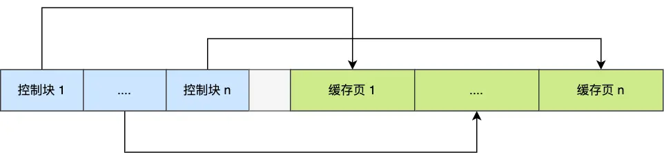  
中间空闲的位置为碎片空间（即不够一对**控制块+缓存页**的空间）  
  
那么问题来了：我们**如何快速找到空闲的页呢**？总不能遍历整个内存空间来找到空闲的缓存页吧（效率很低）  
所以使用的是**Free链表**结构：  
  
有了free链表，则每需要加载一个页到缓存池中时，就从这个链表中取一个空闲的缓存页将该缓存页信息填上，然后从链表中移除（因为这个缓存页已经不再「空闲」）  
  
问题又来了，如何**快速找到脏页**呢？  
为了快速知道哪些页是脏页，使用flush链表：  
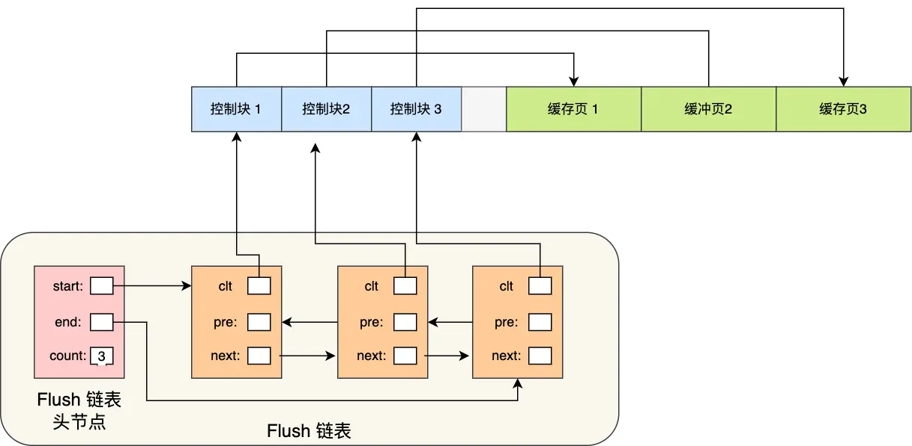  
和free链表结构类似，后台线程可以直接遍历这个链表来将脏页写入磁盘  
  
### 如何提高缓存命中率？  
对于缓存池大小是有限的，那么如何尽可能的**提高缓存命中率呢？**  
* 容易想到**LRU**算法&不是简单的LRU  
    * 对于简答的LRU算法无法避免：  
        * **预读失效：**即根据空间局部性，为了减少磁盘IO，会将相邻的数据页加载进来，但**被提前加载的数据页并没有被访问。**这样就可能导致一直未被访问的页在LRU链表前排，频繁使用的却被淘汰  
            * 解决：让预读的页停留时间尽可能短，真正被访问才移动到头部，让真正被访问的热数据停留时间尽可能长  
            * 将LRU分为old和young区域：预读的页加入old区域的头部，真正被访问则加入到young区域头部（old：young比例可以通过innodb_old_blocks_pct进行设置）  
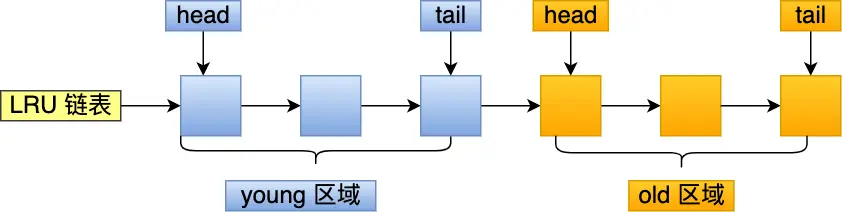  
        * **Buffer Pool污染：**由于buffer pool空间有限，当一个SQL语句扫描了大量数据是，可能将buffer pool的所有页都替换出去，当热点数据再次访问时，缓存无法命中，又会产生**大量磁盘IO**  
            * 解决：提高进入young区域都门槛即可保证young区域都数据不会被替换  
            * 当某个old区域缓存页进行第一次访问时：进入young区域需要判断在old区域停留的时间，当停留时间达到某个值（默认innodb_old_blocks_time=1000ms），才能移动到young的头部，即条件：「被访问」+「在old区域停留超过1s」  
            * MySQL对于young区域前1/4被访问不会移动到链表头部，只有后3/4倍访问了才会移动  
* buffer pool有三种页和链表来进行管理：  
    * free page：位于free链表  
    * clean page：位于LRU链表  
    * dirty page：同时存在于LRU链表和flush链表  
  
  
## Redo log - InnoDB  
> 主要是为了实现事务的持久性（感觉做的工作都是在为了「刷盘」而服务）  
  

「WSL」：MySQL的写操作并不是立即写到磁盘中，而是先写日志，然后在适当的时间写入到磁盘  
  
通过redo log+WAL可以保证即使数据库发生异常，已经提交的事务都不会丢失即奔溃恢复（crash-safe）  
  
  
### redo log的具体内容：  
redo log是物理日志：即记录某个页面进行了什么修改（**对 XXX 表空间中的 YYY 数据页 ZZZ 偏移量的地方做了AAA 更新）**，执行一个事务会产生一条/多条物理日志  
  
### 一些常见问题：  
1. 对于redo log和undo log似乎都可以「恢复」数据库内容？那么区别是什么呢？  
> - undo log是对于某个事务出现问题/奔溃后可以进行**事务回滚，保证事务原子性（**即记录了事务修改前的数据状态**）**  
> 
> - redo log是对于**事务奔溃的恢复，以保证事务的持久性**（即记录的事务修改后的数据状态）  

2. redo log和数据都会写入磁盘，为什么要多此一举？  
> - 将写操作**从随机写变为顺序写**，提升了写入磁盘的性能  
> 
>     - 对于写入redo log都是追加操作（顺序写）  
> 
>     - 写入数据则需要先找到写入位置，再写入到磁盘（随机写）  
> 
> - 实现事务的持久化，即使MySQL拥有的奔溃恢复的能力  
  

3. **产生的redo log写入到磁盘流程？**  
redo log有自己的缓存——redo log buffer（默认16MB）：每产生一条redo log时，会先写入到这个缓存中，后续持久化到磁盘  
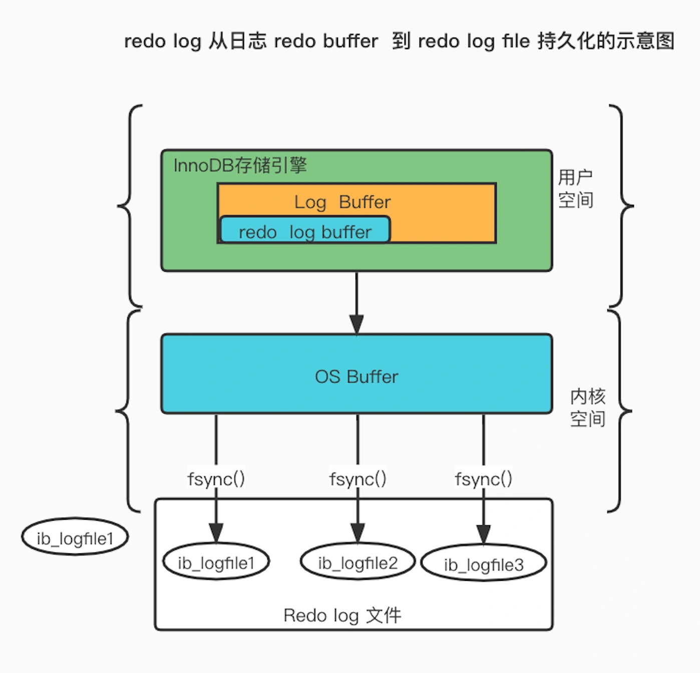  
  
4. **redo log 刷盘时机：**  
- MySQL正常关闭时  
- redo log buffer 中的记录写入量大于其内容空间的一半时  
- 后台线程每隔1s  
- 每次事务提交  
  
刷盘策略主要由  
```
innodb_flush_log_at_trx_commit 

```
参数决定：  
- 参数为0:不会主动触发写入磁盘操作  
- 参数为1:每次事务提交就持久化到磁盘  
- 参数为2:每次事务提交时，将redo log buffer中的redo log写入到了**Page Cache**中  
    - page cache为专门存储缓存文件数据的，为操作系统级别的缓存（即不在MySQL生命周期内）  
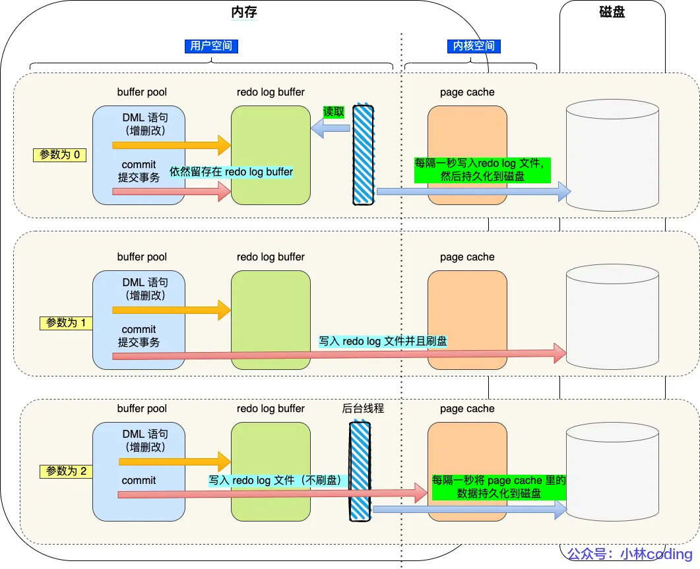  
  
  
### redo log 日志文件组&循环写  
重做日志文件组以**循环写**的方式工作。  
  
假设有两个文件：  
```
ib_logfile0 和 ib_logfile1

```
则是从头开始写，写到末尾就回到开头形成一个环形。  
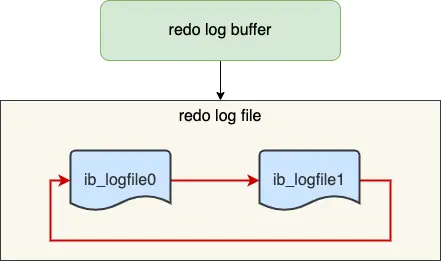  
  
当buffer pool中的脏页刷新到了磁盘中，则redo log中的记录也就没用了，这个时候就可以擦除这些记录以腾出空间  
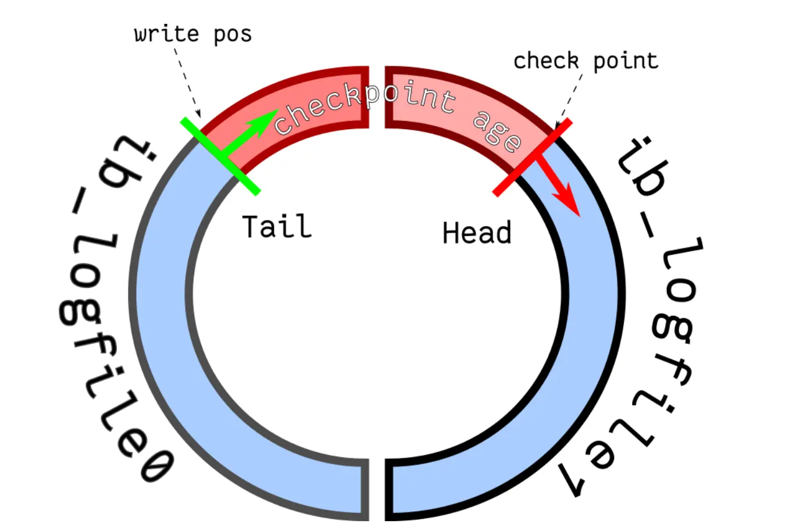  
- write pos表示当前写到的位置  
- checkpoint表示当前要擦除的位置  
- 红色部分为新的更新操作  
- 蓝色部分为待落盘的脏数据页记录  
> 若红色被填满了，则代表redo log填满了，此时不能再执行新的更新操作（即**MySQL会被阻塞**），以等待将buffer pool中的脏页刷新到磁盘中（标记哪些记录可以被擦除），等到对旧的redo log记录被擦除腾出了空间则checkpoint则会往后移动，恢复运行继续执行新的更新操作  
  
  
## Binlog - MySQL  
当MySQL完成一条更新操作的时候，会生成一条binlog，等到事务提交后会将所有binlog统一写入binlog文件  
  
记录的是所有数据库表结构变更/数据修改的日志（不会记录查询操作）  
  
  
  
### redo log和binlog的区别？为什么需要两个同时存在？  
  
1. binlog是MySQL的server层实现的日志，而redo log是InnoDB实现的日志  
2. 写入方式：redo log是循环写，空间大小固定；binlog是追加写，不会覆盖之前的日志，保存的是全量的日志  
3. 用途：redo log用于奔溃恢复；binlog用于备份恢复和主从复制  
4. 文件格式：redo log是物理日志（如上）；binlog则是三种格式类型：  
    1. statement（逻辑日志&**默认**）：每一条修改数据的SQL都会被记录到binlog中  
    2. row：记录最终被修改成什么样了（每行数据变化都会被记录，容易导致binlog文件过大）  
    3. mixed：前两个的混合模式：根据情况切换使用前两个方式的一个  
  
对于整个数据库被删除，可以使用redolog进行恢复吗？  
> 不能，由于redo log是循环写，大小固定，会边写入变擦除日志，只记录未被刷入磁盘的物理日志。  
>   
> 这里使用binlog，因为binlog保存的是全量的日志，保存了所有数据变更情况，只要记录在binlog上的数据都可以恢复，若整个数据库被删除了：都可以通过binlog恢复数据  
  

### 主从复制：  
详细过程：  
1. 写入binlog：主库收到客户端请求后，先写入binlog再提交事务，然后给客户端「操作成功」的响应  
2. 从库创建一个专门的IO线程连接主库的 log dump线程，以接收主库的binlog日志，再将binlog写入relay log中，然后返回主库「复制成功」的响应  
3. 从库创建一个用于回放的binlog线程去读relay log，然后回放binlog更新数据，从而实现主从数据一致性  
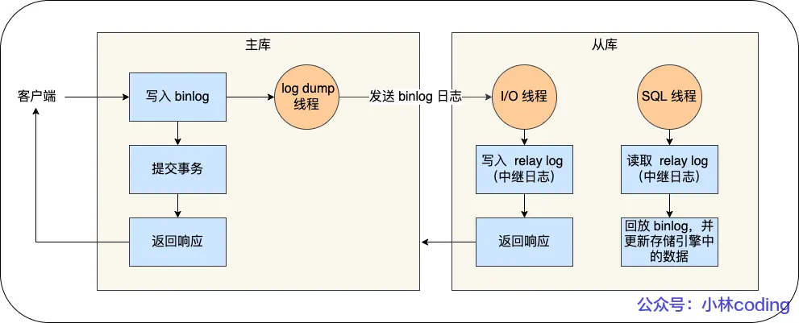  
  
有了主从结构，则可在写数据时写主库，读数据时读从库，即使是锁表/记录，也不会影响读请求的执行  
> 一般为1主2从1备主  
  

主从复制模式：  
1. 同步复制：主库提交事务需要等待所有从库复制成功的响应才返回客户端结果  
2. 异步复制（默认）：主库并不会等待binlog 同步到各个从库就返回结果，主库发生宕机则数据会发生丢失  
3. 半同步复制：即同步复制和异步复制之间，只要等待到一部分的成功响应即可（感觉很优）  
  
### binlog如何进行刷盘？  
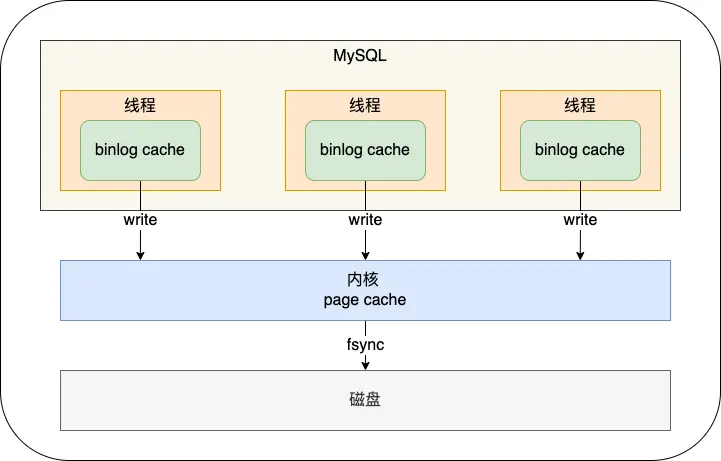  
执行事务过程中，先将日志写入到binlog cache（由参数binlog_cache_size大小决定）中，事务提交时，再将binlog cache写入到binlog文件中  
> 一个事务的binlog是不能被拆开的，否则破坏了事务的原子性  
  

由参数sync_binlog参数来控制数据库的binlog刷到磁盘的频率：  
- 0（默认）:每次事务都只write，不fsync，后续由操作系统决定何时持久化到磁盘  
- 1:每次提交事务都write，然后马上执行fsync  
- N（N>1）:每次提交事务都write，但积累N个事务才fsync  
  
## 两阶段提交  
对于binlog和redo log都需要持久化到磁盘中，但由于这两个日志的逻辑是分开的，所以可能出现一个成功一个失败（即半成功）的问题即**数据不一致的问题**。  
  
所以我们需要避免这样的问题，即保证这两个逻辑要么全成功，要么全失败（即**分布式事务一致性协议**）  
  
  
对于事务的提交分为了两个阶段：（**有点迷**）  
1. prepare 阶段：将XID（内部XA事务ID）写入redo log，同时将redo log的事务状态设置为prepare，将redo log持久化到磁盘中  
2. commit阶段：将XID写入binlog，然后将binlog持久化到磁盘，然后调用事务提交接口将redo log的状态设置为commit，这里的redo log主要write到page cache中即可，由于binlog写入磁盘成功，就算redo log状态是prepare仍然认为执行成功  
  
若出现了异常重启的问题，则重启后主要以**binlog是否成功写入**为事务提交成功的标识，若binlog成功写入，则能找到和redo log相同的XID  
  
  
上面的对于两阶段提交的描述都旨在解决redo log和binlog的「**半成功**」问题  
  
  
### 两阶段提交的问题：  
> 磁盘IO次数多：对于两阶段提交，默认使用的是「双1」配置（即参数为1），每次事务提交都会进行两次刷盘（redo log和binlog）  
  

双1:sync_binlog=1 && innodb_flush_at_trx_comnmit=1  
分别为每次事务提交将binlog cache中的binlog直接持久化到磁盘，每次事务提交时将缓存在redo log buffer 中的redo log持久化到磁盘。（即**两个日志分别到提交策略都为事务提交后刷盘，效率较低**）  
  
> 锁竞争激烈：两阶段提交能保证两个日志的内容一致，但在多事务的情况下却不能保证提交顺序一致，所以**需要一个锁来保证提交的原子性使得提交顺序一致**  
  

通过加锁能解决顺序一致性问题，但并发量较大的时候会导致对锁的争用，性能低下。（这里锁的生命周期为：拿到锁才能进入prepare阶段，commit阶段结束后才能释放锁）  
  
### binlog/redo log的组提交  
  
> binlog组提交：将多个binlog刷盘操作合并成一个，**从而减少磁盘IO次数**  
  

如将10个事务一次性一起刷盘则成本由 10减少到了趋近1  
  
针对binlog到组提交：将commit阶段拆分为三个部分：  
1. flush阶段：即多个事务按照进入到顺序将binlog从cache写入文件（但不刷盘）  
2. sync阶段：将binlog做fsync操作（即将多个事务的binlog合并一次刷盘）  
3. commit阶段：各个事务按照顺序做InnoDB的commit操作  
这样相对于上面的**两阶段加锁**的方式的优点在于：不再锁住提交事务的过程，锁的粒度变小了，使得多个阶段可以并发执行  
  
  
> redo log组提交：（MySQL5.7开始）在prepare阶段不再让事务执行将redo log刷盘的操作，而是延迟到**flush阶段**。通过延迟写的方式为redo log做了一次组写入  
  

（因为原来的redo log刷盘的时机为prepare阶段完成刷盘，所以这种情况下每个redo log是依次刷盘的，效率较低，而在redo log组提交，将redo log刷盘放到flush阶段，**将一组redo log一次刷盘**，则减少了磁盘IO的成本）  
  
### 总结一下组提交的每个过程  
  
**flush阶段：**  
```
1. 第一个到达的会成为leader，后来的成为follower
2. 获取事务组，由leader对redo log做一次write+fsync，即一次将本组redo log进行刷盘
3. 将这一组事务产生的binlog写入binlog文件（调用write，但不fsync）
>flush即用于支撑redo log的组提交


```
**sync阶段：**  
```
1. 这一组事务写入到binlog后并不会马上刷盘（fsync），而是等待一段时间（Binlog_group_commit_sync_delay），目的是为了等待尽可能多的事务能一起刷盘，但若在等待的过程中提前达到了Binlog_group_commit_sync_no_delay_count，则不用再等待，马上将binlog刷盘

>即sync阶段用于支持binlog的组提交

对于上面的两个参数，第一个参数代表等待N微妙，第二个代表等待的最大事务数

```
若在这一步完成后数据库奔溃，则binlog已经有了事务级了，MySQL重启时会通过redo log刷盘的数据继续进行事务提交  
  
**commit阶段：**  
调用引擎提交事务接口，将redo log状态设置为commit  
  
> 即承接sync阶段的事务，完成最后引擎的提交，使得sync可以尽快的处理下一组事务  
  
  
## MySQL磁盘IO过高的优化方式：  
控制参数：  
1. 控制提交的两个参数来延迟刷盘世纪，尽可能减少刷盘次数（但可能增加响应时间）  
```
binlog_group_commit_sync_delay 和 binlog_group_commit_sync_no_delay_count

```
2. 控制参数：  
```
Sync_binlog设置为大于1的数：即每次提交都write，但积累N个事务后才fsync，延迟了binlog刷盘的时机（但当主机挂了后会丢失N个事务的binlog日志）

```
3. 控制参数：  
```
innodb_flush_log_at_trx_commit设置为2:每次提交时write但不fsync（主机挂掉会导致丢数据）

```
  
> **现在尝试复盘一下 一条「update」语句的执行具体流程？**  

# 关于 MySQL 的锁机制：如何加锁？  
  
> 对于唯一索引相关的已经看过了，之后可以再总结一下！  
  
> 我们可以通过 select * from performance_schema.data_locks\G; 这条语句，查看事务执行 SQL 过程中加了什么锁。  
  
## 对于唯一索引的等值查询：  
  
```
mysql> select * from user where id = 1 for update;

```
若记录存在：会退化为记录锁  
  
  
```
mysql> select * from user where id = 2 for update;

```
若记录不存在：会退化为间隙锁  
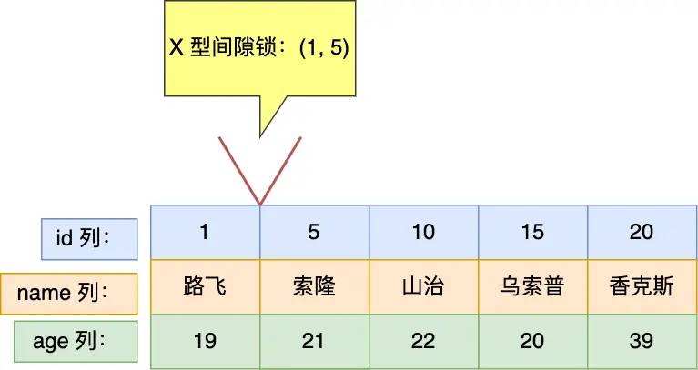  
  
  
  
  
## 对于唯一索引的范围查询*：  
```
mysql> select * from user where id > 15 for update;

```
对于大于操作：  
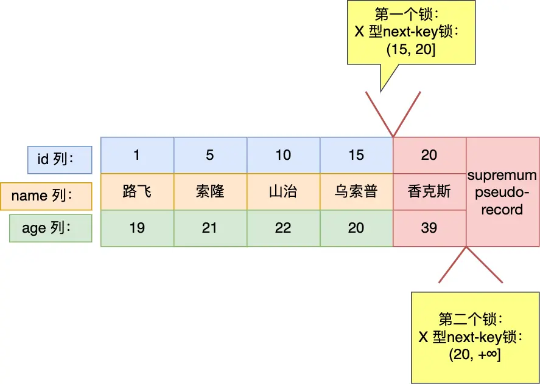  
```
mysql> select * from user where id >= 15 for update;

```
对于大于等于操作：  
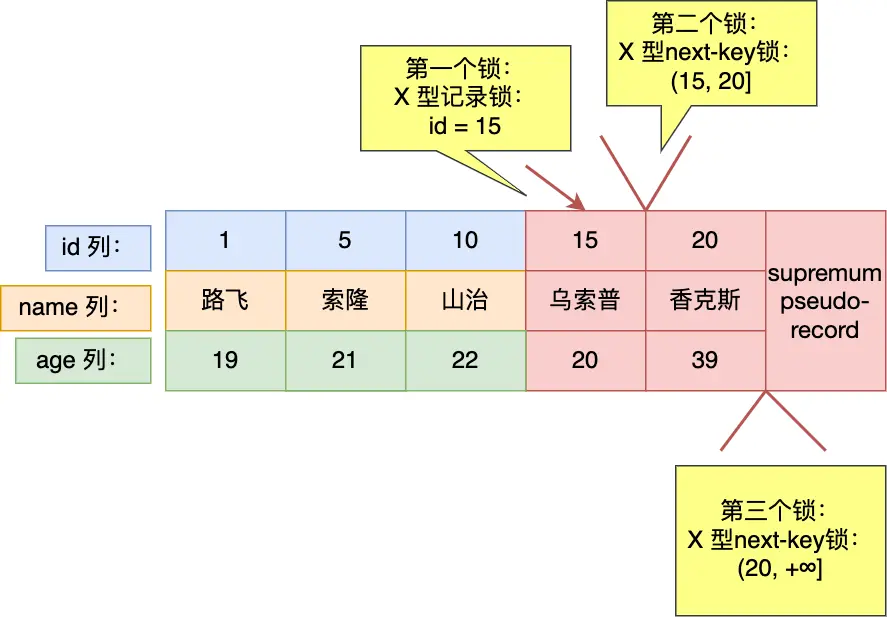  
  
```
mysql> select * from user where id < 6 for update;

```
对于小于操作：  
- 若查询的值不存在于表中（即这里）  
- 若查询的值存在于表中（即 id<5 的查询），则和这里不同为：（-∞，5）  
    - 个人感觉是 5 已经不在这个范围内了，**不予考虑**  
> 这里我其实觉得是可以优化的一个点：id<target 和数据库中相差 1 的时候可以直接不考虑右边部分，但 MySQL 仍然考虑了  

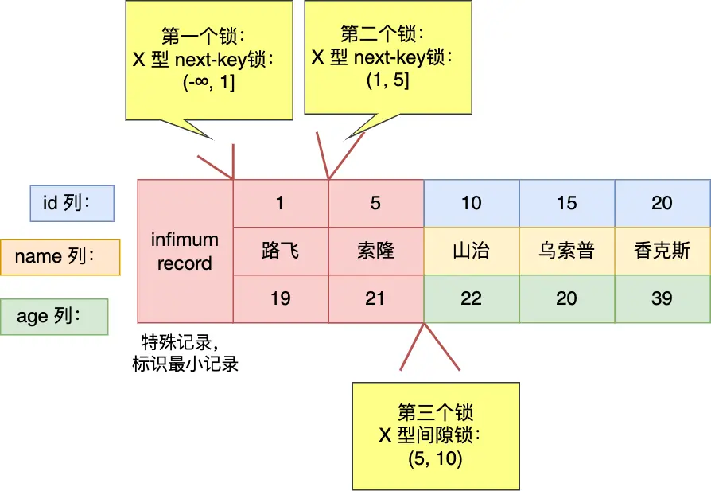  
  
```
mysql> select * from user where id <= 5 for update;

```
  
> ==疑问：为什么这里的 5 不是加记录锁？而上面的又加了记录锁？==  

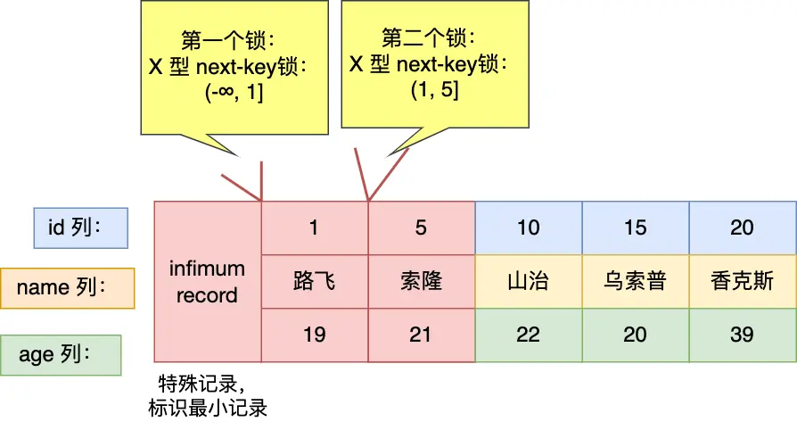  
  
  
  
  
## 对于非唯一索引的等值查询：  
```
select * from user where age = 25 for update;

```
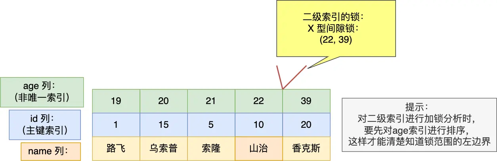  
  
对于这里的查询，加**间隙锁：（22，39）**  
**对于边界是否能插入取决于主键值！**（即之间则阻塞，否则成功）  
对于边界 22  
- 若插入的是 22,3，则可以执行成功  
- 若插入的是 22,12，则会被阻塞  
对于边界 39(和 22 的相反)  
- 插入 39,3，则被阻塞  
- 插入 39,12，则成功  
```
mysql> select * from user where age = 22 for update;

```
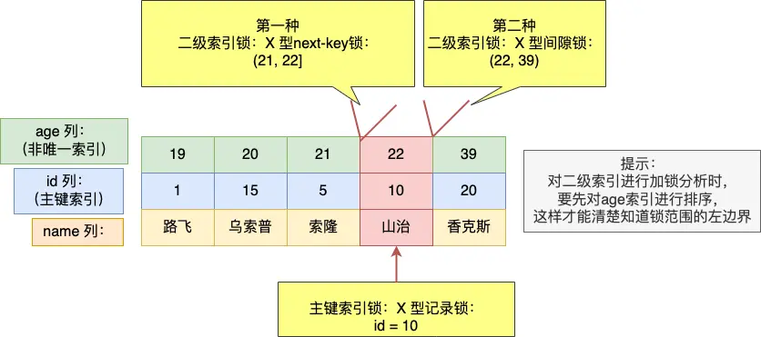  
  
这里加了三个锁:（**其实也可以看作是合并的区间**）  
- next-key lock:(21,22]  
- 间隙锁: (22,39)  
- 主键记录锁：id=10  
  
这里同样需要注意的是**边界问题！**  
  
**对于这里加在两个二级索引上的 X 锁：**  
- 对于临键锁  
    - 若在此期间插入的值在区间之间（这里的之间指的是二级索引和主键的结合），则被阻塞，否则在这里插入成功（当然，这里还需要考虑是否被其他条件冲突）  
    - 如这里若插入 22,12，这个地方满足要求，但是还有间隙锁的束缚，所以仍然无法插入成功  
- 对于间隙锁  
    - **同上一个问题，不过需要综合考虑**  
  
**为什么这里需要加一个间隙锁？不加能不能保证幻读？**  
  
不加无法保证幻读，本来加入的 next-key lock 区间为（21,22]，那么若加入的是 22,12 则不在这个区间了！  
  
  
  
## 对于非唯一索引的范围查询：  
这里 next-key lock 不会退化！  
```
mysql> select * from user where age >= 22  for update;

```
  
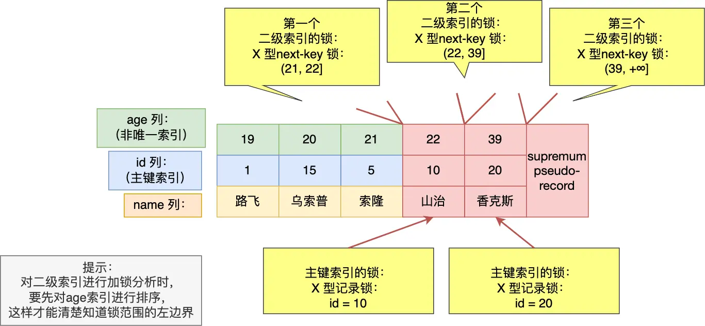  
  
  
个人感觉其实已经理解了，感觉可以这样理解：**本质**需要保证再次查询不会出现不一致的情况，所以我们要保证的就是这一点  
- 对于查找到的数据（二级索引），需要保证查找到的数据的相同数据对应的 id 不管是多少，都不能再次插入了！所以需要在两边都要“拖一点点”，即保证再次查询不会出现问题即可  
- 对于没有查找到的数据，则无需保证（虽然像是在说废话）  
  
  
## 对于没有加索引的查询：  
都没索引了，所以**直接走全表扫描**，每一条索引都会加 next-key lock，对于增删改操作都会被阻塞  
  
且对于 update，delete 语句也是一样走全表扫描  
  
所以尽量让语句走索引，不然是很慢的。  
  

## **MySQL 中的死锁问题**

**对于示例：**

数据库表：

```sql
CREATE TABLE `t_student` (
  `id` int NOT NULL,
  `no` varchar(255) DEFAULT NULL,
  `name` varchar(255) DEFAULT NULL,
  `age` int DEFAULT NULL,
  `score` int DEFAULT NULL,
  PRIMARY KEY ( `id` )
) ENGINE=InnoDB DEFAULT CHARSET=utf 8 mb 4;
```

插入数据：


启动两个事务：
  

  

这里其实就是关于间隙锁和插入意向锁的冲突问题。

（间隙锁和间隙锁不冲突，但是间隙锁和插入意向锁之间会有冲突）