# Redis常见面试题  
> Redis是一个开源的（BSD许可）的基于内存的数据库（读写速度非常快），常用于**缓存，消息队列，分布式锁**等场景  
  
> 
> 除此之外，Redis还支持事务，持久化，Lua脚本，集群，发布/订阅模式，内存淘汰模式，过期删除机制等  
  

**Redis和Memcached的区别？**  
共同点：  
* 都是基于内存的数据库，都可以作为缓存使用  
* 都有过期策略  
* 性能高  
不同点：  
* Memcached只支持key-value类型  
* Memcached无持久化机制  
* Memcasched无原生集群模式  
* Memcached不支持订阅模型，Lua脚本，事务等功能  
  
**为什么使用Redis作为MySQL的缓存？**  
因为Redis具备「高性能」+「高并发」特性  
> MySQL从磁盘中读取，Redis从内存中读取，Redis作为缓存之后可以大大提升性能  
  
> 
> Redis 的QPS远远大于MySQL，所以作为缓存可以阻挡大部分请求，直接到Redis就解决而不用经过MySQL  
  
## Redis的数据结构  
> Redis对数据结构的操作是原子性的，且是单线程负责，**不存在并发竞争问题**  

Redis的数据结构有：  
* String：缓存对象，常规计数，分布式锁，共享session信息  
* Hash：缓存对象，购物车  
* List：消息队列（但有问题的需要解决）  
* Set：聚合计算场景：如点赞，共同关注，抽奖活动  
* Zset：排序场景：如排行榜，电话，姓名排序  
* Bitmaps：二值状态统计场景：如签到，判断登陆状态，连续签到用户数  
* HyperLogLog：海量数据统计场景：如百万网页UV计数  
* GEO：存储地理位置信息场景  
* Stream：消息队列（相比List解决了问题）  


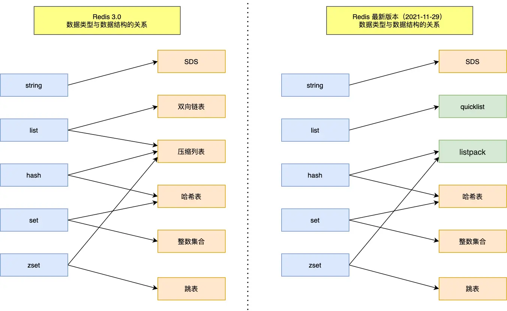  
  
### String  
主要由SDS（简单动态字符串）实现，相比c字符串：  
* SDS可以保存文本数据和**二进制数据**  
* SDS获取字符串长度为O（1）（len字段记录）  
* SDS API是安全的，字符串拼接不会造成缓冲区溢出（SDS在拼接字符串之前会检查空间是否满足要求，若不满足会扩容）  
  
### List  
由双向链表或压缩列表实现的  
  
* 若元素小于512个且每个元素值小于64字节则使用压缩列表  
* 否则使用双向链表  
**在Redis3.2之后List底层只由quicklist实现**  
  
### Hash  
由压缩列表或哈希表实现  
* 若元素小于512个且每个元素都小于64字节则使用压缩列表  
* 否则使用哈希表  
**在Redis7.0中压缩列表废弃，使用listpack实现**  
  
### Set  
由哈希表或整数集合实现  
* 若元素个数小于612个，使用整数集合  
* 否则使用哈希表  
  
### Zset  
由压缩列表或调表实现  
* 元素个数小于128个切每个元素小于64字节，则使用压缩列表  
* 否则使用跳表  
在Redis7.0中压缩列表废弃，使用listpack实现  

## Redis的线程模型  
> Redis是单线程吗？  

Redis的单线程指的是从接收请求到发送数据到客户端的过程由一个线程完成。  
  
但**Redis并不是单线程的**，Redis启动时会启动后台线程（BIO）  
* Redis2.6会启动2个后台线程：处理关闭文件，AOF刷盘  
* Redis4.0之后新增后台线程：用来异步释放Redis内存（即lazyfree线程）  
Redis之所以会为上面的任务单独创建线程处理是由于这些任务处理很耗时，如果交由主线程处理**容易发生阻塞**  
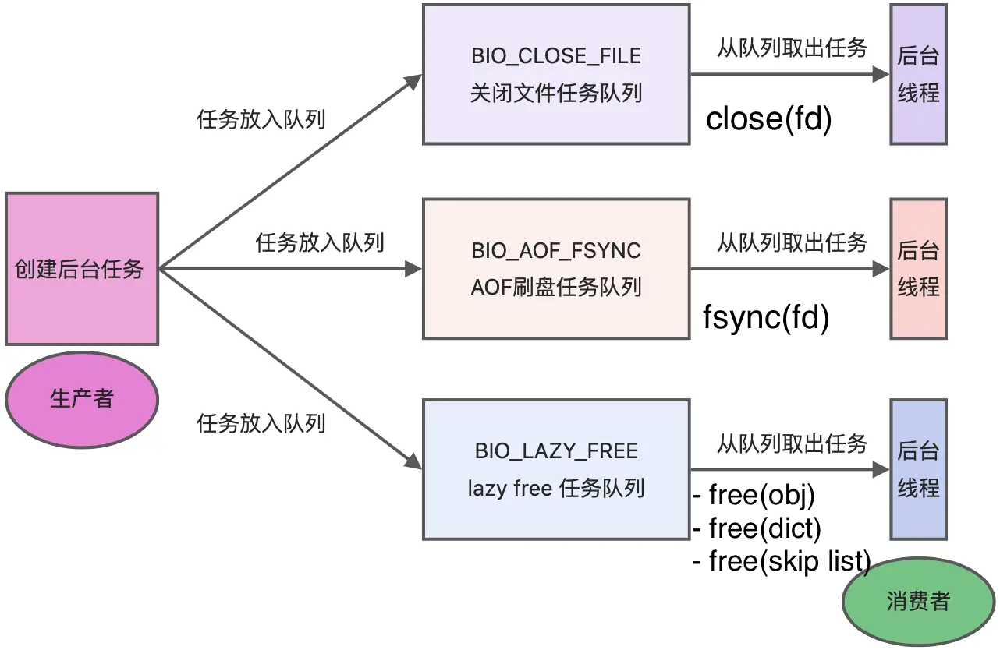  
如图，当对应任务队列有任务后，后台线程会调用对应的方式来进行处理  
  
### Redis6.0之前的单线程模型  
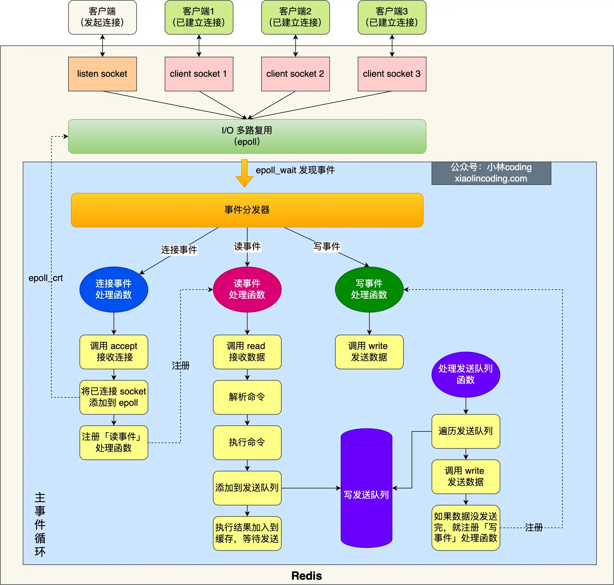  
### 初始化：  
* 调用epoll_create()创建epoll对象和调用soket（）创建一个服务端soket  
* 调用bind（）绑定端口，调用listen（）监听该soket  
* 调用epoll_ctl（）将listen soket加入该epoll，注册「**连接事件**」处理函数  
  
进入**事件循环函数：**  
* 先看「处理发送队列函数」的发送队列是否有任务，有则write发送数据，若这一轮没有发送完，则注册「写事件处理函数」等待epoll_wait发现后再处理  
* 调用epoll_wait等待事件：  
    * 连接事件  
    * 读事件  
    * 写事件  
  
### 为什么Redis采用单线程还这么快？  
> 也算是**Redis6.0之前为什么使用单线程的原因**  

单线程的Redis吞吐量可以达到10W/s  
* Redis大部分操作在内存中完成且有高效的数据结构（瓶颈为内存/网络带宽而非CPU）  
* Redis单线程避免了多线程之间的竞争，避免了多线程带来的性能开销（且避免了多线程带来的问题）  
* Redis采用I/O多路复用机制（一个线程处理多个IO流），即select/epoll机制  
    * 在redis单线程的情况下，多路复用可以存在多个监听soket和已经连接的soket，内核会一直监听这些请求（一旦有请求到达就交由Redis线程处理）  
  
### Redis6.0之后为什么引入了多线程？  
> 这里的「多线程」指的是多个IO线程来处理网络请求（Redis的性能瓶颈可能出现在网络IO处理上）  
  

对于网络IO采用多线程来处理，**但对于命令的执行仍然使用单线程！**  
  
在Redis6.0版本之后，Redis启动时默认额外创建6个线程：  
* Redis-server：主线程，执行命令  
* bio_close_file,bio_aof_fsync, bio_lazy_free:后台线程，具体阐述如上方  
* io_thd_1/2/3:3个IO线程，io-thread默认为4，会启动3个IO线程用于分担Redis网络IO压力  
  
## Redis的持久化  
> 即将数据存储在磁盘中（为了避免Redis重启后数据就会丢失的问题），Redis重启后就能从磁盘中恢复原有的数据  
  

三种持久化方式：  
* AOF日志  
* RDB快照  
* 混合持久化：即成AOF和RDB优点（Redis4.0）  
  
### AOF日志  
Redis执行完一条写操作命令后，就将命令以追加的方式写入日志文件  
  
但为什么不是先写入日志文件再执行命令呢？  
* 避免额外的检查开销：若当前的命令语法有问题，若不进行语法命令检查则在日志恢复数据时可能会出错  
* 不会阻塞当前命令的执行  
但可能带来数据丢失（在写入日志之前机子宕机了）和阻塞其他操作的风险（在将日志写入磁盘的时候会阻塞后续操作执行）  
  
  
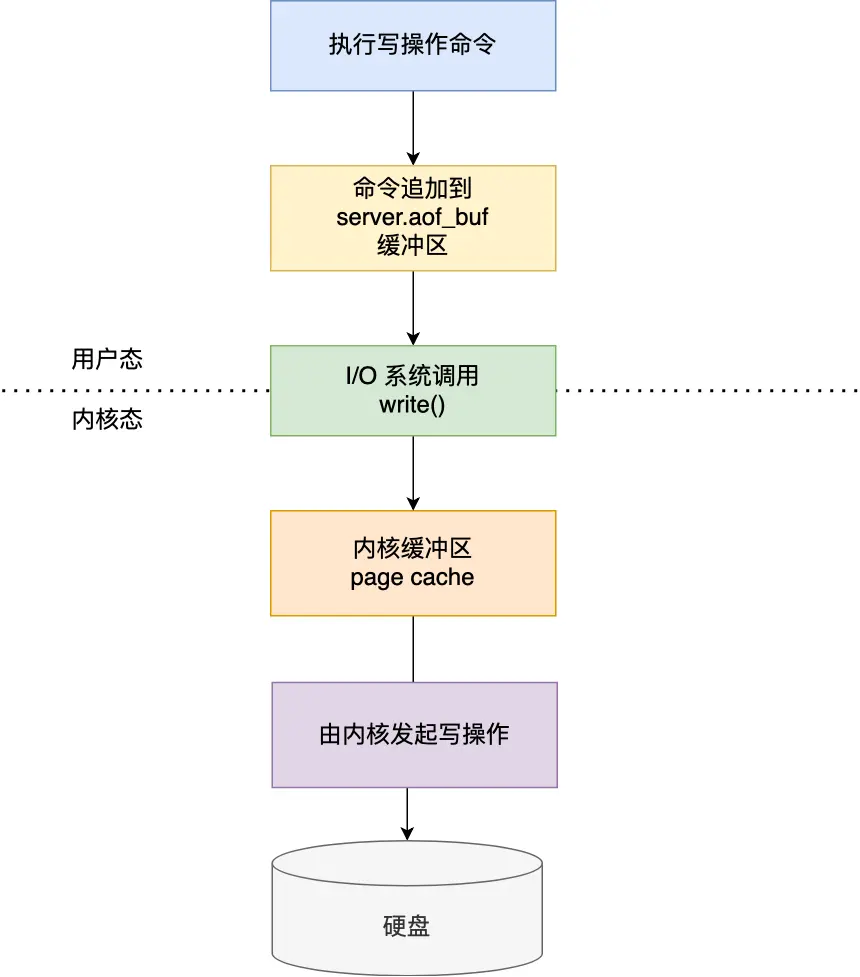  
AOF写回策略：  
* Always：每次写操作命令执行完后同步日志数据写回磁盘（性能开销大但可靠）  
* Everysec：每次写操作命令执行完，现将命令写入Page Cache，然后每隔一秒将缓冲区内容写入磁盘（宕机丢失1s数据，性能适中）  
* No：同样每次操作写入内核缓冲区，但由操作系统决定何时将缓冲区写入磁盘（宕机丢失数据可能比较多，但性能好）  
  
**若AOF日志过大，会有怎样的影响，如何解决？**  
当日志过大，则重启Redis后恢复数据过程缓慢（带来性能问题）  
  
为了解决这个问题，提供**AOF重写机制（压缩AOF文件）**，当AOF文件超过设置阈值后触发  
  
**如何压缩？**  
若执行过相同的命令，则读取最新的value即可，之前的命令则没有必要记录了。（将新AOF文件覆盖原AOF文件，起到了压缩作用）  
  
**如何完成？**  
使用后台**子进程***bgrewriteaof完成：*  
* 主进程可以继续处理请求，避免阻塞主线程  
* 若**使用线程**，多线程之间共享内存，在修改共享内存的时候需要通过加锁来保证数据的安全，这样降低了性能，当**使用了子进程**，共享了内存数据，但以只读的方式，当一方修改了共享内容会发生「写时复制」，父子进程有了独立的数据副本  
但根据上面一点说的：“修改共享内存后发生写时复制”，那么这个时候**也会发生内存数据不一致**，如何解决呢？  
Redis设置了一个AOF重写缓冲区（创建bgrewriteaof子进程创建后开始使用）  
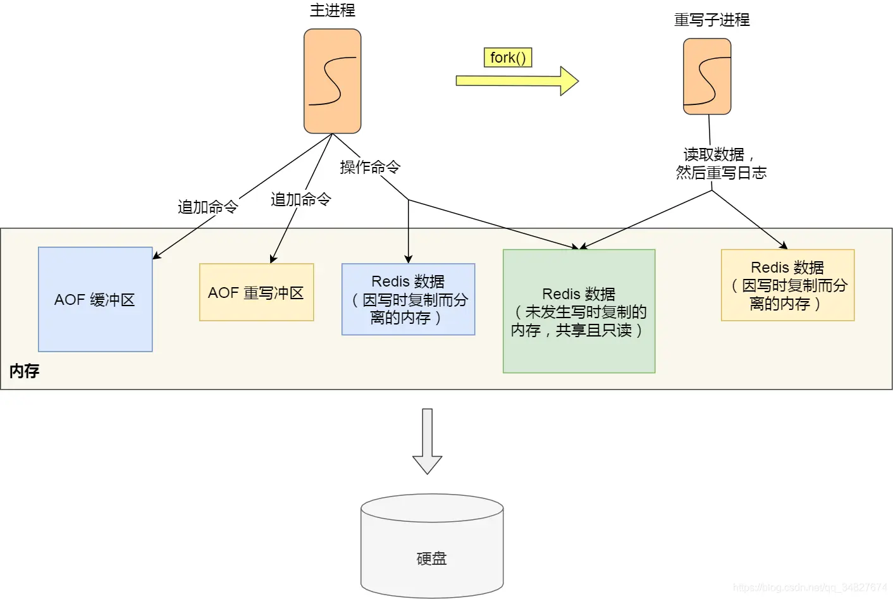  
在子进程执行AOF重写期间，主进程执行：  
* 执行客户端发来的命令  
* 将执行后的写命令追加到「AOF缓冲区」  
* 追加到「AOF重写缓冲区」  
当子进程完成AOF重写工作后，会向主进程异步发送一条信号  
  
主进程收到信号后，调用信号处理函数：  
* 将AOF重写缓冲区的所有内容追加到新AOF文件中，使得新旧文件数据库状态一致  
* 新AOF文件改名，覆盖现有的AOF文件  
执行完毕后，主线程继续处理命令。  
  
> 简单来说：  
> 
> 就是要解决对于写时复制时数据不一致的问题，那么这个地方通过：对于主线程先将命令写入缓冲区，然后当子进程完成重写工作之后，主进程将缓冲区内容追加到新AOF文件中，然后**覆盖现有的AOF文件**（即通过直接追加+覆盖的方式解决）  
  

### RDB快照  
即通过快照的方式恢复数据（快照记录的是实际数据，所以效率比AOF高，不需要额外执行操作命令来恢复数据），直接将RDB文件读入内存即可  
  
两种命令生成RDB文件：  
* save：在主线程生成RDB文件，若写入RDB文件事件太长，会阻塞主线程  
* bgsave：创建一个**子进程**来生成RDB文件，避免主线阻塞  
  
通过配置文件：  
```
#命令含义：second秒之内，对数据库进行了至少time次修改
save <second1> <times1>
save <second2> <times2>
...

```
来进行配置，只要满足了任意一个就会创建子进程生成RDB快照（bgsave）  
  
> Redis生成的快照为全量快照，将内容所有数据都记录到磁盘中，所以是比较重的操作，操作太频繁会对Redis的性能产生影响，频率太低，会导致宕机丢失的数据过多  
  
**RDB执行快照的过程中，数据能被修改吗？**  
可以，执行bgsave过程中可以修改数据在于「**写时复制技术」(**Copy-On-Write,COW**)**  
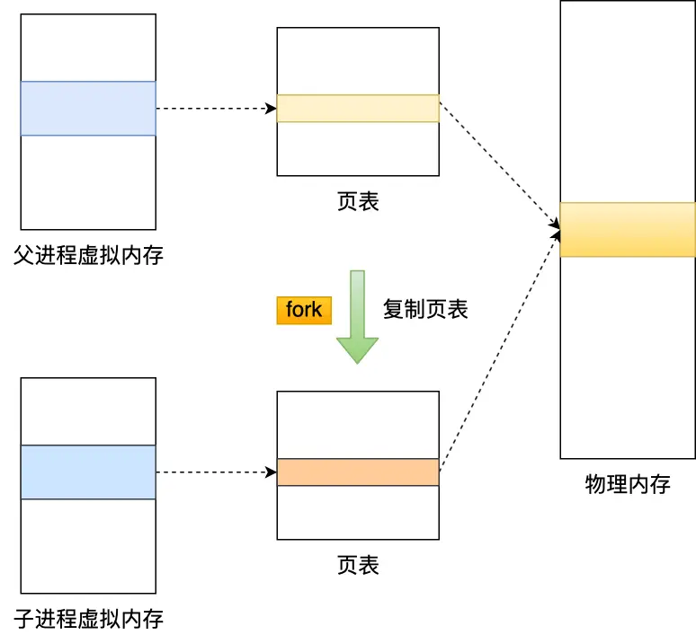  
执行读操作，主线程和bgsave子进程互相不影响  
  
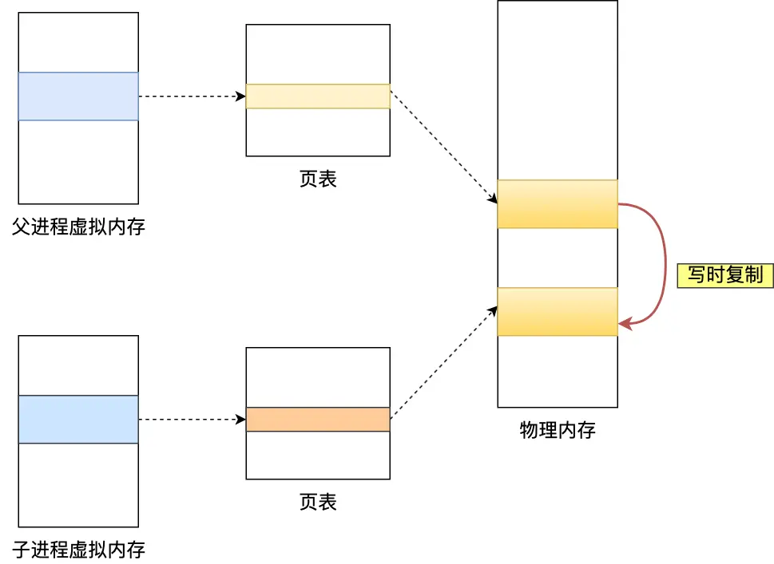  
若主线程执行写操作，被修改的数据会复制一份副本，然后bgsave会把副本数据写入RDB文件，主线程仍然可以直接修改原来的数据  
  
> Q：这个地方没看懂...  
  
### 混合持久化  
对于AOF：丢失数据少，但恢复数据慢  
对于RDB：恢复数据速度快，但快照的频率不好把握（太多影响性能，太少丢失数据多）  
  
Redis4.0提出混合持久化（即混合使用AOF日志和内存快照），既保证重启速度，又降低数据丢失风险  
  
使用了混合持久化，AOF文件前半部分为RDB格式的全量数据，后半部分为AOF格式的增量数据  
  
（这样重启的时候前面是RDB格式，加载速度快，然后加载AOF内容，即后台子进程重写AOF期间主线程处理的操作命令以丢失更少的数据）  
  
**优点：**结合了两种的优点，开头为RDB格式，使得Redis能更快启动，结合AOF的优点，丢失数据风险降低  
  
**缺点：**AOF文件可读性变得很差，且兼容性差，若开启后不能用于Redis4.0之前的版本  
  
  
## Redis集群  
  
### Redis如何实现服务「高可用」？  
从Redis的多服务节点来考虑：  
* 主从复制  
* 哨兵模式  
* 切片集群  
  
**主从复制：**  
即从前一台Redis如武器数据同步到多台服务器上（一主多从模式），且主从服务器之间采用「读写分离」方式  
  
从服务器一般是只读，接受主服务器同步过来的写操作命令，然后执行这个命令（即数据修改都在主服务器进行，同步给从服务器即可）  
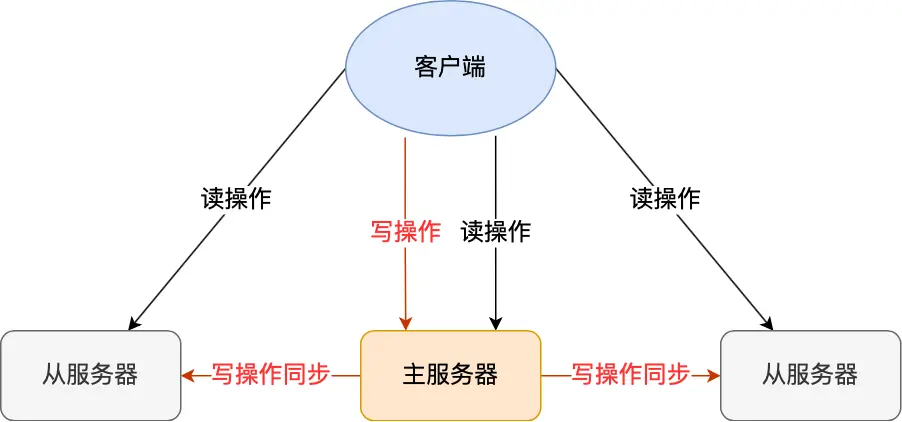  
  
这里使用的是异步的方式（当主服务器执行命令后就向客户端返回结果），无法实现强数据一致性。  
  
**第一次同步**  
使用命令replicaof（Redis5.0之前为slave  
of）形成主从关系，如：  
```
replica of <ip_a> <port_a>//b执行

```
这样b就成为了a的从服务器，然后开始第一次同步，包含三个阶段：  
* 建立连接，协商同步  
    * 从服务器执行从命令操作  
    *  发送给主服务器psync命令，包含两个参数：  
        * runID：随机ID唯一标识自己（默认「？」）  
        * offset：复制的进度（默认-1）  
            * 这里的offset即slave_repl_offset  
    * 主服务器收到psync，使用FULLRESYNC（全量复制）作为响应返回  
* 主服务器同步数据给从服务器  
    * 主服务器执行bgsave命令生成RDB文件  
    * 从服务器收到RDB文件后，先清空当前数据然后载入RDB文件（当然，由于这期间主服务器还可以接收命令，这样导致了数据不一致，所以：）  
    * 将下面时间间隙中收到的写操作命令写入replication buffer中：  
        * 主服务器生成RDB文件期间  
        * 主服务器发送RDB文件期间  
        * 从服务器加载RDB文件期间  
* 主服务器发送**新写命令**给从服务器  
    * 将replication buffer中记录的写操作命令发送给从服务器，从服务器执行其中的命令，这样数据就一致了  
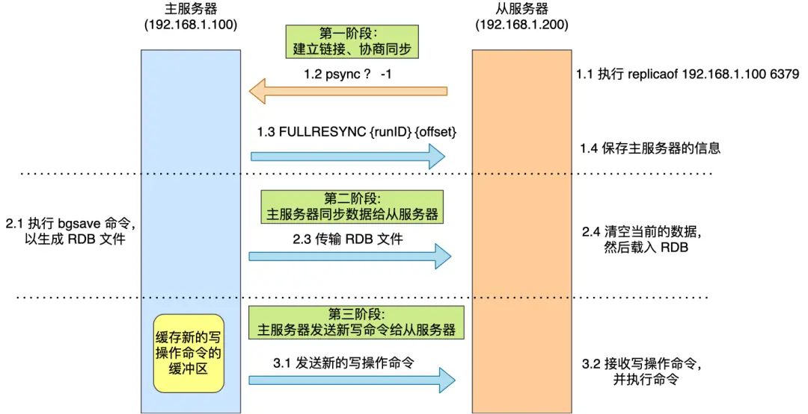  
  
**命令传播**  
完成第一次同步后，双方维护一个TCP连接（长连接）：这样后续主服务器可以通过这个连接继续将写操作传播给从服务器，然后从服务器执行命令以达到数据一致  
  
**分摊服务器压力**  
对于前面来看，在数据同步过程中，生成RDB文件和传输RDB文件很耗时，若从服务器的数量很多，则主服务器的同步开销会非常大（忙于fork创建子进程，fork时会阻塞主线程使得Redis无法正常处理请求）  
  
所以Redis中的从服务器「经理」也可以有自己的从服务器，这个从服务器可以接收主服务器的同步数据，也可以作为主服务器的形式将数据同步给从服务器：  
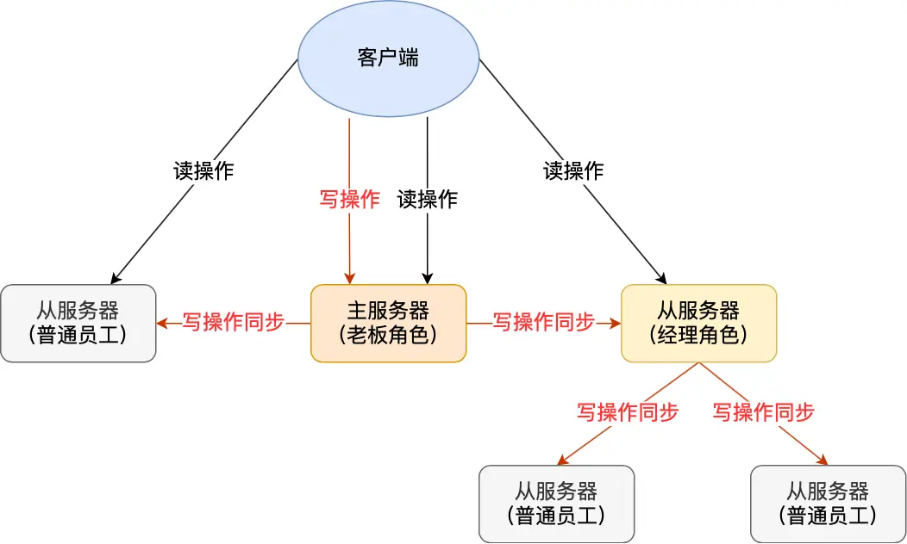  
**这样就可以分摊主服务器（生成/传输RDB文件）的压力**  
  
只需要使用replicaof <tar_ip> 6379作为目标服务器的从服务器，若目标服务器是从服务器则就是担任的「经理」的角色  
  
**增量复制**  
主从服务器完成第一次同步后，会基于长连接进行命令传播，若主从服务器网络断开了，则无法进行命令传播，这时数据不一致了，客户端从「从服务器」读到的可能为旧数据。  
  
若之后网络恢复正常，则应该如何进行数据同步呢？  
在Redis2.8之前，会进行全量复制，但开销太大，可以进行改进  
从Redis2.8开始，采用**增量复制**的方式进行继续同步（即只会将断开期间收到的写操作命令同步给从服务器）  
  
网络恢复后增量复制：  
* 从服务器恢复网络后，发送psync {runID}{offset}给主服务器  
* 主服务器收到命令，使用CONTINUE响应告诉从服务器使用增量复制同步数据  
* 主服务器将断线期间执行的写命令发送给从服务器，然后执行命令  
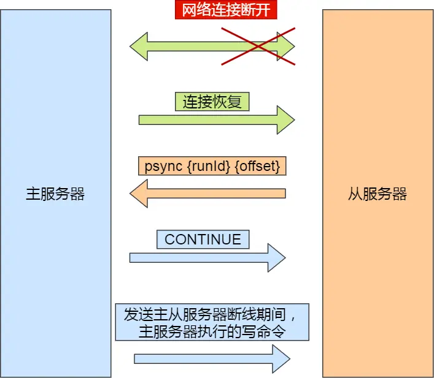  
  
主服务器如何知道将哪些增量数据发送给从服务器呢？  
* repl_backlog_buffer：环形缓冲区（默认1MB），用于主从服务器断开后，找到差异的数据  
* Replication offset：标记上面缓冲区同步进度，主从服务器分别通过（master/salve_repl_offset）记录自己「写/读」到的位置  
  
Repl_bakclog_buffer是什么时候写入？  
主服务器进行命令传播时会将写命令发送给从服务器和repl_backlog_buffer，所以这个缓冲区会存放最近传播的写命令  
当网络断开并重新连接上后，从服务器通过psync将自己的slave_repl_offset发送给主服务器，主服务器根据slave和master缓冲区之间的差距来决定使用哪种操作：  
* 若从服务器要读取的数据在repl_backlog_buffer中，则主服务器采用增量复制同步  
* 否则，采用全量复制进行同步  
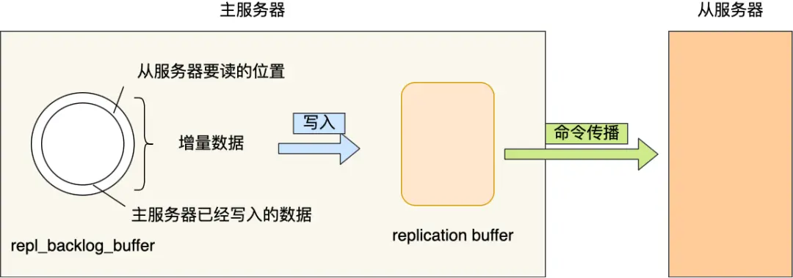  
  
由于repl_backlog_buffer为环形缓冲区，大小有限（默认1MB），当缓冲区写满之后，主服务器继续写入就会覆盖之前的数据，当主服务器写入速度远大于从服务器读的速度时，就到导致缓冲区一下子被覆盖，这样会导致**从服务器拿不到想读的数据**，于是就会采用全量同步，性能开销大  
  
所以为了避免主服务器频繁使用全量同步，可以调整环形缓冲区大小使得尽可能大，减少被覆盖的概率。这里缓冲区最小大小可以根据second*write_size_per_second进行估算（为了保险，最好再调大一点）：  
* second为从服务器断线后重新连接上主服务器的平均时间  
* write_size_per_second是主服务器平均每秒产生的写命令大小  
  
**对于主从复制：**  
* 【全量复制】第一次同步时采用全量复制（但生成/传输RDB太耗时，若从服务器太多可以考虑升级一些经理，分担主服务器压力）  
* 【命令传播】主从服务器维护长连接，主服务器接收写操作命令后通过这个连接传播给从服务器以保证数据一致  
* 【增量复制】若网络断开使用，和repl_backlog_size大小有关（如上）  
  
> Q：replication buffer，master/salve_repl_offset，repl_backlog_buffer分别到底代表什么？这里的buffer/offset和psync的参数offset有什么关系？  
> 
> A：这里确实非常容易搞混：  
> 
> * 对于relication buffer ：  
> 
>     * 生命周期在于主从服务器之间的连接，若断开连接，则这个缓冲区删除(replication buffer溢出会断开连接)  
> 
>     * **存在于从库中**，主要用于生成/发送/加载RDB文件过程中的写命令的发送  
> 
> * 对于repl_backlog_buffer:  
> 
>     * 环形缓冲区，**全局共享！**由一个char数组组成，内置几个变量：  
> 
>         * size（缓冲区总大小），buffer（写入偏移量master_repl_offset），hislen（有效数据长度）  
> 
>     * 对于网络断开的时期的写命令就是写入的这个缓冲区，（而不是replication buffer）  
> 
> * 对于master/slave_repl_offset ：  
> 
>     * master为主节点当前写入位置，slave为从节点最后确认的位置  
> 
>     * 64位整数类型  
```
这里容易有的一个误区是对环形缓冲区的结构：
1.环形缓冲区，idx指针，当前写入位置...都是全局唯一的，而对于slave_repl_offset才是对于每个从服务器都有的
2.从节点确认的变量：repl_ack_off：主节点记录的从节点进度（存储在主节点的client对象中），即从节点确认位置
而slave_repl_offset则是在「从节点本地的逻辑偏移量」，即从节点已经执行到的位置
3.对于master_repl_offset和repl_backlog_idx都是写入位置，有什么区别？前者是逻辑偏移量，后者是物理地址
>个人感觉较为复杂的过程需要一个「mermaid」图来进行详尽描述

```
  
**如何判定节点是否正常工作？**  
通过互相ping，如果一半以上节点ping一个节点没有响应，则认为挂掉了，会断开与其的连接  
* 主节点默认每隔10s（repl-ping-slave-period控制）发送ping命令，判断节点的存活和连接  
* 从节点默认每隔1s发送replconf ack{offset}命令，给主节点上报自身的复制偏移量  
    * 实时检测从节点状态  
    * 上报偏移量，检查数据是否丢失，若从节点丢失，则从主节点的复制缓冲区拉取丢失数据  
  
**哨兵模式：**  
哨兵机制：在Redis2.8之后支持**哨兵机制**，实现了主从节点故障转移，**监测**主节点是否存活，若发现主节点挂了，则**选举**一个从节点为主节点，并将新主节点信息**通知**给从节点和客户端  
  
**判断主节点是否故障：**  
主观下线：哨兵每隔1s给所有主从节点发送ping命令，当主从节点收到后发送响应给哨兵来判断是否正常运行。若主从节点没有在规定时间ms（down-after-ms）内响应，则标记为「主观下线」  
  
客观下线：当判断主节点为主观下线后，就会向其他哨兵发起命令，其他哨兵根据自身和主节点网络状况来作出赞成/拒绝的响应。若赞同票数达到quorum值（超过一半）后，主节点就会被标记为「客观下线」  
> 只针对于主节点（因为主节点可能是因为系统压力大/网络阻塞原因导致超时）。为了减少误判，使用多个节点部署成哨兵集群，通过多个节点一起判断以避免自身网络不佳误判的情况。  
  

**由哪个哨兵进行主从故障转移？**  
需要在哨兵集群中选举出一个leader来执行主从切换，对于选举leader需要进行**投票**  
  
判断主节点为「客观下线」的哨兵节点为**候选者**，即这个哨兵发送is-master-down-by-addr 命令使得赞成票数达到quorum值。当然，这样的候选者可能不止一个，这时每个候选者都会给自己投一票，然后向其他候选者发起投票请求，（投票者先收到谁的就投给谁），若拿到了**半数以上且达到quorum值**则成为leader（这里的leader为哨兵集群的leader，由他进行主从故障转移）  
> * 若哨兵故障个数达到了一半，则哨兵集群无法进行主从切换  
> 
> * 若哨兵故障个数使得可用个数小于quornm值，则无法判定主节点客观下线  
  

【所以哨兵个数应该设置为奇数且quorum=N/2+1】  
  
> **那么哨兵集群是如何组成的？**  
> 
> 通过命令：`sentinel monitor <master-name> <ip> <redis-port> <quorm>`即可组成集群。他们彼此之间通过Redis的「发布者/订阅者」机制相互发现。  

```
主从集群中，主节点有一个名为__sentinel__:hello频道，使得哨兵之间可以互相发现实现互相通信。

哨兵将自己的ip+端口发布到这个频道，然后其他哨兵订阅这个频道，则这个哨兵和其它哨兵建立了网络连接（其他哨兵执行相同操作则可以互相建立连接）

```

> 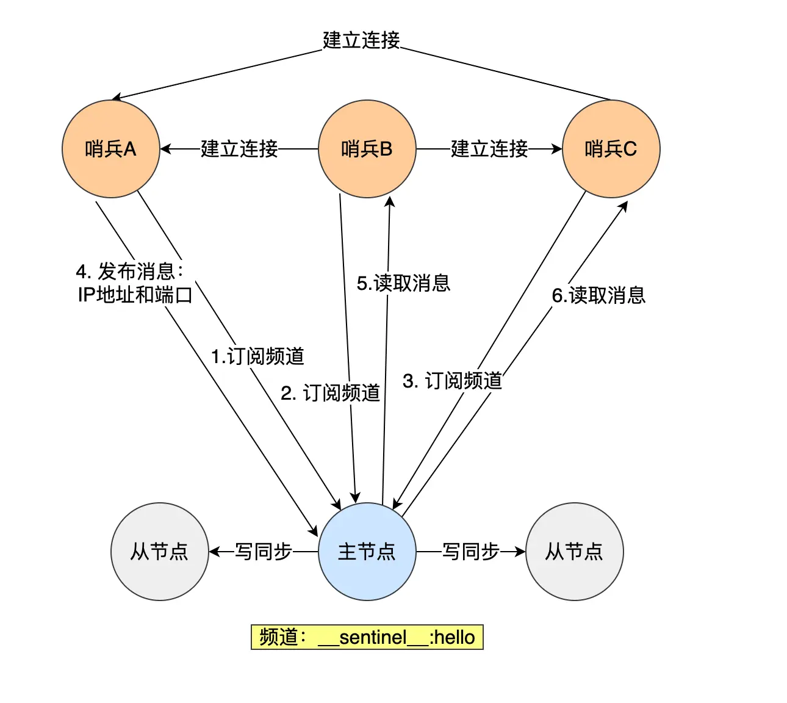  
  
> 
> 那么新问题又来了：**哨兵集群如何监控「从节点」信息呢**？  
> 
> 主节点知道所有从节点的信息，哨兵每10s发送一次INFO命令来获取所有从节点的信息。主节点将从节点列表返回给哨兵，然后哨兵就可以根据列表中的连接信息和每个从节点建立连接进行监控。  
> 
> 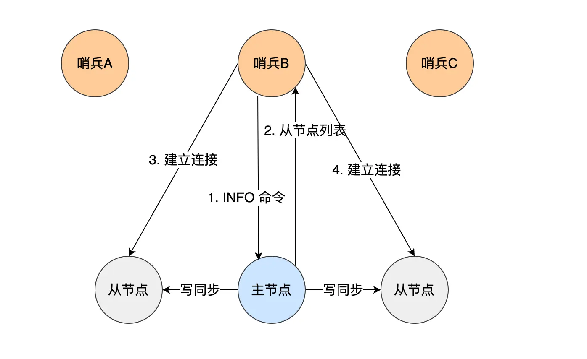  
  
  
**主从故障转移的具体过程：**  
1. 让原主节点（已下线）属下的所有从节点挑选出一个从节点，使其作为新主节点  
2. 让这些从节点修改复制目标，修改为**新主节点**  
3. 将新主节点IP地址和信息通过「发布者/订阅者机制」通知客户端  
4. 继续监视原主节点，若重新上线则将它设置为新主节点的从节点  
> Q：下面的陈述都是由哨兵leader进行的，那么其他从节点是不是在这里没用呢？  

**一：选出新主节点**  
这里要做的就是从所有从节点中选出一个「状态良好且数据完整」的，然后哨兵leader发送SLAVEOF no one命令将这个节点转换为**新主节点**。  
  
为了保险，对于已下线/（以往）网络状态不好的节点需要过滤掉。（若主从节点超时（down-after-milliseconds）次数超过10次则说明网络不好）。  
  
然后对过滤后的从节点进行三轮考察：**优先级，复制进度，ID号**。对每一轮哪个节点**优先**胜出则作为新主节点：  
* 哨兵根据从节点优先级排序，优先级越小排名越高  
    * 根据slave-priority配置设置从节点的优先级（根据每台机器的配置来确定优先级）  
* 优先级相同，则查看复制下标，谁接收的复制数据多，谁就靠前  
    * 如何评判「复制进度」？即看某个从节点的slave_repl_offset最接近master_repl_offset的，则复制进度最靠前  
* 前两项都相同，则选择ID较小的那个  
    * 什么是ID号？即每个从节点的编号，唯一标识从节点  
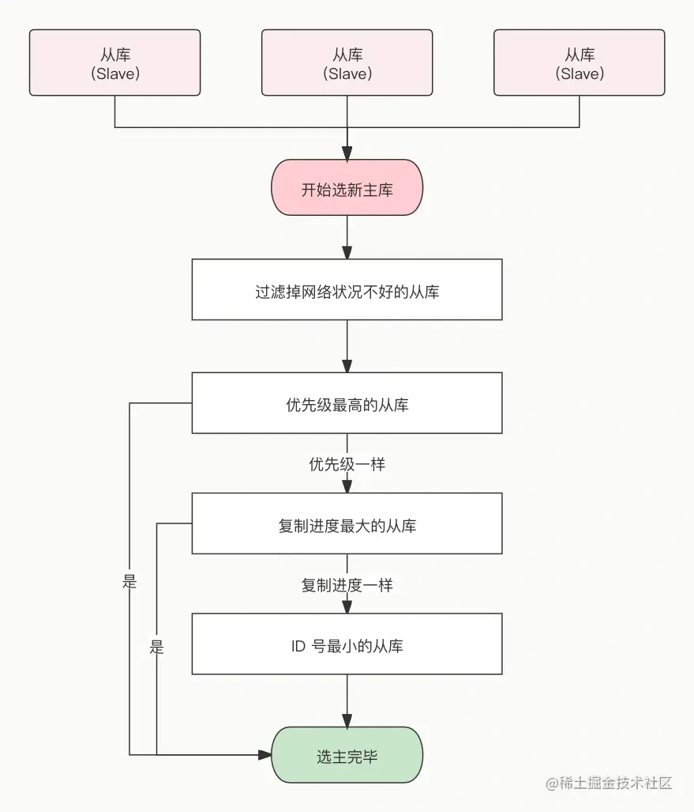  
这样就选举出了新主节点，在哨兵leader发送SLAVEOF no one之后，哨兵leader会以每秒一次的频率（若不是故障转移，则是十秒一次频率）向被升级的从节点发送INFO命令，当被升级的从节点角色信息由slave变为master时，哨兵leader就知道顺利升级为主节点了。  
  
现在的状态：  
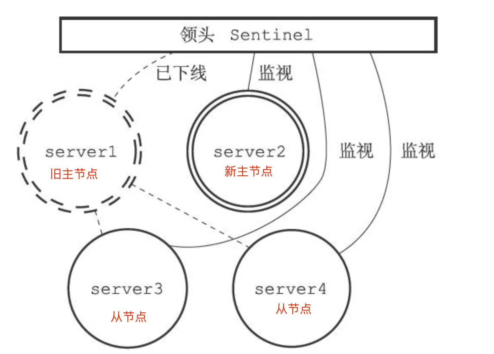  
  
**二：将从节点指向新主节点**  
哨兵leader向所有从节点发送SLAVEOF命令使得成为新主节点的从节点：  
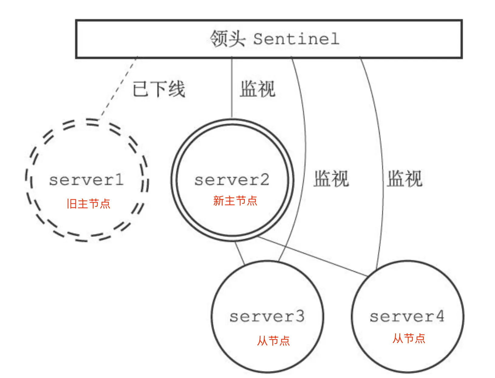  
  
**三：通知客户端**  
通过Redis的「发布者/订阅者」机制实现，每个哨兵提供这个机制，客户端可以从哨兵订阅消息。  
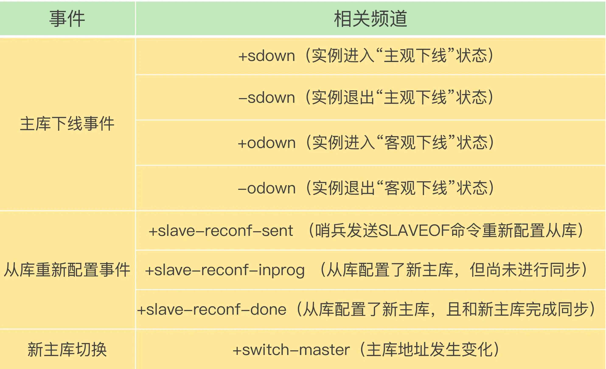  
  
哨兵会向+swith-master频道发布新主节点的「IP地址+端口」信息，客户端可以收到这个信息，然后用新主节点ip+端口进行通信。  
  
（而且客户端还可以在主从切换后得到新主节点的连接信息，可以监控各种重要事件，这样有利于客户端了解「主从切换」进度）  
  
**四：将原主节点变为从节点**  
即当原主节点重新上线，就将他修改为新主节点的从节点：  
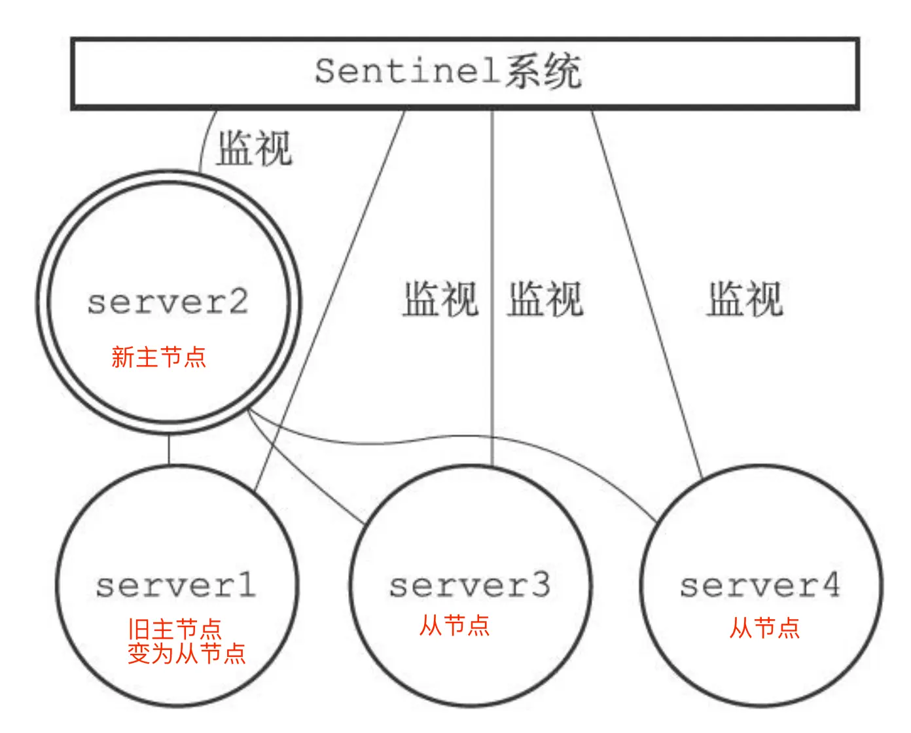  
  
  
  
**切片集群模式（Redis Cluster）：**  
当Redis缓存数据太大，就需要使用集群的方式将数据分布在不同的服务器中，来降低系统对单主节点的依赖，提升读写性能  
  
Redis集群采用哈希槽点方式处理数据和节点之间的映射关系。  
  
一个切片集群有16384（2^14）个哈希槽，每个键值对根据他的key被映射到一个槽当中：  
* 根据key，按照「CRC16」算法计算16bit的值  
* 使用16bit的值%16384得到一个模数  
  
这些哈希槽如何被映射到具体的Redis节点上呢？  
* 平均分配：将哈希槽平均分配到节点上：即每个节点16384/N个槽  
* 手动分配：使用cluster meet命令来手动建立节点之间的连接组成集群，再使用cluster addslots命令置顶每个节点的哈希槽个数（手动分配需要将槽分配完，否则集群无法正常运行）  
  
### 集群脑裂导致数据丢失怎么办？  
> 什么是脑裂？  
> 
> 即主节点与从节点完全**失联**了，这个时候用户并不知道Redis出现了问题，照常发送写数据，此时哨兵发现主节点失联了，就认为主节点挂了（但并没有挂，只是网络出现了问题），于是哨兵又选出一个主节点（出现了两个主节点）——「脑裂」  
>   
> 这时网络好了，就会将旧主节点降级为从节点，然后从节点向新主节点请求数据同步（会将自己的数据清空，做全量同步），**这个时候这个从节点之前写入的数据就完全丢失了，即集群脑裂导致的数据丢失问题**  
  

当主节点发现从节点通信超时/下线的总个数超过阈值时，禁止主节点进行写数据，直接返回错误给客户端  
  
可以通过参数：  
```
min-slaves-to-write x:主节点必须至少有X个从节点连接，否则禁止写数据
Min-slaves-max-lag x：主从复制和同步的延迟不能超过x秒，否则禁止写数据

```
  
## Redis过期删除与内存淘汰策略  
  
### 过期删除策略  
过期删除：Redis可以对key设置过期事件，所以需要对应机制删除已过期的键值对  
  
**如何设置过期事件？**  
```
expire <key> <n> 设置key在n秒后过期
pexpire 设置key在n毫秒后过期
expireat 设置key在某个时间戳（精确到秒）后过期
pexpireat 设置key在某个时间戳（精确到毫秒）后过期

```
在设置字符串时，也可以直接设置过期时间：  
```
set <key> <value> ex <n> ：设置键值对的时候，同时指定过期时间（精确到秒）；
set <key> <value> px <n> ：设置键值对的时候，同时指定过期时间（精确到毫秒）；
setex <key> <n> <valule> ：设置键值对的时候，同时指定过期时间（精确到秒）。

```
  
> 若想查看某key存活时间，使用TTL key命令，若想取消某key过期时间，使用persist key 命令（这个时候查看存活时间则为-1）  
  

**如何判定key已经过期了？**  
当我们对一个key设置了过期事件时，Redis会将该key带上过期时间存到「**过期字典」（存放所有key过期时间）**中。  
过期字典存储在redisDB中：  
```
typedef struct redisDb {
    dict *dict;    /* 数据库键空间，存放着所有的键值对 */
    dict *expires; /* 键的过期时间 */
    ....
} redisDb;

```
* 过期字典的key是一个指针，指向键对象  
* 过期字典的value是一个 long long类型的整数，保存key的过期时间  
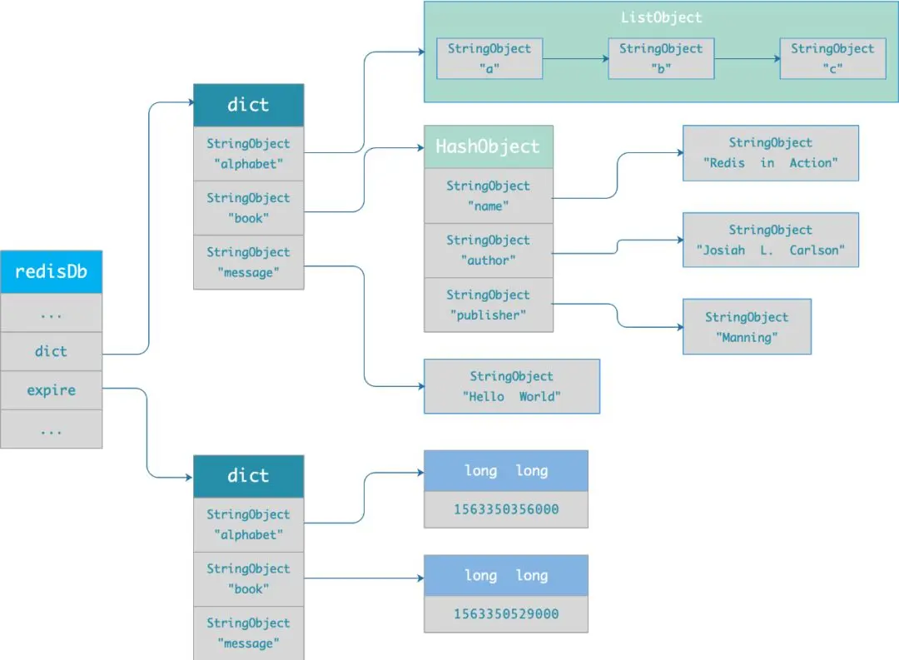  
> 字典实际是哈希表，可以O（1）快速查找  

当查询一个key时：  
* 查看该key是否再过期字典中，若不在，则正常读取键值  
* 若存在，则获取key对过期时间，然后与系统时间比对来判定是否过期  
  
**有哪些过期删除策略？**  
* **定时删除**：设置key过期时间的同时创建一个定时事件，当时间到达则由事件处理器自动执行key删除操作  
    * 优点：key可以尽快被删除，对内存友好  
    * 缺点：过期key较多的情况下，删除会占用较多CPU时间，对CPU不友好  
* **惰性删除**：不主动删除，每次访问key再检测key是否过期，若过期删除即可  
    * 优点：对CPU友好（不需要怎么处理）  
    * 缺点：对内存不友好（过期key可能长时间存在）  
* **定期删除：**每隔一段时间随机取出一定量key进行检查，并删除过期key  
    * **优点**：通过限制删除操作的执行时间和频率来减少对CPU影响，也能有效的减少无效占用  
    * **缺点：**难以确定这个“度”，设置的太频繁则对CPU不友好，设置的太少，内存不能得到释放（所以需要取得平衡）  
  
**Redis采用的过期删除策略：**  
Redis采用的是**惰性删除+定期删除**策略以取得平衡  
  
**实现惰性删除**  
Redis的惰性删除策略由db.c文件的expireIfNeeded函数实现：  
```
int expireIfNeeded(redisDb *db, robj *key) {
    // 判断 key 是否过期
    if (!keyIsExpired(db,key)) return 0;
    ....
    /* 删除过期键 */
    ....
    // 如果 server.lazyfree_lazy_expire 为 1 表示异步删除，反之同步删除；
    return server.lazyfree_lazy_expire ? dbAsyncDelete(db,key) :
                                         dbSyncDelete(db,key);
}

```
Redis在访问/修改key之前，会调用这个函数检查key是否过期：  
* 若过期，则删除key，根据上面参数（Redis4.0开始提供）选择（异步/同步），然后返回null客户端  
* 若没有过期，不做任何处理，正常返回客户端  
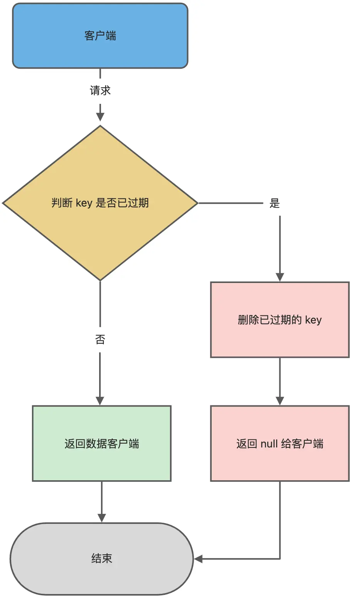  
  
  
**实现定期删除**  
> 默认检查间隔：每秒10次（通过redis.conf配置）  
>   
> 随机抽查数量：每次20个（在expire.c文件的activeExpireCycle函数的  
```
ACTIVE_EXPIRE_CYCLE_LOOKUPS_PER_LOOP

```
> 定义，为20）  
>   
> 默认循环流程上限时间：25ms  
  
定期删除流程：  
* 随机抽取20个key  
* 检查这些key是否过期，删除已经过期的key  
* 若本轮「已过期/随机抽取key」大于25%，则重复步骤一（代表过期的key很多，需要再清理清理），否则等待下一轮检查  
这里还设置了一个上限时间25ms（主要防止Redis循环过度），若超出时间就直接结束。  
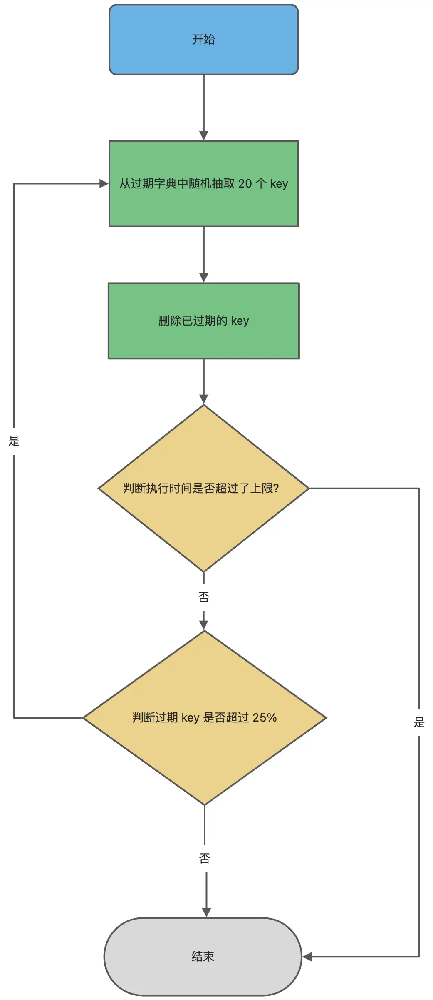  
  
  
### Redis持久化时，对过期键如何处理？  
对于RDB文件：  
* RDB文件生成阶段：内存状态持久化为RDB的时候，对key进行过期检查，过期的键不会保存到新RDB文件中  
* RDB加载阶段：  
    * 若是主服务器：在载入RDB文件时会对key进行检查，过期键不会被载入到数据库中  
    * 若是从服务器：不管是否过期都载入（但由于会进行数据同步，所以也不会造成影响）  
对于AOF文件：  
* AOF写入阶段：持久化时，若某个过期键没被删除，AOF会保存这个键，当这个key被删除后，Redis会向AOF文件追加一条DEL命令删除该key  
* AOF重写阶段：会对key进行检查，已过期的键不会被保存到重写后到AOF文件中  
  
**对于Redis的主从模式：**  
* 从库不会进行过期扫描，即使访问从库，依然可以得到该值（像是未过期一样）  
* 主库在key过期是，会在AOF文件中追加一条DEL命令同步到所有从库，可以通过执行DEL命令删除过期key  
  
### 内存淘汰策略  
当Redis的内存达到某个阈值（maxmemory），就会触发内存淘汰机制  
> * 在64位操作系统中，阈值默认为0，表示没有内存大小限制，Redis不会对可用内存进行检查  
> 
> * 在32位操作系统中，阈值默认为3G，因为32位操作系统最多支持4G内存，避免因为内存不足导致Redis奔溃  
  
  
查看Redis当前使用的内存淘汰策略：  
```
127.0.0.1:6379> config get maxmemory-policy
1) "maxmemory-policy"
2) "noeviction"

```
即使用的是noeviction类型内存淘汰策略，表示不淘汰任何数据，但新增操作会报错  
  
修改内存淘汰策略：  
1. 通过config set max memory-policy <策略>命令设置，不需重启立即生效，但重启之后就会生效....  
2. 通过Redis配置文件修改，设置maxmemory-policy <策略> ，重启后配置不会丢失，但需要重启生效  
  
**内存淘汰策略的类型：**  
* 不进行数据淘汰：  
    * noeviction（Redis3.0之后默认）：表示当内存超过最大设置内存时，不淘汰任何数据，而是返回错误  
* 进行数据淘汰：  
    * 设置了过期时间的数据中淘汰  
        * Volatile-random：随机淘汰设置了过期时间的任意键值  
        * volatile-ttl：优先淘汰更早过期的键值  
        * volatile-lru（redis3.0之前默认）：淘汰最久未使用且设置过期时间的键值  
        * volatile-lfu（redis4.0）：淘汰最少使用且设置过期时间的键值  
    * 在所有数据范围内淘汰  
        * allkeys-random：随机淘汰任意键值  
        * allkeys-lru：淘汰最久未使用  
        * allkeys-lfu（redis4.0）：淘汰最少未使用  
> **对于LRU算法：**  
> 
> 传统LRU算法（链表）的问题：  
> 
> * 使用链表管理所有数据，带来额外空间开销  
> 
> * 每次需要将被访问的数据移动到头部（大量数据被移动会影响Redis性能）  
> 
> **对于Redis的实现：**  
> 
> 并没有严格实现LRU，而是：  
> 
> * 添加一个字段：记录数据最后一次访问时间  
> 
> * 进行内存淘汰时，使用随机采样的方式淘汰数据，（如随机取5个值），然后淘汰最久没有使用那个  
> 
> 这样的优点：  
> 
> * 不用维护链表，节省空间  
> 
> * 不用每次访问移动到表头，提升了性能  
  

对于LRU算法无法解决缓存污染问题：当应用一次读入大量数据，那么这些数据会缓存很长一段时间  
  
> **对于LFU算法：**  
> 
> 即最少未使用（最不常用），所以需要记录被访问的次数  
> 
> **对于Redis的实现：**  
```
typedef struct redisObject {
    ...
      
    // 24 bits，用于记录对象的访问信息
    unsigned lru:24;  
    ...
} robj;

```
> 对于LRU和LFU的这个字段使用不同：  
> 
> * LRU：lru字段记录key访问时间戳  
> 
> * LFU：分为两段：高16bit存储最后修改时间？记录key**访问时间戳**，低8bit存储记录key**访问频率**  
> 
>     * **对于访问频率：（并不单纯是次数，而是会随着时间推移衰减，**这个衰减的值和前后访问时间差距有关，上次访问和这次访问时间差大，则衰减的多，更易被淘汰**）**  
> 
>     * 提供了两个配置：  
> 
>     * lfu-dacay-time：调整衰减速度，以分钟为单位，默认为1，值越大，衰减越慢  
> 
>     * lfu-log-factor：调整增长速度，越大则增长越慢  
  
## Redis缓存设计  

### 如何避免缓存雪崩，缓存击穿，缓存穿透？  
  
> **缓存雪崩**：为了保证数据库和缓存数据一致性，需要给Redis中的数据设置过期时间，**当大量缓存数据在同一时间过期时**，如果此时有大量用户请求都无法在Redis中处理，而是访问数据库，导致数据库压力陡增（甚至导致数据库宕机），造成系统奔溃  

* 将缓存过期时间打散：在原有的过期时间基础上加一个随机值，这样过期就不重复了  
* 设置缓存不过期：通过后台服务更新缓存数据  
  
> **缓存击穿：**对于业务中的**热数据**过期了，此时大量请求访问该热点数据无法从缓存中读取，直接从数据库中读取，此时数据库很容易被高并发请求冲垮  
> 
> （其实可以将缓存击穿看作是缓存雪崩的子集）  

* 互斥锁（setnx）：保证同一时间只有一个线程请求缓存  
* 不给热数据设置过期时间，由后台线程异步更新缓存/热点数据过期前，通知后台更新缓存，重新设置过期时间  
  
> **缓存穿透：**当用户请求访问的数据既不在缓存，也不在数据库中，导致即使访问了数据库后也无法构建缓存。当大量这样的请求到来，数据库压力陡增  
> 
> - 可能是业务误操作/恶意攻击  

* 对于非法请求进行限制：在API入口判断请求参数是否合理，否则就直接返回错误  
* 设置空值/默认值：后续请求可以从缓存中读取到空值/默认值返回  
* **使用布隆过滤器**  
  
### 如何做到动态缓存热点数据？  
由于某些场景的限制/内存限制，并不需要将所有数据都放入缓存中，只是将其中热数据缓存起来  
  
总体思路：通过数据访问时间进行排名，过滤掉不常用的数据，只留下经常访问的数据  
  
### 常见的缓存更新策略？  
1. **Cache Aside（旁路缓存） - 最常用**  
2. **Read/write Through（读穿/写穿）**  
3. **Write Back（写回）**  
  
> **旁路缓存：**  

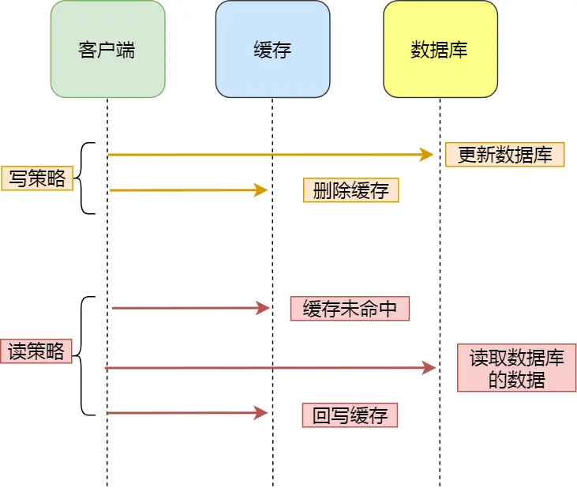  
注：对于写策略不能先删除缓存再更新数据库：在读写并发的时候会出现缓存和数据库数据不一致的情况，即（最终出现了缓存为20，数据库中为21的情况）：  
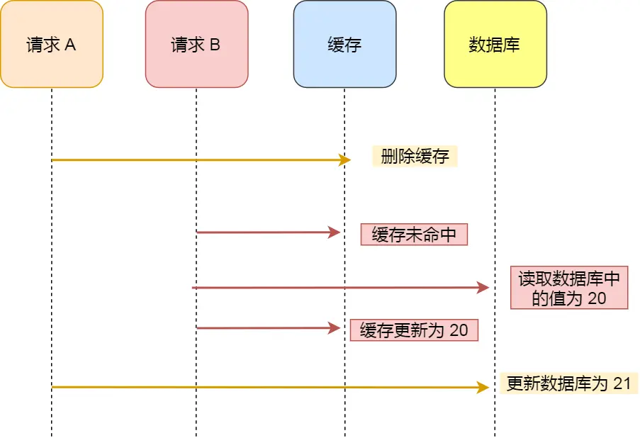  
  
那么先更新数据库再删除缓存会不会出现这个问题呢？  
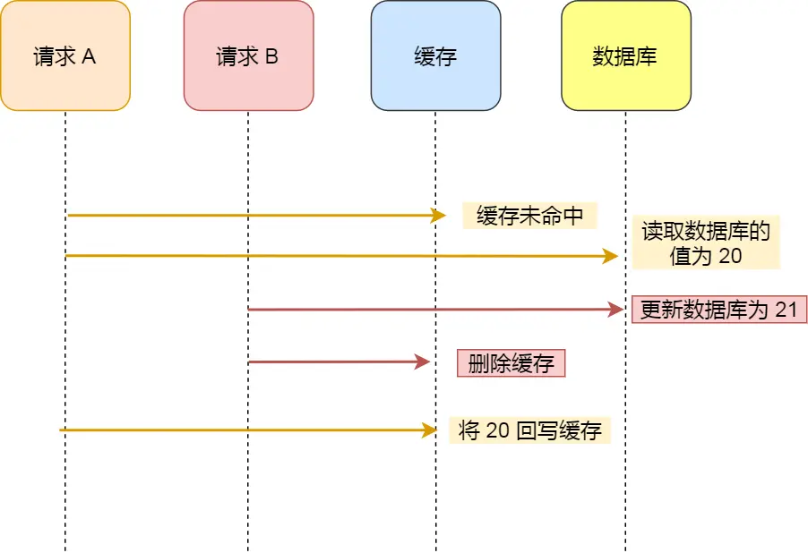  
**所以仍然是可能出现数据不一致的，**但由于缓存写入远远快于数据库，所以出现这样的情况概率非常低  
  
**旁路缓存适合读多写少的策略，不适合写多的场景**，当写比较频繁的时候，缓存会被频繁的清理，对缓存命中率有影响  
  
**若对缓存命中率有严格要求，则可以：**  
* 在更新数据时也更新缓存，在更新缓存前先加分布式锁（这样同一时间只允许一个线程更新缓存，无并发问题），但对于写入性能有影响  
* 在更新数据更新缓存，只是给缓存加一个较短的过期时间，这样即使出现了数据不一致的情况，缓存的数据也会很快过期，可以接受  
  
  
> **Read/Write Through（读穿/写穿）**  

这里即应用程序只和**缓存**交互，不再和数据库交互，相当于更新数据库操作由缓存进行  
  
Read Through策略：  
先查询缓存数据是否存在，  
* 若存在直接返回  
* 若不存在，则由缓存组件负责从数据库查询数据并将结果写入缓存组件，最后将数据返回给应用  
  
Write Through策略：  
当有数据更新时，先查询写入的数据在缓存中是否已经存在：  
* 若存在，则更新缓存中的数据，并同步到数据库中，然后通知应用程序更新完成  
* 若不存在，则直接更新数据库，然后返回  
  
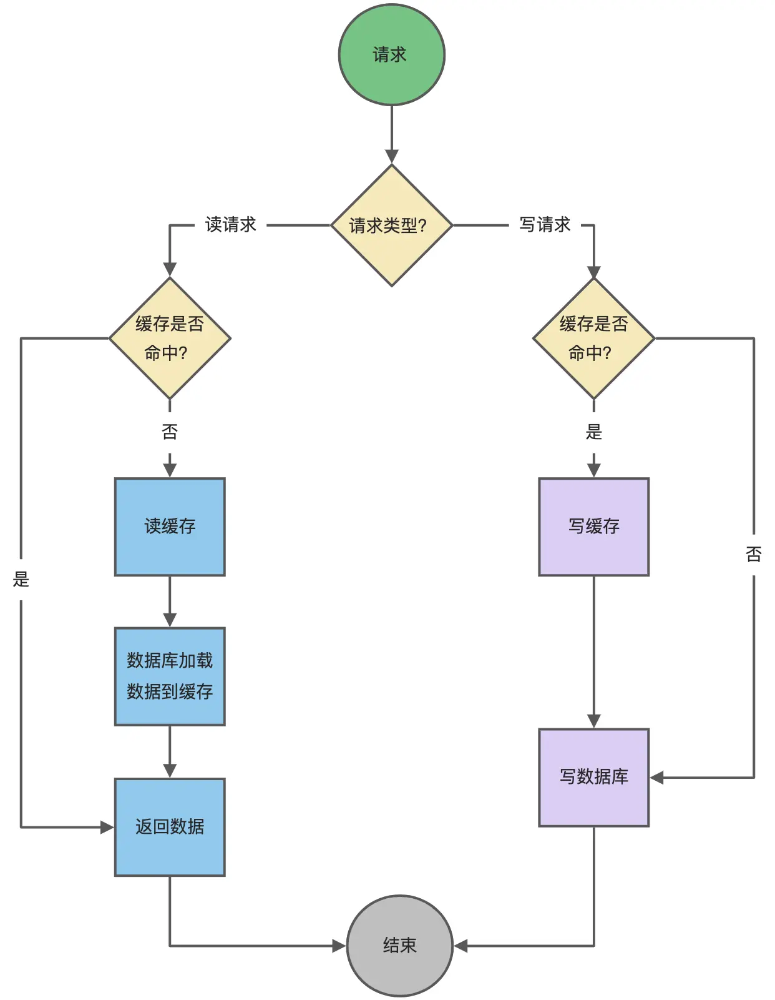  
这种策略见的较少，因为Redis并不提供写入数据库和自动加载数据库数据的功能（使用本地缓存可以考虑）  
  
### Write Back（写回）策略  
对于更新数据时，只更新缓存，同时将缓存数据设置为“脏”的，然后立马返回，并不更新数据库，**对于数据库的更新通过批量异步更新的方式进行**  
  
这个设置不能运用到Redis中，因为Redis没有异步更新数据库的功能  
  
但这个策略计算机中采用较多：CPU缓存，操作系统中文件系统的缓存  
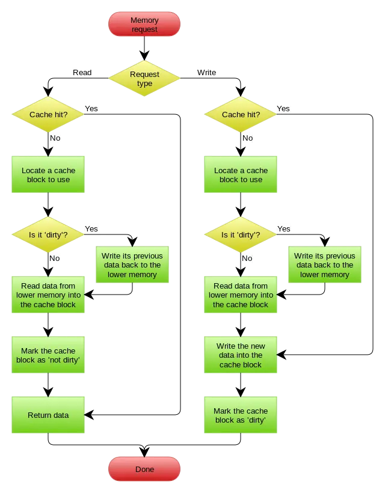  
  
**Write Back 适合写多的场景，**但数据并不是强一致性的，会有数据丢失风险（若缓存机器挂了，则脏数据丢失）  
  
  
## Redis常见处理策略&实现  
  
### Redis如何实现延迟队列？  
  
延迟场景：  
* 在购物平台下单时，超过一定时间未付款，订单自动取消  
* 打车的时候，在规定时间没有人接单，平台取消订单并提醒无人接单  
* 点外卖的时候，商家在10分钟未接单就会取消订单  
Redis通过Zset实现延迟消息队列（Zset的Score属性可以存储延迟执行的时间）  
  
```
zadd score1 value1生产消息
zrange by score 查询符合条件的待处理任务

```
通过循环追星任务队列即可  
  
### Redis的大key如何处理？  
大key指的是key对应的value很大：  
* String 类型值大于10KB  
* Hash，List，Set，Zset元素超过5000个  
  
**造成的影响：**  
* 客户端超时阻塞：处理大key比较耗时，会阻塞Redis，从客户端看就是没响应  
* 网络阻塞：若一个key大小为1MB，每秒访问量为1000，则每秒产生1000MB流量，容易引发网络阻塞  
* 阻塞工作线程：使用DEL删除大key时，会阻塞工作线程  
* 内存分布不均：有大key的Redis节点占用内存多，QPS较大（？）  
  
**如何找到大key？**  
1. redis-cli --bigkeys查找（最好在从节点执行，若无从节点，则在低峰期查询）  
    * 只能统计每种类型最大的bigkey，无法得到前N个  
    * 对于集合类型只统计元素个数，没有统计实际内存占用  
```
redis-cli -h 127.0.0.1 -p6379 -a "password" -- bigkeys

```
2. 使用SCAN命令查找，用TYPE命令获取每一个key的类型，对于获取占用内存大小：  
    * 对于String，可以使用STRLEN命令获取占用字节数  
    * 对于集合类型：（元素格式*集合元素平均大小）  
        * List 类型：LLEN 命令；  
        * Hash 类型：HLEN 命令；  
        * Set 类型：SCARD 命令；  
        * Sorted Set 类型：ZCARD 命令；  
    * 若不知道集合元素平均大小：使用MEMORY USAGE 命令（redis4.0）查询键值对占用的内  
3. 使用RdbTools查找，用来解析RDB文件：  
```
rdb dump.rdb -c memory --bytes 10240 -f redis.csv 即将大于10kb的key输出到表格中

```
  
**如何删除大key？**  
在应用程序释放内存时，操作系统会将释放掉的内存插入一个空闲内存块的链表，以便于后续进行管理和再分配，这个过程需要一定时间且会阻塞当前释放内存的应用程序  
  
一下子释放了大量内存，链表操作时间增加造成Redis主线程的阻塞，从而压垮Redis造成各种异常。  
  
有两种方式：  
* 分批次删除  
* 异步删除（Redis4.0）  
  
1. **分批次删除：**  
* 删除大Hash：使用hscan命令，每次获取100个字段，再用hdel命令每次删除一个字段  
* 删除大List：使用ltrim命令，每次删除少量元素  
* 删除大Set：使用sscan命令，每次扫描集合中100个元素，再用srem命令每次删除一个键  
* 删除大Zset：使用zrem range by rank命令每次删除top100个元素  
2. **异步删除：**  
* 使用unlink命令代替del进行删除，将这个key放入异步线程进行删除，这样不会阻塞主线程  
* 可以配置参数，达到某些条件时进行自动异步删除（下面的默认关闭）  
```
lazyfree-lazy-eviction no 表示当Redis运行内存超过maxmemory时是否开启lazy free删除
lazyfree-lazy-expire no 表示设置了过期时间的键值是否开启lazy free删除
lazyfree-lazy-server-del 在处理已经存在的键的删除，是否开启lazy free删除
noslave-lazy-flush no 针对slave加载master的RDB文件会先清除自己的机制是否开启为lazy free


```
  
如何避免大key呢？  
在设计阶段，将大key拆分为一个一个小key，或定期检查Redis是否存在大key，若key可以删除，不使用DEL命令，而使用unlink（Redis4.0）命令异步删除大key  
  
**对于大key对持久化的影响？**  
当AOF写回策略使用Always且写入的是一个大key，则主线程在执行fsync函数时阻塞的事件会较长（因为数据同步到磁盘是比较耗时的，特别是数据量大的时候）  
  
对于AOF重写和RDB快照（bgsave）【都创建了子进程】，分别会通过fork创建一个子进程来处理任务，有两个阶段导致主线程阻塞：  
1. 创建子进程过程中，由于要复制主线程的页表等数据结构，页表越大，阻塞事件越长  
2. 创建完子进程后，如果主线程修改了大key，则会发生写时复制，期间会拷贝物理内存，由于大key占用物理内存大，则在这里会比较耗时，可能会阻塞主线程  
  
### Redis管道？  
pipeline即一种客户端提供的一种批处理技术（非Redis服务端提供的功能），用于一次性处理多个Redis命令，从而提升性能  
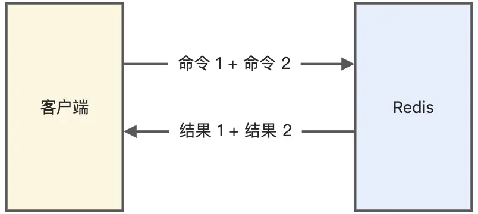  
这样减少了多个命令的网络等待开销  
  
但需要避免发送的命令过大/导致管道内数据太多从而网络阻塞  
  
### Redis是否支持事务回滚？  
  
**Redis没有回滚机制**  
  
discard命令将可以主动放弃事务的执行，但不是回滚  
```
#获取name原本的值
127.0.0.1:6379> GET name
"xiaolin"
#开启事务
127.0.0.1:6379> MULTI
OK
#设置新值
127.0.0.1:6379(TX)> SET name xialincoding
QUEUED
#注意，这条命令是错误的
# expire 过期时间正确来说是数字，并不是‘10s’字符串，但是还是入队成功了
127.0.0.1:6379(TX)> EXPIRE name 10s
QUEUED
#提交事务，执行报错
#可以看到 set 执行成功，而 expire 执行错误。
127.0.0.1:6379(TX)> EXEC
1) OK
2) (error) ERR value is not an integer or out of range
#可以看到，name 还是被设置为新值了
127.0.0.1:6379> GET name
"xialincoding"

```
**不满足原子性**  
  
为什么不支持回滚呢？  
* Redis事务执行，错误通常是编程错误导致，很少会在生产环境中出现  
* 与Redis追求简单高效的设计主旨不符  
  
  
### Redis如何实现分布式锁？  
分布式锁即在集群的情况下，对于同一个机器只能有一个线程访问  
  
Redis可以通过set nx（key不存在才插入）实现分布式锁  
* 若key不存在，则插入成功，即加锁成功  
* 若key存在，则插入失败，即加锁失败  
  
**对于加锁操作**，需要满足  
```
SET lock_key unique_value NX PX 10000 

```
* Unique_value:客户端生成的唯一标识，区别不同客户端的锁操作  
* NX即在key不存在时才能进行设置操作  
* PX 10000代表设置过期时间10s（避免无法释放锁）  
  
**对于解锁操作**，即将lock_key删除（del lock_ key），需要保证执行操作的客户端就是加锁的客户端，所以需要判断unique_value是否为加锁客户端，是则删除key，所以解锁有两个操作，需要使用Lua脚本保证原子性  
```
// 释放锁时，先比较 unique_value 是否相等，避免锁的误释放
if redis.call("get",KEYS[1]) == ARGV[1] then
    return redis.call("del",KEYS[1])
else
    return 0
end

```
  
使用Redis实现分布式锁的优缺点：  
优点：  
* 性能高效  
* 实现方便  
* 避免单点故障（因为是跨集群部署的）  
缺点：  
* 超时时间不好设置，超时时间过长，影响性能，超时时间过短，会保护不到共享资源  
* Redis的主从复制是异步复制的，导致分布式锁的不可靠性（主节点宕机后，新的主节点仍然可以获取到锁）  
  
如何解决集群情况下的可靠性？  
分布式锁算法RedLock（红锁）  
  
> 它是基于**多个 Redis 节点**的分布式锁，即使有节点发生了故障，锁变量仍然是存在的，客户端还是可以完成锁操作。官方推荐是至少部署 5 个 Redis 节点，而且都是主节点，它们之间没有任何关系，都是一个个孤立的节点。  
> 
> Redlock 算法的基本思路，**是让客户端和多个独立的 Redis 节点依次请求申请加锁，如果客户端能够和半数以上的节点成功地完成加锁操作，那么我们就认为，客户端成功地获得分布式锁，否则加锁失败**。  
> 
> 这样一来，即使有某个 Redis 节点发生故障，因为锁的数据在其他节点上也有保存，所以客户端仍然可以正常地进行锁操作，锁的数据也不会丢失。  
> 
> Redlock 算法加锁三个过程：  
> 
> * 第一步是，客户端获取当前时间（t1）。  
> 
> * 第二步是，客户端按顺序依次向 N 个 Redis 节点执行加锁操作：  
> 
>     * 加锁操作使用 SET 命令，带上 NX，EX/PX 选项，以及带上客户端的唯一标识。  
> 
>     * 如果某个 Redis 节点发生故障了，为了保证在这种情况下，Redlock 算法能够继续运行，我们需要给「加锁操作」设置一个超时时间（不是对「锁」设置超时时间，而是对「加锁操作」设置超时时间），加锁操作的超时时间需要远远地小于锁的过期时间，一般也就是设置为几十毫秒。  
> 
> * 第三步是，一旦客户端从超过半数（大于等于 N/2+1）的 Redis 节点上成功获取到了锁，就再次获取当前时间（t2），然后计算计算整个加锁过程的总耗时（t2-t1）。如果 t2-t1 < 锁的过期时间，此时，认为客户端加锁成功，否则认为加锁失败。  
> 
> 可以看到，加锁成功要同时满足两个条件（简述：如果有超过半数的* Redis *节点成功的获取到了锁，并且总耗时没有超过锁的有效时间，那么就是加锁成功）：  
> 
> * 条件一：客户端从超过半数（大于等于 N/2+1）的 Redis 节点上成功获取到了锁；  
> 
> * 条件二：客户端从大多数节点获取锁的总耗时（t2-t1）小于锁设置的过期时间。  
> 
> 加锁成功后，客户端需要重新计算这把锁的有效时间，计算的结果是「锁最初设置的过期时间」减去「客户端从大多数节点获取锁的总耗时（t2-t1）」。如果计算的结果已经来不及完成共享数据的操作了，我们可以释放锁，以免出现还没完成数据操作，锁就过期了的情况。  
> 
> 加锁失败后，客户端向**所有 Redis 节点发起释放锁的操作**，释放锁的操作和在单节点上释放锁的操作一样，只要执行释放锁的 Lua 脚本就可以了。  
