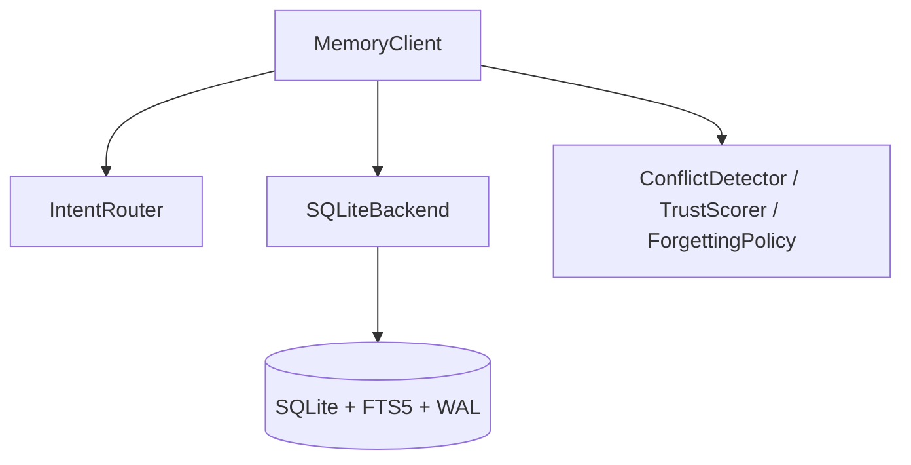
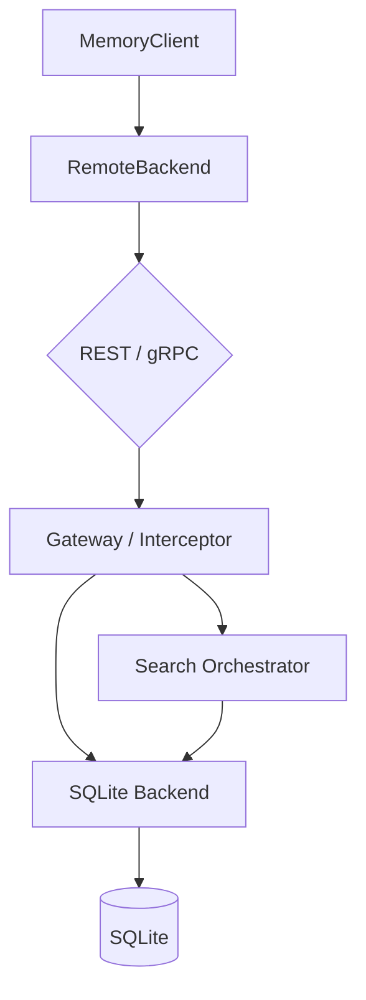
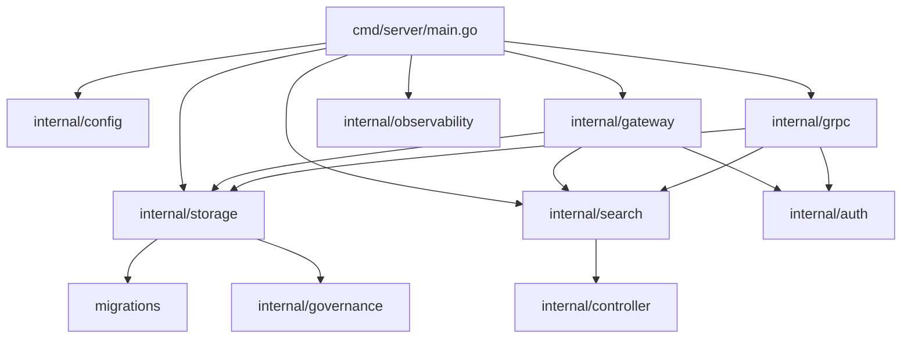
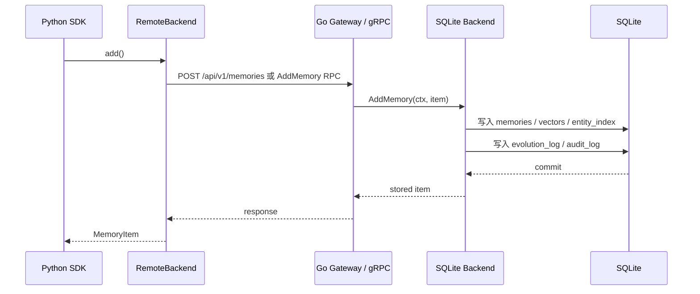
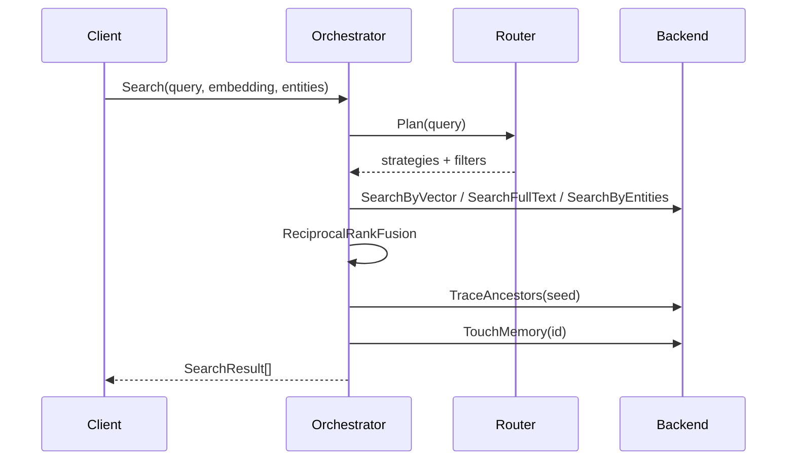
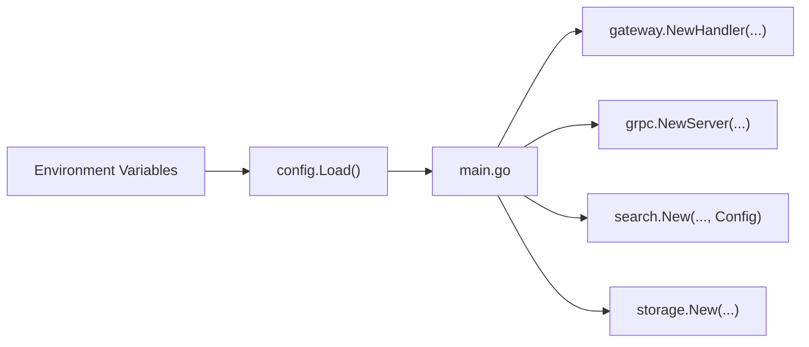

## 前置知识

- [01 项目总览与动机](01-project-overview.md)

## 本文目标

完成阅读后，你将理解：

1. 为什么 Go 负责数据面，Python 负责智能面
2. 嵌入模式与服务模式的完整数据流
3. 核心模块之间如何协作
4. 存储、检索、认证、可观测性和关停流程如何串起来

## 双语言架构的职责划分

系统把职责拆成两层：

- **Python 智能面**：嵌入、实体提取、LLM 客户端、MCP、开发者入口
- **Go 数据面**：REST、gRPC、认证、中间件、检索编排、SQLite 服务端能力

这种划分让每一层都能围绕自己的优势演进。

| 维度 | Python | Go |
|------|--------|----|
| 主职责 | SDK、MCP、提取与模型集成 | 服务层、协议层、数据访问 |
| 典型文件 | `src/agent_memory/client.py` | `go-server/cmd/server/main.go` |
| 优势 | 开发效率高，生态完整 | 并发、部署、静态二进制 |

进一步讲，这种分层还有一个非常现实的好处：  
当系统需要接 OpenAI / Ollama / 本地 embedding 模型时，Python 生态更顺手；当系统需要暴露稳定服务、做中间件、处理并发和打包部署时，Go 的体验更成熟。

## 嵌入模式数据流

嵌入模式适合本地脚本、桌面工具和单进程 Agent。



这条路径的特点是：

- 部署最简单
- 网络开销为零
- 所有智能层逻辑都在同一进程

## 服务模式数据流

服务模式适合把 Go 服务单独部署，再由 Python SDK、CLI 或其他进程远程访问。



服务模式的重点收益有三项：

1. 服务层能力独立部署
2. Go 端统一承接认证、观测和并发请求
3. Python 端可保持 SDK 体验，同时通过远程后端访问数据

## 模块依赖关系



可把它理解成三层：

- **入口层**：`cmd/server/main.go`
- **协议层**：`gateway/`、`grpc/`
- **核心层**：`storage/`、`search/`、`controller/`、`governance/`

## 存储请求生命周期

以服务模式下的新增记忆为例：



这里有两个非常关键的设计点：

- 主表写入和治理日志写入处于同一个事务路径
- 关系索引和向量索引在新增时同步维护

## 检索请求生命周期

以融合检索为例：



查询链路里同时发生了三类事情：

- 意图分类
- 多路召回
- 后处理与访问刷新

## 数据模型如何在双端保持一致

`proto/memory/v1/models.proto:7` 定义了跨语言共享的数据契约。最核心的消息是 `MemoryItem`。

### MemoryItem 19 字段完整表

| 字段 | 类型 | 含义 | 设计意图 |
|------|------|------|----------|
| `id` | string | 记忆主键 | 保证全局可引用 |
| `content` | string | 记忆正文 | 检索和展示的核心载体 |
| `memory_type` | string | 语义/过程/事件类型 | 在写入阶段区分知识类别 |
| `embedding` | repeated float | 向量表示 | semantic 检索基础 |
| `created_at` | string | 创建时间 | 排序、审计、治理的时间基线 |
| `last_accessed` | string | 最近访问时间 | 遗忘与健康分析输入 |
| `access_count` | int32 | 访问次数 | 热度与遗忘强度输入 |
| `valid_from` | string | 生效时间 | 支持时态语义 |
| `valid_until` | string | 失效时间 | 支持时间区间约束 |
| `trust_score` | double | 信任分 | 冲突处理与结果排序参考 |
| `importance` | double | 重要度 | 遗忘和合并的重要输入 |
| `layer` | string | `short_term` / `long_term` | 体现生命周期状态 |
| `decay_rate` | double | 衰减速度 | 控制时间衰减曲线 |
| `source_id` | string | 来源标识 | 追溯与可信度判断 |
| `causal_parent_id` | string | 因果父节点 | 构建祖先链 |
| `supersedes_id` | string | 覆盖对象 | 表示新记忆替代旧记忆 |
| `entity_refs` | repeated string | 实体引用 | 实体检索与合并分组 |
| `tags` | repeated string | 标签 | 过滤、聚类、全文补充 |
| `deleted_at` | string | 软删除时间 | 保留溯源而非硬删除 |

### Proto → Go → Python 三方映射表

| Proto | Go 字段 | Python 字段 |
|-------|---------|------------|
| `id` | `Id` | `id` |
| `content` | `Content` | `content` |
| `memory_type` | `MemoryType` | `memory_type` |
| `embedding` | `Embedding` | `embedding` |
| `created_at` | `CreatedAt` | `created_at` |
| `last_accessed` | `LastAccessed` | `last_accessed` |
| `access_count` | `AccessCount` | `access_count` |
| `valid_from` | `ValidFrom` | `valid_from` |
| `valid_until` | `ValidUntil` | `valid_until` |
| `trust_score` | `TrustScore` | `trust_score` |
| `importance` | `Importance` | `importance` |
| `layer` | `Layer` | `layer` |
| `decay_rate` | `DecayRate` | `decay_rate` |
| `source_id` | `SourceId` | `source_id` |
| `causal_parent_id` | `CausalParentId` | `causal_parent_id` |
| `supersedes_id` | `SupersedesId` | `supersedes_id` |
| `entity_refs` | `EntityRefs` | `entity_refs` |
| `tags` | `Tags` | `tags` |
| `deleted_at` | `DeletedAt` | `deleted_at` |

这种映射表的价值在于：当远程调用出现“字段丢失”“时间格式不一致”“空值处理异常”时，可以立刻定位是在 Proto、Go 还是 Python 侧出现了偏差。

## 关系模型

关系边定义在 `RelationEdge` 中，当前主要包括：

- `derived_from`
- `supersedes`
- `supports`
- `contradicts`
- `related_to`

### 每种关系的建边时机

| 关系类型 | 何时建立 | 作用 |
|----------|----------|------|
| `derived_from` | 新记忆有 `causal_parent_id` 时 | 表示来源或因果承接 |
| `supersedes` | 合并、更新、覆盖场景 | 表示新记忆替代旧记忆 |
| `supports` | 有旁证关系时 | 让可信度更容易提升 |
| `contradicts` | 冲突检测通过后 | 让健康与 trace 可见冲突 |
| `related_to` | 泛关联场景 | 保留弱关系而不强行定性 |

### 图遍历如何工作

代码位置：`go-server/internal/storage/sqlite.go:304`

```sql
WITH RECURSIVE ancestors(id, depth) AS (
    SELECT causal_parent_id, 1
    FROM memories
    WHERE id = ? AND causal_parent_id IS NOT NULL
    UNION ALL
    SELECT m.causal_parent_id, a.depth + 1
    FROM ancestors a
    JOIN memories m ON m.id = a.id
    WHERE a.depth < ? AND m.causal_parent_id IS NOT NULL
)
```

这段递归 CTE 的含义是：

1. 先从当前节点拿到直接父节点
2. 再沿着 `causal_parent_id` 一层层向上追
3. 直到 `maxDepth` 用尽或链路终止

### UNIQUE 约束的作用

Python schema 在 `src/agent_memory/storage/schema.sql:41` 中定义：

```sql
CREATE TABLE IF NOT EXISTS relations (
    id INTEGER PRIMARY KEY AUTOINCREMENT,
    source_id TEXT NOT NULL REFERENCES memories(id) ON DELETE CASCADE,
    target_id TEXT NOT NULL REFERENCES memories(id) ON DELETE CASCADE,
    relation_type TEXT NOT NULL,
    created_at TEXT NOT NULL,
    UNIQUE (source_id, target_id, relation_type)
);
```

`UNIQUE (source_id, target_id, relation_type)` 的作用是保证关系边幂等。  
冲突检测或合并逻辑可以重复跑，边不会无限重复插入。

## 治理架构

治理能力集中在三个方向：

1. **健康检查**：统计 stale/orphan/conflict 等指标
2. **审计日志**：记录对记忆的 create/update/delete 行为
3. **演化日志**：记录 created/updated/deleted 等事件

Go 端对应文件：

- `go-server/internal/governance/health.go`
- `go-server/internal/governance/export.go`
- `go-server/internal/governance/audit.go`

Python 端对应文件：

- `src/agent_memory/governance/health.py`
- `src/agent_memory/governance/export.py`
- `src/agent_memory/governance/audit.py`

这一层之所以独立，是因为它回答的不是“记忆怎么存”，而是“系统现在健康不健康、可不可以解释、能不能导出去复盘”。

## 认证链路

服务模式支持两类认证材料：

- `X-API-Key`
- `Authorization: Bearer <jwt>`

HTTP 侧通过 `go-server/internal/gateway/middleware.go` 串起中间件。gRPC 侧通过 `go-server/internal/grpc/interceptor.go` 读取 metadata。

### HTTP 中间件链

代码位置：`go-server/internal/gateway/middleware.go:12`

```go
func withMiddleware(next http.Handler, cfg config.Config, logger *slog.Logger, metrics *observability.Metrics) http.Handler {
	return recoveryMiddleware(loggingMiddleware(authMiddleware(next, cfg), logger, metrics), logger)
}
```

这条链从内到外是：

1. `authMiddleware`
2. `loggingMiddleware`
3. `recoveryMiddleware`

也可以从请求流角度理解为：

- 先过认证
- 再做日志与 metrics
- 最外层兜 panic

如果你想继续往下讲，不建议在这一篇里把三个中间件函数体全部重复贴一遍。  
更好的讲法是：这里先抓住“组合顺序”和“职责边界”，然后把完整代码走读交给 [04 Go 服务端指南](04-go-server-guide.md) 里的中间件章节。  
那一篇已经把 `authMiddleware`、`loggingMiddleware`、`recoveryMiddleware` 三个函数逐段展开，适合在面试里继续深挖“为什么这个顺序最稳”“认证失败为什么尽早返回”“metrics 为什么放在 logging 这一层”。

也就是说，`02` 这一篇负责把中间件放回整个系统架构里理解；`04` 这一篇负责把函数级实现讲透。  
这种拆分本身也是一种文档设计选择：避免同一段实现细节在两篇文章里来回复制，后面维护时更容易保持一致。

### gRPC 拦截器

代码位置：`go-server/internal/grpc/interceptor.go:13`

```go
func UnaryAuthInterceptor(cfg config.Config) grpc.UnaryServerInterceptor {
	return func(ctx context.Context, request any, info *grpc.UnaryServerInfo, handler grpc.UnaryHandler) (any, error) {
		if cfg.APIKey == "" && cfg.JWTSecret == "" {
			return handler(ctx, request)
		}
		md, _ := metadata.FromIncomingContext(ctx)
		apiKey := firstValue(md.Get("x-api-key"))
		authorization := firstValue(md.Get("authorization"))
		if cfg.APIKey != "" && auth.APIKeyMatches(apiKey, cfg.APIKey) {
			return handler(ctx, request)
		}
		if cfg.JWTSecret != "" && auth.JWTMatches(auth.ParseBearerToken(authorization), cfg.JWTSecret) {
			return handler(ctx, request)
		}
		return nil, status.Error(codes.Unauthenticated, "unauthorized")
	}
}
```

### HTTP header vs gRPC metadata 对比

| 维度 | HTTP | gRPC |
|------|------|------|
| 载体 | Header | Metadata |
| API Key | `X-API-Key` | `x-api-key` |
| JWT | `Authorization` | `authorization` |
| 适合场景 | 浏览器、curl、脚本 | 强类型服务调用 |

## 可观测性

当前 Go 服务已经具备三类观测能力：

- `slog` 日志：`internal/observability/logger.go`
- `Prometheus` 指标：`internal/observability/metrics.go`
- `OpenTelemetry` tracing 初始化：`internal/observability/tracing.go`

HTTP 层目前暴露：

- `/health`
- `/metrics`
- `/api/v1/info`

其中 `/api/v1/info` 补充了版本、构建信息、运行时版本、向量搜索模式和运行时长。

## 配置系统

Go 服务通过 `viper` 读取配置，入口在 `go-server/internal/config/config.go`。

### 环境变量表

| 变量 | 默认值 | 类型 | 说明 |
|------|--------|------|------|
| `AGENT_MEMORY_HTTP_ADDRESS` | `:8080` | string | HTTP 监听地址 |
| `AGENT_MEMORY_GRPC_ADDRESS` | `:9090` | string | gRPC 监听地址 |
| `AGENT_MEMORY_DATABASE_PATH` | `agent-memory.db` | string | SQLite 文件路径 |
| `AGENT_MEMORY_API_KEY` | 空 | string | HTTP/gRPC API Key |
| `AGENT_MEMORY_JWT_SECRET` | 空 | string | JWT 校验密钥 |
| `AGENT_MEMORY_LOG_LEVEL` | `info` | string | 日志级别 |
| `AGENT_MEMORY_SEMANTIC_LIMIT` | `10` | int | semantic top-k |
| `AGENT_MEMORY_LEXICAL_LIMIT` | `10` | int | lexical top-k |
| `AGENT_MEMORY_ENTITY_LIMIT` | `10` | int | entity top-k |
| `AGENT_MEMORY_DEFAULT_LIMIT` | `5` | int | 默认返回条数 |
| `AGENT_MEMORY_RRF_K` | `60` | int | RRF 平滑常数 |
| `AGENT_MEMORY_REQUEST_TIMEOUT_SECONDS` | `5.0` | float | 单请求超时 |

### Viper 工作机制

`SetEnvPrefix("agent_memory") + AutomaticEnv()` 的含义是：  
配置对象先注册默认值，再从带 `AGENT_MEMORY_` 前缀的环境变量里找同名覆盖项。这样即使没有配置文件，服务也能直接启动。

## 优雅关停

代码位置：`go-server/cmd/server/main.go:69`

```go
func waitForShutdown(logger *slog.Logger, httpServer *http.Server, grpcServer *grpc.Server) {
	stop := make(chan os.Signal, 1)
	signal.Notify(stop, syscall.SIGINT, syscall.SIGTERM)
	<-stop
	logger.Info("shutting down servers")
	ctx, cancel := context.WithTimeout(context.Background(), 5*time.Second)
	defer cancel()
	_ = httpServer.Shutdown(ctx)
	grpcServer.GracefulStop()
}
```

顺序原因：

1. 先 `httpServer.Shutdown(ctx)`，让飞行中的 HTTP 请求在 5 秒窗口内收尾
2. 再 `grpcServer.GracefulStop()`，等待 gRPC handler 返回

为什么不反过来：

- 如果先停 gRPC，而 HTTP 还在处理一些会继续访问共享后端的请求，服务状态会更混乱
- 当前入口里 HTTP 是更外层、更常见的访问面，先 drain HTTP 更自然

## 架构层面的阅读建议

若要快速入手代码，建议按下面的顺序：

1. `go-server/cmd/server/main.go`
2. `go-server/internal/gateway/handler.go`
3. `go-server/internal/grpc/server.go`
4. `go-server/internal/search/orchestrator.go`
5. `go-server/internal/storage/sqlite.go`
6. `src/agent_memory/client.py`
7. `src/agent_memory/storage/remote_backend.py`

## 一次 `SearchQuery` 的跨层执行剖面

如果面试官问“这套架构到底是怎么协同的”，最好的办法不是再画一张更大的图，而是选一条真实请求把它拆开。

以远程模式下的一次 `client.search("为什么选择 SQLite")` 为例，可以把它分成九步：

1. Python `MemoryClient.search()` 先判断当前 backend 是否是 `RemoteBackend`；
2. 若是远程模式，Python 先本地生成 query embedding，再抽取实体；
3. `RemoteBackend.search_query()` 根据配置选择 gRPC 或 HTTP；
4. Go 协议层收到请求后，进入 REST handler 或 gRPC RPC；
5. 协议层把 request 交给 `Orchestrator.Search()`；
6. `Orchestrator` 调 `Router.Plan(query)`，决定策略组合；
7. 编排器分别调用 `SearchByVector`、`SearchFullText`、`SearchByEntities`，必要时再做 `TraceAncestors`；
8. RRF 融合结束后，后端对命中的记忆执行 `TouchMemory()`；
9. 协议层把结果返回给 Python SDK，Python 再还原成 `SearchResult` 列表。

这条链路说明一个很重要的架构事实：

> Python 端负责把“查询意图需要的特征”准备好，Go 端负责把“多策略检索与服务治理”执行完整。

## 架构不变量

一个系统如果只能讲模块图，却讲不清“哪些东西绝对不能被破坏”，面试时会显得不够成熟。  
这个项目至少有五条架构不变量。

### 不变量 1：主数据和治理日志要么一起成功，要么一起失败

`AddMemory()` 的事务路径里，`memories`、`memory_vectors`、`entity_index`、`evolution_log`、`audit_log` 必须一起提交。  
如果只有前两者成功，后两者失败，系统还能查到这条记忆，但已经没法解释它是怎么被创建的。

### 不变量 2：Python 与 Go 的行为口径要尽量一致

这个项目允许两种运行方式：

- Python embedded
- Python remote + Go service

如果两条路径对同一个 query 的检索策略、排序和 `matched_by` 含义差异太大，用户就会发现“换个模式结果完全不一样”。  
所以像 Router、RRF、forgetting policy 这种规则，都是双端对齐的。

### 不变量 3：认证语义在不同协议下要保持一致

HTTP 和 gRPC 的载体不一样，但规则应该一样：

- 都支持 API Key；
- 都支持 JWT；
- 都允许“任一材料命中即可通过”。

这就是为什么 `authMiddleware` 和 `UnaryAuthInterceptor()` 的判断顺序几乎一致。

### 不变量 4：查询结果返回前要反映最新访问状态

无论是 Go `Orchestrator.Search()`，还是 Python embedded `search()`，在最终返回结果前都会先 `TouchMemory()`，再读一遍刷新后的对象。  
这意味着用户看到的 `access_count` 和 `last_accessed` 已经包含本次查询的影响。

### 不变量 5：删除是软删除，不是直接消失

系统使用 `deleted_at` 表示软删除。  
这样做的原因不只是“保险”，更是为了让审计、演化、冲突追踪和历史复盘仍有依据。

## 失败路径怎么看

成熟的架构说明不应该只讲 happy path，还要讲失败时系统如何收口。

### 写入失败

典型路径是：

1. Python 构造 `MemoryItem` 成功；
2. Go `AddMemory()` 在插主表或向量表时失败；
3. 事务 rollback；
4. 协议层返回错误；
5. Python SDK 把错误抛给调用方。

这样至少能保证不会产生半写入状态。

### 认证失败

认证失败时：

- HTTP 返回 401 + `{"error":"unauthorized"}`；
- gRPC 返回 `codes.Unauthenticated`。

这说明协议表达不同，但业务含义一致。

### 查询超时

HTTP handler 统一从 `handler.context(request)` 派生带超时的 context。  
如果存储层或编排层执行过久，请求会收到取消信号。  
这种设计让超时边界不是分散在每个 handler 里单独维护，而是统一由配置驱动。

### panic 恢复

HTTP 侧有 `recoveryMiddleware`。  
这意味着某个 handler 出现 panic 时，请求会得到 500，日志会记录错误，但整个进程不会直接退出。

这一层虽然简单，却是服务工程里很有代表性的“最后一道保险”。

## 配置如何跨层传播

很多项目的配置问题，不在于字段多少，而在于层与层之间如何传递。

本项目的传播路径是：



这条路径体现了一个好处：

1. 配置只在入口读取一次；
2. 后面各模块只接收“已经解析好的结构化配置”；
3. 避免 gateway、grpc、search、storage 自己再各读一次环境变量。

这类入口集中配置的方式，在中小型服务里非常实用。

## 为什么要把编排器独立出来

如果没有 `Orchestrator`，一种看似更简单的做法是：

- REST handler 里直接查 semantic；
- gRPC handler 里再拼 full-text；
- 需要 trace 的地方自己再查 ancestors。

但这样做会带来三个问题：

1. HTTP 和 gRPC 很快出现逻辑分叉；
2. 测试需要分别覆盖两条协议路径；
3. 后续想改 RRF、意图路由或 touch 逻辑时，要在多个入口重复改。

把编排器独立出来之后：

- 协议层只负责收参数、调方法、回响应；
- 搜索策略统一集中；
- 单元测试可以围绕 `Orchestrator` 展开。

这就是“把复杂度收敛到一个地方”的典型做法。

## 为什么治理层没有继续下沉到数据库

从纯数据库视角看，似乎可以把更多治理逻辑做成触发器、视图甚至存储过程。  
但这个项目只把最适合数据库维护的部分下沉到了 SQLite：

- 主数据
- FTS5 同步
- 递归 CTE
- 基础索引

而把以下逻辑保留在应用层：

- forgetting policy
- trust scoring
- conflict detection
- consolidation planning

原因是这些逻辑：

1. 更依赖业务规则；
2. 更适合做单元测试；
3. 将来更容易换实现。

## 架构演进路线

如果把这套系统看成一个可以继续长大的架构，它最自然的演进顺序大概是下面这样。

### 阶段 1：当前形态

特点：

- 单节点 SQLite；
- Python + Go 双语言；
- embedded 与 remote 双模式；
- 已经有检索、治理、协议和测试闭环。

这阶段最强的价值是：

- 低部署摩擦；
- 很容易讲清楚；
- 对个人 Agent 和作品集场景非常友好。

### 阶段 2：服务能力增强

下一步如果要往“更像后端服务”走，最值得先补的是：

1. 多租户隔离；
2. 更细粒度权限模型；
3. 服务端定时维护任务；
4. 更明确的错误码与配额控制。

这一步不会推翻现有架构，只会让协议层和治理层更完整。

### 阶段 3：存储能力增强

再往后，才值得考虑：

1. Go 侧向量检索索引化；
2. 更高并发写入路径；
3. 分布式或云端存储抽象。

这里的顺序很重要。  
如果一上来就引入更重的存储基础设施，项目会立刻失去“本地优先、低摩擦”的核心优势。

## 面试里怎么评价这套架构

如果面试官问“你觉得这套架构最大的优点是什么”，一个比较成熟的回答可以是：

“我觉得最大的优点是边界清楚。Python 处理智能入口和模型生态，Go 处理服务层和数据面，SQLite 承担主存储，但治理能力又没有被埋进数据库黑盒里。这样做之后，系统既能本地跑起来，又能远程服务化，而且很多关键策略都能直接测试和解释。”

如果面试官再问“最大的代价是什么”，可以继续答：

“代价主要是双语言带来的契约维护成本，以及 Go 端当前在向量检索上保留了比较保守的实现。也正因为如此，Protobuf 和统一的编排器才会显得特别重要。”

## 从系统设计角度怎么总结这套架构

如果需要把这篇文档压缩成一个 1 分钟的系统设计回答，可以这么说：

“这套架构本质上是一个双语言、双模式的本地优先记忆系统。Python 负责智能入口和模型生态，Go 负责服务层和数据面。核心数据落在 SQLite，但又通过 relations、evolution 和 audit 做出了可解释治理。搜索不是直接查一条索引，而是经过 router、orchestrator 和 backend 的多层配合。整套设计强调的不是无限扩展，而是低部署摩擦、行为一致和可追溯性。”

## 健康快照在架构里扮演什么角色

很多系统会有 `/health`，但如果只把它理解成“进程活着没”，就低估了这套设计。

这个项目的健康快照同时回答了几类问题：

1. **规模状态**：当前总共有多少有效记忆；
2. **时间状态**：有多少记忆已经 stale；
3. **图结构状态**：有多少 orphan memory；
4. **治理状态**：当前 unresolved conflicts 有多少；
5. **数据质量状态**：平均 trust_score 大致处于什么水平。

这说明健康检查不只是运维探针，它其实也是治理层的一个聚合视角。

## 远程模式下的数据边界

远程模式很容易被误解成“Python 只是简单转发”。  
更准确的理解是，它把智能准备和服务执行拆成了两个边界。

### Python 侧负责

- query embedding
- entity extraction
- dataclass 与 proto / JSON 的相互转换
- 面向调用方的统一 API

### Go 侧负责

- 协议入口
- 认证
- 搜索编排
- 数据一致性写入
- 可观测性

这样拆分之后，系统的跨语言边界很清楚：  
Python 负责“把问题变成可执行特征”，Go 负责“把特征落到稳定服务能力上”。

## 为什么关系模型和主表字段同时存在

很多人第一次看 schema 会问：既然已经有 `causal_parent_id`、`supersedes_id` 这些字段，为什么还要再单独建 `relations` 表？

原因在于这两类结构服务的读取场景不同。

### 字段适合

- 读取单条记忆时直接拿到关键关系；
- 写入时快速表达“这条新记忆来自谁、覆盖了谁”。

### 关系表适合

- 做图遍历；
- 做去重与幂等；
- 维护 `supports`、`contradicts` 这类更一般化的边。

也就是说，这里不是重复设计，而是为两种访问模式各自优化。

## 为什么演化日志和审计日志分开

这两个名字很像，但职责不同。

### `evolution_log`

更像对象时间线，关注：

- created
- updated
- deleted

它回答的是“这条记忆自己经历了什么变化”。

### `audit_log`

更像操作记录，关注：

- actor
- operation
- target_type
- target_id

它回答的是“谁对哪个对象做了什么操作”。

这类区分在系统规模小的时候就做出来，后面扩展会更从容。

## 为什么这套架构容易测试

从工程视角看，这套架构一个很大的优点是测试面切得比较自然。

### 可以只测规则层

例如：

- Router 分类；
- RRF；
- forgetting；
- trust scoring。

### 可以只测存储层

例如：

- SQLite backend 的增删改查；
- trace ancestors / descendants；
- relation exists。

### 也可以测协议层

例如：

- REST 路由鉴权；
- gRPC server；
- interceptor 行为。

这和前面提到的“编排器独立、协议层变薄”是一脉相承的。  
模块边界清晰，测试边界才会清晰。

## 架构层最值得记住的五句话

如果你想把整篇文档压缩成最容易记忆的版本，可以记住下面五句话：

1. Python 是智能入口，Go 是服务与数据面。
2. embedded 强调低摩擦，remote 强调服务化。
3. 编排器统一搜索行为，避免协议层分叉。
4. SQLite 承担主存储，但治理逻辑主要留在应用层。
5. 这套架构最核心的价值是行为一致、可解释、可追溯。

## 一句话复盘

如果要把这篇架构文档压缩成一句结论，那就是：

> 这是一个围绕“本地优先 + 行为一致 + 可解释治理”展开的双语言记忆系统架构。

## 小结

- 双语言架构把智能面和数据面分开，职责边界清晰
- 嵌入模式强调简单，服务模式强调可部署和可观测
- 数据模型、关系模型、认证链路和关停顺序都是面试可展开的话题
- 若继续演进，最自然的下一步是多租户和更完整的服务治理作业

## 延伸阅读

- [03 算法指南](03-algorithm-guide.md)
- [04 Go 服务端指南](04-go-server-guide.md)
- [05 Python SDK 指南](05-python-sdk-guide.md)
- [06 Protobuf 与 gRPC 通信](06-protobuf-grpc-guide.md)
