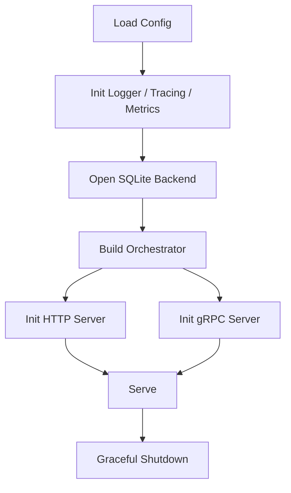

## 前置知识

- [02 架构深度剖析](02-architecture-deep-dive.md)

## 本文目标

完成阅读后，你将理解：

1. Go 服务是如何启动并组织依赖的
2. SQLite 存储引擎如何维护主表、索引和治理日志
3. REST 与 gRPC 层分别做了什么
4. 服务端当前有哪些工程化能力

## 入口：`cmd/server/main.go`

Go 服务入口文件是 **`go-server/cmd/server/main.go:23`**。

启动顺序可以概括为：



下面这段代码就是整个服务的骨架：

文件：`go-server/cmd/server/main.go:23`

```go
func main() {
	cfg := config.Load()
	logger := observability.NewLogger(cfg.LogLevel)
	shutdownTracing := observability.InitTracing()
	defer func() {
		_ = shutdownTracing(context.Background())
	}()

	metrics := observability.NewMetrics()
	backend, err := storage.New(cfg.DatabasePath)
	if err != nil {
		logger.Error("init storage failed", "error", err)
		os.Exit(1)
	}
	defer backend.Close()

	orchestrator := search.New(backend, search.Config{
		SemanticLimit: int32(cfg.SemanticLimit),
		LexicalLimit:  int32(cfg.LexicalLimit),
		EntityLimit:   int32(cfg.EntityLimit),
		DefaultLimit:  int32(cfg.DefaultLimit),
		RRFK:          cfg.RRFK,
	})

	httpHandler := gateway.NewHandler(backend, orchestrator, cfg, metrics)
	httpServer := &http.Server{
		Addr:    cfg.HTTPAddress,
		Handler: httpHandler.Routes(logger),
	}

	grpcServer := grpc.NewServer(grpc.UnaryInterceptor(grpcserver.UnaryAuthInterceptor(cfg)))
	memoryv1.RegisterStorageServiceServer(grpcServer, grpcserver.New(backend, orchestrator, metrics))
	grpcListener, err := net.Listen("tcp", cfg.GRPCAddress)
	if err != nil {
		logger.Error("listen grpc failed", "error", err)
		os.Exit(1)
	}

	go func() {
		logger.Info("http server started", "address", cfg.HTTPAddress)
		if err := httpServer.ListenAndServe(); err != nil && err != http.ErrServerClosed {
			logger.Error("http server failed", "error", err)
		}
	}()

	go func() {
		logger.Info("grpc server started", "address", cfg.GRPCAddress)
		if err := grpcServer.Serve(grpcListener); err != nil {
			logger.Error("grpc server failed", "error", err)
		}
	}()

	waitForShutdown(logger, httpServer, grpcServer)
}
```

这段入口代码值得面试里专门讲三点：

1. `config.Load()` 在最前面执行，后面所有依赖都从同一份配置读值，避免 HTTP、gRPC、存储层各读各的环境变量。
2. `storage.New()` 比协议层更早初始化，因为 HTTP handler 和 gRPC server 都依赖同一个 `Backend`。
3. `search.New()` 只接收 `Backend` 接口和配置，这让编排层和协议层解耦，后续写单元测试也更容易。

如果面试官继续问“为什么 HTTP 和 gRPC 要共用一个编排器”，可以回答：这样做能保证两个入口在搜索策略、RRF 融合、因果追踪和访问计数刷新上完全一致，减少行为分叉。

## 优雅关停：`waitForShutdown()`

很多候选人会说“支持优雅关停”，但说不清代码里到底怎么做。本项目实现很短，却很典型。

文件：`go-server/cmd/server/main.go:78`

```go
func waitForShutdown(logger *slog.Logger, httpServer *http.Server, grpcServer *grpc.Server) {
	stop := make(chan os.Signal, 1)
	signal.Notify(stop, syscall.SIGINT, syscall.SIGTERM)
	<-stop
	logger.Info("shutting down servers")
	ctx, cancel := context.WithTimeout(context.Background(), 5*time.Second)
	defer cancel()
	_ = httpServer.Shutdown(ctx)
	grpcServer.GracefulStop()
}
```

这里的顺序有明确理由：

1. `signal.Notify` 只关心 `SIGINT` 和 `SIGTERM`，已经覆盖本地 `Ctrl+C` 和容器停止两种主流场景。
2. `httpServer.Shutdown(ctx)` 放在前面，意味着先停止接收新的 HTTP 连接，同时给正在执行的请求一个 5 秒收尾窗口。
3. `grpcServer.GracefulStop()` 放在后面，让已经建立的 RPC handler 自然返回。  
4. 如果先停 gRPC，再关 HTTP，可能出现 Python SDK 远程模式正在走 gRPC，而 HTTP `/health` 又还活着，外部探针会误判服务仍然完整可用。

这属于很典型的“先收入口、再排空飞行请求”的服务关停思路。

## 存储引擎：`internal/storage/sqlite.go`

核心文件是 **`go-server/internal/storage/sqlite.go`**。

它负责：

- 打开 `sqlite3` 连接
- 开启外键与 `WAL`
- 调用迁移器创建 schema
- 对记忆、向量、实体、关系、演化和审计做统一读写

### `New()`：PRAGMA、WAL 和 migration

文件：`go-server/internal/storage/sqlite.go:27`

```go
func New(databasePath string) (*Backend, error) {
	db, err := sql.Open("sqlite3", databasePath)
	if err != nil {
		return nil, fmt.Errorf("open sqlite database: %w", err)
	}
	if _, err := db.Exec("PRAGMA foreign_keys = ON"); err != nil {
		return nil, fmt.Errorf("enable foreign keys: %w", err)
	}
	if databasePath != ":memory:" {
		if _, err := db.Exec("PRAGMA journal_mode = WAL"); err != nil {
			return nil, fmt.Errorf("enable wal: %w", err)
		}
	}
	if err := migrations.Apply(db); err != nil {
		return nil, err
	}
	return &Backend{db: db, DatabasePath: databasePath}, nil
}
```

逐段看它为什么这样写：

1. `sql.Open("sqlite3", databasePath)` 只是创建连接句柄，还没有验证 schema，所以后面必须紧跟初始化步骤。
2. `PRAGMA foreign_keys = ON` 是 SQLite 里很容易漏掉的一步。不开启的话，`relations`、`memory_vectors` 这类依赖 `memory_id` 的表就无法真正受外键约束保护。
3. `databasePath != ":memory:"` 时才启用 `WAL`。原因很直接：内存数据库没有磁盘日志文件，不需要 WAL；磁盘数据库开启后可以提升读写并发体验。
4. `migrations.Apply(db)` 把 schema 初始化统一交给迁移器，而不是分散在业务代码里拼 SQL，这样版本演进更稳。
5. 返回的是带 `DatabasePath` 的 `Backend`，后面健康检查里要用这个路径计算库文件大小。

如果面试官问“SQLite 用 WAL 有什么现实收益”，你可以回答：这个项目是读多写少场景，WAL 能让读请求和写事务的冲突更少，尤其是搜索和 `AddMemory` 同时发生时更稳。

### `AddMemory()`：完整事务走读

计划里要求这一节必须给出完整事务代码，因为这是 Go 服务端最关键的一条写入路径。

文件：`go-server/internal/storage/sqlite.go:50`

```go
func (backend *Backend) AddMemory(ctx context.Context, item *memoryv1.MemoryItem) (*memoryv1.MemoryItem, error) {
	tx, err := backend.db.BeginTx(ctx, nil)
	if err != nil {
		return nil, err
	}
	defer tx.Rollback()
	entityJSON, err := json.Marshal(item.EntityRefs)
	if err != nil {
		return nil, err
	}
	tagsJSON, err := json.Marshal(item.Tags)
	if err != nil {
		return nil, err
	}
	result, err := tx.ExecContext(
		ctx,
		`INSERT INTO memories (
			id, content, memory_type, created_at, last_accessed, access_count,
			valid_from, valid_until, trust_score, importance, layer, decay_rate,
			source_id, causal_parent_id, supersedes_id, entity_refs_json, tags_json, deleted_at
		) VALUES (?, ?, ?, ?, ?, ?, ?, ?, ?, ?, ?, ?, ?, ?, ?, ?, ?, ?)`,
		item.Id, item.Content, item.MemoryType, item.CreatedAt, item.LastAccessed, item.AccessCount,
		nullable(item.ValidFrom), nullable(item.ValidUntil), item.TrustScore, item.Importance, item.Layer, item.DecayRate,
		item.SourceId, nullable(item.CausalParentId), nullable(item.SupersedesId), string(entityJSON), string(tagsJSON), nullable(item.DeletedAt),
	)
	if err != nil {
		return nil, err
	}
	rowid, err := result.LastInsertId()
	if err != nil {
		return nil, err
	}
	embeddingJSON, err := json.Marshal(item.Embedding)
	if err != nil {
		return nil, err
	}
	if _, err := tx.ExecContext(ctx, `INSERT INTO memory_vectors (memory_id, memory_rowid, embedding_json) VALUES (?, ?, ?)`, item.Id, rowid, string(embeddingJSON)); err != nil {
		return nil, err
	}
	for _, entity := range item.EntityRefs {
		if _, err := tx.ExecContext(ctx, `INSERT OR IGNORE INTO entity_index (entity, memory_id) VALUES (?, ?)`, strings.ToLower(entity), item.Id); err != nil {
			return nil, err
		}
	}
	if err := appendEvolutionTx(ctx, tx, item.Id, "created", map[string]any{"source_id": item.SourceId}); err != nil {
		return nil, err
	}
	if err := appendAuditTx(ctx, tx, "system", "create", "memory", item.Id, map[string]any{"source_id": item.SourceId}); err != nil {
		return nil, err
	}
	if err := tx.Commit(); err != nil {
		return nil, err
	}
	return item, nil
}
```

这一段要按事务语义来理解：

1. `BeginTx(ctx, nil)` 先显式开启事务，说明这条写入不是单表插入，而是多表一致性写入。
2. `defer tx.Rollback()` 是安全网。只要中间任何一步报错，函数返回时就会自动回滚；如果已经 `Commit()` 成功，后续的 `Rollback()` 会变成无害操作。
3. `json.Marshal(item.EntityRefs)` 和 `json.Marshal(item.Tags)` 先把可变长列表序列化成 JSON 字符串，因为主表里存的是 `entity_refs_json`、`tags_json` 两列。
4. 主表 `INSERT INTO memories (...)` 一次性写入 18 列。这里的设计重点是：主数据统一落在 `memories`，避免“内容在主表、治理字段在别表”导致读取时频繁 join。
5. `nullable(item.ValidFrom)`、`nullable(item.ValidUntil)`、`nullable(item.CausalParentId)` 这些调用是在把空字符串转成 SQL `NULL`。如果直接写空串，后续查询就很难区分“字段不存在”和“字段存在但内容为空”。
6. `LastInsertId()` 虽然主键是业务层生成的 `id`，但 SQLite 仍然维护内部 rowid。这里取 rowid 是为了给 `memory_vectors.memory_rowid` 做外键和后续扫描使用。
7. `memory_vectors` 单独存向量，是因为 embedding 体积大、访问模式和主表不同，拆开后主表更轻。
8. `INSERT OR IGNORE INTO entity_index` 会把实体全部转成小写再入库，这样 `Alice`、`alice`、`ALICE` 不会重复建索引项。
9. `appendEvolutionTx` 和 `appendAuditTx` 都在同一个事务里写，含义很重要：只有主数据真的提交成功，治理日志才会出现对应记录。
10. 最后的 `tx.Commit()` 才是整个写入真正生效的时刻。前面的每一步都只是暂存在事务上下文里。

这一条链路很适合面试里讲“为什么要用事务而不是多次单独写库”：因为一条记忆的主数据、向量、实体索引、演化事件和审计事件必须一起成功，否则后续搜索、追踪和治理都会看到半成品状态。

### `scanMemory()`、`scanMemoryRows()`、`scanMemoryWithScore()`

这三个扫描函数很像，但职责不同。

文件：`go-server/internal/storage/sqlite.go:589`

```go
func scanMemory(row *sql.Row) (*memoryv1.MemoryItem, error) {
	item := &memoryv1.MemoryItem{}
	var entityJSON string
	var tagsJSON string
	var embeddingJSON sql.NullString
	var validFrom sql.NullString
	var validUntil sql.NullString
	var causalParentID sql.NullString
	var supersedesID sql.NullString
	var deletedAt sql.NullString
	err := row.Scan(
		&item.Id, &item.Content, &item.MemoryType, &item.CreatedAt, &item.LastAccessed, &item.AccessCount,
		&validFrom, &validUntil, &item.TrustScore, &item.Importance, &item.Layer, &item.DecayRate,
		&item.SourceId, &causalParentID, &supersedesID, &entityJSON, &tagsJSON, &deletedAt, &embeddingJSON,
	)
	if err != nil {
		if err == sql.ErrNoRows {
			return nil, nil
		}
		return nil, err
	}
	populateOptionalFields(item, entityJSON, tagsJSON, embeddingJSON, validFrom, validUntil, causalParentID, supersedesID, deletedAt)
	return item, nil
}
```

文件：`go-server/internal/storage/sqlite.go:614`

```go
func scanMemoryRows(rows *sql.Rows) (*memoryv1.MemoryItem, error) {
	item := &memoryv1.MemoryItem{}
	var entityJSON string
	var tagsJSON string
	var embeddingJSON sql.NullString
	var validFrom sql.NullString
	var validUntil sql.NullString
	var causalParentID sql.NullString
	var supersedesID sql.NullString
	var deletedAt sql.NullString
	if err := rows.Scan(
		&item.Id, &item.Content, &item.MemoryType, &item.CreatedAt, &item.LastAccessed, &item.AccessCount,
		&validFrom, &validUntil, &item.TrustScore, &item.Importance, &item.Layer, &item.DecayRate,
		&item.SourceId, &causalParentID, &supersedesID, &entityJSON, &tagsJSON, &deletedAt, &embeddingJSON,
	); err != nil {
		return nil, err
	}
	populateOptionalFields(item, entityJSON, tagsJSON, embeddingJSON, validFrom, validUntil, causalParentID, supersedesID, deletedAt)
	return item, nil
}
```

文件：`go-server/internal/storage/sqlite.go:635`

```go
func scanMemoryWithScore(rows *sql.Rows) (*memoryv1.MemoryItem, float64, error) {
	item := &memoryv1.MemoryItem{}
	var entityJSON string
	var tagsJSON string
	var embeddingJSON sql.NullString
	var validFrom sql.NullString
	var validUntil sql.NullString
	var causalParentID sql.NullString
	var supersedesID sql.NullString
	var deletedAt sql.NullString
	var score float64
	if err := rows.Scan(
		&item.Id, &item.Content, &item.MemoryType, &item.CreatedAt, &item.LastAccessed, &item.AccessCount,
		&validFrom, &validUntil, &item.TrustScore, &item.Importance, &item.Layer, &item.DecayRate,
		&item.SourceId, &causalParentID, &supersedesID, &entityJSON, &tagsJSON, &deletedAt, &embeddingJSON, &score,
	); err != nil {
		return nil, 0, err
	}
	populateOptionalFields(item, entityJSON, tagsJSON, embeddingJSON, validFrom, validUntil, causalParentID, supersedesID, deletedAt)
	return item, score, nil
}
```

可以把它们理解成三种场景：

1. `scanMemory()` 服务于 `QueryRowContext` 场景，只读一行，所以入参是 `*sql.Row`。
2. `scanMemoryRows()` 服务于 `rows.Next()` 场景，一次处理结果集中的一条记录。
3. `scanMemoryWithScore()` 适用于像 `SearchByEntities()` 这种 SQL 自己额外带了 `score` 列的查询。

其中最容易被忽略的是 `sql.NullString` 的使用。像 `valid_from`、`valid_until`、`deleted_at` 这类字段可能为 `NULL`，如果直接扫描到普通字符串，就丢掉了是否存在这个值的信息。

而 `scanMemory()` 对 `sql.ErrNoRows` 特别处理，返回的是 `nil, nil`，这也很关键。上层 `GetMemory()` 可以据此决定返回 `found=false`，而不是把“没查到”当成 500。

### 递归 CTE：`TraceAncestors()`

文件：`go-server/internal/storage/sqlite.go:304`

```sql
WITH RECURSIVE ancestors(id, depth) AS (
	SELECT causal_parent_id, 1
	FROM memories
	WHERE id = ? AND causal_parent_id IS NOT NULL
	UNION ALL
	SELECT m.causal_parent_id, a.depth + 1
	FROM ancestors a
	JOIN memories m ON m.id = a.id
	WHERE a.depth < ? AND m.causal_parent_id IS NOT NULL
)
SELECT m.*, v.embedding_json
FROM ancestors a
JOIN memories m ON m.id = a.id
LEFT JOIN memory_vectors v ON v.memory_id = m.id
WHERE m.deleted_at IS NULL
ORDER BY a.depth ASC
```

这段 SQL 是项目里很适合拿来当“会写递归查询”的证据：

1. 锚点子句先找到当前记忆的直接父节点，也就是 `causal_parent_id`。
2. 递归子句再用上一步得到的父节点继续向上追，直到 `depth >= maxDepth`。
3. 最终查询再把祖先 id 回 join 到 `memories` 和 `memory_vectors`，拿到完整的 `MemoryItem`。
4. `ORDER BY a.depth ASC` 保证输出顺序就是“最近父节点在前，更远祖先在后”。

这比在应用层 while 循环一层层查数据库更紧凑，也更容易保证顺序一致。

### 余弦相似度：Go 端为什么是纯扫描

文件：`go-server/internal/storage/sqlite.go:552`

```go
func cosineSimilarity(left []float32, right []float32) float64 {
	if len(left) == 0 || len(right) == 0 {
		return 0
	}
	size := len(left)
	if len(right) < size {
		size = len(right)
	}
	var numerator float64
	var leftNorm float64
	var rightNorm float64
	for index := range size {
		numerator += float64(left[index] * right[index])
		leftNorm += float64(left[index] * left[index])
		rightNorm += float64(right[index] * right[index])
	}
	if leftNorm == 0 || rightNorm == 0 {
		return 0
	}
	return numerator / (math.Sqrt(leftNorm) * math.Sqrt(rightNorm))
}
```

有四个实现细节值得讲：

1. 先判断空向量，避免后面算范数时出现无意义结果。
2. `size` 取两边较短长度，说明代码默认容忍维度不完全一致，至少不会越界。
3. 点积、左范数、右范数在同一个循环里完成，这样只扫一遍数据。
4. 两边范数只要有一个是 0，就直接返回 0，避免分母为 0。

Go 端当前没有接 `sqlite-vec`，所以 `SearchByVector()` 的实现是“全表扫向量 + 计算余弦 + 排序截断”。这在单机、小规模场景够用，但也是系统的主要性能边界之一，后面在 [11 性能与基准测试](11-performance-benchmarking.md) 会继续展开。

## 检索编排：`internal/search/orchestrator.go`

编排器是服务模式里的“查询中枢”。

文件：`go-server/internal/search/orchestrator.go:38`

```go
func (orchestrator *Orchestrator) Search(ctx context.Context, query string, embedding []float32, entities []string, limit int32) ([]*memoryv1.SearchResult, error) {
	if limit == 0 {
		limit = orchestrator.config.DefaultLimit
	}
	plan := orchestrator.router.Plan(query)
	rankings := map[string][]string{}
	resultsByID := map[string]*memoryv1.MemoryItem{}
	matchedBy := map[string]map[string]bool{}
	memoryType := plan.Filters["memory_type"]
	normalizedQuery := controller.StripIntentMarkers(query)
	if normalizedQuery == "" {
		normalizedQuery = query
	}

	for _, strategy := range plan.Strategies {
		switch strategy {
		case "semantic":
			results, err := orchestrator.backend.SearchByVector(ctx, embedding, orchestrator.config.SemanticLimit, memoryType)
			if err != nil {
				return nil, err
			}
			collectResults("semantic", results, rankings, resultsByID, matchedBy)
		case "full_text":
			results, err := orchestrator.backend.SearchFullText(ctx, normalizedQuery, orchestrator.config.LexicalLimit, memoryType)
			if err != nil {
				return nil, err
			}
			collectResults("full_text", results, rankings, resultsByID, matchedBy)
		case "entity":
			results, err := orchestrator.backend.SearchByEntities(ctx, entities, orchestrator.config.EntityLimit, memoryType)
			if err != nil {
				return nil, err
			}
			collectResults("entity", results, rankings, resultsByID, matchedBy)
		case "causal_trace":
			seedIDs := rankings["semantic"]
			if len(seedIDs) == 0 {
				seedIDs = rankings["full_text"]
			}
			traceIDs := []string{}
			for _, seedID := range take(seedIDs, 2) {
				ancestors, err := orchestrator.backend.TraceAncestors(ctx, seedID, 5)
				if err != nil {
					return nil, err
				}
				for _, item := range ancestors {
					resultsByID[item.Id] = item
					ensureMatch(item.Id, matchedBy)["causal_trace"] = true
					traceIDs = append(traceIDs, item.Id)
				}
			}
			if len(traceIDs) > 0 {
				rankings["causal_trace"] = traceIDs
			}
		}
	}

	fused := controller.ReciprocalRankFusion(rankings, orchestrator.config.RRFK)
	finalIDs := make([]string, 0, len(fused))
	for id := range fused {
		finalIDs = append(finalIDs, id)
	}
	if plan.Filters["sort"] == "recency" {
		sort.Slice(finalIDs, func(i, j int) bool {
			left := resultsByID[finalIDs[i]]
			right := resultsByID[finalIDs[j]]
			if fused[finalIDs[i]] == fused[finalIDs[j]] {
				return left.CreatedAt > right.CreatedAt
			}
			return fused[finalIDs[i]] > fused[finalIDs[j]]
		})
	}
	output := []*memoryv1.SearchResult{}
	for _, memoryID := range take(finalIDs, int(limit)) {
		_ = orchestrator.backend.TouchMemory(ctx, memoryID)
		refreshed, err := orchestrator.backend.GetMemory(ctx, memoryID)
		if err != nil {
			return nil, err
		}
		if refreshed == nil {
			continue
		}
		output = append(output, &memoryv1.SearchResult{
			Item:      refreshed,
			Score:     fused[memoryID],
			MatchedBy: flatten(matchedBy[memoryID]),
		})
	}
	return output, nil
}
```

把这段代码拆开理解：

1. `limit == 0` 时回落到 `DefaultLimit`，所以调用方可以省略 limit。
2. `router.Plan(query)` 先做意图判断，决定本次检索要走哪些路。
3. `rankings` 保存每一路的 ID 排名；`resultsByID` 保存实体内容；`matchedBy` 记录每条记忆命中了哪些策略。
4. `StripIntentMarkers(query)` 先剥掉“为什么”“如何”“什么时候”这类意图提示词，避免它们污染全文检索。
5. `semantic`、`full_text`、`entity` 三条策略分别调用后端接口，各自返回一个排序列表。
6. `causal_trace` 不会独立召回，它要先依赖前面已经命中的结果作为种子。优先选 semantic 前两条；如果 semantic 为空，再退到 full-text 前两条。
7. `TraceAncestors(ctx, seedID, 5)` 说明祖先追踪深度目前固定为 5，这个数值是工程上的折中：足够还原局部因果链，又不会把结果集拉得太长。
8. `ReciprocalRankFusion` 融合之后，先拿到一个 `id -> score` 的表，再按需要决定是否追加 recency 排序。
9. 真正返回前会先 `TouchMemory()`，再 `GetMemory()` 读一遍最新值。这样返回给客户端的 `access_count` 和 `last_accessed` 是已经更新过的。

这个“先 touch 再 get”的小步骤很值得讲，因为它体现了接口体验设计：用户搜到一条记忆时，希望看到的是已经反映本次访问后的状态。

## REST 网关：`internal/gateway/handler.go`

REST 路由入口在 **`go-server/internal/gateway/handler.go`**。

### 路由注册模式

文件：`go-server/internal/gateway/handler.go:40`

```go
func (handler *Handler) Routes(logger *slog.Logger) http.Handler {
	mux := http.NewServeMux()
	mux.Handle("/metrics", promhttp.Handler())
	mux.HandleFunc("/health", handler.handleHealth)
	mux.HandleFunc("/api/v1/info", handler.handleInfo)
	mux.HandleFunc("/api/v1/memories", handler.handleMemories)
	mux.HandleFunc("/api/v1/memories/", handler.handleMemoryByID)
	mux.HandleFunc("/api/v1/search/full-text", handler.handleSearchFullText)
	mux.HandleFunc("/api/v1/search/entities", handler.handleSearchEntities)
	mux.HandleFunc("/api/v1/search/vector", handler.handleSearchVector)
	mux.HandleFunc("/api/v1/search/query", handler.handleSearchQuery)
	mux.HandleFunc("/api/v1/touch", handler.handleTouchMemory)
	mux.HandleFunc("/api/v1/trace/ancestors", handler.handleTraceAncestors)
	mux.HandleFunc("/api/v1/trace/descendants", handler.handleTraceDescendants)
	mux.HandleFunc("/api/v1/relations", handler.handleRelations)
	mux.HandleFunc("/api/v1/relations/exists", handler.handleRelationExists)
	mux.HandleFunc("/api/v1/evolution", handler.handleEvolution)
	mux.HandleFunc("/api/v1/audit", handler.handleAudit)
	return withMiddleware(mux, handler.config, logger, handler.metrics)
}
```

这里有两个工程点：

1. 所有业务路由都直接挂在标准库 `http.ServeMux` 上，说明服务对外依赖很轻，没有引入额外 Web 框架。
2. 最后一行统一套 `withMiddleware(...)`，这样认证、日志、panic 恢复对所有接口都生效，路由代码本身保持纯净。

### `context.WithTimeout` 的用法

文件：`go-server/internal/gateway/handler.go:61`

```go
func (handler *Handler) context(request *http.Request) (context.Context, context.CancelFunc) {
	return context.WithTimeout(request.Context(), time.Duration(handler.config.RequestTimeoutS*float64(time.Second)))
}
```

这行代码很短，但说明了两个设计点：

1. 超时不是写死的，而是从 `config.RequestTimeoutS` 读取，默认 5 秒。
2. 子 context 继承自 `request.Context()`，所以如果客户端先断开连接，后端查询也会及时收到取消信号。

在 `handleMemories()`、`handleSearchQuery()`、`handleTraceAncestors()` 等 handler 里，都可以看到 `ctx, cancel := handler.context(request)` 这条模式。这就是 Go 里很常见的“请求级超时边界”。

## 中间件栈：`internal/gateway/middleware.go`

计划要求这一节必须完整展示 `middleware.go` 并解释执行顺序。

文件：`go-server/internal/gateway/middleware.go:13`

```go
func withMiddleware(next http.Handler, cfg config.Config, logger *slog.Logger, metrics *observability.Metrics) http.Handler {
	return recoveryMiddleware(loggingMiddleware(authMiddleware(next, cfg), logger, metrics), logger)
}

func authMiddleware(next http.Handler, cfg config.Config) http.Handler {
	return http.HandlerFunc(func(writer http.ResponseWriter, request *http.Request) {
		if cfg.APIKey == "" && cfg.JWTSecret == "" {
			next.ServeHTTP(writer, request)
			return
		}
		if cfg.APIKey != "" && auth.HasAPIKey(request, cfg.APIKey) {
			next.ServeHTTP(writer, request)
			return
		}
		if cfg.JWTSecret != "" && auth.HasValidJWT(request, cfg.JWTSecret) {
			next.ServeHTTP(writer, request)
			return
		}
		http.Error(writer, `{"error":"unauthorized"}`, http.StatusUnauthorized)
	})
}

func loggingMiddleware(next http.Handler, logger *slog.Logger, metrics *observability.Metrics) http.Handler {
	return http.HandlerFunc(func(writer http.ResponseWriter, request *http.Request) {
		start := time.Now()
		next.ServeHTTP(writer, request)
		metrics.HTTPDuration.WithLabelValues(request.Method, request.URL.Path).Observe(time.Since(start).Seconds())
		logger.Info("http request", "method", request.Method, "path", request.URL.Path, "duration", time.Since(start).String())
	})
}

func recoveryMiddleware(next http.Handler, logger *slog.Logger) http.Handler {
	return http.HandlerFunc(func(writer http.ResponseWriter, request *http.Request) {
		defer func() {
			if recovered := recover(); recovered != nil {
				logger.Error("panic recovered", "error", recovered)
				http.Error(writer, `{"error":"internal server error"}`, http.StatusInternalServerError)
			}
		}()
		next.ServeHTTP(writer, request)
	})
}
```

这段代码要从“组合顺序”和“运行顺序”两层看。

### 组合顺序

`withMiddleware()` 写的是：

```go
recoveryMiddleware(loggingMiddleware(authMiddleware(next, cfg), logger, metrics), logger)
```

从里到外是：

1. `authMiddleware`
2. `loggingMiddleware`
3. `recoveryMiddleware`

### 实际执行顺序

请求进来时，最先进入最外层 `recoveryMiddleware`，然后进入 `loggingMiddleware`，最后进入 `authMiddleware` 和真正的业务 handler。

所以可以把职责理解成：

1. **recovery** 负责兜底：不管里面哪层 panic，至少还能回一个 500。
2. **logging** 负责记账：把整个请求链路耗时记下来。
3. **auth** 负责访问控制：决定要不要放行业务逻辑。

### `authMiddleware`：三段式判断

这一层的控制逻辑非常清晰：

1. 如果 `APIKey` 和 `JWTSecret` 都没配置，直接放行。这符合本地开发零配置启动的目标。
2. 如果配置了 API Key，并且请求头里的密钥匹配，就放行。
3. 如果配置了 JWT Secret，并且 Bearer Token 校验通过，也放行。
4. 前三条都不满足时，返回 401。

这意味着项目支持两类鉴权材料：静态 API Key 和 JWT。只要命中任意一种即可。

### `loggingMiddleware`：指标 + 结构化日志

这里同时做了两件事：

1. `metrics.HTTPDuration.WithLabelValues(...)` 把请求延迟写到 Prometheus histogram。
2. `logger.Info(...)` 用 `slog` 写结构化日志，字段里有方法、路径和耗时。

在面试里可以把这解释为“指标用于聚合看趋势，日志用于具体排查单次请求”。

### `recoveryMiddleware`：防止 panic 打穿进程

这一层的价值不在代码长度，而在部署时的实际收益。即使某个 handler 里因为空指针或数组越界 panic，整个服务也不会直接退出，探针和其他请求仍然能继续工作。

## gRPC 服务：`internal/grpc/server.go`

gRPC 侧实现位于 **`go-server/internal/grpc/server.go`**，对应 `StorageService` 的 18 个 RPC。

### 以 `SearchQuery` 为例看完整链路

文件：`go-server/internal/grpc/server.go:64`

```go
func (server *Server) SearchQuery(ctx context.Context, request *memoryv1.SearchQueryRequest) (*memoryv1.SearchResultList, error) {
	start := time.Now()
	results, err := server.orchestrator.Search(ctx, request.Query, request.Embedding, request.Entities, request.Limit)
	if err != nil {
		return nil, err
	}
	server.observeSearch("grpc", "fused", start)
	return &memoryv1.SearchResultList{Results: results}, nil
}
```

这条 RPC 可以按五步理解：

1. gRPC 框架先把 Protobuf request 解码成 `SearchQueryRequest`。
2. 服务方法直接取 `request.Query`、`request.Embedding`、`request.Entities`、`request.Limit`。
3. 核心搜索逻辑完全下沉到 `orchestrator.Search(...)`，RPC 层自己不做策略判断。
4. 成功返回后用 `observeSearch("grpc", "fused", start)` 记录耗时。
5. 最后把结果重新包装成 `SearchResultList`。

这一层很薄，说明作者刻意把“协议适配”和“业务逻辑”拆开了。REST handler 里也用了同一个编排器，这就是一个很标准的多协议共用业务核设计。

## gRPC 认证拦截器：`internal/grpc/interceptor.go`

文件：`go-server/internal/grpc/interceptor.go:14`

```go
func UnaryAuthInterceptor(cfg config.Config) grpc.UnaryServerInterceptor {
	return func(ctx context.Context, request any, info *grpc.UnaryServerInfo, handler grpc.UnaryHandler) (any, error) {
		if cfg.APIKey == "" && cfg.JWTSecret == "" {
			return handler(ctx, request)
		}
		md, _ := metadata.FromIncomingContext(ctx)
		apiKey := firstValue(md.Get("x-api-key"))
		authorization := firstValue(md.Get("authorization"))
		if cfg.APIKey != "" && auth.APIKeyMatches(apiKey, cfg.APIKey) {
			return handler(ctx, request)
		}
		if cfg.JWTSecret != "" && auth.JWTMatches(auth.ParseBearerToken(authorization), cfg.JWTSecret) {
			return handler(ctx, request)
		}
		return nil, status.Error(codes.Unauthenticated, "unauthorized")
	}
}
```

这段逻辑和 HTTP 中间件口径一致，只是载体从 header 变成了 metadata。

重点有三项：

1. `metadata.FromIncomingContext(ctx)` 从 gRPC 上下文里提取传入元数据。
2. `x-api-key` 和 `authorization` 这两个键与 HTTP 侧保持一致，客户端切协议时不用改鉴权材料的命名习惯。
3. 失败时返回的是 gRPC 语义下的 `codes.Unauthenticated`，而不是 HTTP 401。

这就是“同一套认证规则，不同协议各用自己的错误表达方式”。

## 配置：`internal/config/config.go`

配置层使用 `viper`，当前字段集中在一个 `Config` 结构体里。

文件：`go-server/internal/config/config.go:20`

```go
func Load() Config {
	viper.SetDefault("http_address", ":8080")
	viper.SetDefault("grpc_address", ":9090")
	viper.SetDefault("database_path", "agent-memory.db")
	viper.SetDefault("log_level", "info")
	viper.SetDefault("semantic_limit", 10)
	viper.SetDefault("lexical_limit", 10)
	viper.SetDefault("entity_limit", 10)
	viper.SetDefault("default_limit", 5)
	viper.SetDefault("rrf_k", 60)
	viper.SetDefault("request_timeout_seconds", 5.0)
	viper.SetEnvPrefix("agent_memory")
	viper.AutomaticEnv()
	return Config{...}
}
```

### 环境变量总表

| 环境变量 | 默认值 | 类型 | 作用 |
|---|---:|---|---|
| `AGENT_MEMORY_HTTP_ADDRESS` | `:8080` | string | HTTP 服务监听地址 |
| `AGENT_MEMORY_GRPC_ADDRESS` | `:9090` | string | gRPC 服务监听地址 |
| `AGENT_MEMORY_DATABASE_PATH` | `agent-memory.db` | string | SQLite 文件路径 |
| `AGENT_MEMORY_API_KEY` | 空 | string | HTTP / gRPC API Key |
| `AGENT_MEMORY_JWT_SECRET` | 空 | string | JWT 校验密钥 |
| `AGENT_MEMORY_LOG_LEVEL` | `info` | string | 日志级别 |
| `AGENT_MEMORY_SEMANTIC_LIMIT` | `10` | int | semantic 初始召回数 |
| `AGENT_MEMORY_LEXICAL_LIMIT` | `10` | int | full-text 初始召回数 |
| `AGENT_MEMORY_ENTITY_LIMIT` | `10` | int | entity 初始召回数 |
| `AGENT_MEMORY_DEFAULT_LIMIT` | `5` | int | 最终默认返回条数 |
| `AGENT_MEMORY_RRF_K` | `60` | int | RRF 融合常数 |
| `AGENT_MEMORY_REQUEST_TIMEOUT_SECONDS` | `5.0` | float | 单请求超时秒数 |

### `Viper` 在这里到底做了什么

可以用一句话概括：

> `SetEnvPrefix("agent_memory") + AutomaticEnv()` 会把配置键自动映射到 `AGENT_MEMORY_*` 环境变量，并在没有显式配置文件时直接生效。

这让本项目可以完全靠环境变量启动，适合容器部署，也适合本地快速试跑。

## 可观测性、治理与 CLI

Go 服务目前提供：

- `internal/observability/logger.go`：结构化日志
- `internal/observability/metrics.go`：Prometheus 指标
- `internal/observability/tracing.go`：Tracing 初始化
- `internal/governance/health.go`：健康快照
- `internal/governance/audit.go`：审计读取
- `internal/governance/export.go`：JSONL 导出
- `cmd/cli/main.go`：`health`、`store`、`search` 三个轻量命令

这里的工程取舍很明确：Go 服务主要承担稳定的数据面和协议面；更贴近用户工作流的命令入口仍然放在 Python SDK 和 MCP 侧。

## Go 惯用模式

从代码风格看，这个服务已经体现了几个比较典型的 Go 工程习惯：

- 通过接口收窄依赖面，例如 `search.Backend`
- 使用 `context.Context` 贯穿请求边界
- 使用 `defer tx.Rollback()` 保证事务失败时能收口
- 在入口统一处理优雅关停
- 让协议层尽量薄，把业务逻辑留在编排器和存储层

这些点组合在一起，才让服务既容易讲，也容易测。

## 服务端调试建议

如果要快速调试 Go 服务，建议按下面的顺序：

1. `cd go-server && go test ./...`
2. `cd go-server && go run ./cmd/server`
3. `curl http://127.0.0.1:8080/health`
4. `curl http://127.0.0.1:8080/api/v1/info`
5. 发一个 `POST /api/v1/memories`
6. 再发一个 `POST /api/v1/search/query`

这样可以按“库是否能开 → 服务是否能起 → 写入是否成功 → 检索是否通”四层逐步缩小问题。

## 小结

- Go 服务承接了协议层、数据面和工程化能力
- `New()` 负责把 SQLite 调到可用状态：外键、WAL、migration 一次到位
- `AddMemory()` 用单事务维护主数据、向量、实体索引、演化日志和审计日志的一致性
- REST 与 gRPC 都尽量保持薄层，把核心搜索逻辑收敛到 `Orchestrator`
- 中间件、拦截器、超时和优雅关停一起构成了服务端的工程骨架

## 延伸阅读

- [03 算法指南](03-algorithm-guide.md)
- [05 Python SDK 指南](05-python-sdk-guide.md)
- [07 数据库 Schema 指南](07-database-schema-guide.md)
- [09 API 参考](09-api-reference.md)
