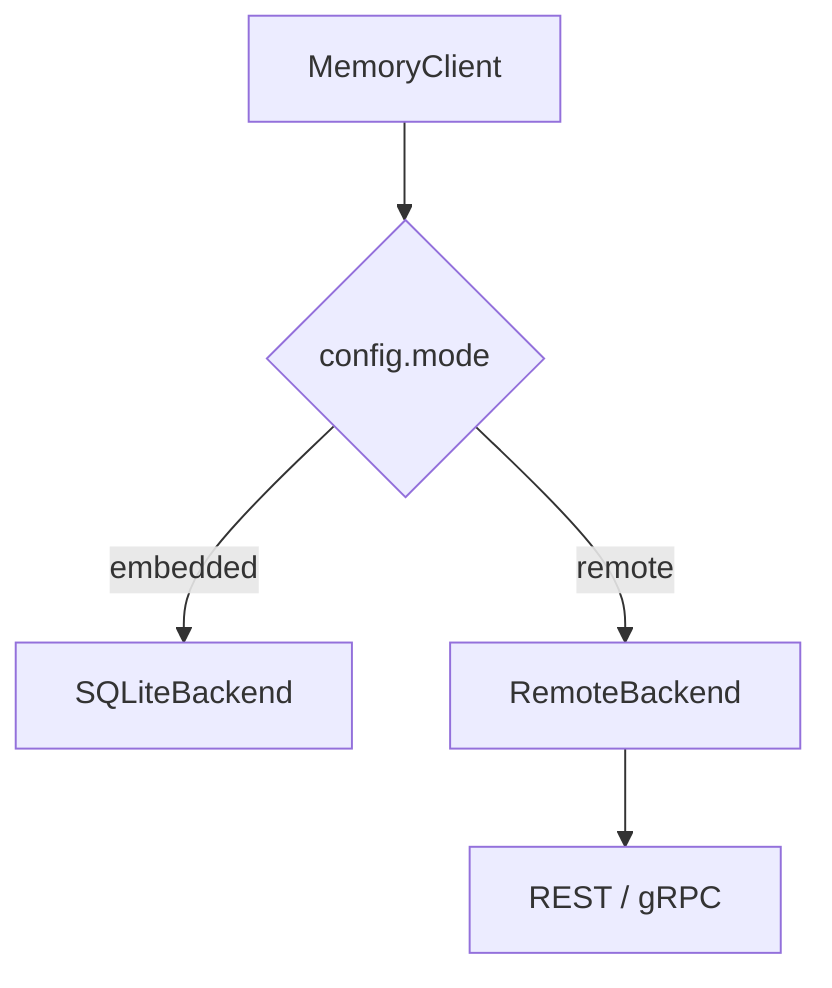

## 前置知识

- [02 架构深度剖析](02-architecture-deep-dive.md)

## 本文目标

完成阅读后，你将理解：

1. `MemoryClient` 为什么是 Python 端统一入口
2. 嵌入模式与远程模式在 SDK 侧如何切换
3. `add()`、`search()`、`ingest_conversation()` 和 `maintain()` 的执行路径
4. Python 端如何集成 embedding、LLM 和 MCP

## 统一入口：`MemoryClient`

核心文件是 **`src/agent_memory/client.py:39`**。

`MemoryClient` 初始化时会组装以下组件：

- `backend`
- `embedding_provider`
- `entity_extractor`
- `router`
- `llm_client`
- `pipeline`
- `forgetting_policy`
- `trust_scorer`
- `conflict_detector`
- `consolidation_planner`
- `health_monitor`
- `audit_reader`
- `exporter`
- `importer`

这意味着调用方通常只需要创建一个对象，就能使用完整能力。

### `_build_backend()`：双模式切换的起点

文件：`src/agent_memory/client.py:65`

```python
def _build_backend(self) -> StorageBackend:
    if self.config.mode.lower() == "remote":
        return RemoteBackend(self.config)
    return SQLiteBackend(
        self.config.database_path,
        prefer_sqlite_vec=self.config.enable_sqlite_vec,
    )
```

这段代码非常短，但它决定了 Python SDK 的角色：

1. `mode=remote` 时，SDK 退化成一个“强类型远程客户端”。
2. 默认路径走 `SQLiteBackend`，说明项目优先支持进程内、单机、本地优先的使用方式。
3. `prefer_sqlite_vec=self.config.enable_sqlite_vec` 说明嵌入模式下还会继续决定是否启用 `sqlite-vec`，也就是 Python 端在向量检索上比 Go 端更激进。



## `add()` 方法完整走读

计划要求这里必须展示真实代码，而不是只列步骤。

文件：`src/agent_memory/client.py:76`

```python
def add(
    self,
    content: str,
    *,
    source_id: str,
    memory_type: MemoryType | str = MemoryType.SEMANTIC,
    importance: float = 0.5,
    trust_score: float = 0.75,
    tags: list[str] | None = None,
    entity_refs: list[str] | None = None,
    causal_parent_id: str | None = None,
    supersedes_id: str | None = None,
) -> MemoryItem:
    memory_type = MemoryType(memory_type)
    embedding = self.embedding_provider.embed([content])[0]
    now = datetime.now(timezone.utc)
    base_trust = self.trust_scorer.score(source_reliability=trust_score)
    item = MemoryItem(
        id=str(uuid.uuid4()),
        content=content,
        memory_type=memory_type,
        embedding=embedding,
        created_at=now,
        last_accessed=now,
        importance=importance,
        trust_score=base_trust,
        source_id=source_id,
        entity_refs=entity_refs or self.entity_extractor.extract(content),
        tags=tags or [],
        causal_parent_id=causal_parent_id,
        supersedes_id=supersedes_id,
    )
    item = self.backend.add_memory(item)
    self._attach_structural_relations(item)
    conflicts = self.detect_conflicts(item)
    if conflicts:
        item, _ = self._apply_conflicts(item, conflicts)
    return item
```

这段代码可以按“写入前准备 → 正式入库 → 入库后治理”三层理解。

### 第一层：写入前准备

1. `memory_type = MemoryType(memory_type)` 先把字符串或枚举统一成 `MemoryType`，这样调用方可以传 `"semantic"`，内部仍保持强类型。
2. `self.embedding_provider.embed([content])[0]` 先生成向量。注意这里传的是单元素列表，因为 provider 的批量接口约定是 `list[str] -> list[list[float]]`。
3. `now = datetime.now(timezone.utc)` 统一使用 UTC 时间，避免本地时区混乱。
4. `self.trust_scorer.score(source_reliability=trust_score)` 并没有直接采用调用方给的 `trust_score`，而是把它当作来源可靠度输入，再重新算一次基础信任分。

### 第二层：构造 `MemoryItem`

1. `id=str(uuid.uuid4())` 说明 Python 侧负责生成业务主键，后端不依赖数据库自增 id。
2. `created_at` 和 `last_accessed` 初始值相同，符合“新写入也算刚被访问过一次”的直觉。
3. `entity_refs=entity_refs or self.entity_extractor.extract(content)` 体现了 SDK 的一个便利设计：调用方可以手工传实体，也可以完全交给默认实体抽取器。
4. `tags=tags or []` 避免后面序列化时遇到 `None`。
5. `causal_parent_id` 和 `supersedes_id` 都是可选结构关系字段，说明写入一条记忆时就可以顺便表达“由谁推导而来”或“取代了谁”。

### 第三层：入库后治理

1. `self.backend.add_memory(item)` 才是真正的持久化边界。嵌入模式走本地 SQLite，远程模式走 HTTP/gRPC。
2. `_attach_structural_relations(item)` 会根据 `causal_parent_id`、`supersedes_id` 自动补关系边。
3. `detect_conflicts(item)` 是入库后的即时冲突扫描。也就是说，这个系统不是“异步很久之后才知道有矛盾”，而是写入后立刻做第一轮治理。
4. 如果确实有冲突，`_apply_conflicts(item, conflicts)` 会建 `contradicts` 或 `supersedes` 边，并重新计算 trust。

这条链路很适合面试里讲成一句话：

> Python `add()` 不只是简单写库，它在客户端侧把 embedding、实体抽取、信任打分、结构关系和冲突治理串成了一条完整管线。

## `_attach_structural_relations()`：结构边自动补齐

文件：`src/agent_memory/client.py:323`

```python
def _attach_structural_relations(self, item: MemoryItem) -> None:
    if item.causal_parent_id:
        self.backend.add_relation(
            RelationEdge(
                source_id=item.id,
                target_id=item.causal_parent_id,
                relation_type=RelationType.DERIVED_FROM,
            )
        )
    if item.supersedes_id:
        self.backend.add_relation(
            RelationEdge(
                source_id=item.id,
                target_id=item.supersedes_id,
                relation_type=RelationType.SUPERSEDES,
            )
        )
```

这里的价值在于把“主记录”和“关系边”分开维护：

1. 记忆本体里保留 `causal_parent_id`、`supersedes_id`，方便直接读取。
2. 图关系表里也同步插入边，方便做图遍历和去重判断。

也就是说，字段和关系边是“双写”的，但目的不同：字段便于单条读取，关系表便于图查询。

## `search()` 双路径代码走读

这是 Python SDK 最重要的一条读路径。计划要求这里必须展示完整代码，并说明 remote 分支和 embedded 分支。

文件：`src/agent_memory/client.py:121`

```python
def search(self, query: str, limit: int | None = None) -> list[SearchResult]:
    search_limit = limit or self.config.default_search_limit
    if isinstance(self.backend, RemoteBackend):
        embedding = self.embedding_provider.embed([query])[0]
        entities = self.entity_extractor.extract(query)
        return self.backend.search_query(query, embedding=embedding, entities=entities, limit=search_limit)
    plan = self.router.plan(query)
    rankings: dict[str, list[str]] = {}
    results_by_id: dict[str, MemoryItem] = {}
    matched_by: dict[str, set[str]] = defaultdict(set)
    memory_type = plan.filters.get("memory_type")
    normalized_query = strip_intent_markers(query) or query

    if "semantic" in plan.strategies:
        embedding = self.embedding_provider.embed([normalized_query])[0]
        semantic_results = self.backend.search_by_vector(embedding, limit=self.config.semantic_limit, memory_type=memory_type)
        rankings["semantic"] = [item.id for item, _ in semantic_results]
        for item, _ in semantic_results:
            results_by_id[item.id] = item
            matched_by[item.id].add("semantic")

    if "full_text" in plan.strategies:
        lexical_results = self.backend.search_full_text(normalized_query, limit=self.config.lexical_limit, memory_type=memory_type)
        rankings["full_text"] = [item.id for item, _ in lexical_results]
        for item, _ in lexical_results:
            results_by_id[item.id] = item
            matched_by[item.id].add("full_text")

    if "entity" in plan.strategies:
        entities = self.entity_extractor.extract(normalized_query)
        entity_results = self.backend.search_by_entities(entities, limit=self.config.entity_limit, memory_type=memory_type)
        rankings["entity"] = [item.id for item, _ in entity_results]
        for item, _ in entity_results:
            results_by_id[item.id] = item
            matched_by[item.id].add("entity")

    if "causal_trace" in plan.strategies:
        seed_ids = rankings.get("semantic", [])[:2] or rankings.get("full_text", [])[:2]
        trace_ids: list[str] = []
        for seed_id in seed_ids:
            for ancestor in self.backend.trace_ancestors(seed_id, max_depth=5):
                results_by_id[ancestor.id] = ancestor
                matched_by[ancestor.id].add("causal_trace")
                trace_ids.append(ancestor.id)
        if trace_ids:
            rankings["causal_trace"] = trace_ids

    fused = reciprocal_rank_fusion(rankings, k=self.config.rrf_k)
    final_ids = list(fused.keys())
    if plan.filters.get("sort") == "recency":
        final_ids.sort(
            key=lambda item_id: (
                fused.get(item_id, 0.0),
                results_by_id[item_id].created_at,
            ),
            reverse=True,
        )

    output: list[SearchResult] = []
    for memory_id in final_ids[:search_limit]:
        self.backend.touch_memory(memory_id)
        refreshed = self.backend.get_memory(memory_id)
        if refreshed is None:
            continue
        output.append(
            SearchResult(
                item=refreshed,
                score=fused.get(memory_id, 0.0),
                matched_by=sorted(matched_by[memory_id]),
            )
        )
    return output
```

### Remote 分支：SDK 只做前处理

前四行就是远程模式的核心：

1. 先算 query embedding。
2. 再抽实体。
3. 把三样东西 `query + embedding + entities` 一起交给 `backend.search_query(...)`。
4. 后端此时已经不是 Python 进程内逻辑，而是 Go 服务编排器。

这条路径说明 Python 远程模式不是“把原始 query 直接扔给服务端”，而是提前完成向量和实体特征准备。这样 Go 端不用依赖 Python embedding provider。

### Embedded 分支：Python 端自己完成完整编排

剩下的大段逻辑就是进程内搜索流程。可以拆成七步：

1. `self.router.plan(query)` 先决定要走哪些策略。
2. `rankings`、`results_by_id`、`matched_by` 分别保存排名、实体内容、命中来源。
3. `strip_intent_markers(query)` 去掉“为什么”“如何”等提示词，避免全文检索被语气词带偏。
4. 如果计划里包含 `semantic`，就用 normalized query 算 embedding，再走 `search_by_vector`。
5. 如果计划里包含 `full_text` 或 `entity`，就分别去查全文索引和实体索引。
6. 如果计划里包含 `causal_trace`，优先从 semantic 前两条当种子；semantic 为空时退到 full-text 前两条。
7. 全部排名交给 `reciprocal_rank_fusion()` 融合，再 `touch_memory()` 刷新访问计数，最后返回 `SearchResult`。

### 为什么这里要 `sorted(matched_by[memory_id])`

`matched_by` 内部用的是 `set`，这样插入去重最方便；但返回给调用方时变成排序后的 list，结果就稳定了。  
这是一种很实用的小工程习惯：内部结构选最方便写逻辑的，输出格式选最方便测和最稳定的。

## `ingest_conversation()`：对话到记忆的桥梁

文件：`src/agent_memory/client.py:194`

```python
def ingest_conversation(self, turns: list[ConversationTurn], source_id: str) -> list[MemoryItem]:
    drafts = self.pipeline.extract(turns, source_id=source_id)
    created: list[MemoryItem] = []
    for draft in drafts:
        created.append(self.add_from_draft(draft))
    return created
```

这一层故意保持很薄，核心价值在于分阶段处理：

1. `pipeline.extract(...)` 负责从对话中提炼出结构化 `MemoryDraft`。
2. `add_from_draft(...)` 再把草稿转成正式 `MemoryItem`，复用同一套写入和治理路径。

也就是说，对话提取没有另起一套存储逻辑，而是最终回到 `add()` 这条主通道。

### `add_from_draft()`：把草稿并入主写入链路

文件：`src/agent_memory/client.py:201`

```python
def add_from_draft(self, draft: MemoryDraft) -> MemoryItem:
    return self.add(
        draft.content,
        source_id=draft.source_id,
        memory_type=draft.memory_type,
        importance=draft.importance,
        trust_score=draft.trust_score,
        tags=list(draft.tags),
        entity_refs=list(draft.entity_refs),
        causal_parent_id=draft.causal_parent_id,
        supersedes_id=draft.supersedes_id,
    )
```

这段实现看起来很短，但它的工程意义其实很大：

1. `MemoryDraft` 只是提取阶段的中间结构，不直接落库。
2. `add_from_draft()` 不自己重写一套 embedding、写库、关系处理、冲突检测逻辑，而是直接回到 `add()`。
3. `tags=list(draft.tags)`、`entity_refs=list(draft.entity_refs)` 这里显式转成新 list，目的是避免把草稿对象里的可变容器直接传下去，后续链路如果改动这些字段，不会反向污染原始 draft。
4. `causal_parent_id` 和 `supersedes_id` 也一起透传，说明对话提取出来的草稿并不是“只剩正文”，它已经可以携带结构关系。

如果面试官追问“为什么不让 draft 直接变成 MemoryItem 然后写库”，可以回答：  
因为 `draft` 的职责是表达“提取结果”，`MemoryItem` 的职责是表达“正式进入记忆系统的数据对象”。  
通过 `add_from_draft()` 这一层做转换，提取链路和存储链路之间的边界更清楚，而且所有正式写入都会经过同一条治理主路径。

## `RemoteBackend`：协议切换怎么做

文件：`src/agent_memory/storage/remote_backend.py:102`

```python
class RemoteBackend:
    def __init__(self, config: AgentMemoryConfig) -> None:
        self.config = config
        self.database_path = ":remote:"
        self._grpc_channel = None
        self._grpc_stub = None
        if self.config.prefer_grpc and grpc is not None and storage_service_pb2_grpc is not None:
            self._grpc_channel = grpc.insecure_channel(self.config.grpc_target)
            self._grpc_stub = storage_service_pb2_grpc.StorageServiceStub(self._grpc_channel)
```

这里的三重条件检查是计划里明确要求解释的：

1. `self.config.prefer_grpc`：用户配置上明确偏向 gRPC。
2. `grpc is not None`：Python 环境里真的装了 gRPC 依赖。
3. `storage_service_pb2_grpc is not None`：Protobuf 代码已经生成并且能 import。

三者缺任意一个，都会退回 HTTP JSON。

### `add_memory()`：gRPC / HTTP 分支

文件：`src/agent_memory/storage/remote_backend.py:116`

```python
def add_memory(self, item: MemoryItem) -> MemoryItem:
    if self._grpc_stub is not None:
        response = self._grpc_call("AddMemory", storage_service_pb2.AddMemoryRequest(item=self._memory_to_proto(item)))
        return self._memory_from_proto(response.item)
    payload = self._request_json("POST", "/api/v1/memories", data=_memory_to_payload(item))
    return _memory_from_payload(payload["item"])
```

这条逻辑的重点不在 if/else 本身，而在“接口语义不变”：

1. 如果 gRPC stub 已就绪，就把 `MemoryItem` 转成 proto，再调 `AddMemory` RPC。
2. 否则就把同一条对象序列化成 JSON，发给 REST `/api/v1/memories`。
3. 两种分支最后都还原成统一的 Python `MemoryItem` 返回给调用方。

也就是说，调用 `client.add(...)` 的业务方根本不需要关心底层当前走的是 HTTP 还是 gRPC。

### `_memory_to_proto()`：19 字段映射

文件：`src/agent_memory/storage/remote_backend.py:376`

```python
def _memory_to_proto(self, item: MemoryItem):
    if models_pb2 is None:
        raise RuntimeError("gRPC stubs are unavailable. Install remote dependencies and regenerate protos.")
    return models_pb2.MemoryItem(
        id=item.id,
        content=item.content,
        memory_type=item.memory_type.value,
        embedding=item.embedding,
        created_at=item.created_at.isoformat(),
        last_accessed=item.last_accessed.isoformat(),
        access_count=item.access_count,
        valid_from=item.valid_from.isoformat() if item.valid_from else "",
        valid_until=item.valid_until.isoformat() if item.valid_until else "",
        trust_score=item.trust_score,
        importance=item.importance,
        layer=item.layer.value,
        decay_rate=item.decay_rate,
        source_id=item.source_id,
        causal_parent_id=item.causal_parent_id or "",
        supersedes_id=item.supersedes_id or "",
        entity_refs=item.entity_refs,
        tags=item.tags,
        deleted_at=item.deleted_at.isoformat() if item.deleted_at else "",
    )
```

这段转换可以总结出三条约定：

1. 枚举类字段传的是 `.value`，因为 proto 里当前把这些值定义成字符串字段。
2. `datetime` 全部转成 ISO 字符串，跨语言最直接。
3. Python `None` 会转成空字符串，例如 `valid_from`、`causal_parent_id`、`deleted_at`。这和 Go 侧再把空串转回 SQL `NULL` 的逻辑刚好对上。

## `maintain()` 完整走读

计划要求这里必须放真实代码，并逐行解释年龄计算、衰减、分层、软删除、冲突扫描和合并。

文件：`src/agent_memory/client.py:259`

```python
def maintain(self) -> MaintenanceReport:
    report = MaintenanceReport()
    now = datetime.now(timezone.utc)
    for memory in self.backend.list_memories():
        age_days = max((now - memory.last_accessed).total_seconds() / 86400.0, 0.0)
        strength = self.forgetting_policy.effective_strength(memory, age_days=age_days)
        next_layer = self.forgetting_policy.next_layer(memory, age_days=age_days)
        updated = memory
        if next_layer is not memory.layer:
            updated = replace(updated, layer=next_layer)
            if next_layer is MemoryLayer.LONG_TERM:
                report.promoted += 1
            else:
                report.demoted += 1
        if strength < 0.1 and age_days > 60:
            if self.backend.soft_delete_memory(memory.id):
                report.decayed += 1
            continue
        if updated is not memory:
            self.backend.update_memory(updated)
    for memory in self.backend.list_memories():
        conflicts = self.detect_conflicts(memory)
        report.conflicts_found += len(conflicts)
        if conflicts:
            report.conflicts_resolved += self._apply_conflicts(memory, conflicts)[1]
    report.consolidated = self.consolidate()
    return report
```

这段维护逻辑建议按三轮处理来理解。

### 第一轮：老化与分层

1. `now = datetime.now(timezone.utc)` 先固定本轮维护的当前时间。
2. `total_seconds() / 86400.0` 把“距上次访问时间”换成天数，这是计划里要求必须点出的年龄计算方式。
3. `effective_strength(...)` 负责根据访问次数、层级、年龄等因素计算当前强度。
4. `next_layer(...)` 决定这条记忆下一步应该处于 `working`、`short_term` 还是 `long_term`。
5. 如果层级变化，就先用 `replace(updated, layer=next_layer)` 生成一个更新后的 dataclass，而不是就地改原对象。

### 第二轮：软删除和回写

1. `if strength < 0.1 and age_days > 60` 是软删除门槛：强度足够低，并且已经超过 60 天没人访问。
2. 命中条件后调用 `self.backend.soft_delete_memory(memory.id)`，并把 `report.decayed` 加一。
3. 如果只是分层变化，但没到删除门槛，就执行 `self.backend.update_memory(updated)` 把新层级写回去。

这条规则体现了项目的治理哲学：先降层，再删除；而且删除是软删除，不是物理抹掉。

### 第三轮：冲突扫描和合并

1. 第二个 `for memory in self.backend.list_memories()` 会再扫一遍当前有效记忆。
2. `detect_conflicts(memory)` 重新跑冲突检测，把发现的数量累计到 `report.conflicts_found`。
3. 如果真有冲突，就调用 `_apply_conflicts(...)` 建边并调低信任分。
4. 最后 `report.consolidated = self.consolidate()` 跑一遍记忆合并。

这说明 `maintain()` 并不只是“遗忘曲线批处理”，它实际上是整个治理闭环的定期入口。

### `MaintenanceReport` 怎么看

虽然返回值只是一个简单 dataclass，但几个字段已经足够表达维护结果：

| 字段 | 含义 |
|---|---|
| `promoted` | 本轮从较低层升级到更高稳定层的记忆数 |
| `demoted` | 本轮从较高层回落的记忆数 |
| `decayed` | 因低强度且长期未访问而被软删除的记忆数 |
| `conflicts_found` | 本轮发现的冲突候选数 |
| `conflicts_resolved` | 本轮实际建边或处理掉的冲突数 |
| `consolidated` | 本轮合并生成的新汇总记忆数 |

示例输出可能像这样：

```json
{
  "promoted": 3,
  "demoted": 1,
  "decayed": 2,
  "conflicts_found": 4,
  "conflicts_resolved": 4,
  "consolidated": 1
}
```

### 为什么 `maintain()` 要分两轮扫描

很多人第一次看这段代码会问：为什么不在一个循环里把分层、冲突、合并都做完？

更合理的理解是：

1. 第一轮只处理“单条记忆自身状态”，例如年龄、强度、层级、软删除；
2. 第二轮再处理“记忆和其它记忆之间的关系”，例如冲突；
3. 最后才处理“组级别”的合并。

这样分层以后，副作用边界更清楚，测试也更好写。

## `_apply_conflicts()`：冲突后如何回写

文件：`src/agent_memory/client.py:341`

```python
def _apply_conflicts(self, item: MemoryItem, conflicts: list[ConflictRecord]) -> tuple[MemoryItem, int]:
    contradiction_count = 0
    inserted_relations = 0
    for conflict in conflicts:
        contradiction_count += 1
        inserted_relations += int(
            self.backend.add_relation(
            RelationEdge(
                source_id=item.id,
                target_id=conflict.existing_id,
                relation_type=(
                    RelationType.SUPERSEDES
                    if conflict.resolution.value == "supersede"
                    else RelationType.CONTRADICTS
                ),
            )
        )
        )
    age_days = max((datetime.now(timezone.utc) - item.created_at).total_seconds() / 86400.0, 0.0)
    adjusted_trust = self.trust_scorer.score(
        source_reliability=item.trust_score,
        contradiction_count=contradiction_count,
        age_days=age_days,
    )
    updated = replace(item, trust_score=adjusted_trust)
    return self.backend.update_memory(updated), inserted_relations
```

可以看到，冲突处理分两步：

1. 先建图关系：如果判定是覆盖旧记忆，就建 `SUPSERSEDES`；否则建 `CONTRADICTS`。
2. 再按冲突数量和年龄重算 `trust_score`，最后更新原记忆。

这就把“冲突是一个事实”和“冲突会影响信任”分成了两个独立动作。

## `MemoryClient` 公开方法如何分层

如果从 SDK 设计角度看，`MemoryClient` 的公开方法其实可以分成四组。

### 1. 基础 CRUD

- `add()`
- `get()`
- `update()`
- `delete()`

### 2. 检索与追踪

- `search()`
- `trace()`
- `trace_graph()`

### 3. 治理与运维

- `maintain()`
- `health()`
- `audit_events()`
- `evolution_events()`

### 4. 数据流转

- `ingest_conversation()`
- `export_jsonl()`
- `import_jsonl()`

这种分层方式让 SDK 看起来更像系统门面，而不是一组零散函数。

## Remote 与 Embedded 的差异总结

| 维度 | Embedded | Remote |
|---|---|---|
| backend | `SQLiteBackend` | `RemoteBackend` |
| embedding 计算 | 本地 Python | 仍在本地 Python |
| 检索编排 | Python 进程内执行 | Go 服务执行 |
| 网络开销 | 无 | 有 HTTP / gRPC 开销 |
| 部署体验 | 最轻 | 更适合多入口接入 |
| 可观测性 | 偏本地 | 更容易接服务监控 |

## 三个常见调用场景

### 场景 1：个人脚本，优先 embedded

如果你只是想在本地脚本里记住“用户偏好 SQLite”“上次任务做到哪里”，最简单的写法就是直接创建 `MemoryClient()`。  
这时所有逻辑都在一个 Python 进程里完成，没有网络开销，也不需要先起 Go 服务。

### 场景 2：桌面 Agent，需要 MCP

如果你要把记忆能力接给一个支持 MCP 的 Agent 客户端，更自然的做法是启动 `agent_memory.interfaces.mcp_server`。  
这时 Python SDK 既负责业务逻辑，又负责把这些逻辑包装成标准 MCP 工具。

### 场景 3：多入口接入，优先 remote

如果你希望：

- Python SDK 调；
- 其他程序走 REST；
- 服务间调用走 gRPC；

那就应该把 Go 服务单独部署出来，再让 Python 侧切到 `mode=remote`。  
这样系统边界更清楚，也更容易接监控和认证。

## SDK 设计上的一个核心优点

`MemoryClient` 最值得讲的优点，是它把“能力集合”和“运行模式”解耦了。

也就是说：

- 上层代码始终面对同一个 `MemoryClient` API；
- 底层可以是 embedded，也可以是 remote；
- 调用方不需要因为部署方式变化，就改一整套业务代码。

这类门面设计在工程上很有价值，因为它显著降低了接入方的心智成本。

## MCP 服务器：Python SDK 的外部化入口

文件：`src/agent_memory/interfaces/mcp_server.py:48`

当前 MCP 工具共 11 个：

- `memory_store`
- `memory_search`
- `memory_ingest_conversation`
- `memory_trace`
- `memory_health`
- `memory_audit`
- `memory_evolution`
- `memory_update`
- `memory_delete`
- `memory_maintain`
- `memory_export`

它们基本都是对 `MemoryClient` 方法的一层薄包装。换句话说，Python SDK 不只是给脚本和应用调用的，它还是 MCP 工具层的内核。

## SDK 调试建议

建议从最短路径开始：

```bash
PYTHONPATH=src .venv/bin/python -c 'from agent_memory import MemoryClient; c = MemoryClient(); print(c.health())'
```

然后再逐步切到：

- `mode=remote`
- 自定义 embedding provider
- LLM 提取
- MCP server

排查顺序建议是：

1. 先看 `embedded` 能不能本地工作；
2. 再看 `remote` 是否连上 Go 服务；
3. 再看 gRPC 依赖与 proto 生成是否齐全；
4. 最后再接 LLM 和外部 Agent 工具。

## 小结

- `MemoryClient` 把 Python 端能力收敛成一个统一入口
- `_build_backend()` 决定了 SDK 是本地执行引擎还是远程客户端
- `add()` 把 embedding、实体抽取、结构关系、冲突处理串成一条写入管线
- `search()` 在 embedded 模式下自己完成路由、召回、RRF 和 touch，在 remote 模式下则把特征准备好后交给 Go 服务
- `maintain()` 是整个遗忘、冲突、合并治理的周期入口

## 延伸阅读

- [03 算法指南](03-algorithm-guide.md)
- [06 Protobuf 与 gRPC 通信](06-protobuf-grpc-guide.md)
- [09 API 参考](09-api-reference.md)
- [10 测试与质量指南](10-testing-quality-guide.md)
