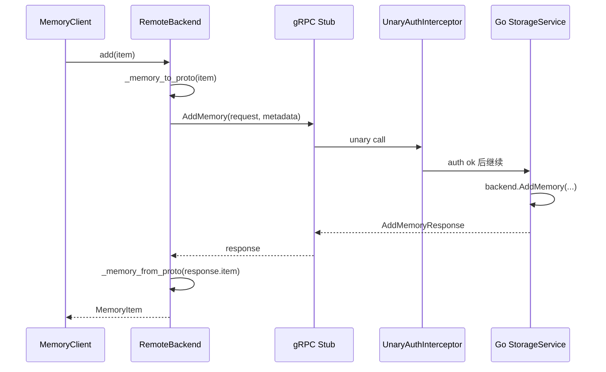

## 前置知识

- [04 Go 服务端指南](04-go-server-guide.md)
- [05 Python SDK 指南](05-python-sdk-guide.md)

## 本文目标

完成阅读后，你将理解：

1. 为什么项目需要 `Protobuf`
2. `models.proto` 与 `storage_service.proto` 分别承担什么职责
3. Python 与 Go 如何消费生成代码
4. gRPC 认证与 REST 认证的异同

## 为什么使用 Protobuf

本项目同时有 Go 服务端和 Python SDK。只靠手写 JSON 结构，很容易出现三个问题：

1. 两边字段名逐渐漂移；
2. 时间、枚举、空值的约定越来越乱；
3. 文档里写的是一套，代码里跑的是另一套。

`Protobuf` 在这里解决的不是“更酷的二进制协议”这么简单，而是双语言项目最核心的契约一致性问题。

可以把它理解成三层收益：

- **模型层**：`MemoryItem`、`RelationEdge`、`SearchResult` 这些数据结构有唯一真相源；
- **接口层**：`StorageService` 的 18 个 RPC 有明确 request / response；
- **工程层**：Go 和 Python 都能从同一份 proto 自动生成代码。

## Proto 文件结构

当前目录在 **`proto/memory/v1/`**：

- `models.proto`：数据模型
- `storage_service.proto`：18 个存储相关 RPC
- `ai_service.proto`：预留 AI 服务契约

这种拆分方式很实用：

1. `models.proto` 关注“系统里有什么对象”；
2. `storage_service.proto` 关注“系统提供什么操作”；
3. 两者解耦后，数据模型可以被多个服务复用。

## `MemoryItem`：19 字段完整定义

计划要求这里必须展示 `models.proto` 里的完整 `MemoryItem` 定义。

文件：`proto/memory/v1/models.proto:7`

```proto
message MemoryItem {
  string id = 1;
  string content = 2;
  string memory_type = 3;
  repeated float embedding = 4;
  string created_at = 5;
  string last_accessed = 6;
  int32 access_count = 7;
  string valid_from = 8;
  string valid_until = 9;
  double trust_score = 10;
  double importance = 11;
  string layer = 12;
  double decay_rate = 13;
  string source_id = 14;
  string causal_parent_id = 15;
  string supersedes_id = 16;
  repeated string entity_refs = 17;
  repeated string tags = 18;
  string deleted_at = 19;
}
```

下面按字段解释它们在双语言系统中的意义：

| 字段号 | 字段名 | 类型 | 说明 |
|---|---|---|---|
| `1` | `id` | `string` | 业务主键，通常由 Python SDK 生成 UUID |
| `2` | `content` | `string` | 记忆正文 |
| `3` | `memory_type` | `string` | 记忆类别，如 `semantic`、`episodic` |
| `4` | `embedding` | `repeated float` | 向量表示 |
| `5` | `created_at` | `string` | 创建时间，ISO 文本格式 |
| `6` | `last_accessed` | `string` | 最近访问时间 |
| `7` | `access_count` | `int32` | 访问次数 |
| `8` | `valid_from` | `string` | 生效开始时间，可为空串 |
| `9` | `valid_until` | `string` | 生效结束时间，可为空串 |
| `10` | `trust_score` | `double` | 信任分 |
| `11` | `importance` | `double` | 重要性分 |
| `12` | `layer` | `string` | 工作记忆 / 短期 / 长期层级 |
| `13` | `decay_rate` | `double` | 遗忘衰减参数 |
| `14` | `source_id` | `string` | 来源标识 |
| `15` | `causal_parent_id` | `string` | 因果父节点 |
| `16` | `supersedes_id` | `string` | 覆盖的旧记忆 |
| `17` | `entity_refs` | `repeated string` | 实体列表 |
| `18` | `tags` | `repeated string` | 标签列表 |
| `19` | `deleted_at` | `string` | 软删除时间 |

### 为什么这里大量字段仍然是字符串

很多人看到 `created_at`、`layer`、`memory_type` 用字符串，会问“为什么不用更严格的 proto `Timestamp` 或 enum”。

当前做法的好处是：

1. Python dataclass 和 Go proto 的转换很直接；
2. JSON / HTTP 回退路径也能沿用同样的文本表示；
3. 对于迭代中的项目，字符串兼容性更高。

代价是类型约束弱一些，所以项目把强约束留在了应用层，而不是 proto 层。

## 其他核心消息

文件：`proto/memory/v1/models.proto`

除了 `MemoryItem`，还有几类很关键的消息：

- `RelationEdge`：一条图关系边
- `SearchResult`：命中的记忆 + 分数 + 命中来源
- `MemoryList` / `RelationList` / `SearchResultList`：批量返回包装
- `EvolutionEvent` / `AuditEvent`：治理日志
- `HealthSnapshot`：健康快照

例如 `SearchResult` 的定义：

```proto
message SearchResult {
  MemoryItem item = 1;
  double score = 2;
  repeated string matched_by = 3;
}
```

这说明 gRPC 返回的不只是记忆本体，还有分数与来源解释，所以客户端可以知道某条记忆是 semantic 命中的，还是 full-text 命中的。

## `StorageService`：18 个 RPC 契约

文件：`proto/memory/v1/storage_service.proto:9`

```proto
service StorageService {
  rpc AddMemory(AddMemoryRequest) returns (AddMemoryResponse);
  rpc GetMemory(GetMemoryRequest) returns (GetMemoryResponse);
  rpc UpdateMemory(UpdateMemoryRequest) returns (UpdateMemoryResponse);
  rpc DeleteMemory(DeleteMemoryRequest) returns (DeletedResponse);
  rpc SearchQuery(SearchQueryRequest) returns (SearchResultList);
  rpc SearchFullText(SearchFullTextRequest) returns (SearchResultList);
  rpc SearchByEntities(SearchByEntitiesRequest) returns (SearchResultList);
  rpc SearchByVector(SearchByVectorRequest) returns (SearchResultList);
  rpc TouchMemory(TouchMemoryRequest) returns (BoolResponse);
  rpc TraceAncestors(TraceAncestorsRequest) returns (MemoryList);
  rpc TraceDescendants(TraceDescendantsRequest) returns (MemoryList);
  rpc ListMemories(ListMemoriesRequest) returns (MemoryList);
  rpc AddRelation(AddRelationRequest) returns (CreatedResponse);
  rpc ListRelations(ListRelationsRequest) returns (RelationList);
  rpc RelationExists(RelationExistsRequest) returns (BoolResponse);
  rpc GetEvolutionEvents(GetEvolutionEventsRequest) returns (EvolutionEventList);
  rpc GetAuditEvents(GetAuditEventsRequest) returns (AuditEventList);
  rpc HealthCheck(HealthCheckRequest) returns (HealthCheckResponse);
}
```

可以按职责分组理解：

### 记忆本体

- `AddMemory`
- `GetMemory`
- `UpdateMemory`
- `DeleteMemory`
- `ListMemories`

### 检索

- `SearchQuery`
- `SearchFullText`
- `SearchByEntities`
- `SearchByVector`
- `TouchMemory`

### 图追踪与关系

- `TraceAncestors`
- `TraceDescendants`
- `AddRelation`
- `ListRelations`
- `RelationExists`

### 治理与观测

- `GetEvolutionEvents`
- `GetAuditEvents`
- `HealthCheck`

## 代码生成流程

根目录 `Makefile` 和 `go-server/Makefile` 都定义了 `proto` 目标。最完整的是根目录版本。

文件：`Makefile:5`

```make
proto:
	export PATH="$$(go env GOPATH)/bin:$$PATH" && protoc -I $(PROTO_DIR) \
		--go_out=go-server/gen --go_opt=paths=source_relative \
		--go-grpc_out=go-server/gen --go-grpc_opt=paths=source_relative \
		$(PROTO_DIR)/memory/v1/models.proto \
		$(PROTO_DIR)/memory/v1/storage_service.proto \
		$(PROTO_DIR)/memory/v1/ai_service.proto
	. .venv/bin/activate && python -m grpc_tools.protoc -I $(PROTO_DIR) \
		--python_out=src/agent_memory/generated \
		--grpc_python_out=src/agent_memory/generated \
		$(PROTO_DIR)/memory/v1/models.proto \
		$(PROTO_DIR)/memory/v1/storage_service.proto \
		$(PROTO_DIR)/memory/v1/ai_service.proto
```

运行命令就是：

```bash
make proto
```

### 生成产物

当前仓库中的生成文件如下。

#### Go

- `go-server/gen/memory/v1/models.pb.go`
- `go-server/gen/memory/v1/storage_service.pb.go`
- `go-server/gen/memory/v1/storage_service_grpc.pb.go`
- `go-server/gen/memory/v1/ai_service.pb.go`
- `go-server/gen/memory/v1/ai_service_grpc.pb.go`

#### Python

- `src/agent_memory/generated/memory/v1/models_pb2.py`
- `src/agent_memory/generated/memory/v1/models_pb2_grpc.py`
- `src/agent_memory/generated/memory/v1/storage_service_pb2.py`
- `src/agent_memory/generated/memory/v1/storage_service_pb2_grpc.py`
- `src/agent_memory/generated/memory/v1/ai_service_pb2.py`
- `src/agent_memory/generated/memory/v1/ai_service_pb2_grpc.py`

## Go 端如何消费生成代码

### 注册服务

文件：`go-server/cmd/server/main.go:53`

```go
grpcServer := grpc.NewServer(grpc.UnaryInterceptor(grpcserver.UnaryAuthInterceptor(cfg)))
memoryv1.RegisterStorageServiceServer(grpcServer, grpcserver.New(backend, orchestrator, metrics))
```

这里的 `memoryv1` 就来自生成代码：

```go
import memoryv1 "github.com/bakebakebakebake/agent-memory/go-server/gen/memory/v1"
```

### 在服务实现里读取 proto request

文件：`go-server/internal/grpc/server.go:64`

```go
func (server *Server) SearchQuery(ctx context.Context, request *memoryv1.SearchQueryRequest) (*memoryv1.SearchResultList, error) {
	start := time.Now()
	results, err := server.orchestrator.Search(ctx, request.Query, request.Embedding, request.Entities, request.Limit)
	if err != nil {
		return nil, err
	}
	server.observeSearch("grpc", "fused", start)
	return &memoryv1.SearchResultList{Results: results}, nil
}
```

这段代码体现了 Go 端消费 proto 的方式：

1. gRPC 框架把二进制消息解码成 `SearchQueryRequest`。
2. 业务代码直接读 `request.Query`、`request.Embedding`、`request.Entities`。
3. 返回值也直接构造成生成代码里的 `SearchResultList`。

这让 Go 服务完全围绕生成模型工作，不需要再手写一套 DTO。

## Python 端如何消费生成代码

Python 端的核心入口在 **`src/agent_memory/storage/remote_backend.py`**。

### gRPC 初始化

文件：`src/agent_memory/storage/remote_backend.py:103`

```python
if self.config.prefer_grpc and grpc is not None and storage_service_pb2_grpc is not None:
    self._grpc_channel = grpc.insecure_channel(self.config.grpc_target)
    self._grpc_stub = storage_service_pb2_grpc.StorageServiceStub(self._grpc_channel)
```

这里的 `storage_service_pb2_grpc.StorageServiceStub` 就是生成代码暴露出来的客户端 stub。

### Python 端 `_memory_to_proto()`

文件：`src/agent_memory/storage/remote_backend.py:376`

```python
def _memory_to_proto(self, item: MemoryItem):
    if models_pb2 is None:
        raise RuntimeError("gRPC stubs are unavailable. Install remote dependencies and regenerate protos.")
    return models_pb2.MemoryItem(
        id=item.id,
        content=item.content,
        memory_type=item.memory_type.value,
        embedding=item.embedding,
        created_at=item.created_at.isoformat(),
        last_accessed=item.last_accessed.isoformat(),
        access_count=item.access_count,
        valid_from=item.valid_from.isoformat() if item.valid_from else "",
        valid_until=item.valid_until.isoformat() if item.valid_until else "",
        trust_score=item.trust_score,
        importance=item.importance,
        layer=item.layer.value,
        decay_rate=item.decay_rate,
        source_id=item.source_id,
        causal_parent_id=item.causal_parent_id or "",
        supersedes_id=item.supersedes_id or "",
        entity_refs=item.entity_refs,
        tags=item.tags,
        deleted_at=item.deleted_at.isoformat() if item.deleted_at else "",
    )
```

这一步的本质是：把 Python dataclass 投影成 proto message。

### Python 端 `_memory_from_proto()`

文件：`src/agent_memory/storage/remote_backend.py:401`

```python
def _memory_from_proto(self, item) -> MemoryItem:
    return _memory_from_payload(
        {
            "id": item.id,
            "content": item.content,
            "memory_type": item.memory_type,
            "embedding": list(item.embedding),
            "created_at": item.created_at,
            "last_accessed": item.last_accessed,
            "access_count": item.access_count,
            "valid_from": item.valid_from or None,
            "valid_until": item.valid_until or None,
            "trust_score": item.trust_score,
            "importance": item.importance,
            "layer": item.layer,
            "decay_rate": item.decay_rate,
            "source_id": item.source_id,
            "causal_parent_id": item.causal_parent_id or None,
            "supersedes_id": item.supersedes_id or None,
            "entity_refs": list(item.entity_refs),
            "tags": list(item.tags),
            "deleted_at": item.deleted_at or None,
        }
    )
```

这里又把 proto message 转回 Python 领域对象。  
整个 remote backend 就靠这两组转换，把 Python dataclass、REST JSON、gRPC proto 三种表示连起来。

## 一次 gRPC 调用到底怎么走

以 `add_memory()` 为例。

文件：`src/agent_memory/storage/remote_backend.py:116`

```python
def add_memory(self, item: MemoryItem) -> MemoryItem:
    if self._grpc_stub is not None:
        response = self._grpc_call("AddMemory", storage_service_pb2.AddMemoryRequest(item=self._memory_to_proto(item)))
        return self._memory_from_proto(response.item)
    payload = self._request_json("POST", "/api/v1/memories", data=_memory_to_payload(item))
    return _memory_from_payload(payload["item"])
```

调用链可以画成这样：



这条链路有两个重点：

1. Python SDK 最终仍然返回 Python `MemoryItem`，所以上层代码几乎察觉不到协议层差异。
2. gRPC 只是传输方式变了，领域对象没有变。

## 认证：gRPC metadata 如何传播

gRPC 不像 HTTP 那样天然有 header 这个概念，所以项目把认证材料放到 metadata 里。

### Python 端写 metadata

文件：`src/agent_memory/storage/remote_backend.py:352`

```python
def _grpc_call(self, method_name: str, request_message):
    if self._grpc_stub is None:
        raise RuntimeError("gRPC stub is unavailable")
    metadata: list[tuple[str, str]] = []
    if self.config.api_key:
        metadata.append(("x-api-key", self.config.api_key))
    if self.config.jwt_token:
        metadata.append(("authorization", f"Bearer {self.config.jwt_token}"))
    method = getattr(self._grpc_stub, method_name)
    return method(request_message, metadata=metadata or None)
```

### Go 端读 metadata

文件：`go-server/internal/grpc/interceptor.go:14`

```go
func UnaryAuthInterceptor(cfg config.Config) grpc.UnaryServerInterceptor {
	return func(ctx context.Context, request any, info *grpc.UnaryServerInfo, handler grpc.UnaryHandler) (any, error) {
		if cfg.APIKey == "" && cfg.JWTSecret == "" {
			return handler(ctx, request)
		}
		md, _ := metadata.FromIncomingContext(ctx)
		apiKey := firstValue(md.Get("x-api-key"))
		authorization := firstValue(md.Get("authorization"))
		if cfg.APIKey != "" && auth.APIKeyMatches(apiKey, cfg.APIKey) {
			return handler(ctx, request)
		}
		if cfg.JWTSecret != "" && auth.JWTMatches(auth.ParseBearerToken(authorization), cfg.JWTSecret) {
			return handler(ctx, request)
		}
		return nil, status.Error(codes.Unauthenticated, "unauthorized")
	}
}
```

这套设计的好处是：

1. HTTP 和 gRPC 复用了同一组认证材料名称：`x-api-key`、`authorization`。
2. SDK 不需要为不同协议学习两套配置项。
3. 失败时 gRPC 返回 `Unauthenticated`，语义比通用 500 更准确。

## REST 与 gRPC 的取舍

| 维度 | REST | gRPC |
|------|------|------|
| 调试体验 | 可以直接 `curl` | 需要 stub 或工具 |
| 类型约束 | 较弱 | 更强 |
| 传输体积 | JSON 较大 | 二进制更紧凑 |
| 集成门槛 | 低 | 更适合服务间调用 |
| 当前项目中的用途 | 手工调试、通用脚本 | Python 远程模式、强类型接入 |

项目同时保留两条路径，背后的原因很现实：

- 人调试时更喜欢 REST；
- 程序调用时更喜欢 gRPC。

## 常见排错点

如果 gRPC 通信不通，优先检查这四项：

1. `make proto` 是否已经执行；
2. Python 是否安装了 `grpcio` 和 `grpcio-tools`；
3. `AGENT_MEMORY_GRPC_TARGET` 是否指向正确地址；
4. `prefer_grpc=true` 时，Go 服务是否真的监听了 `:9090`。

若其中任何一项缺失，`RemoteBackend` 就会退回 HTTP，或者直接抛出 “gRPC stub is unavailable”。

## 小结

- `Protobuf` 是 Go 服务和 Python SDK 之间的统一契约
- `models.proto` 负责定义对象，`storage_service.proto` 负责定义操作
- `make proto` 会同时生成 Go 与 Python 代码
- Python 端通过 `_memory_to_proto()` / `_memory_from_proto()` 在 dataclass 和 proto 之间来回转换
- gRPC metadata 让认证规则在两种协议下保持一致

## 延伸阅读

- [04 Go 服务端指南](04-go-server-guide.md)
- [05 Python SDK 指南](05-python-sdk-guide.md)
- [09 API 参考](09-api-reference.md)
