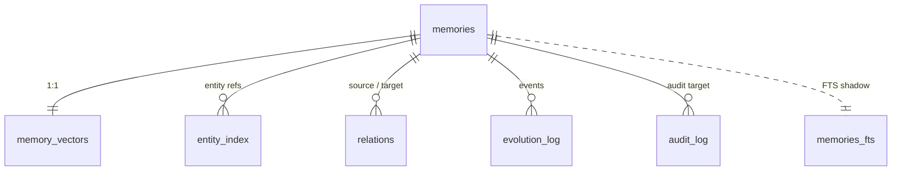

## 前置知识

- [02 架构深度剖析](02-architecture-deep-dive.md)

## 本文目标

完成阅读后，你将理解：

1. 为什么项目选择 SQLite
2. 当前 schema 包含哪些核心表
3. 各类索引分别服务什么查询
4. FTS5 与向量检索在数据库侧如何落地

## 为什么是 SQLite

SQLite 很适合当前仓库的目标场景：

- 本地优先
- 单文件部署
- 读多写少
- 支持 `WAL`
- 自带 `FTS5`

项目的核心判断可以概括为：

> 对本地 Agent 和记忆引擎来说，部署摩擦比“理论上更强的分布式扩展能力”更关键。

这就是为什么仓库把 SQLite 当作默认后端，而不是一开始就引入单独的数据库服务。

## Schema 总览

Python 端 schema 位于 **`src/agent_memory/storage/schema.sql`**。Go 端通过 migration 创建结构，字段设计与 Python 端保持同口径。

当前核心对象包括：

- `memories`
- `memory_vectors`
- `backend_meta`
- `entity_index`
- `relations`
- `evolution_log`
- `audit_log`
- `memories_fts`

可以用下面这张图快速记住它们的关系：



## `memories` 表：主数据中心

文件：`src/agent_memory/storage/schema.sql:3`

```sql
CREATE TABLE IF NOT EXISTS memories (
    id TEXT PRIMARY KEY,
    content TEXT NOT NULL,
    memory_type TEXT NOT NULL,
    created_at TEXT NOT NULL,
    last_accessed TEXT NOT NULL,
    access_count INTEGER NOT NULL DEFAULT 0,
    valid_from TEXT,
    valid_until TEXT,
    trust_score REAL NOT NULL,
    importance REAL NOT NULL,
    layer TEXT NOT NULL,
    decay_rate REAL NOT NULL,
    source_id TEXT NOT NULL,
    causal_parent_id TEXT REFERENCES memories(id),
    supersedes_id TEXT REFERENCES memories(id),
    entity_refs_json TEXT NOT NULL,
    tags_json TEXT NOT NULL,
    deleted_at TEXT
);
```

### 列级说明表

计划要求这里必须把每一列的类型、约束和用途说清楚。

| 列名 | 类型 | 约束 | 用途 |
|---|---|---|---|
| `id` | `TEXT` | `PRIMARY KEY` | 业务主键 |
| `content` | `TEXT` | `NOT NULL` | 记忆正文 |
| `memory_type` | `TEXT` | `NOT NULL` | 记忆类型 |
| `created_at` | `TEXT` | `NOT NULL` | 创建时间 |
| `last_accessed` | `TEXT` | `NOT NULL` | 最近访问时间 |
| `access_count` | `INTEGER` | `NOT NULL DEFAULT 0` | 访问计数 |
| `valid_from` | `TEXT` | 可空 | 生效开始时间 |
| `valid_until` | `TEXT` | 可空 | 生效结束时间 |
| `trust_score` | `REAL` | `NOT NULL` | 信任分 |
| `importance` | `REAL` | `NOT NULL` | 重要性 |
| `layer` | `TEXT` | `NOT NULL` | 记忆层级 |
| `decay_rate` | `REAL` | `NOT NULL` | 遗忘衰减率 |
| `source_id` | `TEXT` | `NOT NULL` | 来源标识 |
| `causal_parent_id` | `TEXT` | `REFERENCES memories(id)` | 因果父节点 |
| `supersedes_id` | `TEXT` | `REFERENCES memories(id)` | 被覆盖的旧记忆 |
| `entity_refs_json` | `TEXT` | `NOT NULL` | 实体数组的 JSON 序列化 |
| `tags_json` | `TEXT` | `NOT NULL` | 标签数组的 JSON 序列化 |
| `deleted_at` | `TEXT` | 可空 | 软删除时间 |

### 为什么实体和标签存成 JSON

这属于很典型的 SQLite 工程取舍：

1. `entity_refs_json`、`tags_json` 让主对象读取很直接，一次查询就能拿全。
2. 真正需要按实体检索时，再把实体拆平到 `entity_index`。
3. 这样既保留了对象读取体验，又兼顾了查询性能。

## 其他表各自做什么

### `memory_vectors`

文件：`src/agent_memory/storage/schema.sql:24`

```sql
CREATE TABLE IF NOT EXISTS memory_vectors (
    memory_id TEXT PRIMARY KEY REFERENCES memories(id) ON DELETE CASCADE,
    memory_rowid INTEGER UNIQUE,
    embedding_json TEXT NOT NULL
);
```

这张表的三个角色：

1. 用 `memory_id` 对应业务主键；
2. 用 `memory_rowid` 对应 SQLite 内部 rowid，便于 `sqlite-vec` 侧索引；
3. 用 `embedding_json` 保存原始向量。

### `backend_meta`

保存后端元数据。Python 侧主要用它记录 `sqlite_vec_dimension`，避免向量维度变化导致索引表错乱。

### `entity_index`

文件：`src/agent_memory/storage/schema.sql:35`

```sql
CREATE TABLE IF NOT EXISTS entity_index (
    entity TEXT NOT NULL,
    memory_id TEXT NOT NULL REFERENCES memories(id) ON DELETE CASCADE,
    PRIMARY KEY (entity, memory_id)
);
```

这张表把实体引用摊平成 `(entity, memory_id)` 结构，适合做“包含这些实体的记忆有哪些”这种查询。

### `relations`

文件：`src/agent_memory/storage/schema.sql:41`

```sql
CREATE TABLE IF NOT EXISTS relations (
    id INTEGER PRIMARY KEY AUTOINCREMENT,
    source_id TEXT NOT NULL REFERENCES memories(id) ON DELETE CASCADE,
    target_id TEXT NOT NULL REFERENCES memories(id) ON DELETE CASCADE,
    relation_type TEXT NOT NULL,
    created_at TEXT NOT NULL,
    UNIQUE (source_id, target_id, relation_type)
);
```

这张表的重点是最后的 `UNIQUE`：

> 同一对源节点、目标节点和关系类型，只允许存在一条边。

这样 `supports`、`contradicts`、`supersedes` 这些关系就天然具备幂等性。

### `evolution_log` 与 `audit_log`

两者都采用 append-only 风格：

- `evolution_log` 关注“记忆自己发生了什么变化”；
- `audit_log` 关注“谁对哪个对象做了什么操作”。

它们在写入路径里和主事务一起提交，所以可追溯性比较强。

## 索引策略深化

计划要求这里不只列索引名，还要说明它服务哪类查询。

文件：`src/agent_memory/storage/schema.sql:68`

### 记忆主表索引

| 索引 | 作用查询 |
|---|---|
| `idx_memories_memory_type` | `ListMemories`、搜索接口按 `memory_type` 过滤时使用 |
| `idx_memories_layer` | 维护周期按层统计或筛选时使用 |
| `idx_memories_created_at` | 列表倒序展示、recency 排序时使用 |
| `idx_memories_last_accessed` | 健康检查和维护任务查“多久没访问”时使用 |
| `idx_memories_trust_score` | 需要按 trust 读热点数据时使用 |
| `idx_memories_source_id` | 按来源追踪记忆时使用 |
| `idx_memories_causal_parent_id` | `TraceDescendants` 递归展开时高频命中 |
| `idx_memories_supersedes_id` | 查覆盖链或合并结果时使用 |
| `idx_memories_deleted_at` | 排除软删除数据时使用 |
| `idx_memories_active_type_created` | `deleted_at + memory_type + created_at` 的组合过滤与排序路径 |

### 辅助表索引

| 索引 | 作用查询 |
|---|---|
| `idx_entity_index_memory_id` | 由 `memory_id` 反查实体，或删除时清理索引 |
| `idx_relations_source_type` | 查询某个源节点发出的某类关系 |
| `idx_relations_target_type` | 查询指向某个目标节点的某类关系 |
| `idx_evolution_memory_created` | 按记忆 id 读取最近演化事件 |
| `idx_audit_target_created` | 按目标对象读取最近审计记录 |

### 一个具体例子

例如 `TraceDescendants` 的递归 SQL 会不断按 `causal_parent_id = ?` 查子节点，此时 `idx_memories_causal_parent_id` 就是关键索引。  
没有它的话，深一点的因果链追踪就会退化成反复扫主表。

## FTS5：`memories_fts`

文件：`src/agent_memory/storage/schema.sql:84`

```sql
CREATE VIRTUAL TABLE IF NOT EXISTS memories_fts
USING fts5(
    content,
    tags,
    content = 'memories',
    content_rowid = 'rowid'
);
```

这个虚拟表只关心两部分文本：

- `content`
- `tags`

它不直接复制整张主表，而是依附 `memories.rowid` 做 shadow table。

### 三个同步触发器

计划明确要求这里展示三个触发器的真实代码。

文件：`src/agent_memory/storage/schema.sql:92`

```sql
CREATE TRIGGER IF NOT EXISTS memories_ai AFTER INSERT ON memories BEGIN
    INSERT INTO memories_fts(rowid, content, tags)
    VALUES (
        new.rowid,
        new.content,
        trim(replace(replace(replace(replace(new.tags_json, '[', ' '), ']', ' '), '\"', ' '), ',', ' '))
    );
END;

CREATE TRIGGER IF NOT EXISTS memories_ad AFTER DELETE ON memories BEGIN
    INSERT INTO memories_fts(memories_fts, rowid, content, tags)
    VALUES (
        'delete',
        old.rowid,
        old.content,
        trim(replace(replace(replace(replace(old.tags_json, '[', ' '), ']', ' '), '\"', ' '), ',', ' '))
    );
END;

CREATE TRIGGER IF NOT EXISTS memories_au AFTER UPDATE ON memories BEGIN
    INSERT INTO memories_fts(memories_fts, rowid, content, tags)
    VALUES (
        'delete',
        old.rowid,
        old.content,
        trim(replace(replace(replace(replace(old.tags_json, '[', ' '), ']', ' '), '\"', ' '), ',', ' '))
    );
    INSERT INTO memories_fts(rowid, content, tags)
    VALUES (
        new.rowid,
        new.content,
        trim(replace(replace(replace(replace(new.tags_json, '[', ' '), ']', ' '), '\"', ' '), ',', ' '))
    );
END;
```

### 这三个触发器分别做什么

1. `memories_ai`：主表插入后，把新内容同步进 FTS。
2. `memories_ad`：主表删除后，把 FTS 里的对应行标记删除。
3. `memories_au`：主表更新时，先删旧文档，再插新文档。

其中 `tags_json` 会经过多轮 `replace(...)`，把 JSON 里的中括号、引号、逗号都清掉，变成适合分词的纯文本串。

## Python 端全文检索怎么用 FTS5

文件：`src/agent_memory/storage/sqlite_backend.py:45`

```python
def _build_fts_query(query: str) -> str:
    terms = re.findall(r"[\w\u4e00-\u9fff-]+", query.lower())
    if not terms:
        return ""
    return " OR ".join(f'"{term}"' for term in terms)
```

这段查询构造有三个关键点：

1. 用正则把英文单词、数字、中文字符和连字符拆出来；
2. 全部转小写，统一匹配口径；
3. 用 `"term1" OR "term2"` 的形式生成 FTS5 查询。

### 真正执行全文检索

文件：`src/agent_memory/storage/sqlite_backend.py:199`

```python
rows = self.connection.execute(
    f"""
    SELECT m.*, v.embedding_json, bm25(memories_fts) AS rank_score
    FROM memories_fts
    JOIN memories m ON m.rowid = memories_fts.rowid
    LEFT JOIN memory_vectors v ON v.memory_id = m.id
    WHERE memories_fts MATCH ?
      AND m.deleted_at IS NULL
      {memory_type_clause}
    ORDER BY rank_score
    LIMIT ?
    """,
    params,
).fetchall()
return [(self._row_to_memory(row), 1.0 / (1.0 + abs(row["rank_score"]))) for row in rows]
```

这里有两个细节值得记：

1. SQLite FTS5 的 `bm25()` 越小越好，所以代码做了 `1.0 / (1.0 + abs(rank_score))` 转换，把它映射成越大越好的分数。
2. FTS 查询命中后还是要 join 回 `memories` 和 `memory_vectors`，因为最终返回的是完整 `MemoryItem`。

## 向量检索：Python 和 Go 的不同落地

### Python：优先 `sqlite-vec`

文件：`src/agent_memory/storage/sqlite_backend.py:252`

```python
def search_by_vector(self, embedding: list[float], limit: int = 10, memory_type: str | None = None) -> list[tuple[MemoryItem, float]]:
    if self._sqlite_vec_enabled:
        results = self._search_by_vector_sqlite_vec(embedding=embedding, limit=limit, memory_type=memory_type)
        if results:
            return results
    return self._search_by_vector_fallback(embedding=embedding, limit=limit, memory_type=memory_type)
```

这意味着 Python 端是“双轨制”：

1. 能开 `sqlite-vec` 就优先用 C 扩展加速的向量索引；
2. 开不了就退回纯 Python 余弦扫描。

### Python：fallback 纯扫描

文件：`src/agent_memory/storage/sqlite_backend.py:264`

```python
for row in rows:
    stored_embedding = json.loads(row["embedding_json"])
    score = _cosine_similarity(embedding, stored_embedding)
    scored.append((self._row_to_memory(row), score))
scored.sort(key=lambda item: item[1], reverse=True)
return scored[:limit]
```

这条路径和 Go 端当前的做法接近，都是“全量读取 + 算余弦 + 排序截断”。

### Go：当前只有纯扫描

文件：`go-server/internal/storage/sqlite.go:272`

Go 端 `SearchByVector()` 会把所有未删除记忆的向量读出来，再调用 `cosineSimilarity()` 逐条计算，然后排序截断。  
这也是为什么 `/api/v1/info` 里 `vector_search_mode` 当前显示为 `cosine_scan`。

## `backend_meta` 与 `sqlite-vec` 元数据

`backend_meta` 这张表看起来不起眼，但它解决了一个很实际的问题：如果数据库已经建过向量索引，而后面又换了 embedding 维度，系统必须先知道“旧索引是什么维度”，否则就可能把新向量错误写进旧结构。

文件：`src/agent_memory/storage/sqlite_backend.py:656`

```python
def _ensure_vec_index_table(self, dimension: int) -> None:
    current_dimension = self._get_backend_meta("sqlite_vec_dimension")
    if current_dimension and int(current_dimension) != dimension:
        raise ValueError(
            f"sqlite-vec index dimension mismatch: existing={current_dimension}, requested={dimension}"
        )
    self.connection.execute(
        f"""
        CREATE VIRTUAL TABLE IF NOT EXISTS memory_vec_index
        USING vec0(
            memory_rowid INTEGER PRIMARY KEY,
            embedding FLOAT[{dimension}],
            memory_type TEXT,
            layer TEXT,
            source_id TEXT,
            trust_score FLOAT,
            created_at TEXT,
            last_accessed TEXT
        )
        """
    )
    self._set_backend_meta("sqlite_vec_dimension", str(dimension))
```

这里的逻辑可以总结成三步：

1. 先查 `backend_meta` 看已有维度；
2. 若旧维度和当前维度不一致，直接报错；
3. 只有维度一致时，才允许继续复用或创建索引。

这类元数据保护层很适合拿来讲工程成熟度，因为它处理的是“平时不常出错，但一出错就很难排”的兼容性问题。

## 递归 CTE：TraceAncestors 的完整 SQL

计划要求这里要同时展示 Go 与 Python 端的对应实现。

### Go 端

文件：`go-server/internal/storage/sqlite.go:304`

```sql
WITH RECURSIVE ancestors(id, depth) AS (
	SELECT causal_parent_id, 1
	FROM memories
	WHERE id = ? AND causal_parent_id IS NOT NULL
	UNION ALL
	SELECT m.causal_parent_id, a.depth + 1
	FROM ancestors a
	JOIN memories m ON m.id = a.id
	WHERE a.depth < ? AND m.causal_parent_id IS NOT NULL
)
SELECT m.*, v.embedding_json
FROM ancestors a
JOIN memories m ON m.id = a.id
LEFT JOIN memory_vectors v ON v.memory_id = m.id
WHERE m.deleted_at IS NULL
ORDER BY a.depth ASC
```

### Python 端

文件：`src/agent_memory/storage/sqlite_backend.py:326`

```sql
WITH RECURSIVE ancestors(id, depth) AS (
    SELECT causal_parent_id, 1
    FROM memories
    WHERE id = ? AND causal_parent_id IS NOT NULL
    UNION ALL
    SELECT m.causal_parent_id, a.depth + 1
    FROM ancestors a
    JOIN memories m ON m.id = a.id
    WHERE a.depth < ? AND m.causal_parent_id IS NOT NULL
)
SELECT m.*, v.embedding_json, a.depth
FROM ancestors a
JOIN memories m ON m.id = a.id
LEFT JOIN memory_vectors v ON v.memory_id = m.id
WHERE m.deleted_at IS NULL
ORDER BY a.depth ASC
```

两边逻辑几乎一致，Python 多带了一个 `a.depth` 供调试或扩展使用。

这说明“祖先追踪”这一层，系统已经把 SQL 语义保持成双端对齐。

## 数据库排错建议

如果搜索或治理行为异常，建议按下面顺序查：

1. `memories`：主数据有没有进表；
2. `memory_vectors`：向量有没有同步进去；
3. `entity_index`：实体索引有没有展开；
4. `relations`：边有没有成功建立；
5. `evolution_log` / `audit_log`：治理日志有没有跟着写；
6. `memories_fts`：全文检索影子表有没有同步。

一个很实用的判断原则是：

> 如果主表有数据但检索结果空，优先检查索引和影子表；如果主表都没有，优先回头查写入事务。

## 一张表如何配合其它表工作

如果把数据库设计讲得更立体一点，可以用“新增一条记忆后，哪些表会一起变化”来理解。

### 写入时

通常会同时影响：

1. `memories`：写入主记录；
2. `memory_vectors`：写入 embedding；
3. `entity_index`：把实体展开成索引；
4. `memories_fts`：通过触发器同步内容与标签；
5. `evolution_log`：记录 created 事件；
6. `audit_log`：记录 create 操作。

### 更新时

通常会同时影响：

1. `memories`：更新主字段；
2. `memory_vectors`：更新 embedding；
3. `entity_index`：先删旧实体，再写新实体；
4. `memories_fts`：通过 UPDATE 触发器删旧写新；
5. `evolution_log`：记录 updated；
6. `audit_log`：记录 update。

### 删除时

当前是软删除，所以：

1. `memories.deleted_at` 被写入时间戳；
2. 向量索引可能被移出 `sqlite-vec` 虚拟表；
3. `evolution_log` / `audit_log` 仍会保留一条删除记录。

这个视角特别适合拿来讲“为什么数据库设计不仅仅是几张表”，因为真正的价值在于表与表之间的协同。

## 小结

- SQLite schema 已经覆盖主数据、向量、实体、关系、演化和审计
- `memories` 是中心表，`memory_vectors`、`entity_index`、`relations` 都围绕它展开
- 索引设计直接对应过滤、排序、因果追踪和治理读取这些高频场景
- Python 端通过 FTS5 + 触发器实现全文检索，通过 `sqlite-vec` 或回退扫描实现向量检索
- Go 与 Python 在递归 CTE 这类关键查询上保持了很高的一致性

## 延伸阅读

- [03 算法指南](03-algorithm-guide.md)
- [04 Go 服务端指南](04-go-server-guide.md)
- [11 性能与基准测试](11-performance-benchmarking.md)
